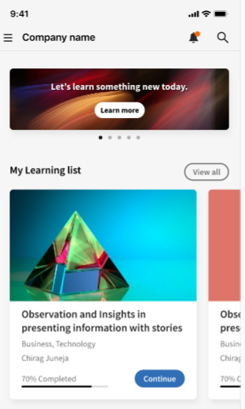
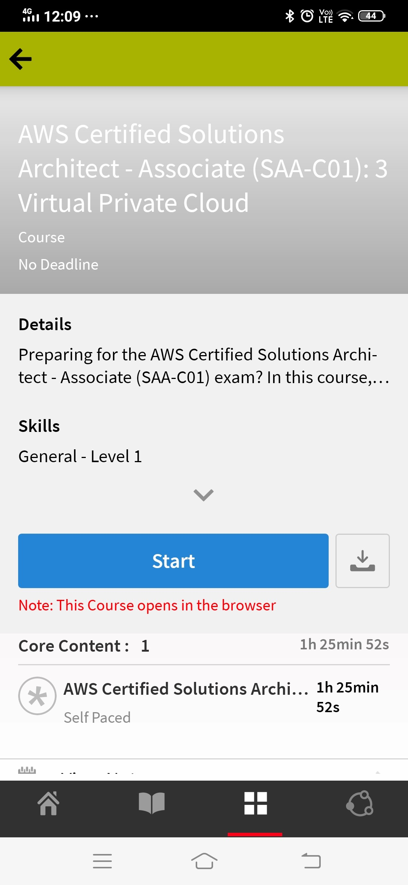

# Learner-app voor mobiele telefoons en tablets

Lees dit artikel om te weten te komen hoe u de Learner-app van Learning Manager voor smartphones en tablets kunt downloaden. Lees hoe u cursussen kunt volgen via uw mobiele telefoon of tablet.

## Overzicht {#overview}

De Learning Manager-app voor studenten is beschikbaar voor zowel Android- als iPhone-gebruikers. Ga naar de Google Play Store (Android OS) of iTunes (macOS) en download de Learning Manager-app.

Nadat u deze app hebt gedownload en geïnstalleerd, meldt u zich aan bij de app met uw studentgegevens. Wanneer u de mobiele app van Learning Manager opent, wordt standaard het volgende scherm weergegeven.

*De startpagina van de Learner-app*

## Startpagina {#homepage}

Voor alle accounts waarvoor de optie Immersive Layout ingeschakeld is, is er een gloednieuwe startpagina die de configuratie van Immersive Layout ondersteunt. De homepage wordt georganiseerd als een lijst van kaarten voor het volgende:

|  |  |
|---|---|
|  |  |

*Lijst met kaarten op de startpagina*

*Sociale feed van de student*

## Feedbackbeoordeling {#feedbackrating}

Learning Manager vraagt de student om feedback te geven over hun ervaring met de mobiele app. Deze feedback wordt één keer per maand weergegeven en geeft gebruikers voldoende tijd om de app te ervaren en vervolgens feedback te geven.

<!--
|  | |
|---|---|
-->

Voor bestaande gebruikers wordt de feedback weergegeven als ze de Player voor de eerste keer sluiten nadat ze de app hebben bijgewerkt naar de nieuwste versie.

De feedbackverzameling is anoniem en wordt alleen weergegeven voor gebruikers die de optie hebben ingeschakeld **Gebruiksgegevens delen** via een configuratie in App-instellingen.

## Badge downloaden {#downloadbadge}

Studenten kunnen hun badges downloaden in de PDF- en afbeeldingsindeling. Blader in de sectie Gebruikersprofiel omlaag en klik op een koppeling om een badge te downloaden. De gedownloade badge wordt opgeslagen in de standaardapparaatmap. Met de app kunt u de map of het bestand direct openen nadat het downloaden is voltooid.

|  |
|---|

*Een badge downloaden*

## Responsieve weblay-out op mobiel {#responsive}

Een volledig responsieve mobiele webervaring die ervoor zorgt dat studenten hun apparaten gebruiken om training te volgen, zelfs als ze de mobiele app niet hebben geïnstalleerd.

Wanneer u zich voor het eerst aanmeldt in de learner app via de browser op uw apparaat, verschijnt de leerapplicatie in de vorm van een mobiel-vriendelijke, responsieve schermindeling.

De mobiele webresponsieve support voor de gebruikersinterface is alleen beschikbaar wanneer een account **is geconfigureerd voor alleen een insluitende schermindeling**. De responsieve gebruikersinterface is **niet beschikbaar voor de klassieke schermindeling**.

<!--
<table>
 <tbody>
  <tr>
   <td>
    
<strong>Home page</strong>

    
<strong>View options</strong>

    
<strong>Start course</strong>
</td>
   <td>
    
<strong>My Learning List</strong>

    
<strong>View catalog</strong>

    
<strong>Apply filters</strong>
</td>
   <td>
    
<strong>Recommendations based on interest</strong>

    
<strong>View notifications</strong>

    
<strong>Share url</strong>
</td>
  </tr>
 </tbody>
</table>
-->

## Niet-ondersteunde functies in de insluitende ervaring op mobiel {#unsupportedfeaturesinmobileimmersiveexperience}

De volgende workflows verschijnen in de klassieke ervaring voor een student:

* Multi-Attempt
* Flexi LP
* Scenario&#39;s voor het uploaden van bestanden
* Het verstrekken van L1-feedback

Andere functies van de app die niet worden ondersteund:

* Sociale app: een student wordt omgeleid naar de klassieke ervaring als hij/zij op de sociale widget op de startpagina klikt
* Profielinstellingen/profiel bewerken
* Badge/vaardigheden weergeven
* Leaderboard: een student wordt omgeleid naar de klassieke ervaring als hij/zij op de Leaderboard-widget op de startpagina klikt
* Taakhulpen downloaden.
* Filteropties in Zoeken.

Sociaal leren ondersteunt nu de insluitende webervaringen op mobiel.

Er zijn enkele functies die niet worden ondersteund in de insluitende mobiele app. Dit zijn:

| **Gebied** | **Niet ondersteund** |
|---|---|
| Board | board maken, bewerken, URL kopiëren, verwijderen, rapport, sorteren, filteren |
| Posten | Opiniepeilingtype maken, bewerken, Meerdere bijlagen bij het bericht, URL kopiëren, Aan bovenkant vastzetten |
| Opmerkingen/antwoorden | Bewerken, markeren als juist antwoord, afbeelding/video/audio uploaden in opmerking of antwoord |
| Media | Audio vastleggen; alleen audiobestand uploaden |
| Overige | Meldingen, Berichtweergave, Sociaal leaderboard, Mensen die ik volg, Gebruikersprofiel |

## Studenten in staat stellen taakhulpen te downloaden {#download-job-aid}

In de mobiele insluitende modus kan een student een taakhulp downloaden. Tikken **Instellingen** en tik vervolgens op **Catalogi**. Download een taakhulp uit de lijst die wordt weergegeven.

|  |
|---|

*Een taakhulp downloaden*

## Studenten in staat stellen studenttranscripten te downloaden {#download-learner-transcript}

In de mobiele immersive modus kan een student de studenttranscripten downloaden.

|  |  |
|---|---|

*Studenttranscripten downloaden*

## Badges en vaardigheden weergeven {#viewbadgesandskills}

**Badges, vaardigheden en gamificationpunten bekijken**

Het standaardscherm toont direct onder uw profielinformatie uw recent behaalde badges, vaardigheden en gamificationpunten. Als u een telefoon gebruikt, worden de recent behaalde badges weergegeven. Veeg naar rechts voor meer informatie.

**Mijn openstaande leermateriaal**

Standaard worden op het scherm de cursussen weergegeven waarvoor u bent ingeschreven. In de donutgrafiek worden het achterstallige leermateriaal, het bijna voltooide leermateriaal en het leermateriaal dat op schema ligt weergegeven.

Tik op een cursus om de details van de cursus en uw voltooiingsdatum (indien van toepassing) te bekijken. U kunt de cursus voortzetten of opnieuw bezoeken vanaf dit scherm, afhankelijk van uw voltooiingsstatus.

*Leerlingen in behandeling weergeven*

**Catalogi bekijken**

Tik op het pictogram naast het boekpictogram onderin het scherm. U kunt de catalogus met alle bijbehorende leerobjecten direct bekijken. U kunt ervoor kiezen om ze in de rasterlay-out weer te geven of de gedetailleerde weergave te kiezen. Selecteer aanbevelingen om cursusaanbevelingen te bekijken op basis van uw leergeschiedenis.

*Cursusaanbevelingen weergeven*

## Leerobjecten sorteren en filteren {#sortandfilterlearningobjects}

**Sorteren en filteren**

Klik op het sorteerpictogram in de rechterbovenhoek van het cursus- of catalogusscherm om de leerobjecten alfabetisch (oplopend of aflopend) of op gepubliceerde datum te sorteren. U kunt de leerobjecten ook filteren op type, voltooiingsstatus, vaardigheden of op tags. Tik en selecteer het filter en tik op Toepassen om het filter toe te passen.

**De zoekfunctie gebruiken**

Rechtsboven op uw telefoonscherm ziet u een zoekpictogram. Tik op dat pictogram om naar leerobjecten te zoeken op basis van cursusmetagegevens, unieke ID, vaardigheden, en dergelijke.

**Profiel, instellingen en meldingen beheren**

Tikken  linksboven in het scherm om uw profiel, meldingen en accountinstellingen weer te geven.

U kunt via dit menu ook de QR-code scannen om de aanwezigheid van studenten bij de cursussen te markeren.

U hoeft alleen maar op de knop **QR-code scannen** en scan de code.

**Offline cursussen volgen**

Wanneer u gedownloade cursussen volgt terwijl u online bent, krijgt de leermanager toegang tot de gedownloade cursus in plaats van dat hij serveraanroepen doet.

## QR-code scannen voor inschrijving {#qrcode}

U kunt een QR-code scannen en u inschrijven voor een cursus. Nadat de Leermateriaalbeheerder een QR-code heeft gegenereerd, kunt u de QR-code uit de app scannen en u inschrijven voor een cursus.

1. Tik op  in de linkerbovenhoek van het scherm.
1. Tik op **QR-code scannen**.

Met de functie om QR te scannen kan een student een van de onderstaande acties uitvoeren, afhankelijk van de QR-code die door de Leermateriaalbeheerder is gegenereerd:

* **Inschrijving:** Zo kan de student zich voor een cursus inschrijven door de QR-code te scannen.
* **Voltooiing:** Hiermee kan de student de cursus als voltooid markeren door de QR-code te scannen.
* **Inschrijving en voltooiing:** Hiermee kan de student zich zowel inschrijven als voltooiing markeren door de QR-code te scannen.
* **Aanwezigheid markeren:** Zo kan de student aanwezigheid voor een bepaalde sessie markeren door de QR-code te scannen.

## Naam van leerobjecten wijzigen {#renaminglearningobjects}

Beheerders kunnen terminologie van leerobjecten wijzigen.  Zie [Naam van leerobjecten wijzigen](../../administrators/feature-summary/settings.md#main-pars_header_1570157145) om de naam te wijzigen.

## Sociaal leren {#socialmobile}

In deze update worden de volgende functies niet ondersteund.  Het volgende is niet mogelijk:

* Een board maken of volgen.
* Een URL naar een bericht kopiëren.
* Een bericht als artikel toevoegen of een bericht als favoriet toevoegen of boven vastzetten.
* Een sociaal leaderboard weergeven.

Sociaal leren is een platform in de mobiele Learning Manager-app waarin gebruikers ideeën en zinvolle inzichten kunnen delen in een informele omgeving. Deze methode is een aanvulling op de notie van traditioneel leren.

Met Sociaal leren kunnen gebruikers de expertise om hen heen benutten om juiste en beknopte informatie te verkrijgen. Studenten kunnen die informatie snel toepassen om taken te voltooien en doelen te bereiken.

Met de mobiele app kunnen gebruikers interactief met elkaar omgaan door inhoud te delen en bevestiging te krijgen over de gedeelde inhoud.

Op dit platform kunnen verschillende inhoudstypen worden gedeeld: video, audio, screenshots, tekst, vragen en polls. Gebruikers kunnen hun online leermateriaal ook met hun collega&#39;s delen.

Deze functie is pas beschikbaar in de app nadat de beheerder **Sociaal leren** voor het account heeft ingeschakeld.

## Sociaal leren openen in de app {#launchsociallearningontheapp}

Tik bij het starten van de app op het pictogram **Sociaal**.

*Sociaal leren weergeven*

## Een bericht maken op een board {#createapostinaboard}

Net als op andere sociale platforms kunt u in de mobiele Learning Manager-app berichten op een board plaatsen zodat alle studenten die deel uitmaken van hetzelfde board uw bericht kunnen zien, erop kunnen reageren en een bestand bij hun opmerking kunnen uploaden.

Tik op de knop  rechtsonder in het scherm.

Het volgende scherm wordt weergegeven.

*Een bericht toevoegen*

<table>
 <tbody>
  <tr>
   <td>
    

</td>
   <td>
    
Schrijf een bericht of plak een URL.
</td>
  </tr>
  <tr>
   <td>
    

</td>
   <td>
    
Maak een foto met uw mobiele camera en upload deze bij uw bericht.
</td>
  </tr>
  <tr>
   <td>
    

</td>
   <td>
    
Neem een video op met uw mobiele camera.
</td>
  </tr>
  <tr>
   <td>
    
 
</td>
   <td>
    
Neem audio op met uw mobiel.
</td>
  </tr>
  <tr>
   <td>
    

</td>
   <td>
    
Upload een document of bestand op het board.
</td>
  </tr>
  <tr>
   <td>
    
 
</td>
   <td>
    
Stel een vraag.
</td>
  </tr>
  <tr>
   <td>
    
 
</td>
   <td>
    
Voeg een poll toe aan uw bericht.
</td>
  </tr>
 </tbody>
</table>

## Ondersteunde inhoudsindeling {#supportedcontentformat}

<table>
 <tbody>
  <tr>
   <td>
    
<strong>Inhoudstype</strong>
</td>
   <td>
    
<strong>Extensies</strong>
</td>
  </tr>
  <tr>
   <td>
    
Video
</td>
   <td>
    
wmv, f4v, asf, 3gp, 3g2, avi, mov, h264, m4v, mp4, MPEG, mpg
</td>
  </tr>
  <tr>
   <td>
    
Audio
</td>
   <td>
    
mp3, amr, m4a, wav, wma, aac
</td>
  </tr>
  <tr>
   <td>
    
Statische bestanden
</td>
   <td>
    
PDF, ppt, pptx, doc, docx, xls, xlsx
</td>
  </tr>
  <tr>
   <td>
    
Afbeelding
</td>
   <td>
    
jpg, jpeg, png, bmp, gif
</td>
  </tr>
 </tbody>
</table>

Nadat u een bericht hebt gemaakt, kiest u het board waarop u het bericht wilt uploaden. Tik op Board selecteren en zoek het gewenste board.

Nadat u een bericht hebt gemaakt, tikt u op Plaatsen en plaatst u uw opmerking zodat andere studenten uw bericht kunnen bekijken.

In de mobiele app kunt u geen boards maken.  Om boards te maken moet u zich als student aanmelden bij de web-app.  Ga voor meer informatie over het maken van een board naar sociaal leren in [Learning Manager](/help/migrated/learners/feature-summary/social-learning-web-user.md).

## Acties die op een bericht kunnen worden uitgevoerd {#actionsthatcanbeperformedonapost}

* Plaats een opmerking bij een bericht en bekijk het bericht op het board, afhankelijk van de machtigingen.
* Bewerk of verwijder opmerkingen op een board.
* Bewerk of verwijder een bericht, afhankelijk van de machtigingen.
* Meld misbruik van een bericht als het de privacy schendt of als de inhoud ongepast is. Nadat een bericht is gerapporteerd, wordt een melding naar de beheerder en moderators van het board gestuurd voor verdere actie.
* leuk    of anders     een bericht.
* leuk   of anders  een opmerking.

## Een bericht plaatsen op andere boards {#createapostinotherboards}

U kunt ook een bericht op andere boards plaatsen.

Tik op **Alle boards** om de activiteiten van andere studenten op het board te bekijken.

*Alle activiteiten op het board weergeven*

Navigeer naar het gewenste board en plaats uw opmerking.

## Media op een board delen {#sharemedia}

<!---->

Deel afbeeldingen, documenten, audio- of videobestanden op een board zodat andere boardleden uw bericht kunnen zien en een interactie kunnen starten. Om media te delen:

1. Open de media die u wilt delen.
1. Tik op de knop Delen en kies Leerbeheer.
1. Kies het board waarin u de media wilt delen.
1. Tikken **Post**.

U kunt ook inhoud van een externe app posten, zo kunt u bijvoorbeeld een opmerking van Reddit of Quora delen.

## Items in extern certificaat uploaden als bewijs van voltooiing {#externalcert}

Volg onderstaande stappen:

1. Meld u aan bij de apparaat-app met uw studentgegevens.
1. Zoek het certificaat op dat de auteur heeft gemaakt.
1. Kies het benodigde certificaat in de lijst met externe certificaten en schrijf u in voor het certificaat.
1. Tikken **Bewijs van voltooiing** en uploadt u een bestand, bijvoorbeeld een PDF-bestand of een afbeelding.

   |  |  |
   |---|---|
   *Bewijs van voltooiing uploaden*

1. Nadat u het bestand hebt geüpload, tikt u op **Verzenden**. Er verschijnt een bevestigingsbericht.

**Een bestand uploaden**

1. Na het uploaden van een bestand tikt u op **Inzenden**.

   U kunt er maar één bestand uploaden als bewijs van voltooiing. Wanneer u meer bestanden probeert te uploaden, ziet u het volgende bericht:

   **De wijzigingen die u hebt aangebracht, gaan verloren. Wilt u doorgaan?**

1. De status verandert in **In afwachting van goedkeuring** (oranje).

   U kunt het geüploade bestand niet weergeven of downloaden in de mobiele app.

Wanneer de manager de inzending goedkeurt, verandert de status in **Goedgekeurd** (groen).

Wanneer de manager de inzending afwijst, verandert de status in **Afgewezen** (rood).

|  |  |  |
|---|---|---|

*Verzendstatus weergeven*

In geval van een afwijzing kunt u een bestand uploaden als bewijs van voltooiing.

* U kunt een bestand alleen verzenden als de status **In behandeling en afgewezen**.
* U kunt geen bestand verzenden als de status **In afwachting van goedkeuring en goedgekeurd**.

## Cursussen volgen van LinkedIn Learning {#linkedin}

Learning Manager ondersteunt al cursussen van LinkedIn Learning binnen het studieplatform. Studenten kunnen nu dergelijke cursussen van LinkedIn Learning volgen in de mobiele app van Learning Manager. Zoek in de apparaat-app naar een cursus en start deze vervolgens.

Als de LinkedIn-app reeds is geïnstalleerd, wordt de cursus geopend in de app. Zo niet, dan wordt de cursus geopend in de standaard browser waar u zich moet aanmelden met behulp van uw LinkedIn-gegevens.

Als u de cursus volgt via de LinkedIn-app, wordt uw voortgang niet bijgehouden in Leerbeheer. Daarom wordt aangeraden de cursus te starten in de browser in plaats van de LinkedIn Learning-app.

>[!NOTE]
>
>U kunt de cursussen alleen volgen als u een actieve internetverbinding hebt.

|  |  |  |
|---|---|---|

*Cursussen inschrijven voor LinkedIn Learning*

De tijd die wordt besteed aan cursussen van LinkedIn Learning wordt via het LinkedIn Content/LinkedIn-platform doorgegeven aan het Learning Manager-studieplatform.

In het geval dat LinkedIn Learning de studietijd niet doorstuurt, kan deze tijd niet door ons studieplatform worden geregistreerd. In dat geval is de leertijd die door de leermanager wordt weergegeven nul.

## Bestanden inzenden voor klassikale en activiteitsmodules {#submitfile}

Als student kunt u bestanden naar uw docent sturen als bewijs van voltooiing. De docent kan uw inzending vervolgens goedkeuren of weigeren op basis van de inhoud van het bestand.

Een auteur kan alleen klassikale en activiteitsmodules maken die een student in de mobiele app kan gebruiken.

Nadat de student een cursus heeft gestart, ziet de student de status **Bestandsverzending** als in behandeling, samen met de koppeling om het bestand te uploaden, op het scherm, zoals weergegeven in de onderstaande schermafbeelding.

*Status van het indienen van bestanden*

Klik op **Bestand uploaden** om het bestand te uploaden.

Upload een bestand en klik op de knop **Verzenden** knop.

 

*Een bestand verzenden*

## Ondersteunde bestandstypen voor uploaden {#supportedfiletypesforupload}

<table>
 <tbody>
  <tr>
   <td>
    
<b>Inhoudstype</b>
</td>
   <td>
    
<b>Extensies</b>
</td>
  </tr>
  <tr>
   <td>
    
Video
</td>
   <td>
    
wmv, f4v, asf, 3gp, 3g2, avi, mov, h264, m4v, mp4, MPEG, mpg
</td>
  </tr>
  <tr>
   <td>
    
Audio
</td>
   <td>
    
mp3, amr, m4a, wav, wma, aac
</td>
  </tr>
  <tr>
   <td>
    
Statische bestanden
</td>
   <td>
    
PDF, ppt, pptx, doc, docx, xls, xlsx
</td>
  </tr>
  <tr>
   <td>
    
Afbeelding
</td>
   <td>
    
jpg, jpeg, png, bmp, gif
</td>
  </tr>
 </tbody>
</table>

## Goedkeuring of afwijzing van inzending {#approvalorrejectionofsubmission}

Nadat u het bestand uploadt, verandert de status in **In afwachting van goedkeuring**. De docent bekijkt dan de lijst met [hangende indiening](/help/migrated/instructors/feature-summary/learners.md) en keurt de inzending goed of wijst deze af via de web-app voor docenten.

Wanneer de docent de inzending goedkeurt, verandert de status in de mobiele app voor studenten in **Goedgekeurd**.

<!---->

Wanneer de docent de inzending afwijst, verandert de status in de mobiele app van de student in **Afgewezen**.

<!---->

Om het bestand opnieuw in te dienen, klikt u op de link **Bestand uploaden**.

## Learning Manager voor iPad en tablets {#captivateforipadandtablets}

In de app Learning Manager op een iPad- of Android-tablet kunt u het volgende zien nadat u zich als student hebt aangemeld: **Home** scherm:

<!---->

Tik op de knop **Menu** en kiest u de gewenste optie.

<!---->

U hebt een optie om de cursussen in een lijstweergave te bekijken in plaats van naast elkaar/met kaarten.

## Offline toegang tot de app {#accesstheappoffline}

U hebt offline toegang tot de Learning Manager-app op iPad- en Android-tablets. U kunt cursussen en leerprogramma&#39;s downloaden. Neem cursussen, volg de leerprogramma&#39;s in offline modus en synchroniseer de inhoud weer met de online app wanneer u verbinding maakt met het netwerk.

1. Tikken **Menu** vervolgkeuzelijst bovenaan en tik op **Leren** gebruiken. Een lijst van alle beschikbare cursussen wordt weergegeven in tegels.
1. Tik op het downloadpictogram onderaan elke leerobjecttegel om de leerinhoud te downloaden.

   

   *Inhoud downloaden*

   Er verschijnt een aanwijzing in een balk boven in de app die de netwerkstatus van het apparaat aangeeft.

   * De rode balk geeft aan dat het netwerk niet beschikbaar is voor het apparaat.
   * De groene balk geeft aan dat het netwerk weer online is.

Gebruiker kan terugschakelen naar online modus door op **online-inhoud weergeven** op de groene balk. De inhoud in het apparaat wordt gesynchroniseerd wanneer de gebruiker overschakelt naar de online modus.

<!--## Track device storage {#trackdevicestorage}

You can monitor your device storage periodically.

Tap the profile icon at the upper-right corner of the app and tap **Device Storage** menu option.

An app storage information dialog appears as shown below.

Using the app storage information, you can check the total space of device, app and the downloaded courses. This information enables you to download courses accordingly. To delete the downloaded courses in the device, tap delete icon adjacent to each course name.-->