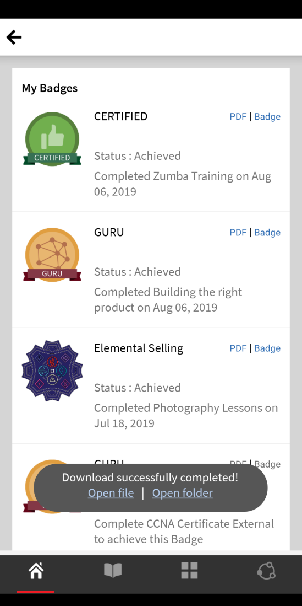
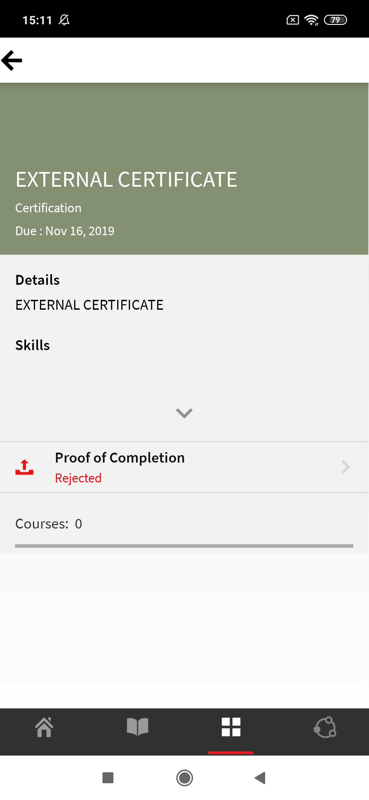

# Learner-app voor mobiele telefoons en tablets

Lees dit artikel om te weten te komen hoe u de Learner-app voor smartphones en tablets kunt downloaden. Leer hoe u cursussen kunt volgen met uw mobiele apparaat of tablet.

## Overzicht {#overview}

De app Learning Manager voor studenten is beschikbaar voor zowel Android-telefoongebruikers als iPhone-gebruikers. Ga naar de Google Play Store (Android OS) of iTunes (macOS) en download de app Learning Manager.

Nadat u deze app hebt gedownload en geïnstalleerd, meldt u zich aan bij de app met uw studentgegevens. Wanneer u de mobiele app van Learning Manager opent, wordt standaard het volgende scherm weergegeven.

*De startpagina van de Learner-app*

## Startpagina {#homepage}

Voor alle accounts waarvoor de optie Immersive Layout ingeschakeld is, is er een gloednieuwe startpagina die de configuratie van Immersive Layout ondersteunt. De homepage wordt georganiseerd als een lijst van kaarten voor het volgende:

|  |  |
|---|---|
|  |  |

*Lijst met kaarten op de startpagina*

*Sociale feed van de student*

## Feedbackscore {#feedbackrating}

Leermanager vraagt de student om feedback te geven over zijn of haar ervaring met de mobiele app. Deze feedback wordt één keer per maand weergegeven en geeft gebruikers voldoende tijd om de app te ervaren en vervolgens feedback te geven.

<!--
|  | |
|---|---|
-->

Voor bestaande gebruikers wordt de feedback weergegeven als ze de Player voor de eerste keer sluiten nadat ze de app hebben bijgewerkt naar de nieuwste versie.

De feedbackverzameling is anoniem en wordt alleen weergegeven voor gebruikers die de optie hebben ingeschakeld **Gebruiksgegevens delen** via een configuratie in App-instellingen.

## Badge downloaden {#downloadbadge}

Studenten kunnen hun badges downloaden in de PDF- en afbeeldingsindeling. Blader in de sectie Gebruikersprofiel omlaag en klik op een koppeling om een badge te downloaden. De gedownloade badge wordt opgeslagen in de standaardapparaatmap. Met de app kunt u de map of het bestand direct openen nadat het downloaden is voltooid.

|  |
|---|

*Een badge downloaden*

## Responsieve lay-out voor mobiel web {#responsive}

Een volledig responsieve mobiele webervaring die ervoor zorgt dat studenten hun apparaten gebruiken om training te volgen, zelfs als ze de mobiele app niet hebben geïnstalleerd.

Wanneer u zich voor het eerst via de browser op uw apparaat aanmeldt bij de Learner-app, verschijnt de Learner-app in de vorm van een mobiel-vriendelijke, responsieve lay-out.

Mobiel web responsieve UI-ondersteuning is alleen beschikbaar als een account **is alleen geconfigureerd voor immersive layout**. De responsieve gebruikersinterface is **niet beschikbaar voor klassieke lay-out**.

<!--
<table>
 <tbody>
  <tr>
   <td>
    
<strong>Home page</strong>

    
<strong>View options</strong>

    
<strong>Start course</strong>
</td>
   <td>
    
<strong>My Learning List</strong>

    
<strong>View catalog</strong>

    
<strong>Apply filters</strong>
</td>
   <td>
    
<strong>Recommendations based on interest</strong>

    
<strong>View notifications</strong>

    
<strong>Share url</strong>
</td>
  </tr>
 </tbody>
</table>
-->

## Niet-ondersteunde functies in mobiele boeiende ervaring {#unsupportedfeaturesinmobileimmersiveexperience}

De volgende workflows worden weergegeven in de klassieke ervaring voor een student:

* Meerdere pogingen
* Flexi LP
* scenario&#39;s voor het uploaden van bestanden
* L1-feedback geven

Andere niet-ondersteunde appfuncties zijn:

* Sociale app: een student wordt omgeleid naar een klassieke ervaring als hij/zij op de sociale widget op de startpagina klikt
* Profielinstellingen/Profiel bewerken
* Badge/Vaardigheden weergeven
* Leaderboard: Een student wordt omgeleid naar de klassieke ervaring als hij op de Leaderboard-widget op de startpagina klikt
* Taakhulpen downloaden.
* Filteropties in Zoeken.

Sociaal leren ondersteunt nu mobiele, boeiende webervaringen.

Er zijn enkele functies die geen Mobile Immersive App ondersteunen. Dit zijn:

| **Gebied** | **Niet ondersteund** |
|---|---|
| Raad | board maken, bewerken, URL kopiëren, verwijderen, rapport, sorteren, filteren |
| Post | Opiniepeilingtype maken, bewerken, Meerdere bijlagen bij het bericht, URL kopiëren, Aan bovenkant vastzetten |
| Opmerkingen/antwoorden | Bewerken, markeren als juist antwoord, afbeelding/video/audio uploaden in opmerking of antwoord |
| Media | Audio vastleggen; alleen audiobestand uploaden |
| Overige | Meldingen, Post View, Sociaal Leaderboard, Mensen die ik volg, Gebruikersprofiel |

## Studenten toestaan taakhulp te downloaden {#download-job-aid}

In de mobiele immersive modus kan een student een taakhulp downloaden. Tikken **Instellingen** en tik vervolgens op **Catalogi**. Download een taakhulp uit de lijst die wordt weergegeven.

|  |
|---|

*Een taakhulp downloaden*

## Studenten toestaan om het Studenttranscript te downloaden {#download-learner-transcript}

In de mobiele immersive modus kan een student de studenttranscripten downloaden.

|  |  |
|---|---|

*Studenttranscripten downloaden*

## Badges en vaardigheden weergeven {#viewbadgesandskills}

**Badges, vaardigheden en gamificationpunten weergeven**

In het standaardscherm worden uw recent behaalde badges, vaardigheden en gamificationpunten net onder uw profielgegevens weergegeven. Als u een telefoon gebruikt, worden de recent behaalde badges weergegeven. Veeg naar rechts voor meer informatie.

**Mijn openstaande leermateriaal**

Standaard worden op het scherm de cursussen weergegeven waarvoor u bent ingeschreven. In het donutdiagram worden de achterstallige leerresultaten, de bijna voltooide leerresultaten en de op schema staande leerresultaten weergegeven.

Tik op een cursus om de details van de cursus en uw voltooiingsdatum (indien van toepassing) te bekijken. U kunt de cursus voortzetten of opnieuw bekijken vanuit dit scherm, afhankelijk van uw voltooiingsstatus.

*Leerlingen in behandeling weergeven*

**Catalogi weergeven**

Tik op het pictogram naast het boekpictogram onder aan het scherm. U kunt de catalogus met alle bijbehorende leerobjecten direct weergeven. U kunt ervoor kiezen om ze in de rasterlay-out weer te geven of de gedetailleerde weergave te kiezen. Selecteer aanbevelingen om cursusaanbevelingen te bekijken op basis van uw leergeschiedenis.

*Cursusaanbevelingen weergeven*

## Leerobjecten sorteren en filteren {#sortandfilterlearningobjects}

**Sorteren en filteren**

Klik op het sorteerpictogram in de rechterbovenhoek van de cursussen of het catalogusscherm om de leerobjecten alfabetisch (oplopend of aflopend) of op gepubliceerde datum te sorteren. U kunt de leerobjecten ook filteren op type, voltooiingsstatus, vaardigheden of op tags. Tik en selecteer het filter en tik op Toepassen om het filter toe te passen.

**De zoekfunctie gebruiken**

Rechtsboven in het telefoonscherm ziet u een zoekpictogram. Tik op dat pictogram om naar leerobjecten te zoeken op cursusmetagegevens, unieke ID, vaardigheden, enzovoort.

**Profiel, instellingen en meldingen beheren**

Tikken  linksboven in het scherm om uw profiel, meldingen en accountinstellingen weer te geven.

Met dit menu kunt u ook de QR-code scannen om aanwezigheid voor cursussen te markeren.

U hoeft alleen maar op de knop **QR-code scannen** en scan de code.

**Offline volgen van cursussen**

Wanneer u gedownloade cursussen volgt terwijl u online bent, krijgt de leermanager toegang tot de gedownloade cursus in plaats van dat hij serveraanroepen doet.

## QR-code scannen om in te schrijven {#qrcode}

U kunt een QR-code scannen en u inschrijven voor een cursus. Nadat de leerbeheerder een QR-code heeft gegenereerd, kunt u de QR-code vanuit de app scannen en u inschrijven voor een cursus.

1. Tik op  in de linkerbovenhoek van het scherm.
1. Tikken **QR-code scannen**.

Met de functie QR scannen kan een student een van de onderstaande handelingen uitvoeren, afhankelijk van de QR-code die door de leerbeheerder is gegenereerd:

* **Inschrijving:** Zo kan de student zich voor een cursus inschrijven door de QR-code te scannen.
* **Voltooiing:** Zo kan de student de cursus als voltooid markeren door de QR-code te scannen.
* **Inschrijving en voltooiing:** Zo kan de student zich inschrijven voor en voltooiing markeren door de QR-code tegelijk te scannen.
* **Aanwezigheid markeren:** Zo kan de student aanwezigheid voor een bepaalde sessie markeren door de QR-code te scannen.

## Naam van leerobjecten wijzigen {#renaminglearningobjects}

Beheerders kunnen de terminologie van leerobjecten wijzigen. Zie [Naam van leerobjecten wijzigen](../../administrators/feature-summary/settings.md#main-pars_header_1570157145).

## Sociaal leren {#socialmobile}

In deze update worden de volgende functies niet ondersteund. U kunt niet:

* Maak of volg een board.
* Kopieer een URL naar een bericht.
* Een bericht als artikel toevoegen of een bericht als favoriet toevoegen of boven vastzetten.
* Bekijk een sociaal leaderboard.

Sociaal leren is een platform in de mobiele app van Learning Manager, waarin gebruikers ideeën en zinvolle inzichten kunnen delen in een informele omgeving. Het is een methode die het idee van traditioneel leren aanvult.

Met Sociaal leren kunnen gebruikers de expertise om hen heen gebruiken om juiste en beknopte informatie te krijgen. Studenten kunnen die informatie snel toepassen om een taak te voltooien en een doel te bereiken.

Met de mobiele app kunnen gebruikers met elkaar communiceren door inhoud te delen en validatie voor de gedeelde inhoud te krijgen.

Op dit platform kunnen verschillende typen inhoud worden gedeeld: video, audio, screenshot, tekst, vraag en opiniepeiling. Gebruikers kunnen hun online leermateriaal ook met hun collega&#39;s delen.

Deze functie is alleen beschikbaar in de apparaatapp nadat de beheerder **Sociaal leren** voor de account.

## Sociaal leren starten in de app {#launchsociallearningontheapp}

Tik bij het starten van de app op de knop **Sociaal** pictogram.

*Sociaal leren weergeven*

## Een bericht op een board maken {#createapostinaboard}

Net als elk ander sociaal platform kunt u in de mobiele app van Learning Manager een bericht op een board maken, zodat alle studenten die deel uitmaken van hetzelfde board uw bericht kunnen bekijken, opmerkingen kunnen plaatsen en een bestand met de opmerking kunnen uploaden.

Tik op de knop  rechtsonder in het scherm.

Het volgende scherm wordt weergegeven.

*Een bericht toevoegen*

<table>
 <tbody>
  <tr>
   <td>
    

</td>
   <td>
    
Schrijf een bericht of plak een URL.
</td>
  </tr>
  <tr>
   <td>
    

</td>
   <td>
    
Neem een foto met uw mobiele camera en upload deze met uw bericht.
</td>
  </tr>
  <tr>
   <td>
    

</td>
   <td>
    
Neem een video op met uw mobiele camera.
</td>
  </tr>
  <tr>
   <td>
    
 
</td>
   <td>
    
Neem audio op met je mobiele apparaat.
</td>
  </tr>
  <tr>
   <td>
    

</td>
   <td>
    
Upload een document of bestand op het board.
</td>
  </tr>
  <tr>
   <td>
    
 
</td>
   <td>
    
Stel een vraag.
</td>
  </tr>
  <tr>
   <td>
    
 
</td>
   <td>
    
Maak een opiniepeiling met uw bericht.
</td>
  </tr>
 </tbody>
</table>

## Ondersteunde inhoudsindeling {#supportedcontentformat}

<table>
 <tbody>
  <tr>
   <td>
    
<strong>Inhoudstype</strong>
</td>
   <td>
    
<strong>Extensies</strong>
</td>
  </tr>
  <tr>
   <td>
    
Video
</td>
   <td>
    
wmv, f4v, asf, 3gp, 3g2, avi, mov, h264, m4v, mp4, MPEG, mpg
</td>
  </tr>
  <tr>
   <td>
    
Audio
</td>
   <td>
    
mp3, amr, m4a, wav, wma, aac
</td>
  </tr>
  <tr>
   <td>
    
Statische bestanden
</td>
   <td>
    
PDF, ppt, pptx, doc, docx, xls, xlsx
</td>
  </tr>
  <tr>
   <td>
    
Afbeelding
</td>
   <td>
    
jpg, jpeg, png, bmp, gif
</td>
  </tr>
 </tbody>
</table>

Nadat u een bericht hebt gemaakt, kiest u het board waar u het bericht wilt uploaden. Tik op Board selecteren en zoek het gewenste board.

Nadat u een bericht hebt gemaakt, tikt u op Plaatsen en plaatst u uw opmerking zodat andere studenten uw bericht kunnen bekijken.

In de mobiele app kunt u geen board maken. Als u een board wilt maken, moet u zich als student aanmelden bij de webapp. Zie Sociaal leren in voor meer informatie over het maken van boards [Learning Manager](/help/migrated/learners/feature-summary/social-learning-web-user.md).

## Handelingen die op een bericht kunnen worden uitgevoerd {#actionsthatcanbeperformedonapost}

* Plaats een opmerking op een bericht en bekijk het bericht op een board op basis van de machtiging.
* Bewerk of verwijder opmerkingen op een board.
* Een bericht bewerken of verwijderen op basis van machtigingen.
* Meld misbruik van een bericht als het inbreuk maakt op hun privacy of als de inhoud ervan ongepast is. Nadat een bericht is gerapporteerd, wordt een melding verzonden naar de beheerder en moderators van het board voor verdere acties.
* leuk    of anders     een bericht.
* leuk   of anders  een opmerking.

## Een bericht op andere boards maken {#createapostinotherboards}

U kunt ook een bericht op andere boards plaatsen.

Tikken **Alle boards** en u kunt de activiteiten van andere studenten op het board bekijken.

*Alle activiteiten op het board weergeven*

Navigeer naar het gewenste board en plaats uw opmerking.

## Media op een board delen {#sharemedia}

<!---->

Deel afbeeldingen, documenten, audio- of videobestanden op elk board, zodat andere leden van het board uw bericht kunnen bekijken en een interactie kunnen starten. Om media te delen:

1. Open de media die u wilt delen.
1. Tik op de knop Delen en kies Leerbeheer.
1. Kies het board waarin u de media wilt delen.
1. Tikken **Post**.

U kunt ook inhoud van een externe app posten, bijvoorbeeld een opmerking van Reddit of Quora delen.

## Elementen uploaden in extern certificaat als bewijs van voltooiing {#externalcert}

Volg de onderstaande stappen:

1. Meld u met uw studentgegevens aan bij de apparaatapp.
1. Zoek naar het certificaat dat de auteur heeft gemaakt.
1. Kies het vereiste certificaat in de lijst met externe certificaten en schrijf u in voor het certificaat.
1. Tikken **Bewijs van voltooiing** en uploadt u een bestand, bijvoorbeeld een PDF-bestand of een afbeelding.

   |  |  |
   |---|---|
   *Bewijs van voltooiing uploaden*

1. Na het uploaden van een bestand, tabblad **Verzenden**. Er verschijnt een bevestigingsbericht.

**Een bestand uploaden**

1. Na het uploaden van een bestand tikt u op **Verzenden**.

   U kunt slechts één bestand uploaden als bewijs van voltooiing. Wanneer u meerdere bestanden probeert te uploaden, wordt het volgende bericht weergegeven:

   **De wijzigingen die u hebt aangebracht, gaan verloren. Wilt u doorgaan?**

1. De status verandert in **In afwachting van goedkeuring**, weergegeven in een oranje kleur.

   U kunt het geüploade bestand niet weergeven of downloaden naar de mobiele app.

Nadat de manager de inzending heeft goedgekeurd, verandert de status in **Goedgekeurd**, groen gekleurd.

Als de manager de inzending afwijst, verandert de status in **Afgewezen**, rood gekleurd.

|  |  |  |
|---|---|---|

*Verzendstatus weergeven*

Na afwijzing kunt u een bestand uploaden als bewijs van voltooiing.

* U kunt een bestand alleen verzenden als de status **In behandeling en afgewezen**.
* U kunt geen bestand verzenden als de status **In afwachting van goedkeuring en goedgekeurd**.

## Cursussen volgen vanuit LinkedIn Learning {#linkedin}

Learning Manager ondersteunt al LinkedIn Learning-cursussen binnen het leerplatform. Studenten kunnen nu dergelijke LinkedIn Learning-cursussen volgen in de mobiele app van Learning Manager. Zoek in de apparaatapp naar een cursus en start de cursus.

Als u de LinkedIn-app al hebt geïnstalleerd, wordt de cursus geopend in de app, anders wordt de cursus geopend in de standaardbrowser waarin u zich moet aanmelden met uw LinkedIn-referenties.

Als u de cursus volgt via de LinkedIn-app, wordt uw voortgang niet bijgehouden in Leerbeheer. Daarom wordt aangeraden de cursus te starten in de browser in plaats van de LinkedIn Learning-app.

>[!NOTE]
>
>U kunt de cursussen alleen volgen als u een actieve internetverbinding hebt.

|  |  |  |
|---|---|---|

*Cursussen inschrijven voor LinkedIn Learning*

De leertijd die in LinkedIn Learning-cursussen wordt doorgebracht, wordt door het LinkedIn Content/LinkedIn-platform doorgegeven aan het Learning Manager Learning-leerplatform.

Als LinkedIn learning de leertijd niet verstuurt, kan het niet worden opgenomen door ons leerplatform. In dat geval is de leertijd die door de leermanager wordt weergegeven nul.

## Bestand verzenden voor klassikale en activiteitsmodules {#submitfile}

Als student kunt u bestanden als bewijs van voltooiing van de cursus indienen bij uw docent. De docent kan vervolgens uw inzending goedkeuren of afwijzen op basis van de inhoud van het bestand.

Een auteur kan alleen klassikale en activiteitsmodules maken die een student in de mobiele app kan gebruiken.

Nadat de student een cursus heeft gestart, ziet de student de status **Bestandsverzending** als in behandeling, samen met de koppeling om het bestand te uploaden, op het scherm, zoals weergegeven in de onderstaande schermafbeelding.

*Status van het indienen van bestanden*

Klik op **Bestand uploaden**.

Upload een bestand en klik op de knop **Verzenden** knop.

 

*Een bestand verzenden*

## Ondersteunde bestandstypen voor uploaden {#supportedfiletypesforupload}

<table>
 <tbody>
  <tr>
   <td>
    
<b>Inhoudstype</b>
</td>
   <td>
    
<b>Extensies</b>
</td>
  </tr>
  <tr>
   <td>
    
Video
</td>
   <td>
    
wmv, f4v, asf, 3gp, 3g2, avi, mov, h264, m4v, mp4, MPEG, mpg
</td>
  </tr>
  <tr>
   <td>
    
Audio
</td>
   <td>
    
mp3, amr, m4a, wav, wma, aac
</td>
  </tr>
  <tr>
   <td>
    
Statische bestanden
</td>
   <td>
    
PDF, ppt, pptx, doc, docx, xls, xlsx
</td>
  </tr>
  <tr>
   <td>
    
Afbeelding
</td>
   <td>
    
jpg, jpeg, png, bmp, gif
</td>
  </tr>
 </tbody>
</table>

## Goedkeuring of afwijzing van de indiening {#approvalorrejectionofsubmission}

Nadat u het bestand uploadt, verandert de status in **In afwachting van goedkeuring**. De docent bekijkt dan de lijst met [hangende indiening](/help/migrated/instructors/feature-summary/learners.md) en keurt de inzending goed of wijst deze af via de web-app voor docenten.

Wanneer de docent de inzending goedkeurt, verandert de status in de mobiele app voor studenten in **Goedgekeurd**.

<!---->

Wanneer de docent de inzending afwijst, verandert de status in de mobiele app van de student in **Afgewezen**.

<!---->

Klik op de koppeling om het bestand opnieuw te verzenden **Bestand uploaden**.

## Learning Manager voor iPad en tablets {#captivateforipadandtablets}

In de app Learning Manager op een iPad- of Android-tablet kunt u het volgende zien nadat u zich als student hebt aangemeld: **Home** scherm:

<!---->

Tik op de knop **Menu** en kiest u de gewenste optie.

<!---->

U hebt een optie om de cursussen in een lijstweergave te bekijken in plaats van naast elkaar/met kaarten.

## De app offline openen {#accesstheappoffline}

U kunt de app Learning Manager offline openen op iPad- en Android-tablets. U kunt cursussen en leerprogramma&#39;s downloaden. Neem cursussen, volg de leerprogramma&#39;s in offline modus en synchroniseer de inhoud weer met de online app wanneer u verbinding maakt met het netwerk.

1. Tikken **Menu** vervolgkeuzelijst bovenaan en tik op **Leren** gebruiken. Een lijst van alle beschikbare cursussen wordt weergegeven in tegels.
1. Tik op het downloadpictogram onder aan elke leerobjecttegel om de leerinhoud te downloaden.

   

   *Inhoud downloaden*

   Er verschijnt een aanwijzing in een balk boven in de app die de netwerkstatus van het apparaat aangeeft.

   * De rode balk geeft aan dat het netwerk niet beschikbaar is voor het apparaat.
   * De groene balk geeft aan dat het netwerk weer online is.

Gebruiker kan terugschakelen naar online modus door op **online-inhoud weergeven** op de groene balk. De inhoud in het apparaat wordt gesynchroniseerd wanneer de gebruiker overschakelt naar de online modus.

<!--## Track device storage {#trackdevicestorage}

You can monitor your device storage periodically.

Tap the profile icon at the upper-right corner of the app and tap **Device Storage** menu option.

An app storage information dialog appears as shown below.

Using the app storage information, you can check the total space of device, app and the downloaded courses. This information enables you to download courses accordingly. To delete the downloaded courses in the device, tap delete icon adjacent to each course name.-->