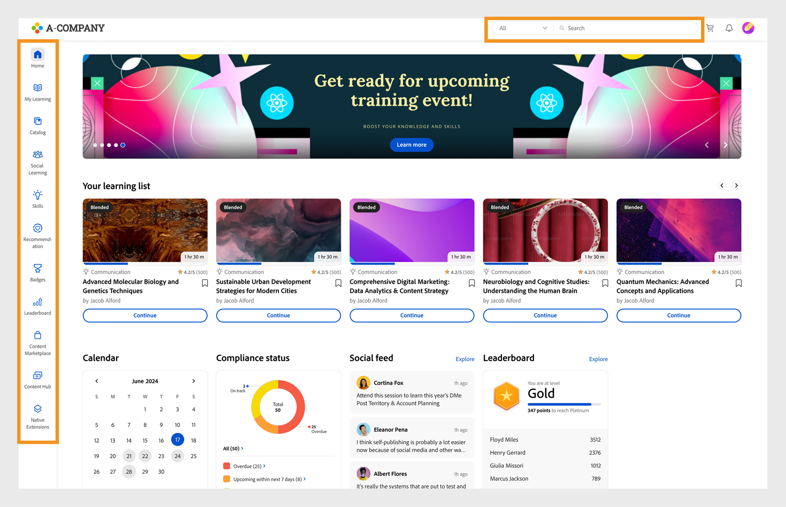
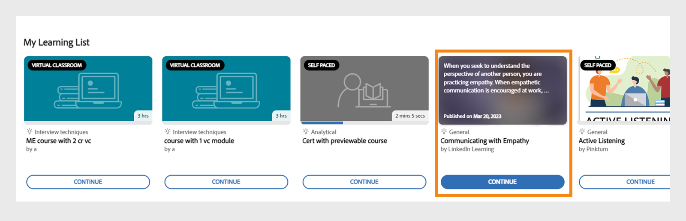
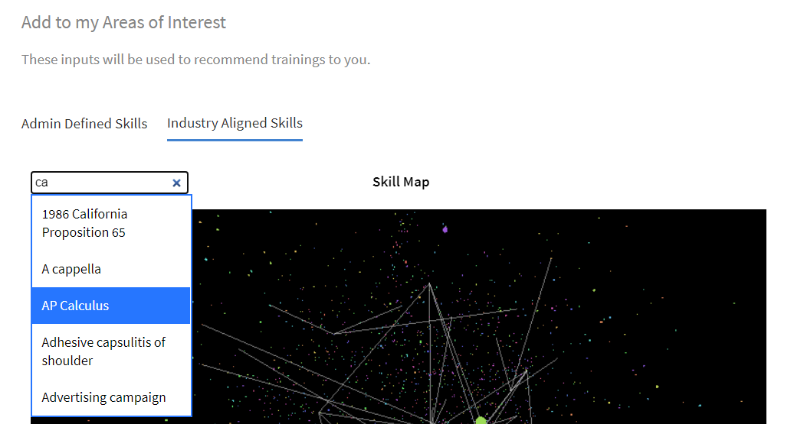

# Startpagina Student

## Overzicht {#overview}

Nadat de beheerder de Immersieve lay-out heeft ingeschakeld, wordt de leerder verwelkomd met een volledig vernieuwde gebruikersinterface bij het aanmelden bij de app.

>[!NOTE]
>
>De IE11-browser ondersteunt de Immersive-lay-out niet.

## Nieuwe gebruikersinterface voor Meeslepende lay-out

>[!IMPORTANT]
>
>We brengen de nieuwe gebruikersinterface in fasen vrij.

We hebben de gebruikersinterface voor de lerende vernieuwd met een strakker en bijgewerkt ontwerp. De nieuwe gebruikersinterface is bedoeld om een consistente gebruikerservaring te bieden op de **[!UICONTROL landingspagina&#39;s Start]**, **[!UICONTROL Mijn leeromgeving]**, **[!UICONTROL Catalogus]** en **[!UICONTROL Cursusoverzicht]** . De nieuwe visuele elementen volgen de huidige ontwerpstijlen en maken het product gebruiksvriendelijker en aantrekkelijker. Deze update bevat een nieuwe masthead, zijpaneel en hedendaagse widgets.

>[!NOTE]
>
>De vernieuwde gebruikersinterface is alleen van toepassing op de Immersive-lay-out. De mobiele web-app ondersteunt deze wijzigingen nog niet en zal ze in een toekomstige release bijwerken.

_Oude gebruikersinterface_

_Nieuwe gebruikersinterface_

### Homepage

De startpagina heeft een nieuw ontwerp met een verbeterd zijvenster, de bovenste koptekst, verbeterde cursuskaarten en widgets.

_Nieuwe homepage_

### Cataloguspagina

De cataloguspagina&#39;s hebben een nieuwe vormgeving met georganiseerde filters en verbeterde cursuskaarten voor een betere gebruikerservaring.

_Cataloguspagina_

### Pagina Cursusoverzicht

De pagina met het cursusoverzicht heeft een nieuwe vormgeving met meer details over de cursus. Deze pagina helpt studenten om alle informatie te krijgen die ze nodig hebben.

_Pagina met cursusoverzicht_

### Cursuskaarten

De cursuskaarten hebben ook een vernieuwde lay-out om details effectiever weer te geven. De vernieuwde cursuskaarten markeren de relevante metagegevens die nodig zijn voor inschrijving. Deze metagegevens omvatten correct gepubliceerde of vervaldatums, classificaties en beschrijvingen samen met de auteurs of providers.

_Oude cursuskaart_

_Nieuwe cursuskaart_

Voor cursussen die zijn geïmporteerd vanuit **LinkedIn** en het **Go1-platform** , worden op de cursuskaarten de oorspronkelijke publicatiedatums van **LinkedIn** en **Go1** weergegeven. U kunt deze specifieke publicatiedatums ook bekijken in de gebruikersinterface.

### Zijbalk en zoekbalk

De zijbalk is bijgewerkt met nieuwe gebruikersinterface-elementen voor een helderder uiterlijk. De nieuwe zoekbalk heeft geen zoekknop, waardoor de zoekbalk er netter uitziet. Studenten kunnen een trefwoord typen en op Enter drukken om de zoekopdracht te starten of resultaten selecteren onder de zoekbalk.

_Zijbalk en zoekbalk_

### Impressum {#masthead}

Bevat een video- of afbeeldingscarrousel met een ingesloten URL. De [beheerder kan elke afbeelding of video](../../administrators/feature-summary/announcements.md#masthead) als masthead uploaden en de zichtbaarheid ervan instellen voor een groep leerlingen.

*Masthead bekijken*

### Lijst met mijn leermateriaal {#mylearninglist}

Geeft de training weer die de leerling heeft gevolgd. Deze trainingen worden weergegeven als kaarten die horizontaal zijn uitgelijnd. Je kunt op de linker- of rechterknop klikken om door de cursussen te bladeren.

*Lijst mijn leerproces weergeven*

U kunt ook naar links en rechts vegen om door de lijst te navigeren.

Als u een cursus wilt hervatten, klikt u **[!UICONTROL op een kaart op Doorgaan]** . De speler wordt dan gestart.

De weergave van pictogrammen op elke trainingskaart wordt door de beheerder ingeschakeld/uitgeschakeld via de app Admin (**Instellingen** > **Algemeen** > **Pictogrammen** voor trainingskaart inschakelen).

**Toevoegen aan lijst met mijn leermateriaal**

Als u met uw muis over een cursuskaart beweegt in de delen **Aanbevolen op basis van uw interessegebieden** en **Aanbevolen op basis van activiteiten van uw collega&#39;s**, kunt u een optie zien om de cursus toe te voegen aan de **Lijst met mijn leermateriaal**. Klik **[!UICONTROL op +]** op de cursuskaart en de cursus wordt toegevoegd aan de **Mijn leerlijst**.

*Toevoegen aan lijst met mijn leermateriaal*

## Vaardigheidsniveaus kiezen {#chooseskilllevels}

Als student kunt u de cursuscatalogus op de volgende niveaus filteren:

* Beginner
* Gemiddeld
* Gevorderd

Kies een optie. Vervolgens kunt u de cursuscatalogus bekijken voor deze selectie.

*Vaardigheidsniveaus selecteren*

## Widget Compatibiliteitsdashboard

Met de widget Compatibiliteitsdashboard kunnen studenten cursussen/leerpaden/certificeringen filteren met aanstaande deadlines met het label Compatibiliteit. Deze functie is beschikbaar voor alle apps voor studenten, inclusief de ALM Teams-app, AEM, Mobile app, Immersive en SF app.

_Widget Compatibiliteitsdashboard_

## Agenda {#calendar}

Geeft uw geplande sessies en trainingen weer. Blader door de kalender om trainingen voor de volgende maanden te zien.

*De agenda voor geplande sessies weergeven*

De agendawidget bevat de volgende functies. U kunt het volgende bekijken:

* Trainingen gesorteerd op maand. Naar links of rechts bladeren.
* Aankomende klassikale of VK-trainingen waarvoor u zich kun aanmelden.
* Aankomende klassikale of VK-trainingen waarvoor u zich hebt aangemeld.
* Door de manager goedgekeurde klassikale of VK-training.

## Feed van sociale media {#socialfeed}

*Sociale feed weergeven*

Zie waar andere gebruikers over praten.

De widget geeft een smaenvatting van de activiteiten over een bepaalde periode. De widget:

* Geeft actieve gebruikers en hun activiteiten weer voor gebruikers binnen uw bereik of groep.
* Geeft berichten weer die in de afgelopen twee weken zijn gepubliceerd.

## Profielvaardigheden {#profileskills}

Profielvaardigheden worden gebruikt voor aanbevelingen voor cursussen. Als de beheerder een vaardigheid toewijst aan een gebruiker of een groep gebruikers, wordt de vaardigheid toegevoegd aan de profielvaardigheden van de student. Als de student een vaardigheid aan zijn of haar profiel toevoegt, worden alle niveaus van de vaardigheid toegevoegd aan de profielvaardigheden van de student. Wanneer een student de muiscursor over een vaardigheid beweegt, kan hij/zij de naam van de vaardigheid, methode voor toevoegen van de vaardigheid, niveau, voltooiingspercentage van de vaardigheid en studiepunten zien.

*Profielvaardigheden weergeven*

Als een student zich aanmeldt voor een cursus, worden alleen de externe vaardigheden die zijn gebaseerd op een score aan de profielvaardigheden toegevoegd. Bovendien kan een leerling externe vaardigheden zoeken, selecteren en toevoegen aan zijn/haar profiel. Als een leerling zich voor het eerst heeft aangemeld bij de app voor de leerling en als de vaardigheden van de leerling al aanwezig zijn, worden de vaardigheden in Mijn profiel weergegeven.

## Aanbeveling op basis van uw interessegebieden {#recommendationbasedonyourareaofinterest}

Geeft trainingen weer op basis van uw gekozen interessegebieden. De aanbeveling wordt gestuurd door een algoritme voor machinaar leren.

*Aanbevolen cursussen weergeven*

Voor meer gerichte aanbevelingen kunt u uw vaardigheden bijwerken door op **Weergeven/Bijwerken** te klikken.

Nadat u een vaardigheid hebt toegevoegd, worden toekomstige aanbevelingen meer gericht op uw voorkeuren.

Als de beheerder de optie **Vaardigheden verkennen** heeft uitgeschakeld, kunt u interesses toevoegen aan uw vaardigheden.

De aanbevolen cursussen worden als kaarten weergegeven. Wanneer je met de muis een kaart plaatst, kun je meer details van de baan zien.

Productterminologie wordt ook ondersteund.

**Vaardigheden afgestemd op de branche**

U kunt de netwerkgrafiek van vaardigheden zien als de beheerder de optie **Afgestemd op de branche** heeft ingeschakeld in de beheerdersapp.

Deze vaardigheid kan alleen worden bekeken wanneer de beheerder het type training instelt als Gerelateerd aan de branche.

In het beeld van de vaardighedenkaart kunt u zoeken naar een vaardigheid of naar vaardigheden en deze toevoegen.

*Vaardigheidskaart visualiseren*

Schakel de optie **Vaardigheden tonen in voor welke trainingen aanwezig zijn in mijn account**, als je alle skills wilt weergeven die in je account staan.

Nadat u een vaardigheid hebt toegevoegd, kunt u de grafiek zien met daarin de geselecteerde vaardigheid als primaire vertex en de gekoppelde vaardigheden als kleinere vertices.

De vaardigheden die u selecteert, worden ook weergegeven in het gedeelte **Geselecteerde vaardigheden**.

*Geselecteerde vaardigheden*

Klik op **[!UICONTROL Toevoegen]** om de vaardigheden toe te voegen.

## Aanbeveling op basis van activiteiten van uw collega&#39;s {#recommendationbasedonpeeractivity}

Geeft training weer op basis van wat uw collega&#39;s volgen. Dit wordt wederom aangestuurd door een Machine Learning-algoritme. De aanbevelingen zijn gebaseerd op training voor leerlingen die op maat zijn afgestemd en die voor de industrie zijn afgestemd.
