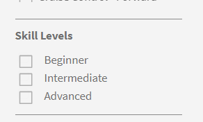
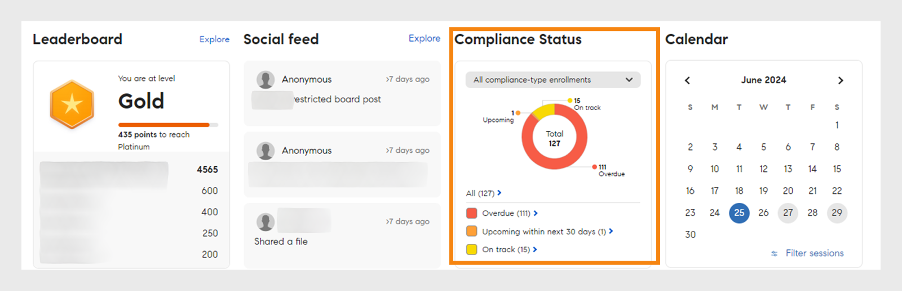

# Startpagina Student

## Overzicht {#overview}

Nadat de beheerder de immersive lay-out heeft ingeschakeld, wordt de student begroet met een volledig vernieuwde gebruikersinterface wanneer hij zich aanmeldt bij de app.

>[!NOTE]
>
>De browser IE11 ondersteunt de lay-out Immersive niet.

## Nieuwe studentinterface voor meeslepende lay-out

>[!IMPORTANT]
>
>De nieuwe gebruikersinterface van de student wordt in fasen uitgebracht.

We hebben de gebruikersinterface van de student vernieuwd met een gestroomlijnder en bijgewerkt ontwerp. De nieuwe UI streeft ernaar een verenigbare gebruikerservaring over **[!UICONTROL Leerhuis]**, **[!UICONTROL Mijn Leren]**, **[!UICONTROL Catalogus]** te verstrekken, en **[!UICONTROL het Overzicht van de Cursus]** landende pagina's. De nieuwe visuele elementen volgen de huidige ontwerpstijlen, waardoor het product er gebruiksvriendelijker en aantrekkelijker uitziet. Deze update bevat een nieuwe masthead, een nieuw zijpaneel en hedendaagse widgets.

>[!NOTE]
>
>De vernieuwde gebruikersinterface is alleen van toepassing op de meeslepende lay-out. Het mobiele web/de mobiele app ondersteunt deze wijzigingen nog niet en zal deze in een toekomstige versie bijwerken.

_Oude Gebruikersinterface_

_Nieuwe Gebruikersinterface_

### Homepage

De startpagina heeft een nieuw ontwerp met een verbeterd zijpaneel, een verbeterde koptekst, verbeterde cursuskaarten en widgets.

_Nieuwe homepage_

### Cataloguspagina

De cataloguspagina's hebben een nieuwe uitstraling met geordende filters en verbeterde cursuskaarten voor een betere gebruikerservaring.

_pagina van de Catalogus_

### Pagina Cursusoverzicht

De pagina met het cursusoverzicht heeft een nieuw uiterlijk met meer informatie over de cursus. Op deze pagina kunnen studenten alle informatie krijgen die ze nodig hebben.

_pagina van het cursusoverzicht_

### Cursuskaarten

Cursuskaarten beschikken ook over een opnieuw ontworpen lay-out om details effectiever weer te geven. De vernieuwde cursuskaarten markeren de relevante metagegevens die voor inschrijving zijn vereist. Deze metagegevens bevatten correcte gepubliceerde of vervaldatums, beoordelingen en beschrijvingen, samen met de auteurs of providers.

_Oude cursuskaart_

_Nieuwe cursuskaart_

Voor cursussen die van **LinkedIn** en het **Go1** platform worden ingevoerd, zullen de cursuskaarten de originele publicatiedata van **LinkedIn** en **Go1** tonen. U kunt deze specifieke publicatiedatums ook bekijken in de gebruikersinterface.

### Zijbalk en zoekbalk

De zijbalk wordt bijgewerkt met nieuwe UI-elementen voor een betere weergave. De nieuwe zoekbalk heeft geen zoekknop, waardoor het er overzichtelijker uitziet. Studenten kunnen een trefwoord typen en op Enter drukken om de zoekopdracht te starten of resultaten onder de zoekbalk te selecteren.

_Sidebar en onderzoeksbar_

### Impressum {#masthead}

Hiermee wordt een video- of afbeeldingscarrousel met een ingesloten URL uitgerust. De [ Beheerder kan om het even welk beeld of video ](../../administrators/feature-summary/announcements.md#masthead) activa als masthead uploaden en zijn zicht voor een groep studenten plaatsen.

*masthead van de Mening*

### Lijst met mijn leermateriaal {#mylearninglist}

Geeft de training weer die de leerling heeft gevolgd. Deze trainingen worden weergegeven als kaarten die horizontaal zijn geplaatst. U kunt op de linker- of rechterknop klikken om door de cursussen te bladeren.

*Bekijk Mijn het Leren lijst*

U kunt ook naar links en rechts vegen om door de lijst te navigeren.

Om een cursus te hervatten, klik **[!UICONTROL verdergaan]** op een kaart, en de speler zal lanceren.

De verschijning van pictogrammen op elke trainingskaart wordt toegelaten/gehandicapt door Admin via Admin app (**Montages** > **Algemeen** > **laat de Pictogrammen van de Kaart van de Opleiding toe**).

**Toevoegen aan lijst met mijn leermateriaal**

Als u met uw muis over een cursuskaart beweegt in de delen **Aanbevolen op basis van uw interessegebieden** en **Aanbevolen op basis van activiteiten van uw collega's**, kunt u een optie zien om de cursus toe te voegen aan de **Lijst met mijn leermateriaal**. Klik **[!UICONTROL +]** op de cursuskaart en de cursus zal aan de **Mijn het Leren Lijst** worden toegevoegd.

*Toevoegen aan lijst met mijn leermateriaal*

## Vaardigheidsniveaus kiezen {#chooseskilllevels}

Als student kunt u de cursuscatalogus op de volgende niveaus filteren:

* Beginner
* Gemiddeld
* Gevorderd

Kies een optie. Vervolgens kunt u de cursuscatalogus bekijken voor deze selectie.

*selecteer vaardigheidsniveaus*

## Widget dashboard Naleving

Met de widget dashboard Naleving kunnen studenten met het label Naleving cursussen/leerpaden/certificeringen filteren die aanstaande deadlines hebben. Deze functie is beschikbaar in alle Learner-apps, inclusief de app ALM Teams, AEM, de mobiele app, Immersive en SF-app.

_dashboard widget van de Naleving_

## Agenda {#calendar}

Geeft uw geplande sessies en trainingen weer. Blader door de kalender om de training voor de volgende maanden te bekijken.

*kalender van de Mening voor geplande zittingen*

De agendawidget bevat de volgende functies. U kunt het volgende bekijken:

* Trainingen gesorteerd op maand. Naar links of rechts bladeren.
* Aankomende klassikale of VK-trainingen waarvoor u zich kun aanmelden.
* Aankomende klassikale of VK-trainingen waarvoor u zich hebt aangemeld.
* Uw voltooide klassikale of VC-sessies
* Door de manager goedgekeurde klassikale of VK-training.

U kunt de filter **[!UICONTROL Mening toepassen ingeschreven zittingen slechts]** om slechts de ingeschreven zittingen op uw kalender te bekijken.

## Feed van sociale media {#socialfeed}

*De sociale voer van de Mening*

Zie waar andere gebruikers over praten.

De widget geeft een smaenvatting van de activiteiten over een bepaalde periode. De widget:

* Geeft actieve gebruikers en hun activiteiten weer voor gebruikers binnen uw bereik of groep.
* Geeft berichten weer die in de afgelopen twee weken zijn gepubliceerd.

## Profielvaardigheden {#profileskills}

Profielvaardigheden worden gebruikt voor aanbevelingen voor cursussen. Als de beheerder een vaardigheid toewijst aan een gebruiker of een groep gebruikers, wordt de vaardigheid toegevoegd aan de profielvaardigheden van de student. Als de student een vaardigheid aan zijn of haar profiel toevoegt, worden alle niveaus van de vaardigheid toegevoegd aan de profielvaardigheden van de student. Wanneer een student de muiscursor over een vaardigheid beweegt, kan hij/zij de naam van de vaardigheid, methode voor toevoegen van de vaardigheid, niveau, voltooiingspercentage van de vaardigheid en studiepunten zien.

*het profielvaardigheden van de Mening*

Als een student zich aanmeldt voor een cursus, worden alleen de externe vaardigheden die zijn gebaseerd op een score aan de profielvaardigheden toegevoegd. Bovendien kan een student externe vaardigheden zoeken, selecteren en toevoegen aan zijn/haar profiel. Als een student zich voor het eerst heeft aangemeld bij de Learner-app en als de vaardigheden van de student al aanwezig zijn, worden de vaardigheden weergegeven in Mijn profiel.

## Aanbeveling op basis van uw interessegebieden {#recommendationbasedonyourareaofinterest}

Geeft trainingen weer op basis van uw gekozen interessegebieden. De aanbeveling wordt aangestuurd door een Machine Learning-algoritme.

*Mening geadviseerde cursussen*

Voor meer gerichte aanbevelingen, kunt u uw vaardigheden bijwerken door op **Mening/Update** te klikken.

Nadat u een vaardigheid hebt toegevoegd, worden toekomstige aanbevelingen meer gericht op uw voorkeuren.

Als de beheerder de optie **Vaardigheden verkennen** heeft uitgeschakeld, kunt u interesses toevoegen aan uw vaardigheden.

De aanbevolen cursussen worden als kaarten weergegeven. Wanneer u de muis op een kaart plaatst, kunt u meer details van de cursus zien.

Productterminologie wordt ook ondersteund.

**Vaardigheden afgestemd op de branche**

U kunt de netwerkgrafiek van vaardigheden zien als de beheerder de optie **Afgestemd op de branche** heeft ingeschakeld in de beheerdersapp.

Deze vaardigheid kan alleen worden bekeken wanneer de beheerder het type training instelt als Gerelateerd aan de branche.

In het beeld van de vaardighedenkaart kunt u zoeken naar een vaardigheid of naar vaardigheden en deze toevoegen.

*de kaartvisualisatie van de Vaardigheid*

Laat de optie **toe toont Vaardigheden waarvoor de opleiding in mijn rekening** aanwezig is, als u alle vaardigheden wilt tonen die in uw rekening zijn.

Nadat u een vaardigheid hebt toegevoegd, kunt u de grafiek zien met daarin de geselecteerde vaardigheid als primaire vertex en de gekoppelde vaardigheden als kleinere vertices.

De vaardigheden die u selecteert, worden ook weergegeven in het gedeelte **Geselecteerde vaardigheden**.

*Geselecteerde vaardigheden*

Klik op **[!UICONTROL Toevoegen]** om de vaardigheden toe te voegen.

## Aanbeveling op basis van activiteiten van uw collega's {#recommendationbasedonpeeractivity}

Geeft training weer op basis van wat je collega’s volgen. Dit wordt wederom aangestuurd door een Machine Learning-algoritme. De aanbevelingen zijn gebaseerd op training voor zowel aangepaste als op branche gerichte studenten.
