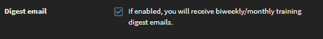

# Profielinstellingen

Lees dit artikel om te zien hoe u de instellingen van het studentprofiel instelt en een profielfoto toevoegt. Leer hoe u het studenttranscript voor uw profiel kunt downloaden.

## Profielinstellingen configureren {#configuringprofilesettings}

1. Klik op het omlaagwijzende pijltje naast uw profielfoto of foto in de rechterbovenhoek van de pagina.
1. Selecteer Profielinstellingen.
1. In het pop-upvenster dat verschijnt, kunt u de volgende acties uitvoeren:

   * Profielfoto toevoegen/bijwerken: ga met de muis op de foto staan. Klik op Uploaden en voeg een foto toe. Klik op Bewerken om de foto te wijzigen.
   * Foto verwijderen: zet de muis op de profielfoto. Klik op Verwijderen.
   * Klik op het tekstgebied onder Over mij om hier inhoud aan toe te voegen.
   * Wijzig de inhoud van Over mij door naast het veld op Bewerken te klikken.
   * Geef de landinstellingen voor uw profiel op. Selecteer de gewenste taal in de vervolgkeuzelijst Landinstellingen.
   * Stel de huidige landinstellingen voor uw profiel in.
   * Stel de tijdzone voor uw profiel in.
   * Download het studenttranscript met uw gegevens.

   
   *Voorkeuren voor studenten weergeven*

   Wanneer u op de link klikt om uw studenttranscript als XLS te downloaden, wordt een Excel-blad naar uw systeem gedownload. Dit Excel-blad bevat details over de leerobjecten die u hebt afgerond, zoals de voltooiingsstatus van elk leerobject, de overeenkomstige vervaldata en de verworven vaardigheden. Download dit blad om snel wat algemene gegevens te krijgen voor uw leerprofiel.

1. Als een beheerder Overzichtsmail heeft ingeschakeld en u staat niet op de DND-lijst, dan kunt u zich aan- of afmelden voor overzichtsmails. Schakel de optie hieronder in.

   
   *Abonneren op of afmelden voor digest-e-mails*

   Op basis van de frequentie zoals ingesteld door de beheerder ontvangt u, de student, de e-mail tweewekelijks of maandelijks.

## Afmelden voor overzichtsmails {#unsubscribefromdigestemails}

Als u een e-mail ontvangt, kunt u uw abonnement op de digest-e-mail opzeggen door op de knop **Abonnement opzeggen** onderaan in de e-mail.

Nadat u op **[!UICONTROL Abonnement opzeggen]**, wordt u omgeleid naar uw **Profielinstellingen** pagina, waar u de optie voor het ontvangen van e-mails kunt uitschakelen.

## Indeling van overzichtsmails {#anatomyofadigestemail}

Een overzicht-e-mail bestaat uit de volgende secties:

<table>
 <tbody>
  <tr>
   <td>
    
<b>Onderdeel</b>
</td>
   <td>
    
<b>Beschrijving</b>
</td>
  </tr>
  <tr>
   <td>
    
Persoonlijk trainingsoverzicht
</td>
   <td>
    
In deze sectie worden de trainingsmetrics van een student gepersonaliseerd door het aantal minuten te vermelden dat aan trainingen is besteed.

    
Op basis van de tijd die door een student is besteed, wordt de inhoud aangepast volgens de hieronder vastgestelde regels:

    
Als (time_spent) &gt;= 60 minuten, dan verschijnt de volgende tekst:

    
<i>"In de afgelopen twee weken/1 maand hebt u <b>(tijd_besteed)</b> minuten training om uzelf te helpen. Hieronder staan enkele aanbevelingen waarmee u meer te weten kunt komen." </i>

    
 Als (time_gebruikte) &lt; 60 minuten, wordt de volgende tekst weergegeven:

    
<i>"In de afgelopen twee weken/1 maand hebt u <b>(tijd_besteed)</b> minuten training om uzelf te helpen. Hieronder staan een paar aanbevelingen waarvan we hopen dat ze nuttig zijn om aan de slag te gaan."</i>
</td>
  </tr>
  <tr>
   <td>
    
Trainingsactiviteit
</td>
   <td>
    
Dit onderdeel toont een overzicht van de trainingsactiviteit op organisatieniveau voor dat account.

    
Het overzicht van de trainingsactiviteiten bestaat uit: 

    <ul>
     <li>Aantal trainingen beschikbaar in het account.</li>
     <li>Aantal medestudenten die actief gebruikmaken van de trainingsactiviteiten.</li>
     <li>Aantal leeruren die door collega's zijn besteed.</li>
     <li>Gemiddelde tijd (in minuten) die door collega's is besteed aan bijscholing in het account.</li>
    </ul></td>
  </tr>
  <tr>
   <td>
    
Aanbevolen cursussen
</td>
   <td>
    
Dit is een persoonlijk onderdeel waarin de aanbevolen trainingen voor studenten staan. In dit onderdeel kan een student drie trainingen zien die zijn uitgekozen door de aanbevelingsmachine.

    
Elke training heeft een Verken-knop, waarop de gebruiker kan klikken en naar de startpagina van de Learner-app wordt geleid.  
</td>
  </tr>
  <tr>
   <td>
    
Leaderboard
</td>
   <td>
    
Toont een staafdiagram waarbij elke staaf voor een student staat met daarbij de gamificationpunten van elke student (alleen als de beheerder gamification voor alle studenten heeft ingeschakeld).

    
Het leaderboard toont het volgende:

    <ul>
     <li>Punten die door een student zijn verdiend.</li>
     <li>Punten die nodig zijn om naar het volgende niveau te gaan.</li>
    </ul>
    
Er is ook een mini-leaderboard waarin de leider staat vermeld, samen met twee studenten die het dichtst bij de student in die gebruikersscope staan.

    
Als het leaderboard leeg is, wordt dit onderdeel niet getoond in de e-mail.
</td>
  </tr>
  <tr>
   <td>
    
<a>Sociale posts</a>
</td>
   <td>
    
Dit onderdeel toont de drie meest recente sociale posts.

    
Een student kan de aanmaakdatum, boardnaam, titel van de post (indien aanwezig), gebruikersnaam en het pictogram van de maker zien. De post kan ook een video, document, pdf of een ander bestand bevatten.

    
Elke post heeft links om de student naar de sociale leerpagina in de Learner-app te leiden.

    
Als er geen recente posts zijn, is dit onderdeel van de e-mail niet zichtbaar voor de student.
</td>
  </tr>
 </tbody>
</table>

## Veelgestelde vragen {#frequentlyaskedquestions}

**1. Hoe kan ik een studenttranscript downloaden als student?**

Klik rechtsboven op uw **[!UICONTROL gebruikersprofiel]** > **[!UICONTROL Profielinstellingen]**. Klik in het dialoogvenster dat verschijnt op **Mijn leertranscript (XLS) downloaden**.

*Studenttranscript downloaden*
