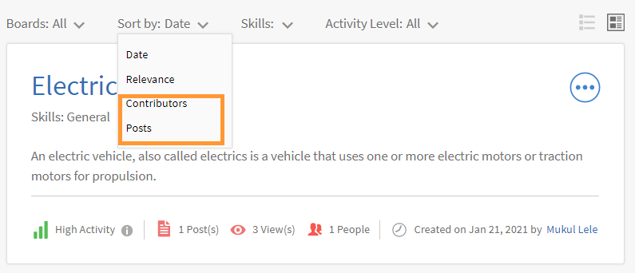
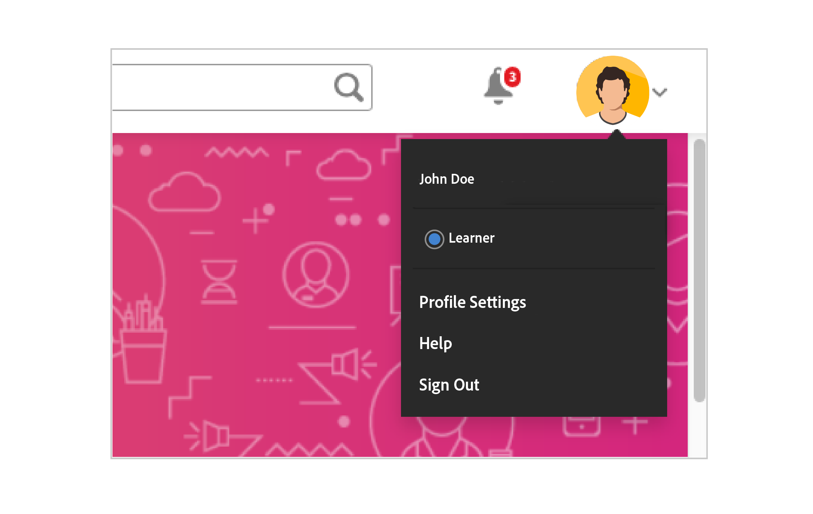

# Sociaal leren in Learning Manager

Kom te weten hoe u Sociaal leren voor het web als student kunt gebruiken

Sociaal leren is een platform in Learning Manager waarin gebruikers ideeën en zinvolle inzichten kunnen delen in een informele omgeving. Deze methode is een aanvulling op de notie van traditioneel leren.  De voltooiing van een online cursus geeft gebruikers geen voordeel om op sociaal niveau met hun collega&#39;s om te gaan.

Als gebruikers een training volgen, kan niet worden gegarandeerd dat ze alle nieuwe informatie onthouden.  Met sociaal leren kunnen gebruikers de expertise om hen heen benutten om precies de juiste informatie te verkrijgen die ze nodig hebben.  Gebruikers kunnen die informatie dan weer snel toepassen om taken te voltooien en doelen te bereiken.

Op dezelfde manier kunnen gebruikers met de functie Sociaal leren van Learning Manager communiceren door inhoud te delen en ervan te leren.

Op dit platform kunnen verschillende inhoudstypen worden gedeeld: video, audio, screenshots, tekst, vragen en polls.  Gebruikers kunnen hun online leermateriaal ook met hun collega&#39;s delen via de **Delen naar sociale bookmarklet**. Zie voor meer informatie  [Delen naar Sociaal leren](share-to-social.md).

Inhoud kan ook op een board worden geplaatst met behulp van de **Adobe Learning Manager-bureaubladtoepassing**. Zie voor meer informatie  [Adobe Learning Manager-app voor desktop](../adobe-learning-manager-app-for-desktop.md).

De functie wordt pas zichtbaar voor studenten als de beheerder Sociaal leren inschakelt.

 

*Leerdashboard weergeven*

<table>
 <tbody>
  <tr>
   <td>
    
<b>Sl. Aantal</b>
</td>
   <td>
    
<b>Terminologie of concept</b>
</td>
   <td>
    
<b>Beknopte uitleg</b>
</td>
  </tr>
  <tr>
   <td>
    
1
</td>
   <td>
    
Mijn boards
</td>
   <td>
    
Een board is <code>
      collection
     </code> berichten die door een gebruiker zijn gemaakt. Op Mijn boards worden alle berichten weergegeven die de gebruiker heeft gemaakt, gevolgd of waaraan deze heeft deelgenomen.
</td>
  </tr>
  <tr>
   <td>
    
2
</td>
   <td>
    
Alle boards
</td>
   <td>
    
Op de pagina Alle boards zien gebruikers de boards die zijn gemaakt door alle studenten met hetzelfde activiteitenbereik.
</td>
  </tr>
  <tr>
   <td>
    
3
</td>
   <td>
    
Opmerking
</td>
   <td>
    
Gebruikers kunnen berichten die op boards zijn gemaakt bekijken en erop reageren. 
</td>
  </tr>
  <tr>
   <td>
    
4
</td>
   <td>
    
Beantwoorden
</td>
   <td>
    
Gebruikers kunnen opmerkingen bij berichten op een board beantwoorden.
</td>
  </tr>
  <tr>
   <td>
    
5
</td>
   <td>
    
Upvote/downvote geven
</td>
   <td>
    
Klik op de upvote- of downvoteknop om een bericht wel of niet leuk te vinden.
</td>
  </tr>
  <tr>
   <td>
    
6
</td>
   <td>
    
Sociaal leaderboard
</td>
   <td>
    
Op het sociale leaderboard kunnen gebruikers de namen van studenten zien met het aantal punten dat ze hebben verdiend door deel te nemen aan Sociaal leren.
</td>
  </tr>
  <tr>
   <td>
    
7
</td>
   <td>
    
Mensen die ik volg
</td>
   <td>
    
Hier zien studenten de namen van andere studenten die ze volgen en het aantal berichten dat ze hebben gemaakt.
</td>
  </tr>
  <tr>
   <td>
    
8
</td>
   <td>
    
Populaire vaardigheden
</td>
   <td>
    
In de sectie Alle boards worden de vaardigheden die vaak door studenten worden gebruikt weergegeven naast het aantal berichten dat ze met die vaardigheid hebben gemaakt.
</td>
  </tr>
  <tr>
   <td>
    
9
</td>
   <td>
    
Delen naar Sociaal
</td>
   <td>
    
Delen naar Sociaal is een bookmarklet waarmee studenten hun online leermateriaal rechtstreeks op Sociaal leren van Learning Manager kunnen delen als webpagina's en blogs.
</td>
  </tr>
  <tr>
   <td>
    
10
</td>
   <td>
    
Nieuw bericht
</td>
   <td>
    
Met de knop Nieuw bericht kunnen gebruikers inhoud maken en posten op boards.
</td>
  </tr>
 </tbody>
</table>

## Inhoud als een bericht maken {#creatingcontentasapost}

Inhoud wordt gemaakt als bericht op een board.  Volg de onderstaande stappen om een bericht te maken:

1. Klikken **[!UICONTROL Nieuw bericht].**

   
   *Nieuw bericht selecteren*

1. Kies een van de volgende typen inhoud om te posten: tekst, vraag, video, audio, poll en screenshot.  Bestaande inhoud kan worden geüpload vanaf het systeem van de gebruiker of vanuit de galerie van de Adobe Learning Manager-desktopapp.

   Gebruik de Adobe Learning Manager-desktopapp om video, scherm of audio op te nemen en screenshots te maken.  Zie voor meer informatie [Adobe Learning Manager-bureaubladtoepassing](../adobe-learning-manager-app-for-desktop.md).

   <!---->

1. Zoek een board dat of vaardigheid die betrekking heeft op het bericht.  Als het board niet bestaat, klikt u **[!UICONTROL Een nieuw board maken]**.

   

   *Een board maken*

   Als u een externe of interne gebruiker bent en de beheerder u toegang heeft gegeven om een board te maken, kunt u een board maken.  Als u niet de machtigingen hebt om een board te maken, wordt de koppeling **Een nieuw board maken** wordt niet weergegeven.

1. Vul de gegevens in het pop-upvenster in en selecteer het volgende boardtype:

   * **Openbaar** - Deelname aan en zichtbaarheid van berichten is beschikbaar voor alle gebruikers.
   * **Privé** - Post is alleen zichtbaar voor de maker van het board, de moderators en de gebruikers die aan het board zijn toegevoegd.
   * **Beperkt** - Alleen boardeigenaars, beheerders en boardmoderators kunnen berichten maken. Andere gebruikers kunnen deelnemen door opmerkingen toe te voegen, te reageren, upvotes/downvotes te geven enzovoort.

   <!---->

   >[!NOTE]
   >
   >In de app Sociaal student kunt u alleen een **Beheerder** heeft de mogelijkheid om een persoonlijk board met gebruikersgroepen (intern/extern) te maken.
   >
   >Alle andere gebruikers behalve beheerders, auteurs, studenten, managers, docenten, enz. **kan** privaatboards met gebruikersgroepen maken. Ze kunnen het gedeelte van **gebruikersgroepen** in terwijl er een privéboard wordt gemaakt.

   Alleen voor beheerders: Als u **Privé** kiest, krijgt u twee opties te zien: **Gebruikers** en **Gebruikersgroepen**. Kies de optie **Gebruikersgroepen** en voeg vervolgens de gebruikersgroepen toe met wie u het privéboard wilt delen.

   In het veld Gebruikersgroepen kunt u interne, externe of aangepaste groepen kiezen. Uw privéboard wordt zichtbaar voor alle opgegeven gebruikersgroepen, ongeacht de omvanginstellingen.

1. Als u inhoud wilt delen, klikt u **[!UICONTROL Post]**. Als u op Posten klikt, krijgt de gebruiker een melding.

   De inhoud wordt gepost op basis van de beheerinstelling die door de beheerder is ingesteld voor inhoud voor Sociaal leren die kan worden beheerd door  [Moderatoren/vakexperts](social-learning-web-user.md#HowtobecomeaSubjectMatterExpertSME).

   <!---->

1. Gebruikers ontvangen meldingen wanneer hun bericht wordt goedgekeurd of afgewezen als de beheerder de inhoudsbeheerinstellingen heeft ingesteld op Uitsluitend handmatig inhoudsbeheer.  Als het bericht wordt afgewezen, klikt u op de link **Klik om te beoordelen** om opmerkingen te bekijken van de boardmoderators of SME&#39;s (Subject Matter Experts ofwel vakexperts).

   Inhoud gemaakt door gebruikers wordt beheerd door boardmoderators of vakexperts.

   <!---->

Als u een bericht in Sociaal leren aanmaakt of reageert op een bericht, kunt u met de RTF-editor een bericht opstellen en verschillende soorten opmaak toepassen.

*De Rich Text Editor gebruiken om een bericht te maken*

Als u een board maakt, hebt u ook toegang tot dezelfde set opties in de RTF-editor.

*De Rich Text Editor gebruiken om een bericht te maken*

## Goedgekeurde inhoud bekijken {#viewingapprovedcontent}

Zodra een bericht is goedgekeurd, wordt het weergegeven op een board voor Sociaal leren.  Gebruikers kunnen nu opmerkingen plaatsen, op het bericht reageren en upvotes/downvotes geven.

Gebruikers kunnen het volgende type inhoud gebruiken om een opmerking te maken: Scherm, webcam of beide opnemen, Audio opnemen, Screenshot maken, Bestand uploaden, Learning Manager-galerie.

<!---->

## Inhoud in Social Player {#contentinsocialplayer}

In Learning Manager worden video&#39;s, statische inhoud zoals presentaties en afbeeldingen op een board geplaatst in Social Player.  U kunt een bestand vanaf uw systeem uploaden, een video/scherm opnemen en een screenshot maken met behulp van de Adobe Learning Manager-desktopapp.

Zodra de gebruiker inhoud heeft gepost, kan deze door andere studenten in hetzelfde activiteitenbereik worden bekeken.  Op Social Player kunnen studenten inhoud bekijken, opmerkingen plaatsen, op berichten reageren, upvotes/downvotes geven en misbruik melden.

<!---->

**Volg de onderstaande stappen om opmerkingen te plaatsen/te reageren of upvotes/downvotes te geven op Social Player:**

1. Klik op de knop voor volledig scherm in de rechterbenedenhoek van de Social Player.
1. Om de afspeelknoppen op het scherm weer te geven, klikt u op de pijl naar beneden.
1. Om het gedeelte met opmerkingen weer te geven, klikt u op het opmerkingenpictogram in de linkerbenedenhoek van het scherm.
1. Gebruikers kunnen opmerkingen plaatsen/op berichten reageren, upvotes/downvotes geven en misbruik melden.
1. Klik op de Esc-toets om de modus Volledig scherm te sluiten.

## Board-weergave in sociaal {#board-view-social}

Een student kan alle boards in een lijstweergave zien. Meld u aan bij uw Learner-app en klik op de knop op de pagina Sociaal leren, zoals hieronder weergegeven:

*Boardweergave in sociaal opzicht*

Als u de berichten op het board bekijkt, kunt u de berichten sorteren op **Post** en **Medewerker**.

* Als u kiest voor **Berichten**, zullen de boards gesorteerd worden op basis van het aantal berichten in het board.
* Als u kiest voor **Bijdragers**, zullen de boards gesorteerd worden op basis van het aantal gebruikers dat heeft gereageerd of commentaar heeft gegeven in de threads.

### Vaardigheid filteren {#skillfilter}

*Publicaties sorteren*

Om boards te filteren op meerdere vaardigheden gebruikt u het Vaardighedenfilter. Zodra u de vaardigheden heeft geselecteerd kunt u ook de filters wissen.

### Activiteitenniveau filteren {#activitylevelfilter}

*Activiteitsniveaus filteren*

Om boards te sorteren op basis van het aantal interacties gebruikt u het Activiteitenfilter. U kunt deze sorteren op:

* Hoge activiteit
* Normale activiteit
* Lage activiteit

In de boardweergave kunt u de gebruikelijke handelingen op boards uitvoeren.

<!---->

## Posts downloaden {#downloadposts}

Studenten kunnen de inhoud, met bijlagen, downloaden van het platform Sociaal leren, zodat ze die inhoud offline kunnen gebruiken.

*Een bericht downloaden in een sociaal*

U kunt de inhoud downloaden uit de secties Posten, Opmerkingen of Reacties. U kunt slechts één bestand tegelijk downloaden.

Beide typen gebruikers (intern of extern) moeten de inhoud kunnen downloaden.

De knop Downloaden kan ook worden weergegeven in zoekresultaten voor berichten, opmerkingen of antwoorden.

U kunt een post – nog – niet downloaden in de apparaattoepassing. Die functie wordt binnenkort beschikbaar.

## Ondersteunde inhoudsindelingen {#supportedcontentformats}

<table>
 <tbody>
  <tr>
   <td>
    
<b>Inhoudstype</b>
</td>
   <td>
    
<b>Extensies</b>
</td>
  </tr>
  <tr>
   <td>
    
Video
</td>
   <td>
    
wmv, f4v, asf, 3gp, 3g2, avi, mov, h264, m4v, mp4, MPEG, mpg
</td>
  </tr>
  <tr>
   <td>
    
Audio
</td>
   <td>
    
mp3, amr, m4a, wav, wma, aac
</td>
  </tr>
  <tr>
   <td>
    
Statische bestanden
</td>
   <td>
    
PDF, ppt, pptx, doc, docx, xls, xlsx
</td>
  </tr>
  <tr>
   <td>
    
Afbeelding
</td>
   <td>
    
jpg, jpeg, png, bmp, gif
</td>
  </tr>
 </tbody>
</table>

## Board alleen zichtbaar voor geselecteerde gebruikers {#selected-users}

Een student die ook de rol **Admin** heeft, kan een gebruikersgroep toevoegen aan een privéboard. Elke gebruikersgroep kan aan het privéboard worden toegevoegd. De gebruikers die bij de gebruikersgroep horen, hebben alleen toegang tot het board.

Wanneer een nieuwe gebruiker aan de gebruikersgroep wordt toegevoegd, kunnen beide gebruikers het privéboard zien.

Als er een gebruiker van het privéboard wordt verwijderd, kan de gebruiker het privéboard niet meer zien.

Als er meerdere gebruikersgroepen zijn toegevoegd aan het privéboard, krijgen alle gebruikers van beide groepen toegang tot de privéboards.

<!---->

## Acties die op een bericht kunnen worden uitgevoerd {#actionsthatcanbedoneonapost}

Klik op het samengevouwen menupictogram in de rechterbovenhoek van een bericht om de opties weer te geven. De volgende menulijst wordt weergegeven: Bewerken, Toevoegen aan mijn verhaal, URL kopiëren, Verwijderen en Rapporteren.

Slechts bepaalde gebruikers hebben de machtigingen om bepaalde taken uit te voeren.  Hieronder vallen inhoudseigenaars, boardmoderators en de beheerder van de organisatie.

<table>
 <tbody>
  <tr>
   <td>
    
<b>Sl. Aantal</b>
</td>
   <td>
    
<b>Actie</b>
</td>
   <td>
    
<b>Uitleg</b>
</td>
  </tr>
  <tr>
   <td>
    
1
</td>
   <td>
    
Bewerken
</td>
   <td>
    
Met de optie Bewerken kan de maker van de inhoud zijn/haar bericht corrigeren of wijzigen.
</td>
  </tr>
  <tr>
   <td>
    
2
</td>
   <td>
    
Toevoegen aan mijn verhaal
</td>
   <td>
    
Een verhaal is een verzameling inhoud die door een gebruiker wordt beheerd.  Gebruikers kunnen de zichtbaarheid van de inhoud instellen op Privé of Openbaar.
</td>
  </tr>
  <tr>
   <td>
    
3
</td>
   <td>
    
URL kopiëren
</td>
   <td>
    
Met deze optie kunnen alle gebruikers de URL van een board of bericht kopiëren en delen.
</td>
  </tr>
  <tr>
   <td>
    
4
</td>
   <td>
    
Verwijderen
</td>
   <td>
    
Met de optie Verwijderen wordt het bericht na bevestiging door de gebruiker verwijderd.
</td>
  </tr>
  <tr>
   <td>
    
5
</td>
   <td>
    
Rapporteren
</td>
   <td>
    
Elke gebruiker kan misbruik van een bericht melden als het de privacy schendt of als de inhoud ongepast is.

    
Nadat een bericht is gerapporteerd, wordt een melding naar de beheerder en moderators van het board gestuurd voor verdere actie.
</td>
  </tr>
 </tbody>
</table>

**Toevoegen aan mijn verhaal**

Met deze functie kunnen gebruikers verhalen toevoegen of maken met berichten die door hen of andere gebruikers zijn gemaakt.

Volg de onderstaande stappen om een bericht aan een verhaal toe te voegen:

1. Klik op het samengevouwen menupictogram rechtsboven in een bericht en klik op **[!UICONTROL Toevoegen aan mijn verhaal]**.

   

   *Toevoegen aan een artikel*

1. In het dialoogvenster **Verhaal selecteren** kiest u een relevant verhaal om aan het bericht toe te voegen.  Als er nog geen relevante verhalen bestaan, kunt u ook een verhaal maken door op **Nieuw verhaal** te klikken.

   

   *Een artikel maken*

1. In het dialoogvenster Nieuw verhaal vult u de verhaalnaam en -beschrijving in.  U kunt de zichtbaarheid van het verhaal ook instellen op Openbaar of Privé.

   

   *Artikelnaam en -beschrijving toevoegen*

   Om verhalen te bekijken die door gebruikers zijn gemaakt, klikt u op de naam van de gebruiker in de menuopties van het profiel.

## Gebruikersbevoegdheden voor het uitvoeren van acties op een bericht {#userprivilegesforperformingtheactionsonapost}

<table>
 <tbody>
  <tr>
   <td>
    
 
</td>
   <td>
    
<b>Inhoudseigenaar</b>
</td>
   <td>
    
<b>Elke gebruiker</b>
</td>
   <td>
    
<b>Board-moderators</b>
</td>
   <td>
    
<b>Beheerder</b>
</td>
  </tr>
  <tr>
   <td>
    
<b>Bewerken</b>
</td>
   <td>
    
Ja
</td>
   <td>
    
Nee
</td>
   <td>
    
Nee
</td>
   <td>
    
Nee
</td>
  </tr>
  <tr>
   <td>
    
<b>Toevoegen aan mijn verhaal</b>
</td>
   <td>
    
Ja
</td>
   <td>
    
Ja
</td>
   <td>
    
Ja
</td>
   <td>
    
Ja
</td>
  </tr>
  <tr>
   <td>
    
<b>URL kopiëren</b>
</td>
   <td>
    
Ja
</td>
   <td>
    
Ja
</td>
   <td>
    
Ja
</td>
   <td>
    
Ja
</td>
  </tr>
  <tr>
   <td>
    
<b>Verwijderen</b>
</td>
   <td>
    
Ja
</td>
   <td>
    
Nee
</td>
   <td>
    
Ja
</td>
   <td>
    
Ja
</td>
  </tr>
  <tr>
   <td>
    
<b>Rapporteren</b>
</td>
   <td>
    
Ja
</td>
   <td>
    
Ja
</td>
   <td>
    
Ja
</td>
   <td>
    
Ja
</td>
  </tr>
 </tbody>
</table>

## Inhoud op boards bekijken {#viewingcontentinboards}

Boards zijn een verzameling van berichten.  Elk board in Sociaal leren is gemaakt op basis van een vaardigheid.  In Sociaal leren kunnen gebruikers de pagina&#39;s **Alle boards** en **Mijn boards** weergeven.

Op de pagina Alle boards staan berichten of boards die zijn gemaakt door alle gebruikers in een activiteitenbereik.  Maar op de pagina Mijn boards staan alleen boards die door een gebruiker zijn gemaakt of gevolgd, of waaraan deze heeft bijgedragen.

Op de pagina Mijn boards kunnen de zichtbare boards als volgt worden gefilterd: **Alles**, **Gemaakt door mij**, **Opmerkingen van mij**, **Gevolgd door mij**.

*Zichtbare boards filteren*

Gebruikers kunnen boards in zowel Mijn boards als Alle boards sorteren op **Relevantie** of **Datum**.

*boards sorteren op relevantie en datum*

Als er tijdens het maken van een bericht geen relevante boards in het bericht staan, klikt u op [Een nieuw board maken](social-learning-web-user.md#Creatingcontentasapost).  Volg de onderstaande stappen om een board weer te geven, te bewerken, te verwijderen, te rapporteren, URL te kopiëren en toe te voegen aan uw lijst met favoriete boards:

1. Klik op de naam van het board en klik op **[!UICONTROL Ga naar board]**.
1. Klik op de pagina Boards op het samengevouwen menupictogram en selecteer een optie uit de keuzelijst.

   <!---->

**Gebruikers zien de volgende opties op de pagina van een board:**

* Het aantal berichten, weergaven en volgers van het board.  De naam van de maker van het board, de aanmaakdatum en de populairste SME&#39;s voor het board.

* De namen van boards die aan de lijst met favoriete boards van een gebruiker is toegevoegd.

<!---->

## Delen naar Sociaal {#sharetosocial}

Delen naar Sociaal is een bookmarklet waarmee studenten hun online leermateriaal als webpagina&#39;s en blogs rechtstreeks op de pagina Sociaal leren kunnen plaatsen als bericht.  Zie voor meer informatie [Delen naar Sociaal leren](share-to-social.md).

*Delen naar Sociaal leren*

## Mijn vaardigheden {#myskills}

Op de pagina Mijn boards zien gebruikers de vaardigheden en het aantal berichten of boards die zijn gemaakt met behulp van een vaardigheid.  Klik op **[!UICONTROL Alle vaardigheden bekijken]** voor alle vaardigheden die een gebruiker heeft toegepast bij het maken van een board.

*Alle vaardigheden weergeven*

## Mensen die ik volg {#peopleifollow}

Op de pagina Mijn boards zien gebruikers de namen van mensen die ze volgen en het aantal berichten dat ze hebben gemaakt.

*Mensen die een student volgt*

Volg de onderstaande stappen om andere gebruikers te volgen:

1. Klik op de naam van een andere gebruiker om zijn/haar profielpagina weer te geven.
1. Klik op de knop Volgen/Niet meer volgen, afhankelijk van wat u wilt doen.

   

   *Een gebruiker volgen of ontvolgen*

## Sociaal leaderboard {#socialleaderboard}

Sociaal leaderboard verbetert gamification.  Activiteitspunten worden toegekend aan gebruikers wanneer ze een nieuw bericht/board maken, een upvote voor hun bericht krijgen, het juiste antwoord geven op een vraag of op een andere manier deelnemen aan Sociaal leren.

Het aantal punten en nieuwe berichten voor alle gebruikers in hetzelfde bereik staat in de lijst van het sociale leaderboard.  De student met het hoogste aantal punten staat bovenaan de lijst van het sociale leaderboard, gevolgd door de andere studenten.

Klik op **[!UICONTROL Ga naar het leaderboard]** op de pagina **Mijn boards** om alle studenten en hun puntenaantal te bekijken.

*Alle studenten weergeven*

## Activiteitspunten {#activitypoints}

Het aantal activiteitspunten dat aan gebruikers wordt toegekend, is gebaseerd op de uitgevoerde sociale activiteiten.

**Activiteitspunten worden voor het volgende toegekend aan gebruikers:**

* 5 punten voor het maken van een board.
* 5 punten voor het toevoegen van een bericht als tekst of vraagtype.
* 2 punten voor het plaatsen van een opmerking bij een bericht.
* De gebruiker die als eerste een board begint te gebruiken, krijgt 1 punt.  Gebruikers krijgen in totaal 20 punten voor de eerste 20 nieuwe berichten op dat board.

## Vakexpert (SME, Subject Matter Expert) worden {#howtobecomeasubjectmatterexpertsme}

Een vakexpert (SME) is iemand met expertise in een bepaalde vaardigheid.  In Sociaal leren van Learning Manager worden gebruikers aangewezen als SME&#39;s op basis van het maximale aantal activiteitspunten dat aan hen wordt toegekend voor een vaardigheid.

Toonaangevende SME&#39;s hebben het recht om de inhoud van de student te beheren voordat deze op een board in Sociaal leren wordt geplaatst.

De beheerder van een organisatie kan ook meer punten aan een student toekennen zodat deze SME wordt voor een vaardigheid.

## Inhoud beheren als SME {#howtocuratecontentasasme}

1. Wanneer een gebruiker een nieuw bericht of board maakt, krijgt de SME een melding waarin staat dat het bericht of board wacht op inhoudsbeheer.

   <!---->

1. Klik op de knop **Klik om te reviseren** koppeling. Deze actie brengt de SME naar de pagina voor inhoudsmoderatie (zie screenshot hieronder).

   <!---->

1. Om inhoud te beoordelen op basis van de relevantie voor de vaardigheid van een board, selecteert u de kleur op de relevantieschaal.  De eerste kleur duidt op irrelevantie (10% relevant) en de laatste kleur duidt op uiterste relevantie (100% relevant)
1. Het wordt aanbevolen dat de SME een opmerking plaatst op basis van de gegeven relevantiescore.  Gebruikers kunnen aan de hand van de opmerking beter begrijpen waarom hun bericht is afgewezen.

<!--## AI-enabled auto curation {#autocuration}-->

## Zoeken in Formeel en Informeel leermateriaal {#searchinformalandinformallearning}

Elke pagina op Sociaal leren heeft een zoekveld waarin gebruikers boards, vaardigheden of inhoud kunnen zoeken. Typ om te zoeken de zoekopdracht in het zoekveld en klik op het zoekpictogram of druk op Enter op uw toetsenbord.

<!---->

De volgende pagina&#39;s in Informeel leermateriaal hebben een zoekveld: **Mijn boards**, **Alle boards**, **Boardpagina**, van gebruikers **Profielpagina**, en **profielpagina van andere studenten**.

Wanneer een gebruiker inhoud zoekt in Informeel leermateriaal, wordt het aantal zoekresultaten voor de inhoud in Informeel en Formeel leermateriaal van Learning Manager weergegeven.

Het aantal zoekresultaten uit Informeel leermateriaal wordt ook weergegeven wanneer een gebruiker inhoud zoekt op een pagina in Formeel leermateriaal.

*Zoekresultaten voor leerdoeleinden*

Op de pagina Informeel leermateriaal van een board zijn alleen zoekopdrachten met betrekking tot het board mogelijk.  Zoekresultaten die geen betrekking hebben tot een board, worden niet weergegeven.

## Gebruikersprofiel weergeven {#viewuserprofile}

Als Sociaal leren voor een student is ingeschakeld, kan de gebruiker zijn/haar profiel bekijken door op de profielafbeelding in de rechterbovenhoek van Sociaal leren te klikken en zijn/haar naam te selecteren in de keuzelijst.

*Gebruikersprofiel weergeven*

Op de profielpagina zien studenten het aantal verdiende punten, het aantal gemaakte berichten en het aantal volgers.

Studenten kunnen ook de vaardigheden zien waarvoor ze als vakexpert zijn aangewezen.

Op de pagina van de student staan ook de **beheerde artikelen**, **recente activiteiten** uitgevoerd en de **gevolgd personen** door hen.

## Meldingen {#notifications}

Wanneer een bericht door een SME wordt goedgekeurd of afgewezen, ontvangen gebruikers een melding die kan worden geopend door op het meldingspictogram te klikken in de rechterbovenhoek van het venster.  Gebruikers kunnen meldingen bekijken over activiteiten in Sociaal leren en Formeel leermateriaal.

<!---->
