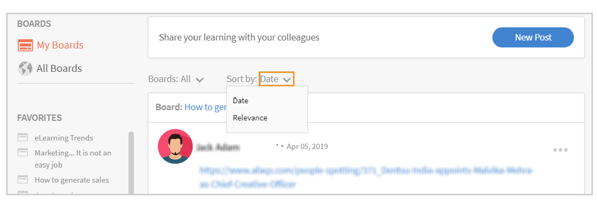

# Sociaal leren in Learning Manager

Leer hoe u Sociaal leren op het web als student kunt gebruiken

Sociaal leren is een platform in Learning Manager waarmee gebruikers ideeën en zinvolle inzichten kunnen delen in een informele omgeving. Het is een methode die het idee van traditioneel leren aanvult. Het voltooien van een online cursus biedt gebruikers geen voordeel om op sociaal niveau met hun collega&#39;s te communiceren.

Door alleen maar een training bij te wonen, is het niet zeker dat gebruikers alles behouden wat wordt geleerd. Aan de andere kant stelt social learning gebruikers in staat de expertise om hen heen te gebruiken om precies de informatie te krijgen die ze nodig hebben. Gebruikers kunnen die informatie vervolgens snel toepassen om een taak te voltooien en een doel te bereiken.

Op dezelfde manier kunnen gebruikers met de functie Sociaal leren van Learning Manager communiceren door inhoud te delen en ervan te leren.

Op dit platform kunnen verschillende typen inhoud worden gedeeld: video, audio, screenshot, tekst, vraag en opiniepeiling. Gebruikers kunnen hun online leermateriaal ook met hun collega&#39;s delen via de **Delen naar sociale bookmarklet**. Zie voor meer informatie  [Delen naar Sociaal leren](share-to-social.md).

Inhoud kan ook op een board worden geplaatst met behulp van de **Adobe Learning Manager-bureaubladtoepassing**. Zie voor meer informatie  [Adobe Learning Manager-app voor desktop](../adobe-learning-manager-app-for-desktop.md).

Alleen als de beheerder Sociaal leren inschakelt, is de functie zichtbaar voor een student.

 

*Leerdashboard weergeven*

<table>
 <tbody>
  <tr>
   <td>
    
<b>Sl. Nee.</b>
</td>
   <td>
    
<b>Terminologie of concept</b>
</td>
   <td>
    
<b>Korte toelichting</b>
</td>
  </tr>
  <tr>
   <td>
    
1
</td>
   <td>
    
Mijn boards
</td>
   <td>
    
Een board is <code>
      collection
     </code> berichten die door een gebruiker zijn gemaakt. Mijn boards geven alle berichten weer waaraan de gebruiker heeft deelgenomen, gemaakt en gevolgd.
</td>
  </tr>
  <tr>
   <td>
    
2
</td>
   <td>
    
Alle boards
</td>
   <td>
    
Op de pagina Alle boards kunnen gebruikers de boards bekijken die zijn gemaakt door alle studenten die het activiteitenbereik delen.
</td>
  </tr>
  <tr>
   <td>
    
3
</td>
   <td>
    
Opmerking
</td>
   <td>
    
Gebruikers kunnen berichten die op boards zijn gemaakt, voorzien van opmerkingen en bekijken. 
</td>
  </tr>
  <tr>
   <td>
    
4
</td>
   <td>
    
Antwoord
</td>
   <td>
    
Gebruikers kunnen reageren op opmerkingen die op berichten in een board worden geplaatst.
</td>
  </tr>
  <tr>
   <td>
    
5
</td>
   <td>
    
Upvote/downvote geven
</td>
   <td>
    
Klik op de knop voor upvotes en downvotes om een bericht wel of niet leuk te vinden.
</td>
  </tr>
  <tr>
   <td>
    
6
</td>
   <td>
    
Sociaal leaderboard
</td>
   <td>
    
Op het sociale leaderboard kunnen gebruikers de namen van studenten bekijken met het aantal punten dat ze hebben verdiend door deel te nemen aan Sociaal leren.
</td>
  </tr>
  <tr>
   <td>
    
7
</td>
   <td>
    
Mensen die ik volg
</td>
   <td>
    
Hier kunnen gebruikers de namen van andere studenten zien die ze volgen en het aantal berichten dat ze hebben gemaakt.
</td>
  </tr>
  <tr>
   <td>
    
8
</td>
   <td>
    
Populaire vaardigheden
</td>
   <td>
    
In de secties Alle boards kunnen de vaardigheden die vaak door studenten zijn gebruikt worden bekeken samen met het aantal berichten dat ze met die vaardigheid hebben gemaakt.
</td>
  </tr>
  <tr>
   <td>
    
9
</td>
   <td>
    
Delen op social media
</td>
   <td>
    
Delen naar Sociaal is een bookmarklet waarmee gebruikers hun online leermateriaal, zoals webpagina's en blogs, rechtstreeks kunnen delen naar Learning Manager Social Learning.
</td>
  </tr>
  <tr>
   <td>
    
10
</td>
   <td>
    
Nieuw bericht
</td>
   <td>
    
Met de knop Nieuw bericht kunnen gebruikers inhoud maken en posten op boards.
</td>
  </tr>
 </tbody>
</table>

## Inhoud maken als een bericht {#creatingcontentasapost}

Inhoud wordt gemaakt als een bericht op een board. Volg de onderstaande stappen om een bericht te maken:

1. Klikken **[!UICONTROL Nieuw bericht].**

   
   *Nieuw bericht selecteren*

1. Selecteer een van de volgende typen inhoud die u wilt posten: tekst, vraag, video, audio, opiniepeiling en schermafbeelding. Bestaande inhoud kan worden geüpload vanaf het gebruikerssysteem of vanuit de galerie van de Adobe Learning Manager-bureaubladtoepassing.

   Gebruik de Adobe Learning Manager desktop-app om een video of scherm, audio en screenshot op te nemen. Zie voor meer informatie [Adobe Learning Manager-bureaubladtoepassing](../adobe-learning-manager-app-for-desktop.md).

   <!---->

1. Zoek naar een board of vaardigheid die betrekking heeft op het bericht. Als het board niet bestaat, klikt u **[!UICONTROL Een nieuw board maken]**.

   

   *Een board maken*

   Als u een externe of interne gebruiker bent en de beheerder u toegang heeft verleend om een board te maken, kunt u een board maken. Als u niet de machtigingen hebt om een board te maken, wordt de koppeling **Een nieuw board maken** wordt niet weergegeven.

1. Vul in het pop-upvenster de gegevens in en selecteer het volgende type board:

   * **Openbaar** - Deelname aan en zichtbaarheid van berichten is beschikbaar voor alle gebruikers.
   * **Privé** - Post is alleen zichtbaar voor de maker van het board, de moderators en de gebruikers die aan het board zijn toegevoegd.
   * **Beperkt** - Alleen boardeigenaars, beheerders en boardmoderators kunnen berichten maken. Andere gebruikers kunnen deelnemen door opmerkingen toe te voegen, te reageren, upvotes/downvotes te geven enzovoort.

   <!---->

   >[!NOTE]
   >
   >In de app Sociaal student kunt u alleen een **Beheerder** heeft de mogelijkheid om een persoonlijk board met gebruikersgroepen (intern/extern) te maken.
   >
   >Alle andere gebruikers behalve beheerder, auteur, student, manager, docent, enz. **kan** privaatboards met gebruikersgroepen maken. Ze kunnen het gedeelte van **gebruikersgroepen** in terwijl er een privéboard wordt gemaakt.

   Alleen beheerder - Wanneer u **Privé** ziet u twee opties- **Gebruikers** en **Gebruikersgroepen**. Kies de optie **Gebruikersgroepen** en voeg vervolgens de gebruikersgroepen toe met wie u het privéboard wilt delen.

   In het veld Gebruikersgroepen kunt u interne, externe of aangepaste groepen kiezen. Uw privéboard is dan zichtbaar voor alle opgegeven gebruikersgroepen, ongeacht de bereikinstellingen.

1. Als u inhoud wilt delen, klikt u **[!UICONTROL Post]**. Als de gebruiker op Posten klikt, krijgt hij een melding.

   De inhoud wordt gepost op basis van de beheerinstelling die door de beheerder is ingesteld voor inhoud voor Sociaal leren die kan worden beheerd door  [Moderatoren/vakexperts](social-learning-web-user.md#HowtobecomeaSubjectMatterExpertSME).

   <!---->

1. Gebruikers ontvangen meldingen wanneer hun bericht is goedgekeurd of afgewezen, als de beheerder de instelling voor inhoudsbeheer heeft ingesteld op alleen handmatig beheer. Als het bericht is afgewezen, klikt u op de knop **Klik om te beoordelen** hyperlink naar de opmerkingen van de boardmoderators of SME&#39;s (Subject Matter Experts).

   Inhoud die door gebruikers wordt gemaakt, wordt beheerd door boardmoderators of vakexperts.

   <!---->

Wanneer u een bericht maakt of erop reageert in Sociaal leren, kunt u een bericht samenstellen met de Rich Text Editor en verschillende typen opmaak toepassen.

*De Rich Text Editor gebruiken om een bericht te maken*

Bovendien hebt u bij het maken van een board toegang tot dezelfde opties in de Rich Text Editor.

*De Rich Text Editor gebruiken om een bericht te maken*

## Goedgekeurde inhoud weergeven {#viewingapprovedcontent}

Zodra een bericht is goedgekeurd, wordt het weergegeven op een board voor Sociaal leren. Gebruikers kunnen nu opmerkingen plaatsen, op het bericht reageren, upvotes/downvotes geven.

Gebruikers kunnen het volgende type inhoud gebruiken om een opmerking te maken: Scherm, webcam of beide opnemen, Audio opnemen, Screenshot maken, Bestand uploaden, Galerie met leerbeheer.

<!---->

## Inhoud in Social Player {#contentinsocialplayer}

In Learning Manager worden video&#39;s, statische inhoud zoals presentaties en afbeeldingen in Social Player op een board geplaatst. U kunt een bestand van uw systeem uploaden, een video/scherm opnemen en een schermafbeelding vastleggen met behulp van de bureaubladtoepassing van Adobe Learning Manager.

Zodra de gebruiker inhoud heeft gepost, kan deze door andere studenten in hun activiteitenbereik worden bekeken. Op Social Player kunnen studenten misbruik bekijken, becommentariëren, reageren, upvotes/downvotes geven en melden.

<!---->

**Volg de onderstaande stappen om opmerkingen te plaatsen/te reageren, upvotes/downvotes te geven op Social Player:**

1. Klik op de knop Volledig scherm in de rechterbenedenhoek van de Social Player.
1. Klik op de pijl omlaag om de afspeelknoppen op het scherm weer te geven.
1. Klik op het opmerkingenpictogram linksonder in het scherm om de sectie met opmerkingen weer te geven.
1. Gebruikers kunnen opmerkingen plaatsen/reageren, upvotes/downvotes geven en misbruik melden.
1. Klik op Esc om de modus Volledig scherm af te sluiten.

## Boardweergave in sociaal opzicht {#board-view-social}

Een student kan alle boards in een lijstweergave zien. Meld u aan bij uw Learner-app en klik op de knop op de pagina Sociaal leren, zoals hieronder weergegeven:

*Boardweergave in sociaal opzicht*

Als u de berichten op het board bekijkt, kunt u de berichten sorteren op **Post** en **Medewerker**.

* Als u **Berichten**, worden de boards gesorteerd op basis van het aantal ambten in de raad van bestuur.
* Als u **Bijdragers** De boards worden gesorteerd op basis van het aantal gebruikers dat opmerkingen heeft geplaatst of heeft gereageerd in de threads.

### Vaardigheid, filter {#skillfilter}

*Publicaties sorteren*

Met het filter Vaardigheid kunt u meerdere vaardigheden selecteren om de boards te filteren. U kunt de filters ook wissen nadat u de vaardigheden hebt geselecteerd.

### Activiteitsniveau, filter {#activitylevelfilter}

*Activiteitsniveaus filteren*

Met het filter Activiteit kunt u de boards sorteren op de grootte van de interacties op een board. U kunt deze sorteren op:

* Hoge activiteit
* Normale activiteit
* Lage activiteit

In de boardweergave kunt u de gebruikelijke handelingen op boards uitvoeren.

<!---->

## Publicaties downloaden {#downloadposts}

Studenten kunnen de inhoud met bijlagen downloaden van het Sociaal Leerplatform, zodat ze deze inhoud offline kunnen gebruiken.

*Een bericht downloaden in een sociaal*

U kunt de inhoud downloaden uit de secties Posten, Opmerkingen of Reacties. U kunt slechts één bestand tegelijk downloaden.

Beide typen gebruikers (intern of extern) moeten de inhoud kunnen downloaden.

De knop Downloaden kan ook worden weergegeven in zoekresultaten voor berichten, opmerkingen of antwoorden.

U kunt een bericht nog niet downloaden in de apparaatapp. Deze functie is binnenkort beschikbaar.

## Ondersteunde indelingen voor inhoud {#supportedcontentformats}

<table>
 <tbody>
  <tr>
   <td>
    
<b>Inhoudstype</b>
</td>
   <td>
    
<b>Extensies</b>
</td>
  </tr>
  <tr>
   <td>
    
Video
</td>
   <td>
    
wmv, f4v, asf, 3gp, 3g2, avi, mov, h264, m4v, mp4, MPEG, mpg
</td>
  </tr>
  <tr>
   <td>
    
Audio
</td>
   <td>
    
mp3, amr, m4a, wav, wma, aac
</td>
  </tr>
  <tr>
   <td>
    
Statische bestanden
</td>
   <td>
    
PDF, ppt, pptx, doc, docx, xls, xlsx
</td>
  </tr>
  <tr>
   <td>
    
Afbeelding
</td>
   <td>
    
jpg, jpeg, png, bmp, gif
</td>
  </tr>
 </tbody>
</table>

## Het board is alleen zichtbaar voor geselecteerde gebruikers {#selected-users}

Een student die ook een **beheerder** kan een gebruikersgroep toevoegen aan een privéboard. Elke gebruikersgroep kan worden toegevoegd aan het privéboard en de gebruikers die tot de gebruikersgroep behoren, hebben alleen toegang tot het board.

Als een nieuwe gebruiker aan de gebruikersgroep wordt toegevoegd, kunnen beide gebruikers het privéboard zien.

Als een gebruiker van het privéboard wordt verwijderd, kan de gebruiker het privéboard niet meer zien.

Als er meerdere gebruikersgroepen zijn toegevoegd aan het privéboard, krijgen alle gebruikers van beide groepen toegang tot de privéboards.

<!---->

## Handelingen die op een bericht kunnen worden uitgevoerd {#actionsthatcanbedoneonapost}

Klik op het samengevouwen menupictogram in de rechterbovenhoek van een bericht om de opties ervan weer te geven. De volgende menulijst wordt weergegeven: Bewerken, Toevoegen aan mijn verhaal, URL kopiëren, Verwijderen en Rapporteren.

Slechts enkele gebruikers hebben machtigingen om bepaalde taken uit te voeren. De volgende soorten gebruikers zijn inhoudseigenaars, boardmoderators, en de beheerder van de organisatie.

<table>
 <tbody>
  <tr>
   <td>
    
<b>Sl. Nee.</b>
</td>
   <td>
    
<b>Handeling</b>
</td>
   <td>
    
<b>Uitleg</b>
</td>
  </tr>
  <tr>
   <td>
    
1
</td>
   <td>
    
Bewerken
</td>
   <td>
    
Met Bewerken kan de maker van inhoud zijn bericht corrigeren of wijzigen.
</td>
  </tr>
  <tr>
   <td>
    
2
</td>
   <td>
    
Toevoegen aan mijn verhaal
</td>
   <td>
    
Een artikel is een verzameling inhoud die wordt beheerd door een gebruiker. Gebruikers kunnen de zichtbaarheid van de inhoud instellen op Privé of Openbaar.
</td>
  </tr>
  <tr>
   <td>
    
3
</td>
   <td>
    
URL kopiëren
</td>
   <td>
    
Met deze optie kunnen alle gebruikers de URL van een board of bericht kopiëren en delen.
</td>
  </tr>
  <tr>
   <td>
    
4
</td>
   <td>
    
Verwijderen
</td>
   <td>
    
Met de optie Verwijderen wordt het bericht na bevestiging door de gebruiker verwijderd.
</td>
  </tr>
  <tr>
   <td>
    
5
</td>
   <td>
    
Rapport
</td>
   <td>
    
Elke gebruiker heeft machtigingen om misbruik van een bericht te melden als het de privacy schendt of als de inhoud ervan niet geschikt is.

    
Nadat een bericht is gerapporteerd, wordt een melding verzonden naar de beheerder en moderators van het board voor verdere acties.
</td>
  </tr>
 </tbody>
</table>

**Toevoegen aan mijn verhaal**

Met een sociaal verhaal kunnen gebruikers verhalen toevoegen of maken met berichten die door hen of andere gebruikers zijn gemaakt.

Volg de onderstaande stappen om een bericht aan een artikel toe te voegen:

1. Klik op het samengevouwen menupictogram rechtsboven in een bericht en klik op **[!UICONTROL Toevoegen aan mijn verhaal]**.

   

   *Toevoegen aan een artikel*

1. Van de **Verhaal selecteren** een relevant artikel te selecteren om het bericht toe te voegen. Als er geen relevante bestaande artikelen zijn, kunt u een artikel maken door op **Nieuw artikel**.

   

   *Een artikel maken*

1. Vul in het dialoogvenster Nieuw artikel de velden Artikelnaam en Beschrijving in. U kunt de zichtbaarheid van het artikel ook instellen op Openbaar of Privé.

   

   *Artikelnaam en -beschrijving toevoegen*

   Als u door gebruikers gemaakte artikelen wilt weergeven, klikt u op de naam van de gebruiker in de opties in het profielmenu.

## Gebruikersrechten voor het uitvoeren van handelingen op een bericht {#userprivilegesforperformingtheactionsonapost}

<table>
 <tbody>
  <tr>
   <td>
    
 
</td>
   <td>
    
<b>Eigenaar inhoud</b>
</td>
   <td>
    
<b>Elke gebruiker</b>
</td>
   <td>
    
<b>Baandrogers</b>
</td>
   <td>
    
<b>Beheerder</b>
</td>
  </tr>
  <tr>
   <td>
    
<b>Bewerken</b>
</td>
   <td>
    
Ja
</td>
   <td>
    
Nee
</td>
   <td>
    
Nee
</td>
   <td>
    
Nee
</td>
  </tr>
  <tr>
   <td>
    
<b>Toevoegen aan mijn verhaal</b>
</td>
   <td>
    
Ja
</td>
   <td>
    
Ja
</td>
   <td>
    
Ja
</td>
   <td>
    
Ja
</td>
  </tr>
  <tr>
   <td>
    
<b>URL kopiëren</b>
</td>
   <td>
    
Ja
</td>
   <td>
    
Ja
</td>
   <td>
    
Ja
</td>
   <td>
    
Ja
</td>
  </tr>
  <tr>
   <td>
    
<b>Verwijderen</b>
</td>
   <td>
    
Ja
</td>
   <td>
    
Nee
</td>
   <td>
    
Ja
</td>
   <td>
    
Ja
</td>
  </tr>
  <tr>
   <td>
    
<b>Rapport</b>
</td>
   <td>
    
Ja
</td>
   <td>
    
Ja
</td>
   <td>
    
Ja
</td>
   <td>
    
Ja
</td>
  </tr>
 </tbody>
</table>

## Inhoud op boards weergeven {#viewingcontentinboards}

Boards zijn een verzameling berichten. Elk board in Sociaal leren wordt gemaakt op basis van een vaardigheid. In Sociaal leren kunnen gebruikers de **Alle boards** pagina en **Mijn boards** pagina.

Op de pagina Alle boards zijn berichten of boards die zijn gemaakt door alle gebruikers in een activiteitenbereik zichtbaar. Maar op de pagina Mijn boards zijn alleen boards zichtbaar die zijn gemaakt, gevolgd en waaraan een gebruiker heeft deelgenomen.

Op de pagina Mijn boards kunnen de zichtbare boards als volgt worden gefilterd: **Alles**, **Gemaakt door mij**, **Opmerkingen van mij**, **Gevolgd door mij**.

*Zichtbare boards filteren*

In zowel Mijn boards als Alle boards kunnen gebruikers de boards sorteren op **Relevantie** of **Datum**.

*boards sorteren op relevantie en datum*

Als er tijdens het maken van een bericht geen relevante boards in het bericht staan, klikt u op [Een nieuw board maken](social-learning-web-user.md#Creatingcontentasapost).  Volg de onderstaande stappen om een board weer te geven, te bewerken, te verwijderen, te rapporteren, URL te kopiëren en toe te voegen aan uw lijst met favoriete boards:

1. Klik op de naam van het board of klik op **[!UICONTROL Naar board]**.
1. Klik op het samengevouwen menupictogram op de pagina Borden en selecteer een optie in de vervolgkeuzelijst.

   <!---->

**Gebruikers kunnen de volgende opties op een pagina op een board bekijken:**

* Het aantal berichten, weergaven en personen dat het board volgt, is zichtbaar op deze pagina. De naam van de maker van het board en de datum waarop het board is gemaakt, worden samen met de beste SME&#39;s voor het board weergegeven.

* De namen van boards die zijn toegevoegd aan de lijst met favoriete boards van een gebruiker, worden ook weergegeven.

<!---->

## Delen naar Sociaal {#sharetosocial}

Delen naar Sociaal is een bookmarklet waarmee gebruikers hun online leermateriaal, zoals webpagina&#39;s en blogs, als bericht rechtstreeks op de sociale pagina kunnen delen. Zie voor meer informatie [Delen naar Sociaal leren](share-to-social.md).

*Delen naar Sociaal leren*

## Mijn vaardigheden {#myskills}

Gebruikers kunnen op de pagina Mijn boards de vaardigheden en het aantal berichten of boards bekijken die met een vaardigheid zijn gemaakt. Als u alle vaardigheden wilt bekijken die de gebruiker tijdens het maken van een board gebruikt, klikt u op **[!UICONTROL Alle vaardigheden bekijken]**.

*Alle vaardigheden weergeven*

## Mensen die ik volg {#peopleifollow}

Op de pagina Mijn boards kunnen gebruikers de namen bekijken van de mensen die ze volgen en het aantal berichten dat ze hebben gemaakt.

*Mensen die een student volgt*

Volg de onderstaande stappen om andere gebruikers te volgen:

1. Klik op de naam van een andere gebruiker om de profielpagina van die gebruiker weer te geven.
1. Klik op de knop Volgen/Niet meer volgen om de gewenste actie uit te voeren.

   

   *Een gebruiker volgen of ontvolgen*

## Sociaal leaderboard {#socialleaderboard}

Sociaal leaderboard verbetert gamification. Activiteitspunten worden toegekend aan gebruikers wanneer ze een nieuw bericht/board maken, upvotes krijgen voor hun bericht, het juiste antwoord geven op een vraag en andere deelnemers aan Sociaal leren.

Het totale aantal punten en nieuwe berichten voor alle gebruikers in hetzelfde bereik is zichtbaar in de lijst van het sociale leaderboard. De student met het maximumaantal punten staat boven aan de lijst van het sociale leaderboard, gevolgd door de andere studenten.

Klikken **[!UICONTROL Naar leaderboard]** in de **Mijn boards** pagina om alle studenten en het aantal punten dat ze hebben gekregen te bekijken.

*Alle studenten weergeven*

## Activiteitspunten {#activitypoints}

Het aantal activiteitspunten dat aan gebruikers wordt gegeven, is gebaseerd op de uitgevoerde sociale activiteiten.

**Activiteitspunten worden toegekend aan gebruikers voor het volgende:**

* 5 punten voor het maken van een board.
* 5 punten voor het toevoegen van een bericht als tekst of vraagtype.
* 2 punten voor commentaar op elk bericht.
* Er wordt 1 punt toegekend aan de gebruiker die als eerste een board gaat gebruiken. Gebruikers krijgen in totaal 20 punten voor de eerste 20 nieuwe berichten op dat board.

## Een vakexpert (SME) worden {#howtobecomeasubjectmatterexpertsme}

Een vakexpert (SME) is een persoon met expertise in een bepaalde vaardigheid. In Sociaal leren van Learning Manager worden gebruikers aangewezen als SME&#39;s op basis van het maximale aantal activiteitspunten dat aan hen wordt toegekend voor een vaardigheid.

Toonaangevende SME&#39;s hebben het recht om de inhoud van de student te beheren voordat deze op een board in Sociaal leren wordt geplaatst.

De beheerder van de organisatie heeft ook het recht om meer punten toe te voegen aan een student om deze SME te maken voor een vaardigheid.

## Inhoud beheren als SME {#howtocuratecontentasasme}

1. Wanneer een gebruiker een nieuw bericht of board maakt, krijgt de SME een melding met de mededeling dat een bericht op het board wacht op beheer.

   <!---->

1. Klik op de knop **Klik om te reviseren** koppeling. Hiermee navigeert de SME naar de pagina voor inhoudsmoderatie, die eruitziet als de onderstaande screenshot.

   <!---->

1. Als u inhoud wilt beoordelen op basis van de relevantie van de inhoud voor de vaardigheid van een board, selecteert u de kleur in de relevantieschaal. De eerste kleur wordt als irrelevant beschouwd (10% relevant) en de laatste kleur is erg relevant (100% relevant).
1. Het wordt aanbevolen dat de SME een opmerking typt op basis van een gegeven relevantiescore. Gebruikers begrijpen beter waarom hun bericht wordt afgewezen bij het lezen van de opmerking.

<!--## AI-enabled auto curation {#autocuration}-->

## Zoeken in formeel en informeel leermateriaal {#searchinformalandinformallearning}

Elke pagina in Sociaal leren heeft het zoekveld waarmee gebruikers boards, vaardigheden of inhoud kunnen zoeken. Typ de zoekopdracht in het zoekveld en klik op het zoekpictogram of druk op Enter op het toetsenbord.

<!---->

De volgende pagina&#39;s in Informeel leermateriaal hebben een zoekveld: **Mijn boards**, **Alle boards**, **Boardpagina**, van gebruikers **Profielpagina**, en **profielpagina van andere studenten**.

Wanneer een gebruiker inhoud zoekt in Informeel leermateriaal, wordt het totale aantal zoekresultaten voor de inhoud in Informeel en Formeel leermateriaal van Leermanager weergegeven.

Het aantal zoekresultaten dat wordt gevonden in Informeel leermateriaal, wordt ook weergegeven tijdens het zoeken naar inhoud op een pagina Formeel leermateriaal.

*Zoekresultaten voor leerdoeleinden*

Op de pagina van het informele leerboard kunnen alleen zoekopdrachten met betrekking tot het board worden uitgevoerd. Zoekopdrachten die niet aan een board zijn gerelateerd, worden niet weergegeven.

## Gebruikersprofiel weergeven {#viewuserprofile}

Als Sociaal leren is ingeschakeld voor een student, kan de gebruiker zijn of haar profiel bekijken door in de rechterbovenhoek van Sociaal leren op de profielafbeelding te klikken en op zijn of haar naam in de vervolgkeuzelijst te klikken.

*Gebruikersprofiel weergeven*

Op de profielpagina kunnen studenten het totale aantal verdiende punten, het aantal gemaakte berichten en het aantal volgers bekijken.

Studenten kunnen ook de vaardigheden bekijken waarvoor ze zijn aangewezen als vakexpert.

Op de pagina van de student staan ook de **beheerde artikelen**, **recente activiteiten** uitgevoerd en de **gevolgd personen** door hen.

## Meldingen {#notifications}

Als een bericht door een SME wordt goedgekeurd of afgewezen, ontvangen gebruikers een melding die kan worden weergegeven wanneer ze op het meldingenpictogram in de rechterbovenhoek van het venster klikken. Gebruikers kunnen meldingen bekijken over activiteiten op het gebied van Sociaal leren en Formeel leren.

<!---->
