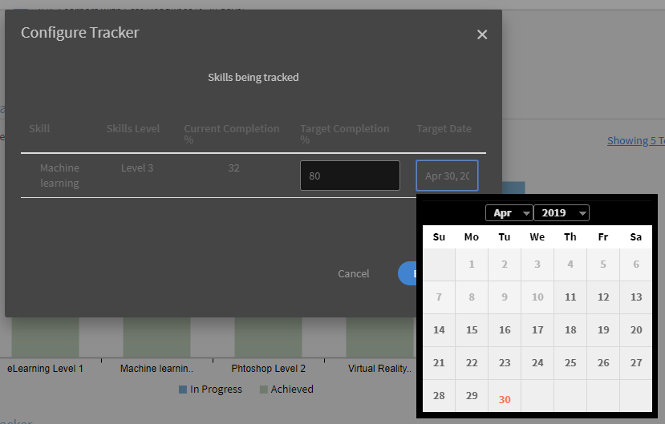

# Managerdashboard

Leer hoe u de leerresultaten van het beheerdashboard kunt bekijken en volgen.

Managers spelen een belangrijke rol in de leerinitiatieven van een team. Om hen beter te begeleiden, biedt het leerplatform de manager een dashboardweergave om de leerresultaten in zijn team bij te houden.

*Dashboard-rapport voor een manager*

Klik op de grafiek of klik om de details van een grafiek weer te geven **[!UICONTROL Details]** hyperlink.

## Leeroverzicht {#learningsummary}

Een manager kan het overzicht van de leeractiviteiten voor zijn team gedurende een geselecteerde periode bekijken. Selecteer maand, kwartaal of jaar in het vervolgkeuzemenu.

&#39;Maand&#39; en &#39;Jaar&#39; zijn gebaseerd op het kalenderjaar, terwijl &#39;Kwartaal&#39; is gebaseerd op het begrotingsjaar zoals geconfigureerd door de beheerder in accountinstellingen.

*Leeractiviteiten weergeven over een tijdsperiode*

## Teamweergave {#teamview}

In de Teamweergave worden de teams, hun leden en hun respectieve inschrijvingen, progressies en voltooide taken voor leerobjecten weergegeven.

*De Teamweergave toont de teams, hun leden en hun respectieve inschrijvingen*

Wanneer u op de teamnamen klikt, bijvoorbeeld Venkatesh&#39;s Team, kunt u de leden in het team van Venkatesh bekijken, samen met het totale aantal inschrijvingen, progressies en voltooide versies voor een leerobject.

*Teamleden selecteren*

Als u het leeroverzicht voor elk teamlid wilt weergeven, klikt u op het nummer in de desbetreffende kolom die overeenkomt met de teammanager. Er wordt een tabel geopend met een lijst met leerobjecten met informatie over Inschrijvingsdatum, Vervaldatum en Voortgang.

*Selecteer een teammanager*

Op dezelfde manier kunt u de leerobjecten samen met het aantal inschrijvingen, progressies of voltooide bewerkingen bekijken door op de waarden onder de corresponderende kolommen te klikken.

*Overzicht van cursussen en leermateriaal weergeven*

Als u nogmaals klikt op het aantal inschrijvingen, progressies of voltooide leerresultaten, kunt u de volgende gegevens bekijken: Personen, Inschrijvings-/voltooiingsdatum, Vervaldatum en geboekte vooruitgang.

*Inschrijvings-/voltooiingsdatum, vervaldatum en gemaakte voortgang weergeven*

## Studentenweergave {#learningsview}

In de weergave Leermateriaal wordt het aantal inschrijvingen, progressies en Voltooiingen voor een leerobject weergegeven.

Klik op de corresponderende waarden in de kolommen voor inschrijvingen, voortgang en voltooiing om details te bekijken, zoals personen, inschrijvingsdatums, vervaldatums en voortgang voor de respectievelijke leerobjecten.

*Leerweergave*

## Rapport exporteren {#exportreport}

Klik op **[!UICONTROL Handelingen] > [!UICONTROL Rapport]**

## Compatibiliteitsstatus {#compliancestatus}

Managers kunnen de algemene nalevingsstatus van het team voor geconfigureerde leerresultaten bekijken in het dashboard Naleving. De lijst met studenten kan worden geconfigureerd en de manager kan de leerresultaten selecteren om de nalevingsstatus bij te houden.

Op dit dashboard kunnen managers ook de studenten zien die voldoen aan de vereisten, binnen een veilige deadline, naderend deadline en niet-compatibel voor een geselecteerd leerobject.

U kunt leerobjecten met voltooiingsdeadlines configureren in het compatibiliteitsdashboard voor tracering.

**Volgzaam**: Geeft het aantal studenten weer dat het leerobject binnen de voltooiingsdeadline heeft voltooid.

**Veilige deadline**: Geeft het aantal studenten weer dat minder dan 30 dagen beschikbaar is om een leerobject te voltooien.

**Aanstaande deadline**: Geeft het aantal studenten weer met meer dan 30 dagen beschikbaar om een leerobject te voltooien.

**Niet-compatibel**: Geeft het aantal studenten weer dat het leerobject niet binnen de voltooiingsdeadline heeft voltooid.

*Compatibiliteitsdashboard weergeven*

## Teamweergave {#TeamView-1}

Geeft de compatibiliteitsstatus van een cursus voor de respectieve teams weer. Compliant, Veilige deadline, Aanstaande deadline en Niet-conform zijn kolommen in de tabel Teamweergave.

*nalevingsstatus van een cursus voor de respectieve teams*

Klik op de corresponderende waarden in de tabel om de namen van de leden in een team en het individuele aantal cursussen waarvoor hun status Voltooid is, in Veilige deadline, bij Aanstaande deadline en Niet-conform weer te geven.

*Individuele teams selecteren*

Nadat u verder hebt geklikt op de waarden in de compatibele, veilige deadline, aanstaande deadline en niet-conforme kolom, worden de corresponderende cursusgegevens weergegeven: naam leerobject, inschrijvingsdatum/voltooiingsdatum, vervaldatum en voortgang in percentage.

 

*Voortgang van cursussen weergeven*

## Studentenweergave {#LearningsView-1}

In de weergave Statusinformatie voor compliance wordt de lijst met leerobjecten en het corresponderende aantal teamleden die binnen een veilige deadline compatibel zijn, een aanstaande deadline hebben of niet voldoen weergegeven.

*De deadline en nalevingsstatus weergeven*

Wanneer u verder klikt op de waarden in de compatibele, veilige deadline, aanstaande deadline en niet-compatibele kolommen, worden de volgende gegevens weergegeven: Personen, Inschrijvingsdatum, Voltooiingsdatum en Voortgang.

*Details van compliance weergeven*

## Gegevens exporteren en e-mails verzenden {#exportdataampsendemails}

* Klik op **[!UICONTROL Handelingen]** > **[!UICONTROL Exporteren]**.

* Als u een e-mail naar teamleden wilt sturen, klikt u op **[!UICONTROL Handelingen]** > **[!UICONTROL E-mail verzenden]**.

*Gegevens exporteren en e-mailen*

## Teamvaardigheden {#teamskills}

Managers kunnen de grafiek van de vaardigheidsvoltooiing bekijken en een prognose van de vaardigheidsvoltooiing op verschillende niveaus configureren. Vijf vaardigheden worden vermeld in de vaardigheidsvervolgkeuzelijst. De manager krijgt kennis van de expertise die de teamleden hebben opgedaan en identificeert sterke talenten in bepaalde vaardigheden.

Managers kunnen ook bepaalde vaardigheden in een team aansturen door een doel vast te stellen en te voorspellen hoe lang het zou duren om een vaardigheid voor een bepaald percentage van een team binnen een tijdslijn te behalen.

Deze prognose is gebaseerd op systeemberekeningen die in de toekomst een beeld geven van de voortgang van die specifieke vaardigheid.

*Vaardigheidsprognose weergeven*

Volg de onderstaande stappen om de vaardigheidsstatus van een team te bekijken:

1. Klikken **[!UICONTROL Teamvaardigheden]** in het linkerdeelvenster onder Mijn teamweergave.
1. Klik op het vaardigheidsfilter en selecteer een vaardigheid in de vervolgkeuzelijst om de weergegeven vaardigheden weer te geven.
1. Als u een niveau wilt selecteren (Niveau 1, Niveau 2 of Niveau 3), klikt u op de vervolgkeuzelijst met niveaus.
1. Op basis van de geselecteerde vaardigheid en het geselecteerde niveau wordt een grafiek met de vaardigheidsstatus weergegeven. Bij het aanwijzen van de grafiek kunt u de volgende percentages van de vaardigheidsstatus bekijken: **In uitvoering** en **Gebehaald**.

   

   *Percentage van vaardigheidsstatus weergeven*

## De teamvoltooiing % voor een vaardigheid voorspellen {#howtoforecasttheteamcompletionforaskill}

Volg de onderstaande stappen om te voorspellen hoeveel teamvoltooiing % is voor een vaardigheid:

1. Klik op de configureerbare hyperlink om de configuratiecontracker weer te geven.

   

   *Selecteer de hyperlink Configureren*

1. Voer in het pop-updialoogvenster configureren voor de vaardigheid die u wilt configureren een percentage in het dialoogvenster **Doelvoltooiing %** en de datum waarop u het gewenste voltooiingspercentage wilt bereiken in het dialoogvenster **Doeldatum** veld.***

   

   *Doelvoltooiingspercentage invoeren*

1. Klik op de knop **Schatting** knop. De uitvoer lijkt op de onderstaande schermafbeelding.

   

   *Uitvoer van vaardighedentracering weergeven*

## Voltooiingsprognose voor vaardigheidsniveau {#skilllevelcompletionforecast}

De manager van een team kan het percentage van de teamvoltooiing van een vaardigheid voor een bepaalde periode weergeven en configureren op basis van de voltooiingspercentage van het doel en de datumtijd die in de vaardigheidstracker zijn opgegeven.

In de prognosegrafiek zijn er twee typen lijnen (dichte en gestippelde lijnen) met elk drie hoekpunten.

Op de ononderbroken lijn geeft het eerste punt de datum weer voor de eerste inschrijving voor een vaardigheidsniveau.

*Eerste inschrijving voor een vaardigheidsniveau weergeven*

Het tweede punt toont de huidige datum en het niveau % van de teamvoltooiing van de vaardigheid.

*Huidige datum en teamvoltooiing weergeven % niveau van vaardigheid*

Het derde punt op de lijn geeft het verwachte voltooiingspercentage en de streefdatum aan.

*Verwachte voltooiingspercentage en einddatum van doel weergeven*

## Voorspelde lijn {#forecastline}

De stippellijn is de prognoslijn die de prognose weergeeft op basis van de huidige teamvoltooiing % voor een vaardigheid in een bepaalde tijdsperiode.

Het eerste punt op de stippellijn geeft de voltooiing van het team aan in % en de verwachte voltooiing van het team in % voor een vaardigheid op die datum.

*De volledige teamdeelname en het verwachte percentage teamvoltooiing voor een vaardigheid weergeven*

Het tweede punt geeft de datum weer waarop de verwachte teamvoltooiing voor een vaardigheid werd behaald.

*Bekijk de datum waarop de verwachte teamvoltooiing % werd bereikt voor een vaardigheid*

Het derde punt in de voorspelde regel geeft het percentage weer waarmee het team is voltooid dat is bereikt op de doeldatum die is opgegeven in de vaardigheidskiezer.

*Bekijk het percentage teamvoltooiing dat is bereikt op de doeldatum die is opgegeven in de vaardigheidskiezer*

Onder de grafiek wordt een tabel weergegeven met de weergave van het team en het aantal vaardigheden dat is ingeschreven, bereikt en in uitvoering. Als een leerprogramma een voltooiingsdatum heeft, wordt ook de verwachte voltooiingsdatum weergegeven.

*Tabel met de weergave van het team en het aantal vaardigheden dat is ingeschreven, bereikt en in uitvoering*

Wanneer u op de teamnaam klikt, wordt de lijst met leden die zich hebben ingeschreven voor de vaardigheid, de vaardigheidsstatus en de voltooiingsdatum weergegeven.

*Lijst met leden weergeven*

Wanneer u op het team klikt, kunt u de leden in het team en de bijbehorende details voor de geselecteerde vaardigheid bekijken, zoals de ingeschreven persoon, de status (bezig of bereikt) en de voltooiingsdatum indien ingesteld.

*Vaardigheden van leden weergeven*

Bij het selecteren van de waarden voor een team onder de inschrijvingskolom, bereikt en bezig, kunt u het aantal gebruikers bekijken dat zich voor de vaardigheid heeft ingeschreven. U kunt ook de datum bekijken waarop de gebruiker zich voor de vaardigheid heeft ingeschreven, de status en de voltooiingsdatum als de vaardigheid door de gebruiker is voltooid.

<!-- -->

## Rapport exporteren {#Exportreport-1}

* Klikken **[!UICONTROL Handelingen]** > **[!UICONTROL Exporteren]** om de gegevens als Excel-bestand te exporteren.

*De gegevens exporteren*
