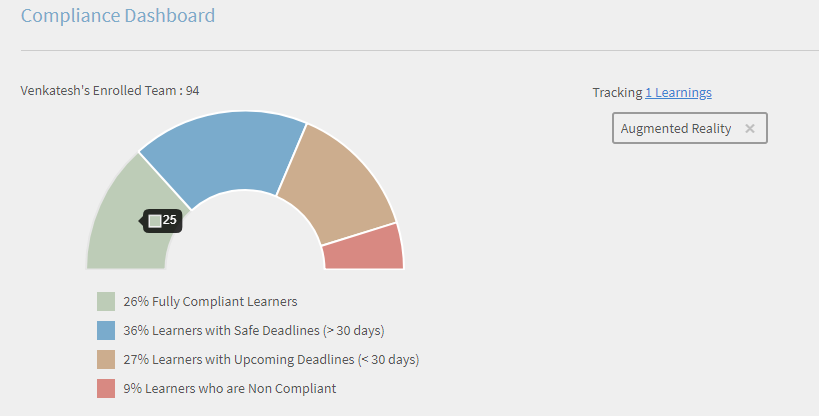
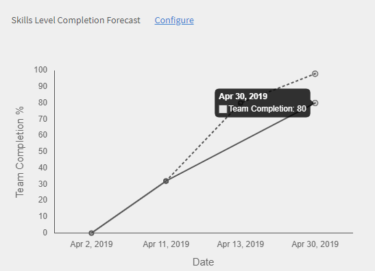

# Managerdashboard

Leer hoe u vanaf het managerdashboard leermateriaal kunt bekijken en volgen.

Managers spelen een belangrijke rol in de leerinitiatieven van een team. Het leerplatform biedt de manager een dashboard om het leermateriaal in zijn team te bekijken en te volgen voor een betere begeleiding.

*Dashboardrapport voor een Manager*

Klik op de grafiek of klik op de hyperlink **[!UICONTROL Details]** om de details van een grafiek te bekijken.

## Leersamenvatting {#learningsummary}

Een manager kan een samenvatting bekijken van leeractiviteiten voor zijn team over een geselecteerde tijdsperiode. Selecteer maand, kwartaal of jaar in het vervolgkeuzemenu.

&#39;Maand&#39; en &#39;Jaar&#39; zijn gebaseerd op het kalenderjaar, terwijl &#39;Kwartaal&#39; gebaseerd is op het financiële jaar zoals geconfigureerd door de beheerder in de accountinstellingen.

*Leeractiviteiten gedurende een tijd bekijken perios*

## Teamoverzicht {#teamview}

Het teamoverzicht toont de teams, de leden en hun respectievelijke inschrijvingen, vorderingen en voltooiingen voor leerobjecten.

*In de teamweergave worden de teams, hun leden en hun respectieve inschrijvingen weergegeven.*

Door op de teamnamen te klikken, bijvoorbeeld het team van Venkatesh, kun je de leden in het Venkatesh-team bekijken samen met het totale aantal inschrijvingen, progressies en voltooien van een leerobject.

*Selecteer een teamlid*

Klik op het aantal in de kolom die aan de teammanager is gekoppeld om de leersamenvatting van elk teamlid te bekijken. Een tabel wordt geopend en de lijst van leerobjecten met inschrijvingsdatum, vervaldatum en vorderingsinformatie wordt weergegeven.

*Selecteer een teammanager*

Op dezelfde manier kunt u de leerobjecten bekijken samen met het aantal inschrijvingen, vorderingen of voltooiingen door op de waarden te klikken die onder de overeenkomstige kolommen staan.

*Cursussen en leeroverzicht weergeven*

Wanneer u verder klikt op het aantal inschrijvingen, voortgang of voltooiingen voor elk leerproces, kunt u de volgende gegevens bekijken: personen, inschrijvings-/voltooiingsdatum, vervaldatum en gemaakte voortgang.

*De inschrijvings-/voltooiingsdatum, vervaldatum en gemaakte voortgang weergeven*

## Leermateriaaloverzicht {#learningsview}

Het leermateriaaloverzicht toont het aantal inschrijvingen, vorderingen en voltooiingen voor een leerobject.

Om details te bekijken zoals mensen, inschrijvingsdatums, vervaldatums en vorderingen voor respectievelijke leerobjecten, klikt u op de overeenkomstige waarden in de kolommen voor inschrijvingen, vorderingen en voltooiingen.

*Weergave Leren*

## Rapport exporteren {#exportreport}

Als u een Excel-rapport wilt genereren, selecteert u **[!UICONTROL Handelingen] > [!UICONTROL Rapport]**

## Nalevingsstatus {#compliancestatus}

In het nalevingsdashboard kunnen beheerders de algehele compatibiliteitsstatus van het team voor geconfigureerde lessen voor specifieke categorieën bekijken (bijvoorbeeld verkoop, marketing en juridisch). Beheerders kunnen een dashboard maken met compatibiliteitscursussen, leerpaden of certificering en deze delen met de managers. Beheerders kunnen het dashboard bekijken dat door de beheerder wordt gedeeld in hun instanties.

### Het dashboard weergeven

Selecteer **[!UICONTROL Nalevingsdashboard]** in de managerapp om het dashboard weer te geven.

_Compatibiliteitsdashboard - Manager-app_

Het nalevingsdashboard bevat de volgende compatibiliteitsstatussen:

* **[!UICONTROL Niet-conforme studenten]**: hier wordt het aantal studenten weergegeven dat deadlines heeft gemist.
* **[!UICONTROL Leerders die deadlines]** naderen: toont het aantal studenten met een deadline in minder dan 30 dagen.
* **[!UICONTROL Studenten met veilige deadlines]**: hier ziet u het aantal studenten met nog meer deadlines (meer dan 30 dagen).
* **[!UICONTROL Volledig compatibele studenten]**: het aantal volledig compatibele studenten.
* **[!UICONTROL Studenten die nergens zijn ingeschreven]**: het aantal leerlingen dat niet is ingeschreven voor cursussen, leerpaden of certificeringen.

### E-mailmanagers en studenten

**Meerdere teams beheren**

Als u meerdere teams beheert, kunt u uw managers op de hoogte stellen van de leerstatus van hun teamleden door de **[!UICONTROL optie E-mailmanagers]** in de **[!UICONTROL sectie Teamweergave]** te selecteren.

_E-mailmanagers_

De **[!UICONTROL E-mailmanagers]** bieden u de volgende opties:

* **[!UICONTROL E-mailmanagers van niet-compatibele studenten]**: stel managers op de hoogte van hun teamleden die deadlines hebben gemist.
* **[!UICONTROL E-mailmanagers van deadlines]** van studenten die naderen: stel managers op de hoogte van hun teamleden die nog naderende deadlines hebben.

**Eén team beheren**

Als u één team beheert, kunt u uw studenten op de hoogte stellen van hun leerstatus door de **[!UICONTROL optie E-mail lerenden]** te selecteren die beschikbaar is in de **[!UICONTROL sectie teamweergave]** .

_Studenten e-mailen_

De **[!UICONTROL optie Studenten e-mailen]** biedt je de volgende opties:

* **[!UICONTROL Niet-conforme studenten]** via e-mail verzenden: stel leerlingen op de hoogte die deadlines hebben gemist.
* **[!UICONTROL E-mailen aan studenten die deadlines]** naderen: stel leerlingen op de hoogte van aanstaande deadlines.

### Rapport downloaden

Ga als volgt te werk om het rapport te downloaden:

1. Ga in de Manager-app naar Het Nalevingsdashboard **** > **[!UICONTROL weergave Team]**.
1. Selecteer **[!UICONTROL Rapport]** downloaden om uw dashboard op te slaan als een rapport.
Hiermee kunt u de algemene leervoortgang van uw team volgen.

_Rapporten downloaden_

<!--On this dashboard, managers can also view the learners who are compliant, in a safe deadline, approaching deadline, and non-compliant for a selected learning object. 

Learning Objects with completion deadlines can be configured in compliance dashboard for tracking. 

**Compliant**: Displays the number of learners who have completed the learning object within completion deadline.

**Safe deadline**: Displays the number of learners who have less than 30 days available to complete a learning object.

**Upcoming Deadline**: Displays the number of learners with more than 30 days available to complete a learning object.

**Non-compliant**: Displays the number of learners who did not complete the learning object within the completion deadline.

*View compliance dashboard*

## Team View {#TeamView-1}

Displays the compliance status of a course for respective teams. Compliant, Safe Deadline, Upcoming Deadline, and Non-Compliant are columns in the Team View table.

*compliance status of a course for respective teams*

To display names of the members in a team and the individual number of courses for which their status is Compliant, in Safe Deadline, reaching Upcoming Deadline, and Non Compliant, click the corresponding values in the table.

*Select individual teams*

On further clicking the values in the compliant, safe deadline, upcoming deadline, and non-compliant column, the corresponding course details are displayed: Learning object name, enrollment/ completion date, due date, and progress in percentage.

 

*View progress of courses*

## Learnings View {#LearningsView-1}

In the Compliance Status Learnings View, the list of Learning Objects and the corresponding number of team members that are Compliant, within a Safe Deadline, have an Upcoming Deadline, or are Non Compliant is displayed.

*View deadline and compliance status*

On further clicking the values in the compliant, safe deadline, upcoming deadline, and non compliant columns, the following data is displayed: People, Enrollment Date, Completion date, and Progress.

*View details of compliance*

## Export data & send emails {#exportdataampsendemails}

* To export the compliance status for team and learnings view, click **[!UICONTROL Actions]** > **[!UICONTROL Export]**.

* To send an email to team members, click **[!UICONTROL Actions]** > **[!UICONTROL Send Email]**.

*Export and email data*-->

## Teamvaardigheden {#teamskills}

Managers kunnen de grafiek met voltooiing van vaardigheden bekijken en de voltooiing van vaardigheden voorspellen op verschillende niveaus. De vervolgkeuzelijst met vaardigheidsvaardigheden bevat vijf vaardigheden. De manager maakt kennis met de expertise die de teamleden opdoen en identificeert sterke talenten in bepaalde vaardigheden.

Managers kunnen ook bepaalde vaardigheden in een team stimuleren door een doel in te stellen en te voorspellen hoe lang het duurt om een vaardigheid voor een bepaald percentage van een team binnen een tijdlijn te bereiken.

Deze voorspelling is gebaseerd op systeemberekeningen die een blik in de toekomst geven voor vorderingen voor die specifieke vaardigheid.

*Vaardigheidsprognoses weergeven*

Volg de onderstaande stappen om de vaardigheidsstatus van een team weer te geven:

1. Klik op **[!UICONTROL Teamvaardigheden]** in het linkerdeelvenster onder Mijn teamweergave.
1. Klik op het vaardigheidsfilter en selecteer een vaardigheid in de vervolgkeuzelijst om de weergegeven vaardigheden te bekijken.
1. Klik op het vervolgkeuzemenu van het niveau om een niveau te selecteren (Niveau 1, Niveau 2 of Niveau 3).
1. Op basis van geselecteerde vaardigheid en niveau wordt een grafiek getoond met de vaardigheidsstatus. Door met uw muis over de grafiek te bewegen, kunt u de volgende percentages van de vaardigheidsstatus zien: **In uitvoering** en **Behaald**.

   

   *Percentage van de vaardigheidsstatus weergeven*

## Het voltooiingspercentage van het team voor een vaardigheid voorspellen {#howtoforecasttheteamcompletionforaskill}

Volg de onderstaande stappen om het voltooiingspercentage van het team voor een vaardigheid te voorspellen:

1. Klik op de hyperlink voor configureren om de configureervolger te tonen.

   

   *Selecteer de hyperlink Configureren*

1. Voer in het pop-upvenster Configureren voor de vaardigheid die u wilt configureren een percentage in het **veld Voltooiingspercentage** doel in en de datum voor wanneer u het gewenste voltooiingspercentage wilt bereiken in het **veld Doeldatum** .?

   

   *Percentage voor doelvoltooiing invoeren*

1. Klik op de knop **Schatting** om de uitvoer van uw voorspelling te bekijken. De uitvoer ziet eruit als de onderstaande schermafbeelding.

   

   *Uitvoer van skilltracxker weergeven*

## Voorspelling voltooiing vaardigheidsniveau {#skilllevelcompletionforecast}

De manager van een team kan het voltooiingspercentage van een vaardigheid van het team bekijken en configureren voor een bepaalde tijdsperiode op basis van het doelpercentage voor voltooiing en de datum die in de vaardigheidsvolger is opgegeven.

Er zijn twee soorten lijnen in de voorspellingsgrafiek (doorgetrokken en gestippeld) met elk drie hoekpunten.

Het eerste punt op de doorgetrokken lijn geeft de datum van de eerste inschrijving voor een vaardigheidsniveau weer.

*Eerste inschrijving voor een vaardigheidsniveau bekijken*

Het tweede punt geeft de huidige datum en het voltooiingspercentage van het team weer voor die vaardigheid.

*Huidige datum en voltooiingsniveau van het team weergeven*

Het derde punt op de lijn geeft het verwachte doelpercentage voor voltooiing en de streefdatum voor voltooiing weer.

*De verwachte beoogde voltooiing % en de beoogde voltooiingsdatum weergeven*

## Voorspellingslijn {#forecastline}

De stippellijn is de voorspellingslijn die de voorspelling weergeeft afhankelijk van het huidige voltooiingspercentage van het team voor een vaardigheid in een gegeven tijdsperiode.

Het eerste punt op de stippellijn staat voor het voltooiingspercentage van het team en het voorspelde voltooiingspercentage van het team voor een vaardigheid op die datum.

*Bekijk de teamvoltooiing % en de verwachte teamvoltooiing % voor een vaardigheid*

Het tweede punt toont de datum waarop het voorspelde voltooiingspercentage van het team voor een vaardigheid is behaald.

*Bekijk de datum waarop de verwachte teamvoltooiing % voor een vaardigheid werd bereikt*

Het derde punt op de voorspellingslijn toont het voltooiingspercentage van het team dat is behaald op de streefdatum die in de vaardigheidsvolger is opgegeven.

*Het voltooiings%-percentage van het team weergeven dat wordt bereikt op de doeldatum die is opgegeven in de Skill Tracker*

Onder de grafiek staat een tabel met het overzicht van het team en het aantal vaardigheden dat is ingeschreven, behaald en in uitvoering is. Als een leermateriaal een voltooiingsdatum heeft, staat ook de verwachte voltooiingsdatum vermeld.

*Tabel met de teamweergave en het aantal vaardigheden dat is ingeschreven, bereikt en wordt uitgevoerd*

Door op de teamnaam te klikken, wordt de lijst weergegeven met leden die zijn ingeschreven voor de vaardigheid, de vaardigheidsstatus en de voltooiingsdatum.

*Lijst met leden weergeven*

Wanneer u op het team klikt, kunt u de leden in het team bekijken en de bijbehorende details voor de geselecteerde skill, zoals bijvoorbeeld wanneer u bent ingeschreven, de status (al dan niet in uitvoering of bereikt) en de voltooiingsdatum als deze is ingesteld.

*De vaardigheden van leden weergeven*

Door de waarden voor een team te selecteren onder de kolommen Inschrijving, Behaald en In uitvoering, kunt u het aantal gebruikers bekijken dat zich heeft ingeschreven voor de vaardigheid. U kunt ook de datum zien waarop de gebruiker zich heeft ingeschreven voor de vaardigheid, de status en de voltooiingsdatum als de vaardigheid al is voltooid door de gebruiker.

<!-- -->

## Rapport exporteren {#Exportreport-1}

* Klik op **[!UICONTROL Handelingen]** > **[!UICONTROL exporteren]** om de gegevens als een Excel-bestand te exporteren.

*De gegevens exporteren*
