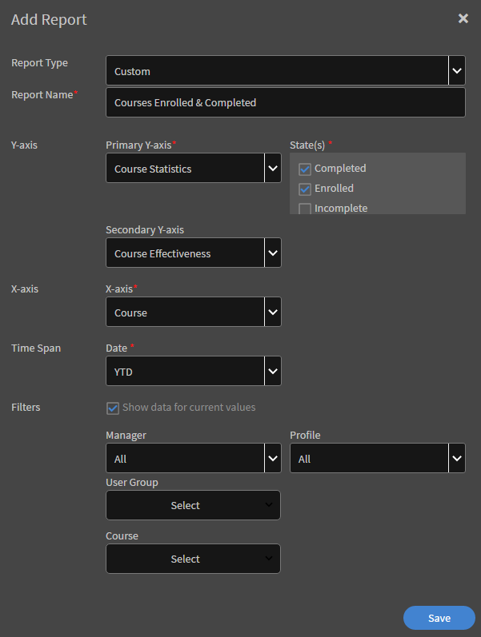

# Rapporten

Rapporten voor managers maken en beheren.

Met Adobe Learning Manager kunt u verschillende rapporten maken om de activiteiten van studenten te volgen, te controleren en te beheren. Studentenactiviteiten worden automatisch bijgehouden en vastgelegd in de database. Manager- en beheerderrapporten worden gegenereerd op basis van de database.

## Overzicht {#overview}

Het genereren van rapporten is hetzelfde voor beheerder en manager. Managers kunnen rapporten bekijken die overeenkomen met hun ondergeschikten, terwijl beheerders alle rapporten voor de hele organisatie kunnen bekijken.

Rapporten worden samengevoegd in een dashboard. Een rapport moet in een dashboard bestaan. A **Standaarddashboard** bestaat standaard op de pagina Rapporten. Elk rapport dat door u is toegevoegd, gaat naar dit standaarddashboard. Als u rapporten wilt toevoegen aan afzonderlijke dashboards, gebruikt u de vervolgkeuzepijl en kiest u Rapport toevoegen. Raadpleeg de sectie Dashboards op deze pagina voor meer informatie over het maken van dashboards.

## Managerdashboards {#manager-dashboards}

Een manager kan informatie over zijn directe of indirecte team als een samenvatting bekijken.

De manager kan het rapport vervolgens filteren op bereiken als, kwartaal, deze maand, de laatste drie volledige maanden en de laatste twaalf volledige maanden.

## Leeroverzicht {#learningsummary}

*Leeroverzicht weergeven*

*Leeroverzicht filteren op datum*

## Dashboard Naleving {#compliancedashboard}

Bekijk de compliance van je team en zie welk teamlid grenst aan niet-naleving. Kies de leerobjecten en bekijk de status van elk object.

*Compatibiliteitsdashboard weergeven*

## Vaardigheidsstatus {#skillsstatus}

Zie het percentage studenten voor elke vaardigheid. Kies maximaal vijf vaardigheden waarvoor u de vaardigheden voor studenten wilt zien. De visualisatie vindt plaats in de vorm van een gestapeld staafdiagram. Wanneer u met de muis over elke balk beweegt, ziet u het einde van de status voor die vaardigheid.

*De status van vaardigheden van een student weergeven*

## Skilometerbeheer {#skilstracker}

Bekijk een projectie van het voltooien van vaardigheden in een team. Kies het voltooiingspercentage en de datum van een vaardigheid als doel.

Gebaseerd op historische gegevens, kunt u een grafische vertegenwoordiging van de projectie van de vaardigheidsvoltooiing op de geselecteerde datum zien.

*Projectie van voltooiing van vaardigheden weergeven*

## Rapporten maken {#creatingreports}

1. Klik op Rapporten in het linkerdeelvenster. De pagina Rapportoverzicht wordt weergegeven.\
   **Opmerking**
Standaard worden er ten minste drie voorbeeldrapporten weergegeven op de overzichtspagina van het rapport. U kunt deze voorbeeldrapporten alleen bekijken om een idee te krijgen hoe u ze maakt en aanpast.

1. Klik op de pagina Rapportoverzicht op Toevoegen. Het dialoogvenster Rapport maken verschijnt.
1. Klik op Opslaan om het maken van een rapport te voltooien. Hieronder ziet u een voorbeeldrapport ter referentie.

*Het dialoogvenster Rapport toevoegen*

In Rapporttype kunt u een vooraf gedefinieerde set rapporten of aangepaste rapporten kiezen. U kunt de volgende rapporten bekijken als onderdeel van een vooraf gedefinieerde set rapporten:

* Toegewezen en behaalde vaardigheden
* Ingeschreven en voltooide cursus
* Effectiviteit voor cursussen
* Ingeschreven en voltooide leerprogramma&#39;s
* Leertijd per cursus
* Bestede leertijd per kwartaal

U kunt de bovenstaande rapporttypen gebruiken om meer dan 300 soorten rapporten te genereren.

Rapportnaam Typ een titel voor uw rapport.

**Primaire Y-as** Kies de eerste/primaire criteria voor uw rapport in de vervolgkeuzelijst. Voor sommige geselecteerde criteria kunt u een of meer statussen kiezen in de vervolgkeuzelijst Statussen ernaast. Voor het primaire criterium voor inschrijvingsstatistieken voor een cursus kunnen de statussen Voltooid, Niet voltooid, Ingeschreven, enzovoort. De gegevens van het primaire bereik worden weergegeven in de vorm van staafgrafieken in het rapport.

**Secundaire Y-as** Kies de criteria/het bereik van de secundaire Y-as voor uw rapport in de vervolgkeuzelijst. Kies bijvoorbeeld in de inschrijvingsoptie voor leerprogramma&#39;s een of meer statussen in de vervolgkeuzelijst Statussen ernaast. De gegevens van het secundaire bereik worden weergegeven in de vorm van lijngrafieken.

**x-as** Kies in de vervolgkeuzelijst de toepasselijke criteria voor de x-as voor uw rapport. Als u de x-as als datum hebt gekozen, kunt u uw x-ascriterium op dag, maand, kwartaal en jaar groeperen.

**Datum** Kies de gewenste optie in de vervolgkeuzelijst. Opties: laatste maand, kwartaal, jaar, kwartaal tot heden (laatste 90 dagen), jaar tot heden (laatste 365 dagen) en datumbereik. Als u een datumbereik kiest, voert u Van en Tot datum als volgt in:

**Van** Kies de startdatum vanaf wanneer u het rapport wilt bekijken.

**Aan** Kies de einddatum voor uw rapport.

## Filters {#filters}

Filters verschijnen in het dialoogvenster Rapport toevoegen onderaan op basis van de rapporttypen die u hebt gekozen. Hieronder worden enkele prominente filters genoemd.

**Manager** U kunt een van de managers kiezen op basis van hiërarchie. Voor sommige managers kunnen er ondergeschikte managers en meerdere werknemers zijn die aan elke ondergeschikte manager rapporteren.

**Profiel** Kies de benoeming van uw werknemer. Het zou helpen om rapporten van werknemers te bekijken die op hun profiel/benoeming worden gebaseerd. Bijvoorbeeld computerwetenschapper, ingenieur, enzovoort.

**Gebruikersgroep** Kies de gebruikersgroep waarop u de rapporten wilt filteren. Leermanager haalt de gebruikersgroepen die voor uw account zijn gedefinieerd op uit de functie Gebruikers.

**Cursus** U kunt uw rapport op elke cursus filteren door deze in de vervolgkeuzelijst te kiezen.

*Grafiek van ingeschreven en voltooide cursussen weergeven*

>[!NOTE]
>
>Boven de legenda voor de grafiek kunt u een zoomvak weergeven. U kunt de cursor eroverheen verplaatsen, erop klikken en de dwarsbalk slepen over het gedeelte van het zoomvak waarop u wilt inzoomen.

U kunt de waarden van de secundaire y-as weergeven in de vorm van een lijn langs de grafiekbalken. In het bovenstaande voorbeeld ziet u bijvoorbeeld de waarden voor Effectiviteit in een grijze lijn over de grafiek.

## Gebruikersgroeprapporten {#user-group-reporting}

Volg hoe gebruikersgroepen zoals afdelingen, externe partners en rollen presteren in vergelijking met andere gebruikersgroepen of ten opzichte van andere leerdoelen.

### Gebruikersgroepen {#usergroups}

Als u rapporten wilt genereren op basis van gebruikersgroepen, kiest u **Gebruikersgroep** op de X-as uit de lijst met opties in de vervolgkeuzelijst, zoals weergegeven in de onderstaande schermafbeelding.

*Gebruikersgroeprapporten genereren*

Nog een **Selecteren** verschijnt naast de X-as met een lijst van beschikbare gebruikersgroepen voor uw account. In deze vervolgkeuzelijst kunt u een of meer gebruikersgroepen selecteren.

Als u meerdere gebruikersgroepen hebt geselecteerd en dit rapport opslaat en genereert, wordt het rapport gegenereerd met alle gebruikersgroepen in een staafgrafiek naast elkaar op de x-as.

Met dit gebruikersgroeprapport kunt u de prestaties van de ene afdeling/divisie/rol vergelijken met die van de andere om hun leerprestaties te evalueren.

### Aangepaste gebruikersgroepen/gebruikerskenmerken {#customusergroupsuserattributes}

U kunt ook aangepaste gebruikersgroepen maken met de functie Gebruikers/gebruikersgroepen toevoegen in Leerbeheer. Nadat u de gebruikersgroepen hebt gemaakt, kunt u rapporten genereren voor die aangepaste gebruikersgroepen met behulp van een lijst met kenmerken zoals locatie, vertakking, enzovoort.

Kies in de X-as de optie Gebruikerskenmerk en selecteer het kenmerk **selecteren** naast de afbeelding. Als u op basis van deze kenmerken een aangepast gebruikersgroeprapport wilt maken, moet u ook de juiste gebruikersgroep in het filter kiezen.

Managers kunnen alleen voor hun eigen teamleden als studenten gebruikersgroeprapporten maken.

## Typen rapporten {#typesofreports}

* Statistieken voor cursus-levering voor studenten
* Rapport over effectiviteit van cursussen
* Rapport op basis van vaardigheden van student
* Inschrijvingsstatistieken van leerprogramma&#39;s voor studenten
* Leertijd besteed door studenten
* Voltooiing certificering

## Mijn rapporten {#myreports}

Een dashboard is een verzameling rapporten. Rapporten kunnen naar keuze worden gegroepeerd in een dashboard.

**Voorbeeldrapporten**

Klik op dit tabblad om enkele indicatieve rapporten weer te geven die zijn gebaseerd op voorbeeldgegevenspunten. Verken deze rapporten om een idee te krijgen van verschillende soorten rapporten met uitgebreide functies die u kunt genereren met behulp van uw accountgegevens.

**Mijn rapporten**

Klik op dit boardtabblad om alle boards te bekijken die u hebt gemaakt. In de vervolgkeuzelijst Tekengebied kunt u het standaardboard of een door u gemaakt dashboard selecteren.

**Dashboard toevoegen**

1. Klik op Dashboard toevoegen aan de rechterkant van de pagina om uw eigen boards te maken.

   

   *Uw eigen board maken*

1. Geef de naam en beschrijving van het dashboard op en klik op **[!UICONTROL Opslaan]**.

U kunt het recent gemaakte board bekijken in de lijst Mijn dashboards.

Klik op de vervolgkeuzelijst rechtsboven in het boardvenster en klik op Rapport toevoegen om rapporten aan uw board toe te voegen. Het rapport dat u op deze manier maakt, wordt aan uw dashboard gekoppeld.

>[!NOTE]
>
>De rapporten die u maakt door op Toevoegen rechtsboven op de pagina Rapporten te klikken, worden aan uw standaarddashboard toegevoegd.

**Gedeelde rapporten**

Gedeelde rapporten zijn een verzameling rapporten die met u zijn gedeeld door andere gebruikers binnen uw organisatie. Als u over de machtigingen beschikt, kunt u de gedeelde rapporten downloaden of dupliceren. Neem contact op met de beheerder van uw organisatie om toegangsrechten tot de gedeelde rapporten te downloaden/dupliceren.

**Geabonneerde rapporten**

U kunt zich abonneren op uw favoriete rapporten door hier uw e-mail-ID op te geven. Uw geabonneerde rapporten worden per e-mail naar u verzonden.

Klik op de knop **Bewerken** in de rechterhoek van uw rapportnaam uit de lijst met rapporten om uw abonnement op elk gewenst moment te wijzigen.

## Rapporten weergeven {#viewingreports}

Op de pagina Rapportoverzicht kunt u alle rapporten bekijken. U kunt elk rapport minimaliseren door op het minteken (-) rechtsboven in elk rapport te klikken. Klik op het +-pictogram om uw rapport opnieuw weer te geven.

**Snelle weergave met verschillende datums**

De datumwaarden die u gebruikt om het rapport te bekijken, zijn tijdelijk. Deze weergave van het rapport wordt niet gedownload wanneer u de downloadoptie kiest. Dit is slechts een tijdelijke weergave.

U kunt het datumbereik/de waarde voor elk rapport en elke weergave snel voor een andere datum wijzigen zonder het rapport te wijzigen en op te slaan. Klik op het bewerkingspictogram (zoals weergegeven met een pijl in de onderstaande afbeelding) naast het datumbereik, zoals QTD, laatste jaar enzovoort. Kies de nieuwe waarde in de vervolgkeuzelijst en klik op het vinkje om de wijziging te bevestigen. U kunt de wijziging annuleren door op het X-teken te klikken.

**Snelle weergave met verschillende managers**

Als er meerdere managers aan u rapporteren, kunt u de rapporten snel voor elke manager bekijken. Kies de naam van de manager in de vervolgkeuzelijst om een uniek rapport voor elke manager weer te geven.
**Bewerken/Verplaatsen naar board/Kopie maken/Verwijderen/Formaat van rapporten wijzigen** Klik op de vervolgkeuzepijl in de rechterbovenhoek van elk rapport om vervolgkeuzemogelijkheden weer te geven zoals Bewerken/Verplaatsen naar dashboard/Kopie maken/Verwijderen/Formaat wijzigen.

<!---->

**Bewerken** Klik op Herstellen als u tijdens het wijzigen van gegevens wilt teruggaan naar de beginwaarden. Klik op Opslaan na het wijzigen van de waarden.

**Verplaatsen naar dashboard** U kunt het huidige rapport verplaatsen naar een ander dashboard, dat uit de lijst met dashboards wordt gekozen.

**Een kopie maken** U kunt het rapport naar hetzelfde of een ander dashboard kopiëren. Dit wordt gekozen in de lijst met dashboards.

**Verwijderen** Klik op Verwijderen om het rapport te verwijderen. Er verschijnt een waarschuwings-/bevestigingsbericht voordat u het rapport kunt verwijderen.

**Formaat wijzigen** U kunt de grootte van uw rapporten wijzigen in 1×1(medium) en 2×2(groot).

## E-mailabonnementen {#emailsubscriptions}

U kunt uw favoriete rapporten per e-mail ontvangen door u hierop te abonneren.

Klik op E-mailabonnement naast de knop Toevoegen rechtsboven op de pagina Rapporten. De abonnementspagina voor rapporten wordt weergegeven.

Typ de rapportnaam in het veld Rapporten om de rapportnaam in de vervolgkeuzelijst te selecteren. Kies de frequentie van de e-mail zoals dagelijks, wekelijks, maandelijks volgens uw keuze, voeg het onderwerp van de e-mail toe en klik op Toevoegen om u te abonneren.

Klik op Bewerken om het abonnement te wijzigen. Klik op Verwijderen om het abonnement te verwijderen.
