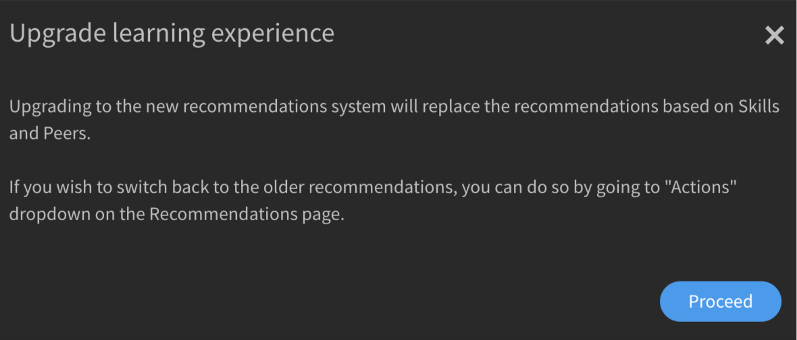
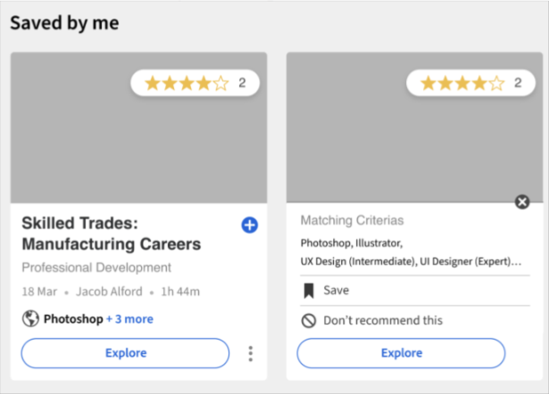

# Recommendations in Adobe Learning Manager

Adobe Learning Manager heeft een nieuw en vernieuwd aanbevelingssysteem voor cursussen geïntroduceerd. Deze aanbevelingsfunctie gebruikt AI-algoritmen en gebruikersinteresses zoals Producten, Rollen en Niveaus om gepersonaliseerde contentaanbevelingen te bieden.

Met het nieuwe aanbevelensysteem kunt u aangepaste parameters maken die studenten kunnen selecteren om gepersonaliseerde aanbevelingen te ontvangen. Deze aanbevelingen worden weergegeven als cursussen, leerpaden en certificeringen aan studenten in hun startpagina.

Om aan de slag te gaan met deze functie, moet u de functie inschakelen in de Admin-app.

## De aanbevelingen inschakelen en configureren

1. De cursus en gebruikersgegevens uploaden (optioneel).
1. Breng de wijzigingen live.
1. Nadat u de aanbevelingen hebt ingeschakeld en geconfigureerd, uploadt u de gegevens naar de Adobe Learning Manager voor aanbevelingen om te beginnen met werken. Deze gegevens bestaan uit:

   * Cursusgegevens
   * Gebruikersgegevens (optioneel)

## Algoritme voor cursusrangschikking

De kern van de aanbevelingsengine wordt bepaald door de nieuwe **[!UICONTROL Algoritme voor cursusvolgorde]**. Het algoritme gebruikt 50 miljoen datapunten en vijf jaar geaggregeerde leergegevens voor miljoenen gebruikers om cursussen te rangschikken op basis van hun kans op inschrijving. Deze rangschikking zorgt ervoor dat de meeste inschrijfbare cursussen vóór de studenten worden weergegeven.

## Belangrijkste voorwaarden

De nieuwe AI-gebaseerde aanbevelingsengine van Learning Manager biedt leerleiders een configureerbaar op parameters gebaseerd aanbevelingssysteem voor het maken van een gepersonaliseerde ervaring voor studenten.

De parameters zijn: **Producten/onderwerpen**, **Rollen**, en **Niveaus**. Bovendien kunnen de namen van deze parameters worden aangepast aan uw behoeften. &#39;producten&#39; kunnen dus &#39;onderwerpen&#39; worden of &#39;rollen&#39; kunnen &#39;regio&#39; worden.

## Het aanbevelingssysteem instellen

De nieuwe aanbevelingsengine van Adobe Learning Manager vereenvoudigt de beheerworkflow voor het instellen van gepersonaliseerde aanbevelingen, omdat gegevens over producten en rollen die aan een klant/partner zijn gekoppeld doorgaans beschikbaar zijn voor beheerders (bijvoorbeeld van aankooprecords).

Bij het instellen van de nieuwe aanbevelingsengine zijn voornamelijk drie workflows betrokken:

* Beheerder
* Auteur
* Student

Beheerders configureren de parameterwaarden Producten, Rollen en Niveaus van het account. Zo kan een aanbieder van IT-oplossingen met banken als hun primaire klantenbasis de &quot;Product&quot;-parameter zo configureren dat waarden als Payment Gateway, Secure Cloud Storage, Fraud Detection System, Trading Platform enz. en de &quot;Role&quot;-parameter waarden als Integration Specialist, Network Administrator, Risk Analyst, Compliance Officer, enz. hebben

Beheerders krijgen een begeleide workflow in Leerbeheer om de aanbevelingsengine optimaal in te stellen en de engine aan te passen op basis van het gebruiksscenario van het account. Bovendien krijgen beheerders ook de mogelijkheid om PRL-aanbevelingen in te stellen via een eenmalige CSV-upload.

1. Selecteren **[!UICONTROL Recommendations]** in de Admin-app.

   

   *Selecteer de Recommendations-optie*

1. Klikken **[!UICONTROL Upgrade]**.

   

   *Selecteer de optie Upgrade*

1. Klikken **[!UICONTROL Doorgaan]** de aanpassing aan het nieuwe aanbevelingssysteem.

   
   *Selecteer de knop Doorgaan*

1. Maak de aanbevelingsparameters voor Producten en Rollen.

   
   *Parameters voor aanbeveling maken*

1. Klikken **[!UICONTROL Meer waarden toevoegen]**.
1. Voeg de producten toe. Typ de naam van een product en druk op Enter.

   U moet ten minste twee producten toevoegen om aan de slag te gaan.

   
   *Producten toevoegen*

1. Voeg de rollen toe. Typ de namen van de rollen en druk op Enter.

   
   *Rollen toevoegen*

1. Klikken **[!UICONTROL Doorgaan]**.

   De producten en de rollen zijn nu opgenomen in de lijst met parameters.

   
   *Lijst van producten en rollen*

## Gegevensvoorbereiding

De aanbevelingen werken alleen correct als de interessedata, Product, Roles en Levels zijn geüpload.

**Gegevensopties uploaden**

De functie Aanbevelingen kan worden geconfigureerd. In plaats van producten/rollen/niveaus kunt u dus onderwerpen/rollen/niveau gebruiken of een van deze opties kiezen: alleen product/onderwerpen, alleen rollen, alleen product/onderwerpen en rollen, alleen rollen/niveaus of alleen producten-niveaus.

Wijzig de gegevensbladen op basis van de door u gekozen aanbevelingsconfiguratie.

In de volgende sectie wordt de meest uitgebreide optie uitgelegd voor het gebruik van producten, rollen en niveaus.

De beheerder moet gebruikersgegevens in een vooraf bepaalde indeling uploaden. De geüploade gegevens worden vervolgens in het aanbevelingsalgoritme ingevoerd, zodat een student aanbevelingen voor de juiste cursussen ontvangt op basis van zijn rollen en niveaus.

**Vereisten**

Als u de gegevens voor de aanbevelingen wilt uploaden, vult u de Producten, Rollen en Niveaus in de CSV&#39;s Gebruiker en AanbevelingLO.

Als onderdeel van de datavoorbereiding bieden we twee CSV-sjablonen:

**RecUser.csv**

* Gebruikers-id
* Producten
* Rollen
* Niveaus (Beginner, Tussenpersoon of Geavanceerd)

Hieronder ziet u een voorbeeld van records in de CSV:

| Gebruikers-id | Producten | Rollen | Niveaus |
|--- |--- |--- |--- |
| 123 | Data Science | Analyst | Analyst: Intermediate |
| 456 | Aerospace Engg | Technicus | Technicus: geavanceerd |

**RecLO.csv**

* Training
* Type training
* Naam van training
* Producten
* Rollen
* Niveaus
* Labels
* Vaardigheden

Hieronder ziet u een voorbeeld van records in de CSV:

| Training-id | Type training | Naam van training | Producten | Rollen | Niveaus | Labels | Vaardigheden |
|---|---|---|---|---|---|---|---|
| 111 | CURSUS | Python 101 | Data Science | Analyst | Analyst: Intermediate | data | Algemeen |
| 222 | CURSUS | Julia 101 | Data Science | Analyst | Analyst: Geavanceerd | data | Algemeen |

Vul deze CSV&#39;s in en neem contact op met uw Customer Success-team om de indelingen te downloaden en deze CSV&#39;s te uploaden.

## Maak de aanbevelingen live

Klik op Ga live nadat beide CSV&#39;s zijn geüpload. Zo wordt het nieuwe aanbevelingssysteem zichtbaar voor de studenten.

*Maak de aanbevelingen live*

Het aanbevelingssysteem is nu beschikbaar voor uw studenten.

## Een parameter bewerken

1. Selecteer in de lijst met parameters het pictogram met de drie puntjes en selecteer **[!UICONTROL Parameternaam bewerken]**.

   

1. Wijzig de naam van de parameter en klik **[!UICONTROL Opslaan]**.

   
   *De parameter bewerken*

## Een parameter verwijderen

1. Selecteer in de lijst met parameters het pictogram met de drie puntjes en selecteer **[!UICONTROL Parameter verwijderen]**.

*De parameter verwijderen*

## Pagina Cursusinstellingen

Op de instellingenpagina van een cursus wordt de aanbeveling voor Producten en rollen weergegeven. Studenten wordt aanbevolen deze cursus te volgen als zij belangstelling voor deze producten en rollen hebben getoond.

*Pagina Cursusinstellingen*

## Studentenweergave

Als een student zich aanmeldt bij het leerplatform voor een account met PRL-gebaseerde aanbevelingen, stelt een begeleide workflow de student op basis van zijn/haar product-, rol- en niveauvoorkeuren aanbevelingen op. Hiermee maakt u het studentprofiel voor de te analyseren aanbevelingsengine.

Studenten op accounts die zijn overgeschakeld op het nieuwe aanbevelingssysteem kunnen de aanbevolen cursussen en training bekijken.

De studenten kunnen het volgende zien:

* Producten, rollen - Niveaus: Studenten worden gevraagd eerst Producten, Rollen en vervolgens Niveaus te selecteren voor elk van de geselecteerde rollen
* Product - Niveaus: Studenten worden gevraagd eerst Producten te selecteren en vervolgens Niveaus voor elk van de geselecteerde producten
* Rollen - Niveaus: studenten worden gevraagd eerst Rollen en vervolgens Niveaus te kiezen voor elke geselecteerde rol.
* Producten en rollen: studenten worden gevraagd eerst Producten te kiezen en vervolgens Rollen.
* Producten: studenten worden gevraagd alleen producten te selecteren.
* Rollen: studenten worden gevraagd alleen Rollen te kiezen.

Na het selecteren van Recommendations in het linkerdeelvenster ziet de student een pop-up om de aanbevelingen in te stellen.

*Student stelt de aanbeveling in*

Klik op Setup Recommendations om de student naar het pop-upvenster met productselectie te leiden.

*Producten selecteren*

In het volgende pop-upvenster kan de student de rol selecteren.

*Rollen selecteren*

De student kan vervolgens de niveaus toevoegen.

*Niveaus selecteren*

## Leerstreepjes op de Learner-app

Een student kan de volgende stappen in de app zien:

* Mijn leerstrook
* Strip met agenda-, sociale en gamificationwidget
* Opgeslagen door mij strip
* Super relevante strip
* Productstrook - 1
* Productstrook - 2
* Verkenningsstrook
* Door beheerder aanbevolen strip
* Bladeren op catalogusstrook

### Kaarten op mijn leerstrook

*Kaarten op de leerstrook*

Elke kaart heeft Classificatie, Kaartafbeelding, Titel, Vaardigheid, gepubliceerde datum, Auteur, Duur, voortgangsbalk en de knop Doorgaan of Verkennen.

### Kaarten opgeslagen door mij strip

*Opgeslagen kaarten*

Elke kaart heeft Classificatie, Kaartafbeelding, Titel, Vaardigheid, gepubliceerde datum, Auteur, Duur, voortgangsbalk en de knop Start, Verkennen, Doorgaan of Reviseren.

Er is geen voortgangsbalk op de kaart nadat een student de cursus heeft gestart. Een student kan de cursus ook verwijderen.

### Kaarten op superrelevante strip

*Relevante kaarten*

Elke kaart heeft Classificatie, Kaartafbeelding, Titel, Vaardigheid, gepubliceerde datum, Auteur, Duur, voortgangsbalk en de knop Start, Verkennen, Doorgaan of Reviseren.

Er is geen voortgangsbalk op de kaart nadat een student de cursus heeft gestart.

Er zijn twee opties in het menu: **[!UICONTROL Opslaan]** en **[!UICONTROL Dit niet aanraden]**. Als de student klikt **[!UICONTROL Opslaan]**, wordt de cursus opgeslagen op de strook &#39;Opgeslagen door mij&#39;. Als de student klikt **[!UICONTROL Dit niet aanraden]**, wordt de aanbevolen training uit de lijst verwijderd.
