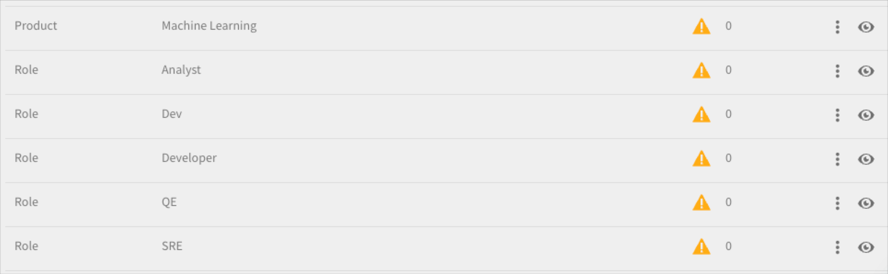
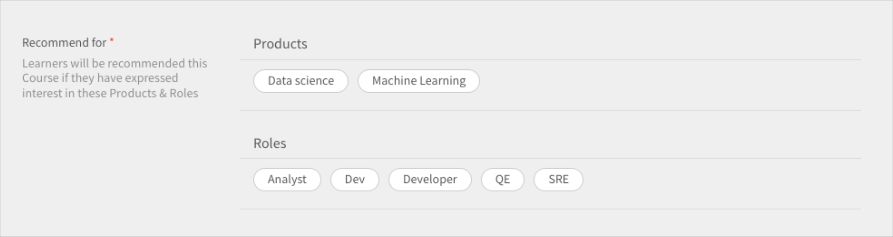

# Aanbevelingen in Adobe Learning Manager

Adobe Learning Manager heeft een nieuw en verbeterd aanbevelingssysteem voor cursussen geïntroduceerd. Deze aanbevelingsfunctie gebruikt AI-algoritmen en gebruikersinteresses zoals Producten, Rollen en Niveaus om gepersonaliseerde contentaanbevelingen te bieden.

Met het nieuwe aanbevelingssysteem kunt u aangepaste parameters maken die studenten kunnen selecteren om gepersonaliseerde aanbevelingen te ontvangen. Deze aanbevelingen worden voor deelnemers op hun startpagina als cursussen, leerpaden en certificaten weergegeven.

Om aan de slag te gaan met deze functie, moet u de functie inschakelen in de beheerdersapp.

## De aanbevelingen inschakelen en configureren

1. Upload de cursus- en gebruikersgegevens (optioneel).
1. Voer de wijzigingen live door.
1. Nadat u de aanbevelingen hebt ingeschakeld en geconfigureerd, uploadt u de gegevens naar de Adobe Learning Manager voor aanbevelingen om te beginnen met werken. Deze gegevens bestaan uit:

   * Cursusgegevens
   * Gebruikersgegevens (optioneel)

## Algoritme voor cursusrangschikking

De kern van de aanbevelingsengine wordt bepaald door de nieuwe **[!UICONTROL Algoritme voor cursusvolgorde]**. Het algoritme gebruikt 50 miljoen datapunten en vijf jaar geaggregeerde leergegevens voor miljoenen gebruikers om cursussen te rangschikken op basis van hun kans op inschrijving. Deze rangschikking zorgt ervoor dat de cursussen met de meeste kans op inschrijving als eerste aan studenten worden weergegeven.

## Belangrijkste voorwaarden

De nieuwe AI-gebaseerde aanbevelingsengine van Learning Manager biedt leerleiders een configureerbaar op parameters gebaseerd aanbevelingssysteem voor het maken van een gepersonaliseerde ervaring voor studenten.

De parameters zijn: **Producten/onderwerpen**, **Rollen**, en **Niveaus**. Bovendien kunnen de namen van deze parameters worden afgestemd op uw behoeften. &#39;producten&#39; kunnen dus &#39;onderwerpen&#39; worden of &#39;rollen&#39; kunnen &#39;regio&#39; worden.

## Het aanbevelingssysteem instellen

De nieuwe aanbevelingsengine van Adobe Learning Manager vereenvoudigt de beheerworkflow voor het instellen van gepersonaliseerde aanbevelingen, omdat gegevens over producten en rollen die aan een klant/partner zijn gekoppeld doorgaans beschikbaar zijn voor beheerders (bijvoorbeeld van aankooprecords).

Bij het instellen van de nieuwe aanbevelingsengine zijn met name drie workflows betrokken:

* Beheer
* Auteur
* Student

Beheerders configureren de parameterwaarden Producten, Rollen en Niveaus van het account. Zo kan een aanbieder van IT-oplossingen met banken als hun primaire klantenbasis de &quot;Product&quot;-parameter zo configureren dat waarden als Payment Gateway, Secure Cloud Storage, Fraud Detection System, Trading Platform enz. en de &quot;Role&quot;-parameter waarden als Integration Specialist, Network Administrator, Risk Analyst, Compliance Officer, enz. hebben

Beheerders krijgen een begeleide workflow in Leerbeheer om de aanbevelingsengine optimaal in te stellen en de engine aan te passen op basis van het gebruiksscenario van het account. Bovendien krijgen beheerders de mogelijkheid om PRL-aanbevelingen in te stellen via een eenmalige CSV-upload.

1. Selecteren **[!UICONTROL Recommendations]** in de Admin-app.

   

   *Selecteer de Recommendations-optie*

1. Klik op **[!UICONTROL Upgraden]**.

   

   *Selecteer de optie Upgrade*

1. Klik op **[!UICONTROL Doorgaan]** om te upgraden naar het nieuwe aanbevelingssysteem.

   
   *Selecteer de knop Doorgaan*

1. Maak de aanbevelingsparameters voor Producten en Rollen.

   
   *Parameters voor aanbeveling maken*

1. Klik op **[!UICONTROL Meer waarden toevoegen]**.
1. Voeg de producten toe. Typ de naam van een product en druk op Enter.

   U moet ten minste twee producten toevoegen om aan de slag te gaan.

   
   *Producten toevoegen*

1. Voeg de rollen toe. Typ de namen van de rollen en druk op Enter.

   
   *Rollen toevoegen*

1. Klik op **[!UICONTROL Doorgaan]**.

   De Producten en Rollen staan nu in de lijst met parameters.

   
   *Lijst van producten en rollen*

## Gegevensvoorbereiding

De aanbevelingen werken alleen correct als de interessedata, Product, Roles en Levels zijn geüpload.

**Gegevensopties uploaden**

De functie Aanbevelingen kan worden geconfigureerd. In plaats van producten/rollen/niveaus kunt u dus onderwerpen/rollen/niveau gebruiken of een van deze opties kiezen: alleen product/onderwerpen, alleen rollen, alleen product/onderwerpen en rollen, alleen rollen/niveaus of alleen producten-niveaus.

Wijzig de gegevensbladen op basis van de door u gekozen aanbevelingsconfiguratie.

In het volgende onderdeel wordt de meest uitgebreide optie van het gebruik van product, rollen en niveaus uitgelegd.

De beheerder moet gebruikersgegevens uploaden in een vooraf bepaald formaat. De geüploade gegevens worden vervolgens in het aanbevelingsalgoritme ingevoerd, zodat een student aanbevelingen voor de juiste cursussen ontvangt op basis van zijn rollen en niveaus.

**Vereisten**

Om de gegevens te uploaden zodat de aanbevelingen werken, vult u de producten, rollen en niveaus in de CSV&#39;s User en RecommendationLO in.

Als onderdeel van de datavoorbereiding bieden we twee CSV-sjablonen:

**RecUser.csv**

* Gebruikers-id
* Producten
* Rollen
* Niveaus (Beginner, Gemiddeld of Geavanceerd)

Hieronder ziet u een voorbeeld van records in CSV:

| Gebruikers-id | Producten | Rollen | Niveaus |
|--- |--- |--- |--- |
| 123 | Datawetenschappen | Analist | Analist: gemiddeld |
| 456 | Aerospace Engg | Technicus | Technicus: geavanceerd |

**RecLO.csv**

* Cursus/leerpad
* Type training
* Trainingsnaam
* Producten
* Rollen
* Niveaus
* Tags
* Vaardigheden

Hieronder ziet u een voorbeeld van records in CSV:

| Training-ID | Type training | Trainingsnaam | Producten | Rollen | Niveaus | Tags | Vaardigheden |
|---|---|---|---|---|---|---|---|
| 111 | CURSUS | Python 101 | Datawetenschappen | Analist | Analist: gemiddeld | gegevens | Algemeen |
| 222 | CURSUS | Julia 101 | Datawetenschappen | Analist | Analyst: Geavanceerd | gegevens | Algemeen |

Vul deze CSV&#39;s in en neem contact op met uw Customer Success-team om de indelingen te downloaden en deze CSV&#39;s te uploaden.

## Voer de aanbevelingen live door

Klik op Ga live nadat beide CSV&#39;s zijn geüpload. Zo wordt het nieuwe aanbevelingssysteem zichtbaar voor de studenten.

*Maak de aanbevelingen live*

Het aanbevelingssysteem is nu beschikbaar voor uw studenten.

## Bewerk een parameter

1. Selecteer in de lijst met parameters het pictogram met de drie puntjes en selecteer **[!UICONTROL Parameternaam bewerken]**.

   

1. Wijzig de naam van de parameter en klik op **[!UICONTROL Opslaan]**.

   
   *De parameter bewerken*

## Een parameter verwijderen

1. Selecteer in de lijst met parameters het pictogram met de drie puntjes en selecteer **[!UICONTROL Parameter verwijderen]**.

*De parameter verwijderen*

## Pagina met de cursusinstellingen

Op de instellingenpagina van een cursus worden de aanbevelingen voor Producten en Rollen weergegeven. Deze cursus wordt aanbevolen aan studenten die interesse hebben getoond in deze producten en rollen.

*Pagina Cursusinstellingen*

## Studentenweergave

Als een student zich bij het leerplatform aanmeldt voor een account met PRL-gebaseerde aanbevelingen, helpt een begeleide workflow de student om voorkeuren voor producten, rollen en niveaus in te stellen. Hiermee maakt u het studentprofiel voor de te analyseren aanbevelingsengine.

Studenten op accounts die zijn overgeschakeld op het nieuwe aanbevelingssysteem kunnen de aanbevolen cursussen en training bekijken.

De studenten kunnen het volgende zien:

* Producten, Rollen - Niveaus: Studenten worden gevraagd om eerst Producten, Rollen en vervolgens Niveaus te selecteren voor elk van de geselecteerde rollen
* Product - Niveaus: Studenten worden gevraagd om eerst producten te selecteren en vervolgens niveaus voor elk van de geselecteerde producten
* Rollen - Niveaus: studenten worden gevraagd om eerst Rollen te kiezen en dan voor elke geselecteerde rol Niveaus te kiezen.
* Producten en rollen: Studenten worden gevraagd om eerst Producten te kiezen en dan Rollen.
* Producten: Studenten worden gevraagd alleen producten te selecteren.
* Rollen: Studenten worden gevraagd alleen Rollen te kiezen.

Na het selecteren van Aanbevelingen in het linkerdeelvenster ziet de student een pop-upvenster om de aanbevelingen in te stellen.

*Student stelt de aanbeveling in*

Als u op Instelaanbevelingen klikt, gaat de student naar het pop-up voor productselectie.

*Producten selecteren*

Vervolgens kan de student in de volgende pop-up de rol selecteren.

*Rollen selecteren*

De student kan vervolgens de niveaus toevoegen.

*Niveaus selecteren*

## Leermateriaal strips op de Learner-app

Een student kan de volgende strips in de app zien:

* Mijn leermateriaal-strip
* Strip met agenda-, sociale en gamificatie-widget
* Opgeslagen door mij-strip
* Super relevant-strip
* Productstrip - 1
* Productstrip - 2
* Ontdekkingsstrip
* Door de beheerder aanbevolen-strip
* Bladeren per catalogus-strip

### Kaarten op mijn leerstrook

*Kaarten op de leerstrook*

Elke kaart heeft een waardering, kaartafbeelding, titel, vaardigheid, publicatiedatum, auteur, duur, voortgangsbalk en een knop Doorgaan of Verkennen.

### Kaarten opgeslagen door mij strip

*Opgeslagen kaarten*

Elke kaart heeft een waardering, kaartafbeelding, titel, vaardigheid, publicatiedatum, auteur, duur, voortgangsbalk en een knop Doorgaan of Verkennen.

Er is geen voortgangsbalk op de kaart nadat een student de cursus is begonnen. Een student kan de cursus ook verwijderen.

### Kaarten op superrelevante strip

*Relevante kaarten*

Elke kaart heeft een waardering, kaartafbeelding, titel, vaardigheid, publicatiedatum, auteur, duur, voortgangsbalk en een knop Doorgaan of Verkennen.

Er is geen voortgangsbalk op de kaart nadat een student de cursus is begonnen.

Er zijn twee opties in het menu: **[!UICONTROL Opslaan]** en **[!UICONTROL Dit niet aanraden]**. Als de student klikt **[!UICONTROL Opslaan]**, wordt de cursus opgeslagen op de strook &#39;Opgeslagen door mij&#39;. Als de student klikt **[!UICONTROL Dit niet aanraden]**, wordt de aanbevolen training uit de lijst verwijderd.
