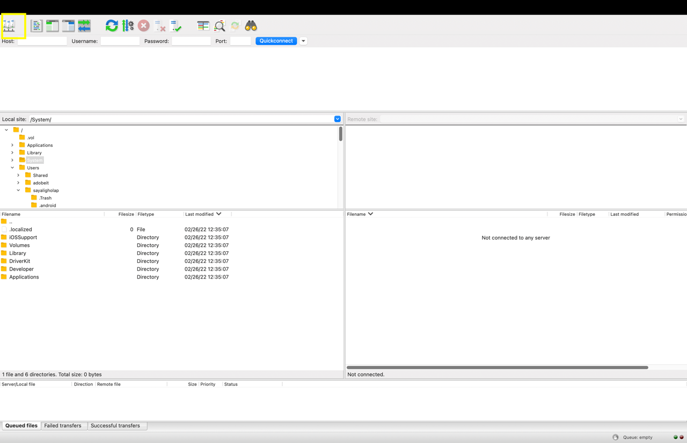

# Overgang van Adobe FTP Manager

Adobe Learning Manager ondersteunt een nieuwe connector die gebruik maakt van het SFTP-protocol van AWS Transfer Family.

U kunt elke opensource FTP-client vervangen door Adobe FTP Manager.

Sommige AWS-geadviseerde cliënten van FTP zijn [ hier vermeld ](https://docs.aws.amazon.com/transfer/latest/userguide/transfer-file.html):

* FileZilla (Windows, macOS en Linux)
* OpenSSH (macOS en Linux) - Opmerking: Deze client werkt alleen met servers die zijn ingeschakeld voor SFTP (Secure Shell (SSH) File Transfer Protocol).
* WinSCP (alleen Microsoft Windows)
* Cyberduck (Windows, macOS en Linux)

## De op AWS gebaseerde FTP-connector configureren

U moet de nieuwe op AWS gebaseerde FTP-connector configureren op de integratiebeheerder.

*selecteer de optie van FTP*

Zodra u verbinding hebt gemaakt, ziet u de pagina Verbindingsdetails.

*Bekijk de pagina van de Details van de Verbinding*

Er zijn drie verificatieopties:

### Verificatie door nieuwe SSH-sleutels te genereren

U kunt de SSH-sleutel ook in uw systeem zelf genereren. Klik op SSH-sleutel genereren.

De privésleutel wordt naar uw computer gedownload en de openbare sleutel wordt opgeslagen in onze services. Nadat u op Verbinden hebt geklikt, wordt de FTP-gebruiker gemaakt met de openbare en persoonlijke sleutels als verificatie.

U hebt een FTP-verbinding gemaakt.

### Verificatie door bestaande SSH-sleutels te gebruiken

Als u reeds een sleutel van SSH hebt, kleef de openbare sleutel op het **[!UICONTROL Openbare Sleutel van FTP]** gebied, en klik dan verbinden.

*Deeg de sleutels*

### Basisverificatie met een wachtwoord

Dit is de basisverificatiemethode. Selecteer de eerste optie, **[!UICONTROL creeer basisauthentificatie gebruikend een wachtwoord]**. Ga het wachtwoord in en klik dan **[!UICONTROL verbinden]**.

Hiermee maakt u een verbinding.

## Wat is er nieuw

### De FTP-client instellen

Stel de verbinding in op een FTP-client (aanbevolen in de sectie eerder) met de gedownloade sleutels of bestaande sleutels of wachtwoorden.

### Voorbeeldtest exporteren

* Wijzig in uw FTP-client de locatie van de ExaVault FTP in de nieuwe FTP-locatie. Het nieuwe domein is `http://almftp.adobelearningmanager.com/` .
* U moet ook een whitelist maken van de IP, `18.195.107.67` .
* Na de verificatie moet u een aantal voorbeeldbestanden uploaden van en downloaden naar de nieuwe FTP-locatie met externe FTP-clients of automatiseringsscripts.
* U moet gegevens van de oude locatie overbrengen naar de nieuwe.
* Het beleid voor gegevensbehoud voor de connector blijft hetzelfde. ExaVault ondersteunde ook een aantal beleidsregels voor gegevensbewaring naast het officiële beleid. Dergelijke beleidsregels voor gegevensbewaring zijn niet beschikbaar voor de nieuwe connector. Controleer of uw connector gegevensbewaring gebruikt buiten het officieel ondersteunde beleid.

### Wat gebeurt er met de migratieprojecten

| Status | Aanbeveling |
|---|---|
| Nieuwe migratie | U kunt geen nieuwe migraties starten vanaf de oude FTP. U moet de nieuwe FTP gebruiken voor de nieuwe migraties. Neem voor meer ondersteuning contact op met het Customer Success-team. |
| Migratie in uitvoering | Een sprint maken: U kunt de oude FTP blijven gebruiken, maar we raden u aan de nieuwe FTP te gebruiken. Neem contact op met het Customer Success-team voor elke bestaande sprint die niet kan worden verschoven. |
| Gesloten migratie | Geen actie. |

## Verbinding maken met Adobe Learning Manager via de Filezilla FTP-client

1. Maak verbinding met de nieuwe ALM FTP-connector. Klik op Verbinden.

   
   *verbind met nieuwe Schakelaar van FTP ALM*

1. Als u via standaardverificatie via een wachtwoord verbinding wilt maken, voert u de domeinnaam, de FTP-gebruikersnaam en het wachtwoord in dat overeenkomt met de wachtwoordvalidatiecriteria. Klik op Verbinden. De nieuwe FTP-verbinding wordt gemaakt en is toegankelijk via elke SFTP-client.

   
   *via basisauthentificatie via wachtwoord*

1. Installeer een SFTP-client, bijvoorbeeld File Zilla. Start File Zilla en klik op Sitebeheer openen in de linkerbovenhoek.

   
   *verbind via SFTP c-client*

1. Klik op **[!UICONTROL Nieuwe site]** om een nieuwe site te maken. Wijzig desgewenst de naam van de site.

   
   *creeer een plaats*

1. Wijs de details van de pagina Verbindingsgegevens toe.

   * Protocol selecteren als &#39;SFTP - SSH File Transfer Protocol&#39;
   * Host als FTP-domein
   * Aanmeldingstype als &#39;Vragen om wachtwoord&#39;
   * Gebruiker als FTP-gebruikersnaam

1. Klik op Verbinden.

   
   *ga geloofsbrieven* in

   >[!NOTE]
   >
   >Voer deze stap uit in de File Zilla-client.

1. Voer het wachtwoord in.

   (Optioneel) Schakel het selectievakje Wachtwoord onthouden in om het wachtwoord te onthouden.

   
   *ga wachtwoord* in

   (Facultatief) selecteer **[!UICONTROL altijd op deze gastheer]** checkbox vertrouwen om de gastheer te vertrouwen.

1. Klik op OK.

   
   *Sleutel van de Gastheer*

1. Controleer de status en voortgang van de verbinding bovenaan.

   De linkerhelft is de lokale site en de rechterhelft is de externe site.

   Bestanden verplaatsen van lokaal naar extern en andersom:

   * U kunt bestanden slepen en neerzetten.
   * Dubbelklik op het bestand.

   
   *Controle de verbindingsstatus*

U kunt het verificatietype op elk gewenst moment wijzigen en bijwerken.

Andere verificatiemethoden gebeuren via SSH-toetsen:

Plak de openbare sleutel in het tekstvak om de bestaande SSH-toetsen te gebruiken. Klik op Verbinden/Opslaan.

Om nieuwe sleutels van SSH te produceren, klik &#39;**[!UICONTROL de Sleutel van SSH]**&#39; knoop. De persoonlijke sleutel wordt gedownload. Klik op **[!UICONTROL Verbinden/opslaan]**.

*Genereer SSH Sleutel*

Wijs de details toe. Selecteer een type aanmelding als sleutelbestand. Selecteer het bestand met de persoonlijke sleutel.

Klik op **[!UICONTROL Verbinden]**.

## Wat gebeurt er nadat ExaVault is afgeschaft?

Nadat ExaVault is afgeschaft, worden alle lopende migratieprojecten overgezet naar de nieuwe FTP als bronlocatie. Vervolgens moet u de nieuwe FTP-connector configureren en het migratieproces voortzetten.

## Aanbevelingen om sprints te migreren

Bij het maken van een migratieproject raadt Adobe u aan het project aan te maken met de nieuwe AWS SFTP-connector om de sprintmigratie van Exavault naar AWS in een later stadium te voorkomen.

Als er een migratie wordt uitgevoerd, sluit u de huidige sprint die Exavault als gegevensbron gebruikt. Maak de AWS SFTP-verbinding, test de installatie en neem contact op met het Customer Success-team om over te schakelen naar de nieuwe AWS SFTP-gegevensbron. Na het overschakelen maakt u een nieuwe sprint in hetzelfde migratieproject aan. De sprintmappen worden op de nieuwe locatie gemaakt en u kunt de migratie-CSV&#39;s uploaden om de activiteit voort te zetten.

**Gevallen waarin een migratieproject niet kan worden gesloten**

* De cursus-id wordt in het huidige project toegewezen voor cursussen die van oudere externe systemen worden gemigreerd naar Adobe Learning Manager. U kunt dit alleen doen als u dezelfde cursussen in hetzelfde project wilt bijwerken. Nadat u het project hebt gesloten, kunt u de details niet meer wijzigen.
* Voor op API gebaseerde migratieprojecten, waar u geen project moet sluiten.
