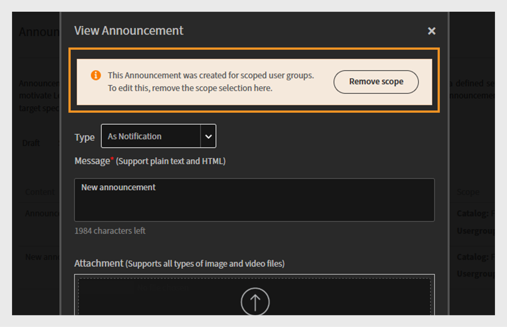
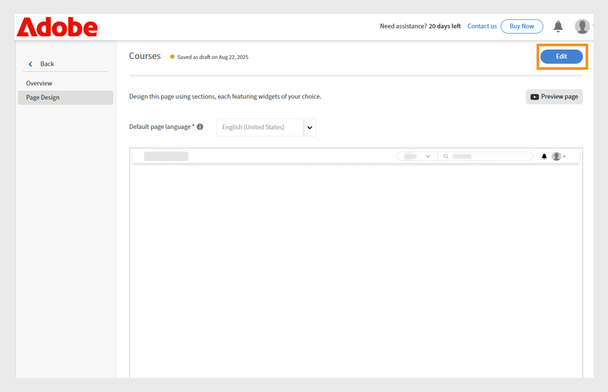
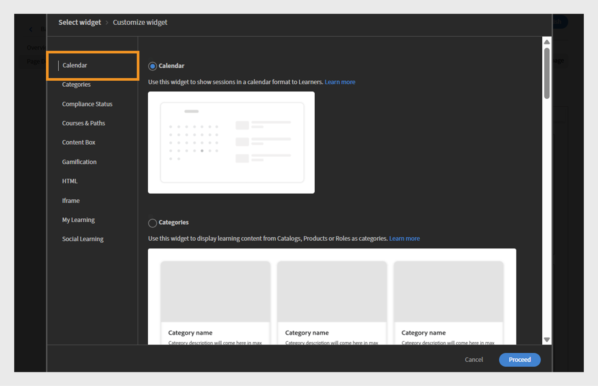
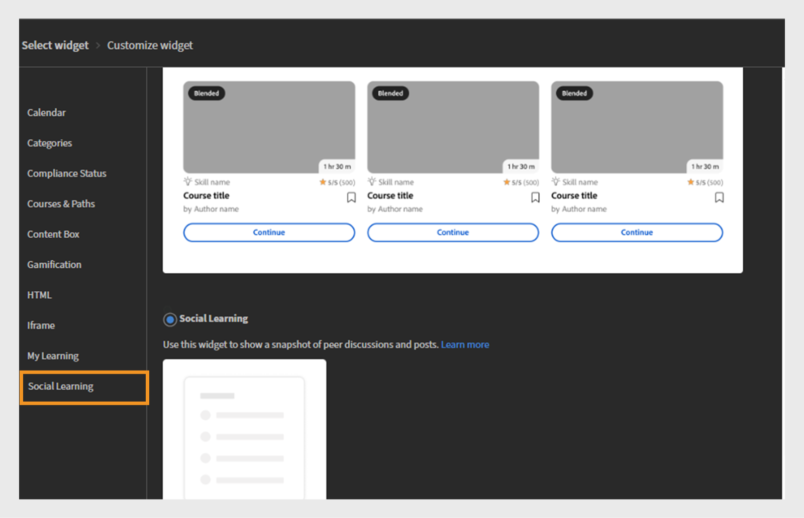

# Nieuwe functies in de Adobe Learning Manager-versie van oktober 2025

>[!IMPORTANT]
>
>Houd er rekening mee dat de geschetste functies voorlopig zijn en kunnen worden gewijzigd. Neem contact op met uw aangewezen Customer Success Manager voor meer informatie en bevestiging. Als u om het even welke kwesties ontmoet, gelieve ons team van de Steun van de Klant in [ learningmanagersupport@adobe.com ](mailto:learningmanagersupport@adobe.com) te contacteren.

## Overzicht van de release

De Adobe Learning Manager-versie van oktober 2025 introduceert aanzienlijke verbeteringen die zijn ontworpen om de rapportnauwkeurigheid te verbeteren, de integratiemogelijkheden uit te breiden en de leerervaring voor beheerders, auteurs en studenten te verbeteren. Belangrijke verbeteringen zijn verbeterde studenttranscripten waarmee voltooide, door docenten gemarkeerde voltooide taken nauwkeurig worden vastgelegd, uitgebreide gebruikersrapporten met aanvullende identificatievelden en taakhulpenrapporten met directe downloadkoppelingen.

Deze release introduceert ook uitgebreide aankondigingsmachtigingen voor aangepaste beheerders, functionaliteit voor het coderen van gebruikers op boards van Sociaal leren en op taal gebaseerde voortgangstracering waarmee de voortgang van studenten in verschillende landinstellingen behouden blijft. Tot de extra functies behoren verbeteringen voor Go1-integratie dankzij het maken van afspeellijsten met AI-assistentie, verbeterd aangepast rolbeheer met incrementele importondersteuning en verbeterde API&#39;s voor betere bewaking van quizprestaties en migratiestatus.

## Voltooiingen die zijn gemarkeerd als docent in Studenttranscripten

**Overzicht**

Incrementele studenttranscripten leggen nu door de docent gemarkeerde voltooide taken vast, zelfs als aanwezigheid na de sessiedatum wordt vastgelegd.
Deze verbetering verhelpt een kritieke leemte in incrementele studenttranscripten waarbij de door de docent gemarkeerde voltooiingen eerder werden gemist als aanwezigheid werd vastgelegd na de oorspronkelijke sessiedatum.

Incrementele studenttranscripten zijn geplande rapporten waarin alleen de wijzigingen worden vastgelegd (zoals voltooiingen of voortgangsupdates) die zich binnen een opgegeven periode voordoen, in plaats van een volledige historische datumpdump. Ze worden vaak gebruikt voor automatisering, dashboards en integraties, waardoor gebruikers recente leeractiviteiten efficiënt kunnen volgen zonder dat telkens de volledige transcripthistorie moet worden verwerkt.

**Nieuw**

* **Teken Voltooide Datum (UTC TimeZone) kolom**: Een nieuwe timestamp kolom die de nauwkeurige datum en de tijd vangt wanneer een instructeur een zitting of een module als volledig merkt.
* **Verbeterde het verbeterde eind bron volgen**: Traceert de specifieke instructeur en de module (bijvoorbeeld, &quot;Klaslokaal&quot;) waar de voltooiing werden geregistreerd.

Deze wijzigingen zorgen ervoor dat voltooide bewerkingen die zijn gemarkeerd na de sessiedatum, correct worden weergegeven in incrementele studenttranscripten.

**Zeer belangrijke voordelen**

* Hiermee legt u alle voltooide bewerkingen vast in incrementele rapporten, ongeacht wanneer aanwezigheid is gemarkeerd.
* Biedt een duidelijk controlespoor voor compliance en rapportage.
* Ondersteunt automatisering en dashboards voor regelgevingsvereisten.

**gevallen van het Gebruik**

* Organisaties met klassikale sessies waarbij docenten aanwezigheid dagen na de sessie kunnen markeren.
* Geautomatiseerde systemen of dashboards waarbij incrementele studenttranscripten worden gebruikt voor compliance of rapportage.

### Studenttranscript met de nieuwe kolom

Zie dit [ artikel ](/help/migrated/administrators/feature-summary/learner-transcripts.md) om te leren hoe te om het Transcript van de Student te downloaden.

Het gedownloade rapport Studenttranscript bevat de nieuwe kolom: Datum markeren voltooid (tijdzone UTC).


_het rapport van het Transcriptie van de Student toont een nieuwe kolom in geel die individuele voltooiingsdata voor elke gebruiker benadrukt_

## Verbeterd gebruikersrapport met uitgebreide gegevensvelden

**Overzicht**

Het gebruikersrapport bevat nu extra velden waarmee gebruikers beter kunnen worden gevolgd en de organisatie beter kan worden toegewezen.

**Nieuw**

* Kolom interne gebruiker-id: verschaft unieke interne id&#39;s voor een vloeiende gebruikersregistratie voor verschillende systemen en API-eindpunten.
* E-mailkolom van manager: bevat contactgegevens van directe managers voor het bijhouden van de hiërarchie van de organisatie.

**Zeer belangrijke voordelen**

* Vereenvoudigde gebruikersidentificatie en elimineert problemen bij het in kaart brengen van gebruikers in meerdere systemen.
* Ondersteunt workflows voor downstream-gebruikersbeheer via integratiemogelijkheden.
* Verbeterde organisatorische toewijzing en beter inzicht in rapportagerelaties.
* Behoudt organisatorische grenzen en voorkomt toevallige kruiscommunicatie.

**Belangrijke overwegingen**

* Als het werkingsgebied van een douanebeheerder verandert, tonen de beïnvloede aankondigingen een waarschuwingspictogram en vereisen individuele werkingsgebied terugstelt.
* Elke aankondiging moet afzonderlijk worden bijgewerkt wanneer het bereik wordt gewijzigd.
* Het meldingsrapport toont alleen studenten binnen het toegewezen bereik van de aangepaste beheerder.

### Gebruikersrapport met de nieuwe kolom

Zie dit [ artikel ](/help/migrated/administrators/feature-summary/reports.md#user-activity-dashboards) leren hoe te om het Rapport van de Gebruiker te downloaden.

Het gedownloade gebruikersrapportbestand bevat de nieuwe kolommen: Interne gebruikers-id en E-mail manager.


_Rapporten die van de Gebruiker interne gebruiker IDs en manager e-mailadressen benadrukken om gebruikersbeheer te stroomlijnen_

## FTP-gebruikersrapport met ondersteuning voor interne gebruikers-id

**Overzicht**

Het op FTP gebaseerde gebruikersrapport bevat nu ondersteuning voor interne gebruikers-id&#39;s, die een uniforme benadering biedt voor het exporteren en integreren van gegevens voor headless implementaties.

**Nieuw**

* De Rapporten van de gebruiker zijn nu beschikbaar door [ Douane FTP ](/help/migrated/integration-admin/feature-summary/connectors.md#custom-ftp) naast bestaande rapporten (de Transcripten van de Schittering, de Transcripten van de Student, het Rapport van de Opleidingen).
* De kolom Interne gebruikers-id is nu consistent in alle exportmethoden (FTP, Jobs API en UI).

**Zeer belangrijke voordelen**

* Vereenvoudigd databeheer met één bron voor alle benodigde rapporten.
* Betere gegevensconsistentie door uniforme gebruikersidentificatie in alle rapportageperioden te waarborgen.
* Geautomatiseerde workflowondersteuning door bulkbewerkingen en analytics-workflows met consistente id’s mogelijk te maken.
Het gebruikersrapport dat is gedownload uit de FTP-map bevat de nieuwe kolom Interne gebruikers-id.

## Opgeschorte gebruikers opnemen in Studenttranscripten

**Overzicht**

Organisaties kunnen nu geschorste gebruikers (gebruikers met uitgeschakelde externe profielen) opnemen in Studenttranscripten, zodat u beschikt over uitgebreide bewaarinstellingen voor historische leergegevens.

**Nieuw**

* Configureerbaar geschorste zichtbaarheid voor gebruikers met een vlag op accountniveau om geschorste gebruikers op te nemen in de Studenttranscripten.
* Historische databehoud zelfs na deactivering van geschorste externe profielen.

**de vereisten van de Implementatie**

* Neem contact op met uw Customer Success Manager (CSM) om de markering op accountniveau in te schakelen.

>[!NOTE]
>
>Deze markering is standaard uitgeschakeld voor bestaande accounts en moet expliciet worden aangevraagd voor nieuwe accounts.

## Scoped-aankondigingsmachtigingen voor aangepaste beheerders

**Overzicht**

Aangepaste beheerders kunnen nu aankondigingen maken, maar alleen voor hun toegewezen gebruikersgroepen of catalogi. Dit voorkomt ongewenste communicatie over organisatorische grenzen heen.

**Nieuw**

* Aangepaste beheerders kunnen alleen aankondigingen maken voor gebruikers binnen het toegewezen bereik.
* Aankondigingen kunnen betrekking hebben op specifieke gebruikersgroepen of catalogi.
* Volledige beheerders houden zicht op en controle over alle aankondigingen, inclusief de aankondigingen die door bereikbare aangepaste beheerders zijn gemaakt.

**Zeer belangrijke voordelen**

* Gerichte communicatie om ervoor te zorgen dat aankondigingen alleen relevante doelgroepen bereiken.
* Minder informatieoverbelasting doordat niet-relevante meldingen niet bij onbedoelde gebruikers terechtkomen.
* Behoudt organisatorische grenzen en voorkomt toevallige kruiscommunicatie.

**Belangrijke overwegingen**

* Als het werkingsgebied van een douanebeheerder verandert, tonen de beïnvloede aankondigingen een waarschuwingspictogram en vereisen individuele werkingsgebied terugstelt.
* Elke aankondiging moet afzonderlijk worden bijgewerkt wanneer het bereik wordt gewijzigd.
* Het meldingsrapport toont alleen studenten binnen het toegewezen bereik van de aangepaste beheerder.

**gevallen van het Gebruik**

* Franchise-organisaties waar regionale managers alleen met hun franchisehouders moeten communiceren.
* Grote organisaties met regionale of afdelingsbeheerders die aankondigingen richten aan hun teams.

### Aankondiging maken voor het toegewezen bereik

Een aangepaste beheerder kan aankondigingen maken die beperkt zijn tot de toegewezen gebruikersgroepen en catalogi, zodat berichten de juiste doelgroep bereiken en onnodige meldingen worden voorkomen.

Een aankondiging maken voor het toegewezen bereik:

1. Meld u als beheerder aan bij Adobe Learning Manager.
2. Selecteer **[!UICONTROL Aankondiging]** in de linkernavigatieruit.
3. Selecteer **[!UICONTROL toevoegen]**.

   
   _pagina van aankondigingen in Adobe Learning Manager, waar de beheerders aankondigingen voor gerichte gebruikersgroepen tot stand kunnen brengen en leiden_

4. Selecteer het **[!UICONTROL Type van Aankondiging]** van het dropdown menu.
a. **[!UICONTROL als Bericht]**
b. **[!UICONTROL als Masthead]**
c. **[!UICONTROL als Aanbeveling]**
d. **[!UICONTROL als e-mail]**
5. Selecteer **[!UICONTROL als Masthead]**.
6. Selecteer de taal en upload een afbeelding voor de masthead.
7. Voeg desgewenst een URL toe voor de actieknop.

   
   _creeer het scherm van de Aankondiging dat beheerders toestaat om aankondigingstype te plaatsen, bijlagen te uploaden, en actieknopen toe te voegen_

   Het toegewezen werkingsgebied wordt pre-geselecteerd in de **[!UICONTROL sectie van het Bereik]** en kan niet door beheerders worden gewijzigd.

   >[!NOTE]
   >
   >**[!UICONTROL voor Bericht]** en **[!UICONTROL E-mail]** aankondigingen, kunnen zij extra gebruikersgroepen en catalogi omvatten als deze met hun toegewezen werkingsgebied overlappen.

8. Selecteer **[!UICONTROL Opslaan]**.

Alleen studenten binnen het bereik van de aangepaste beheerder kunnen de aankondiging bekijken. Zie dit [ artikel ](/help/migrated/administrators/feature-summary/announcements.md) leren hoe te om veelvoudige types van aankondigingen tot stand te brengen.

### Bereik opnieuw instellen door aangepaste beheerders

Aangepaste beheerders kunnen het bereik van hun gepubliceerde aankondigingen opnieuw instellen als een beheerder het bereik ervan heeft gewijzigd. Zodra het bereik opnieuw is ingesteld, wordt het bijgewerkte bereik toegepast op de aankondiging en kunnen alleen studenten binnen het nieuwe bereik de aankondiging zien.

Het bereik opnieuw instellen:

1. Meld u aan bij Adobe Learning Manager als aangepaste beheerder.
2. Selecteer **[!UICONTROL Aankondiging]** in de linkernavigatieruit.
3. Selecteer **[!UICONTROL Gepubliceerd]** lusje.
4. Selecteer een aankondiging en selecteer het instellingspictogram.
5. Selecteer **[!UICONTROL Bewerken]**.

   
   _het scherm dat van de Bekendmaking de gepubliceerde aankondigingen met uitgeeft toont, publiceert en andere opties_

6. Selecteer **Terugstellen**.

   
   _Aankondiging die een bericht van de werkingsgebiedverandering toont, met een optie voor douanebeheerders om de werkingsgebiedselectie terug te stellen en bij te werken om nieuwe toegangstoestemmingen te wijzen_

Het bereik wordt bijgewerkt en alleen gebruikers binnen het bijgewerkte bereik kunnen de aankondiging bekijken.

### Bewerk de aankondiging via de beheerdersinterface

Beheerders kunnen aankondigingen die zijn gemaakt door aangepaste beheerders bekijken via hun interface. Zij hebben de capaciteit om deze aankondigingen uit te geven slechts door het toegewezen werkingsgebied te wijzigen of te verwijderen. Als het bereik niet wordt gewijzigd, kunnen beheerders de aankondiging niet verder bewerken.

De aankondiging bewerken via de beheerdersinterface:

1. Meld u als beheerder aan bij Adobe Learning Manager.
2. Selecteer **[!UICONTROL Aankondiging]** in de linkernavigatieruit.
3. Selecteer **[!UICONTROL Gepubliceerd]** lusje.
4. Selecteer een aankondiging en selecteer het instellingspictogram.
5. Selecteer **[!UICONTROL Bewerken]**.

   
   _het scherm dat van de Bekendmaking de gepubliceerde aankondigingen met uitgeeft toont, publiceert en andere opties_

6. Selecteer **[!UICONTROL verwijder]**.

   
   _het scherm dat van de aankondiging erop wijst dat het werkingsgebied moet worden verwijderd om beheerders toe te staan om aankondigingen uit te geven die voor scoped gebruikersgroepen_ worden gecreeerd

De beheerder kan de aankondiging bewerken nadat het bereik is verwijderd.

## Gebruikers van sociale boards voorzien van tags

**Overzicht**

Sociaal leren biedt nu ondersteuning voor tagfuncties voor gebruikers, waardoor gerichtere discussies en een betere samenwerking binnen leergemeenschappen mogelijk zijn. Studenten kunnen via de Learner-app, API&#39;s en de Adobe Learning Manager-referentiesite worden gelabeld in berichten en opmerkingen voor Sociaal leren.

**Nieuw**

* **@gebruikersnaam tagging** : gebruikers kunnen andere leden van het board een tag toewijzen met behulp van de &quot;@gebruikersnaam&quot;-indeling.
* **gebied-beperkt het etiketteren**: Slechts kunnen de gebruikers met toegang tot de specifieke raad worden geëtiketteerd, verzekerend privacy en relevantie.
* **Meerkanaalsberichten**: De geëtiketteerde gebruikers ontvangen zowel in-app als e-mailberichten met directe verbindingen aan relevante berichten of commentaren.

**Zeer belangrijke eigenschappen**

* Gebruikers buiten het bereik van het board kunnen niet worden getagd om ongewenste meldingen te voorkomen.
* Als een gecodeerde gebruiker uit het systeem wordt verwijderd, wordt de bijbehorende vermelding weergegeven als &quot;anoniem&quot;.
* Het labelen van gebruikersgroepen of @all is niet toegestaan om berichtspam te voorkomen.

**gevallen van het Gebruik**

* Beroepsbeoefenaars in de gezondheidszorg die specifieke collega&#39;s om informatie vragen over medische gevallen.
* Deskundigen over specialistische onderwerpen worden geraadpleegd.
* Teamdiscussies die input van specifieke belanghebbenden vereisen.
* Sessies voor het delen van kennis met doelgerichte betrokkenheid van experts.

### Tags toewijzen aan gebruikers op sociale boards

Studenten kunnen nu specifieke boardleden in berichten of opmerkingen labelen met @username. Het labelen is beperkt tot leden die toegang hebben tot dat board.

Gebruikers in een sociaal board van tags voorzien:

1. Meld u als student aan bij Adobe Learning Manager.
2. Selecteer **[!UICONTROL Sociaal Leren]** in de linkernavigatieruit.

   
   _laat collaborative het leren door Sociaal Leren toe om tot discussieboards toegang te hebben, inzichten te delen, en gebruikers voor interactieve betrokkenheid te etiketteren_

3. Selecteer **[!UICONTROL Nieuwe Post]**.

   
   _Begin een nieuwe bespreking door Nieuw Post in Sociaal Leren te selecteren om kennis met de geëtiketteerde gebruikers te delen_

4. Alvorens gebruikers te etiketteren, selecteer de raad van **[!UICONTROL dit aan een 1&rbrace; optie van de Raad van de Discussie.]**

   
   _selecteer een discussieboard om gebruikers te posten en te etiketteren, toelatend gerichte samenwerkingsgesprekken in Sociaal Leren_

5. Typ uw postgegevens en tagde een gebruiker door het @-symbool in te voeren gevolgd door de naam (bijvoorbeeld @andrew). Wanneer u @ typt gevolgd door de eerste drie letters van de gebruikersnaam, wordt een lijst met overeenkomende gebruikers weergegeven.

   
   _de gebruikers van de markering in uw discussiepost door te typen @ gevolgd door de gebruikersbenaming om gerichte samenwerking binnen Sociaal Leren boards_ toe te laten

6. Selecteer de gewenste gebruiker in de lijst.
7. Selecteer **[!UICONTROL Post]**.

De getagde gebruikers ontvangen zowel in-app- als e-mailmeldingen met een directe koppeling naar het bericht, waardoor de discussies doelgerichter en beter samenwerken.

### Tags toewijzen aan gebruikers op basis van het bereik van het board

Met tag met beperkingen op bereik kunnen gebruikers alleen die studenten taggen die toegang hebben tot een specifiek board. Hierdoor blijft de privacy behouden doordat codering van gebruikers buiten het bereik wordt voorkomen.

Als u probeert studenten te labelen die buiten het bereik van het board vallen, worden er geen suggesties weergegeven en kunt u ze niet labelen. Verwijs naar dit [ artikel ](/help/migrated/administrators/feature-summary/social-learning-configurations-as-an-admin.md) om meer over Sociaal het Leren Omvang te leren.

## Verwijderde gebruikers in opmerkingen coderen

Als een gebruiker die is verwijderd, is gelabeld in een bericht voor Sociaal leren, wordt de naam Anoniem weergegeven in het bericht. De opmerking en de tag blijven zichtbaar voor de context, maar de profielkoppeling of -details worden niet weergegeven.


_Sociaal het Leren post die benadrukt hoe een geschrapte gebruiker als Anoniem wanneer geëtiketteerd verschijnt_

## Taakhulpenrapport met directe toegangskoppelingen

**Overzicht**

Het Taakhulpenrapport is uitgebreid en bevat nu directe downloadkoppelingen naar taakhulpen, waarmee het contentmanagement en auditprocessen voor beheerders en auteurs worden gestroomlijnd.

**Nieuw**

* Kolom voor taakhulp koppelen: directe toegang tot taakhulpbestanden en externe URL&#39;s vanuit het rapport.
* Op rollen gebaseerd toegangsbeheer: toegankelijkheid van koppeling is afhankelijk van gebruikersrollen en catalogusmachtigingen.
* Verwijderde taakhulpen blijven toegankelijk als ze nog steeds aan actieve cursussen zijn gekoppeld.

**Zeer belangrijke voordelen**

* Directe bestandsdownloads en URL-toegang vanuit het rapport.
* Zo voorkomt u handmatige inspanningen bij het zoeken naar en downloaden van taakhulpen voor compatibiliteits- of toegankelijkheidscontroles.

**gevallen van het Gebruik**

* Auteurs of beheerders voeren regelmatig toegankelijkheidscontroles uit op taakhulpen, zoals vereist door grote organisaties.
* Elk scenario waarin snelle, op rollen gebaseerde toegang tot taakhulpenbestanden nodig is voor revisie of naleving.

### Taakhulpenrapport met de nieuwe kolom

Zie dit [ artikel ](/help/migrated/administrators/feature-summary/reports.md#job-aids-report) leren hoe te om het Rapport van de Hulp van de Baan te downloaden.

Het Taakhulpenrapport kan worden gedownload uit de sectie Rapporten en bevat nu directe downloadkoppelingen voor elke taakhulp.


_het Rapport van de Hulp van de Baan toont directe downloadverbindingen, die het gemakkelijk maken om tot taakhulpen in Adobe Learning Manager toegang te hebben en te downloaden_

## API-updates

### API-verbeteringen voor studenten voor het bijhouden van quizprestaties

**Overzicht**

De API van `GET /loResourceGrades` is verbeterd en biedt gedetailleerde quizprestatiedata, waardoor geavanceerdere analytics en geautomatiseerde besluitvorming mogelijk zijn.

**Nieuw**

De API-reactie bevat nu twee extra velden:

* **[!UICONTROL hoogsteScore]**: De beste score die door een student over alle quizpogingen wordt bereikt
* **[!UICONTROL maxScore]**: De totale mogelijke score voor de quiz

**API reactievoorbeeld**

```
{
    "links": {
        "self": "https://learningmanagerstage1.adobe.com/primeapi/v2/loResourceGrades/course:15067_30122_41715_1_3400468"
    },
    "data": {
        "id": "course:15067_30122_41715_1_3400468",
        "type": "learningObjectResourceGrade",
        "attributes": {
            "completed": false,
            "duration": 0,
            "hasPassed": false,
            "highestScore": 0,
            "maxScore": 0,. 
            "progressPercent": 0,
            "score": 0
        },
        "relationships": {
            "loResource": {
                "data": {
                    "id": "course:15067_30122_41715_1",
                    "type": "learningObjectResource"
                }
            }
        }
    }
}
```

In antwoord, **cursus:15067_30122_41715_1_3400468** is identiteitskaart van de het middelgraad van het Leerobject waarvoor de informatie wordt gevraagd. De `learningObjectResourceGrad` e id kan worden verkregen via de `GET /enrollments/{id}` API.

**Zeer belangrijke voordelen**

* Hiermee wordt gedetailleerde quizprestatieanalyse ingeschakeld voor het meten van de leereffectiviteit.
* Ondersteunt progressieregels op basis van de hoogste prestatie in plaats van de meest recente pogingen.
* Biedt een volledig beeld van de prestaties van de studentquiz in de loop der tijd.

**Hoe API** werkt

1. Een gebruiker probeert meerdere malen een quiz uit. Elke poging wordt opgenomen.
2. De API biedt zowel de hoogst behaalde score als de maximaal haalbare score voor de quiz.
3. Externe systemen kunnen deze gegevens gebruiken om geautomatiseerde handelingen te activeren, zoals het inschrijven van gebruikers voor nieuwe cursussen op basis van hun beste prestaties.

**gevallen van het Gebruik**

* Headless learning-systemen vereisen geautomatiseerde inschrijvingsbeslissingen.
* Leeranalyticsplatforms volgen prestatiepatronen van studenten.
* Compatibiliteitssystemen met op prestaties gebaseerde progressievereisten.

### API-verbeteringen voor migratie

**Overzicht**
Adobe Learning Manager ondersteunt nu de migratie van verschillende gegevensobjecten naar een account via het migratieproces. Dit proces kan worden gestart via zowel API&#39;s als de gebruikersinterface. Wanneer een migratie mislukt, kunnen fouten via de interface worden gedownload. Deze fouten zijn handig bij het opsporen van fouten in de migratie en het beheren van de migratieuitvoering.

In deze release kunnen de foutlogboeken ook via de API&#39;s worden gedownload voor een efficiënte, programmatische foutopsporing en foutopsporing.

**API veranderingen**

Er is een nieuwe migratie-API, `runStatus` , waarmee integratiebeheerders de status van via de API getriggerde migratiesets kunnen controleren. Dit is niet mogelijk in eerdere versies van Adobe Learning Manager.

Bovendien biedt de `runStatus` API nu een directe koppeling om foutlogbestanden (CSV) te downloaden voor voltooide runs. De koppeling is slechts zeven dagen geldig en de logbestanden worden één maand bewaard.

De reactie van de `startRun` API is bijgewerkt en bevat nu de id van het migratieproject, de sprint-id en de sprint-run-id, die vereist zijn om het nieuwe statuseindpunt op te vragen.

#### runStatus API

**Beschrijving**

Hiermee wordt de status van een bestaande migratieuitvoering opgehaald.

**Eindpunt**

```
GET /bulkimport/runStatus
```

**Parameters**

* **migrationProjectId**: (Vereist). Een unieke id voor een migratieproject. Een migratieproject wordt gebruikt om gegevens en inhoud over te brengen van een bestaand LMS (Learning Management System) naar Adobe Learning Manager. Elk migratieproject kan uit meerdere sprints bestaan, kleinere eenheden migratietaken.

* **sprintId**: (Vereist). Een unieke id voor een sprint binnen een migratieproject. Een sprint is een subset migratietaken met specifieke leeritems (bijvoorbeeld cursussen, modules, studentrecords) die van een bestaand LMS naar Adobe Learning Manager moeten worden gemigreerd. Elke sprint kan onafhankelijk worden uitgevoerd, waardoor gefaseerde migratie mogelijk is.

* **sprintRunId**: (Vereist). Een unieke id die wordt gebruikt om de uitvoering van een specifieke sprint binnen een migratieproject te volgen. Het is gekoppeld aan het feitelijke migratieproces voor de items die zijn gedefinieerd in een sprint. sprintRunId helpt bij het controleren, oplossen van problemen en het beheren van de migratietaak.

**Antwoord**

```
{
  "sprintId": 2510080,
  "sprintRunId": 2740845,
  "migrationProjectId": 2509173,
  "startTime": 1746524711052,
  "endTime": 1746524711052,
  [
    {
      "id": 2609923,
      "lastHeartbeatTime": 1746524711052,
      "objectName": "content",
      "jobState": "COMPLETED",
      "errorCsvLink": "",
      "errorLogLink": "migration/5830/2509173/2510080/2740845/content_err.csv",
      "sequenceNumber": 1
    },
    {
      "id": 2609922,
      "lastHeartbeatTime": 1746524713577,
      "objectName": "course",
      "jobState": "WAITING_IN_QUEUE",
      "errorCsvLink": "",
      "errorLogLink": null,
      "sequenceNumber": 2
    }
  ]
}
```

#### startRun-API

De API-reactie van `startRun` is bijgewerkt en bevat nu drie extra velden: migrationProjectId, sprintId en sprintRunId. Met deze velden kunnen gebruikers de status van specifieke migratietests bijhouden en controleren met behulp van de nieuwe runStatus-API.

```
curl -X GET --header 'Accept: text/html' 'https://learningmanager.adobe.com/primeapi/v2/bulkimport/runStatus?migrationProjectId=001&sprintId=10001&sprintRunId=7'
```

Produceert de volgende reactie. De reactie bevat:

* migrationId
* sprintId
* sprintRunId

**Antwoord**

```
{
  "status": "OK",
  "title": "BULKIMPORT_RUN_INITIATED_SUCCESSFULLY",
  "source": {
    "info": "Success",
    "migrationInfo": {
      "migrationProjectId": "001",
      "sprintId": "10001",
      "sprintRunId": "7"
    }
  }
}
```

### Wijzigingen in de sociale API (gebruikerstag, opmerkingen en antwoorden)

**Overzicht**

Adobe Learning Manager ondersteunt nu de tagfunctie @user in Sociaal leren op boards, zodat studenten peers kunnen vermelden en melden in berichten, opmerkingen en antwoorden. Deze functie verbetert de samenwerking en de detectie van inhoud op het hele platform.

Deze release introduceert nieuwe API-mogelijkheden ter ondersteuning van gebruikersvermeldingen, waaronder verbeterde eindpunten voor POSTEN en GET, en een nieuwe zoekfunctie voor getagde gebruikers.

**API veranderingen overzicht**

* Bijgewerkte POST-API&#39;s voor het maken van berichten/opmerkingen/antwoorden met gebruikersvermeldingen
* Bijgewerkte GET-API&#39;s met gebruikersgegevens in reacties

**Formaat van gebruikersvermeldingen**

Een gebruiker wordt vermeld gebruikend het formaat: @ (gebruiker :userId)

#### Bericht met vermeldingen maken

**Eindpunt**

```
POST /primeapi/v2/posts
```

**Beschrijving**

Maak een nieuw bericht voor Sociaal leren met gebruikersvermeldingen.

**het lichaam van het Verzoek**

```
{
  "data": {
    "type": "post",
    "attributes": {
      "boardId": 13282,
      "accountId": 11152,
      "text": "<p>This is a new post mentioning @[user:11257229]</p>",
      "createdByUserId": 11257228,
      "postType": "discussion"
    },
    "id": null
  }
}
```

**Antwoord**

De standaard post creatiereactie met verwijzingsgegevens inbegrepen in de _userMentions_ verhouding.

#### Opmerking maken met vermeldingen

**Eindpunt**

```
POST /primeapi/v2/comments
```

**Beschrijving**

Voeg een opmerking toe aan een bericht met gebruikersvermeldingen.

**het lichaam van het Verzoek**

```
{
  "data": {
    "type": "comment",
    "attributes": {
      "postId": 20746,
      "accountId": 11152,
      "text": "<p>Test Comment @[user:11257229]</p>",
      "createdByUserId": 11257228,
      "commentLevel": 0
    },
    "id": null
  }
}
```

#### Reactie maken met vermeldingen

**Eindpunt**

```
POST /primeapi/v2/replies
```

**Beschrijving**

Reageer op een opmerking met gebruikersvermeldingen.

**het lichaam van het Verzoek**

```
{
  "data": {
    "type": "reply",
    "attributes": {
      "postId": 20746,
      "accountId": 11152,
      "text": "<p>Thanks for the update @[user:11257229]</p>",
      "createdByUserId": 11257228,
      "commentLevel": 1,
      "parentCommentId": 55621
    },
    "id": null
  }
}
```

#### Publicaties met vermeldingen ophalen

**Eindpunt**

```
GET /primeapi/v2/posts/{id}
```

**Beschrijving**

Haal de postgegevens op, inclusief de vermelde gebruikers.

**Antwoord**

```
{
  "links": {
    "self": "https://learningmanager.adobe.com/primeapi/v2/posts/7522"
  },
  "data": {
    "id": "7522",
    "type": "post",
    "attributes": {
      "commentCount": 3,
      "dateCreated": "2025-06-10T11:33:29.000Z",
      "dateUpdated": "2025-06-25T14:52:04.000Z",
      "downVote": 0,
      "postingType": "DEFAULT",
      "richText": "<p>my updated fourth post @[user:14707776] second mention my first post</p>",
      "state": "ACTIVE",
      "text": "my updated fourth post @[user:14707776] second mention my first post",
      "upVote": 0,
      "viewsCount": 0
    },
    "relationships": {
      "createdBy": {
        "data": {
          "id": "14707776",
          "type": "user"
        }
      },
      "parent": {
        "data": {
          "id": "3971",
          "type": "board"
        }
      },
      "userMentions": {
        "data": [
          {
            "id": "14707776",
            "type": "user"
          }
        ]
      }
    }
  },
  "included": [
    {
      "id": "14707776",
      "type": "user",
      "attributes": {
        "avatarUrl": "https://cpcontents.adobe.com/public/images/default_user_avatar.svg",
        "binUserId": "45664b87-75a3-43ec-b0b7-5064958eac6f",
        "email": "user@example.com",
        "enrollOnClick": false,
        "fields": {
          "Location": "BLR"
        },
        "gamificationEnabled": true,
        "lastLoginDate": "2025-06-27T11:21:17.000Z",
        "name": "John Doe",
        "pointsEarned": 1690,
        "pointsRedeemed": 0,
        "preferredResolution": "AUTO",
        "profile": "admin",
        "roles": [
          "Learner",
          "Admin",
          "Author",
          "Instructor",
          "Integration Admin",
          "Manager"
        ],
        "state": "ACTIVE",
        "userType": "Internal"
      },
      "relationships": {
        "account": {
          "data": {
            "id": "9238",
            "type": "account"
          }
        }
      }
    }
  ]
}
```

### Wijzigingen in de sociale API (gebruikerszoekopdracht)

**Eindpunt**

```
GET /primeapi/v2/users/search?q={searchTerm}&context=tagging
```

**Beschrijving**

Zoek naar gebruikers die beschikbaar zijn voor tags op basis van instellingen voor sociale bereiken.

**parameters van het Verzoek**


* q (vereist): zoekterm (minimaal 3 tekens).
* context: Stel deze optie in op &#39;coderen&#39; om gebruikers in aanmerking te laten komen voor vermeldingen.
* boardId (optioneel): kaart-id om gebruikers te filteren op basis van toegangsrechten.

**Antwoord**

```
{
  "data": [
    {
      "id": "11257229",
      "type": "user",
      "attributes": {
        "name": "Jane Smith",
        "email": "jane.smith@example.com",
        "avatarUrl": "https://cpcontents.adobe.com/public/images/default_user_avatar.svg",
        "userType": "Internal",
        "state": "ACTIVE"
      }
    }
  ]
}
```

### Implementatierichtlijnen

#### Tekenbeperkingen

* Posten: er geldt een limiet van 4000 tekens, waarbij elke gecodeerde gebruiker beschikbare tekens met een vaste hoeveelheid reduceert.
* Opmerkingen: limiet van 1000 tekens.

#### Meningvalidatie

* Gebruikers kunnen alleen worden getagd op gebruikersnaam of e-mail (niet op UUID).
* Interne gebruikers kunnen geen tags toewijzen aan externe gebruikers en omgekeerd.
* Beschikbaarheid van tags volgt de bestaande instellingen voor sociale bereiken.
* Machtigingen voor boards bepalen de geschiktheid voor tags (openbaar/privé).

#### Meldingen

* Meerdere vermeldingen van dezelfde gebruiker in één bericht resulteren in één melding.
* De eigenaar van het oorspronkelijke bericht ontvangt alleen meldingen wanneer deze specifiek zijn getagd.

#### Foutafhandeling

* Ongeldige gebruikers-id&#39;s in vermeldingen retourneren validatiefouten.
* AVG-gebruikers en gebruikers met een softlay-out worden anoniem weergegeven in gecodeerde inhoud.

### Op taal gebaseerde voortgang van studenten

Momenteel wordt de voortgang van de student alleen bijgehouden voor de geselecteerde landinstelling. Dit leidt tot aanzienlijk voortgangsverlies wanneer wordt geschakeld tussen talen/landinstellingen in de speler. Deze beperking leidt tot een slechte gebruikerservaring, waarbij studenten hun leervoortgang kwijtraken bij het verkennen van inhoud in verschillende talen.

**Huidige kwesties**

* **opheffing van de Voortgang**: De vooruitgang voor elke module in de speler wordt gevolgd op zowel de gebruiker als moduleniveaus. Dit leidt tot een situatie waarin de voortgang van een gebruiker wordt overschreven wanneer de gebruiker voor dezelfde module teruggaat naar een eerder gebruikte landinstelling.
* **het terugstellen van de Voortgang**: Bijvoorbeeld, als een student 75% vooruitgang in Scale A (Engels) bereikt en dan aan Schaal B (Spaans) schakelt, na het terugkeren naar Scale A, hun vooruitgang terugstelt aan 0% in plaats van herstellend van 75%.

Om deze beperkingen op te lossen, is de API uitgebreid voor ondersteuning van de landspecifieke voortgangsregistratie:

* **plaats-specifieke opslag**: Wanneer een student landinstellingen (bijvoorbeeld, van Scène A aan Scale B) binnen de speler schakelt, bewaart het systeem nu afzonderlijk de vooruitgangsstaat voor elke scène van de inhoud.
* **Hervatting van de Voortgang**: Wanneer de gebruiker terug naar eerder gebruikte scène (van Scène B terug naar Scale A) schakelt, hervat de inhoud van waar zij in die specifieke scène weggingen.
* **Onafhankelijke vooruitgang het volgen**: Elke scène handhaaft zijn eigen staat van vooruitgang, die studenten toestaat om inhoud in veelvoudige talen te onderzoeken zonder hun individuele vooruitgang in elke taal te verliezen.

#### API-wijzigingen

De volgende API&#39;s zijn uitgebreid ter ondersteuning van de nieuwe parameter locale:

* Status-API van GET Player
* POST Player State API

#### Status-API van GET Player

**Eindpunt**

```
GET /primeapi/v2/users/{userId}/playerState
```

**Beschrijving**

Hiermee wordt de huidige status van een leerobject voor een specifieke gebruiker en landinstelling opgehaald.

**Parameters**

| Parameter | Type | Locatie | Vereist | Beschrijving |
|---|---|---|---|---|
| userId | Tekenreeks | Pad | Ja | Unieke id van de gebruiker |
| loID | Tekenreeks | Query | Ja | Leerobject-id in format lo:{id} |
| loResourceId | Tekenreeks | Query | Ja | Leerobject-id in indelingscursus: {loId_loInstanceId_moduleId_moduleVersion} |
| csrf_token | Tekenreeks | Query | Ja | CSRF-beveiligingstoken |
| landinstelling | Tekenreeks | Query | Optioneel | Landinstellings-id voor taalspecifieke voortgang (bijvoorbeeld &quot;en-US&quot;, &quot;es-ES&quot;) |

**verzoek van het Voorbeeld**

```
GET /primeapi/v2/users/12345/playerState?loId=lo:67890&loResourceId=course:67890_1_mod123_v2&csrf_token=abc123&locale=en-US
```

**gedrag van de Reactie**

* Als de parameter locale is opgegeven en er een status bestaat die specifiek is voor de landinstelling, retourneert de API de voortgang voor die landinstelling.
* Als de landinstellingsparameter wordt opgegeven maar er geen landspecifieke status bestaat, voert de API een fallback-zoekopdracht uit naar de standaardstatus.
* Als de parameter locale wordt weggelaten, retourneert de API de standaardstatus (de achterwaartse compatibiliteit wordt behouden).
* Voor headless-verzoeken waarbij de landinstelling null is, wordt de API teruggezet naar de standaardzoekstatus.

#### POST Player State API

**Eindpunt**

POST /primeapi/v2/users/{userId}/playerState

**Beschrijving**

Hiermee wordt de huidige status van een leerobject bijgewerkt of gemaakt voor een specifieke gebruiker en landinstelling.

**Parameters**

| Parameter | Type | Locatie | Vereist | Beschrijving |
|---|---|---|---|---|
| userId | Tekenreeks | Pad | Ja | Unieke id van de gebruiker |
| loID | Tekenreeks | Query | Ja | Leerobject-id in format lo:{id} |
| loResourceId | Tekenreeks | Query | Ja | Leerobject-id in indelingscursus: {loId_loInstanceId_moduleId_moduleVersion} |
| csrf_token | Tekenreeks | Query | Ja | CSRF-beveiligingstoken |
| landinstelling | Tekenreeks | Query | Optioneel | Landinstelling-id voor language-sp |

**het lichaam van het Verzoek**

De hoofdtekst van de aanvraag bevat de leerobjectstatusgegevens die specifiek zijn voor de landinstelling.

**verzoek van het Voorbeeld**

```
POST /primeapi/v2/users/12345/playerState?loId=lo:67890&loResourceId=course:67890_1_mod123_v2&csrf_token=abc123&locale=en-US
```

```
{
  "progress": 75,
  "completionStatus": "incomplete",
  "timeSpent": 1800,
  "lastAccessedPage": 5,
  // Additional state data
}
```

De API maakt of werkt de status van het leerobject voor de opgegeven landinstelling bij.

## Verbeterde Go1-integratie

**Overzicht**

Go1-integratie is verbeterd zodat Go1-cursussen rechtstreeks kunnen worden beheerd voor het maken van LP&#39;s (Learning Programs) in Adobe Learning Manager. Deze update ondersteunt het opnemen van Go1-cursussen in terugkerende certificeringen en introduceert een nieuwe versie van de hubervaring voor Go1-inhoud, waardoor een efficiënter cursusbeheer mogelijk wordt.

**Nieuw**

* Maak en beheer afspeellijsten rechtstreeks in Go1 met behulp van AI-chatondersteuning of handmatige selectie.
* Neem Go1-cursussen op in terugkerende certificeringscycli met automatische terugzetprocedure.
* Verbeterde interface voor het detecteren van inhoud voor beter bladeren en contentbeheer.

**Zeer belangrijke voordelen**

* Door AI-ondersteunde afspeellijsten worden contentgroepering en -aanlevering aanzienlijk versneld.
* Hiermee wordt het gebruik van Go1-inhoud voor periodieke trainingsvereisten op het gebied van regelgeving ingeschakeld.
* Een duidelijk preview-and-purchase-model ondersteunt geïnformeerde investeringsbeslissingen voor content.
* Verbeterde ontdekkings- en beheertools voor een beter contentmanagement.

**Belangrijke nota&#39;s**

* Voor alle Go1-functies is een actieve Go1-licentie vereist.
* Eerdere gratis Go1-inhoud wordt uit bedrijf genomen. Organisaties moeten de vereiste inhoudsbundels voorvertonen en aanschaffen.
* Beheerders en auteurs kunnen afspeellijsten maken en beheren; studenten behouden alleen toegang tot de weergave.

**gevallen van het Gebruik**

* Organisaties die uitgebreide externe inhoudsbibliotheken nodig hebben voor uitgebreide trainingsprogramma&#39;s.
* Op naleving gerichte trainingsprogramma&#39;s die regelmatige contentupdates en leveringcycli vereisen.
* Leerteams proberen de overhead op het gebied van contentcuratie te verminderen met behulp van AI-ondersteuning.

### Go1-afspeellijst toevoegen aan een leerpad

Beheerders kunnen een leerpad maken dat een Go1-afspeellijst bevat, zodat studenten tijdens hun training toegang hebben tot geselecteerde cursussen van derden.

Een leerpad maken:

1. Meld u als beheerder aan bij Adobe Learning Manager.
2. Selecteer **[!UICONTROL het Leren Wegen]** in de linkernavigatieruit.
3. Selecteer **[!UICONTROL toevoegen]**.

   
   _selecteer toevoegen in de sectie van de Wegen van het Leren om nieuwe gestructureerde opleidingsprogramma&#39;s voor uw studenten te creëren en te organiseren_

4. Typ de vereiste details en selecteer **[!UICONTROL sparen]**. Zie dit [ artikel ](/help/migrated/administrators/feature-summary/learning-paths.md) voor meer informatie.
5. Selecteer **[!UICONTROL Add Go1 Cursussen]**.

   
   _voeg Go1 cursussen aan uw playlist van de Ontwikkeling van de Vaardigheid van de Motor van de Verkoop toe om het leren opties met beheerde derdeinhoud uit te breiden_

6. In de **[!UICONTROL Bibliotheek]**, onderzoek naar en selecteer **[!UICONTROL creeer playlist]** en kies van één van het volgende:
a. **[!UICONTROL met AI]**: Creeer een playlist met behulp van AI.
b. **[!UICONTROL door mezelf]**: Creeer een playlist door cursussen aan het manueel toe te voegen.

**creeer een playlist met AI**

Beheerders kunnen de beschrijving van de afspeellijst typen in de AI-prompt. De AI beheert de gerelateerde cursussen en maakt een afspeellijst op basis van de vereisten. AI genereert afspeellijsten door het leerdoel of de leerprompt van de gebruiker te interpreteren. Bij het maken van een afspeellijst kunnen beheerders ervoor kiezen om inhoud &#39;met AI&#39; te beheren, zodat het systeem grote taalmodellen kan gebruiken om de opgegeven leerdoelstellingen en inhoudsvoorkeuren zoals duur en type te begrijpen. De AI zoekt vervolgens in de inhoudsbibliotheek naar relevante leerobjecten die aan deze criteria voldoen.

Een afspeellijst maken met AI:

1. Selecteer **[!UICONTROL playlist]** creëren en dan selecteren **[!UICONTROL met AI]**.

   
   _creeer gebogen playlists met AI, die geautomatiseerde cursusaanbevelingen toelaat die aan studentenbehoeften worden aangepast_

2. Typ een korte beschrijving over uw playlist in **[!UICONTROL ga uw het leren doel]** tekstgebied in.
3. Selecteer **[!UICONTROL daarna]**.

   
   _Type uw het leren doel om een douane playlist te creëren, die Adobe Learning Manager helpt gerichte cursussen adviseren die aan de behoeften van uw studenten worden aangepast_

4. Kies de vaardigheden in de lijst.

   
   _kies de vaardigheden van de lijst om de cursussen voor de Ingenieur van de Verkoop te leiden_
5. Selecteer de cursusduur en typ voor uw afspeellijst.
6. Selecteer **[!UICONTROL Genereer playlist]**. De afspeellijst wordt gemaakt met 10 cursussen en beheerders kunnen deze gebruiken om een leerpad te maken.

   
   _herzie uw beheerde Versterking van de Vaardigheden van de Ingenieur van de Verkoop in Adobe Learning Manager_
7. Selecteer **[!UICONTROL toevoegen aan Bibliotheek]**.
8. Selecteer **Ja** in de bevestigingsherinnering.
9. Selecteer playlist van **[!UICONTROL Uitgezochte playlist om vraag]** in te voeren.

   
   _selecteer en voer de Verbetering van de Vaardigheden van de Ingenieur van de Verkoop van de Bibliotheek Go1 in Adobe Learning Manager_ in

10. Selecteer **[!UICONTROL Playlists aan het Leren Weg]** en dan **[!UICONTROL Publish]** toevoegen.

De cursussen in de afspeellijst worden toegevoegd aan het leerpad. Beheerders kunnen vervolgens studenten inschrijven, die onmiddellijk kunnen beginnen met het volgen van de cursussen.

**creeer manueel een playlist**

Selecteer handmatig cursussen die het best aansluiten bij de vereisten van de studenten en beheer aanvullende relevante cursussen.

Een afspeellijst handmatig maken:

1. Selecteer **[!UICONTROL playlist]** en selecteer dan **[!UICONTROL door mijzelf]**.

   
   _creeer manueel een playlist die beheerders volledige controle geeft om cursussen te leiden die op specifieke studentenbehoeften worden gebaseerd_

2. Typ de titel en beschrijving van uw afspeellijst.

   
   _voeg een titel en een beschrijving aan uw playlist in Adobe Learning Manager toe om zijn doel duidelijk te bepalen en helpen studenten naar gerichte vaardigheidsontwikkeling leiden_

3. Selecteer **[!UICONTROL creeer]**.
4. Selecteer **[!UICONTROL punt]** toevoegen om de verwante cursussen toe te voegen.

   
   _voeg punten aan uw playlist van de Ontwikkeling van de Vaardigheid van de Motor van de Verkoop in Adobe Learning Manager toe om gerichte cursussen te leiden_

5. Zoek en selecteer de gewenste cursussen.

De afspeellijst is gemaakt met gerelateerde cursussen en beheerders kunnen deze gebruiken om een leerpad te maken.

## Voortgang spelerstatus opslaan voor talen

**Overzicht**

De Fluidic Player slaat uw voortgang nu afzonderlijk op voor elke taal in een module. Dit betekent dat je kunt schakelen tussen talen en precies kunt teruggaan waar je was gebleven in elke taal, in plaats van je voortgang te verliezen en opnieuw te beginnen.

**Zeer belangrijke voordelen**

* Ga tussen talen en ga terug vanaf je exacte positie in elke taal.
* Perfect voor studenten die tijdens hun leertraject toegang moeten hebben tot content in meerdere talen.
* Voltooi de module in een willekeurige taal en houd de voortgang bij in alle talen die u hebt geopend.

**gevallen van het Gebruik**

* Wereldwijde organisaties met medewerkers die meerdere talen spreken en content in hun moedertaal en Engels moeten verwijzen.
* Naleving, waarbij studenten in een bepaalde taal beginnen, maar voor certificeringsdoeleinden in een andere taal moeten voltooien.
* Technische trainingsprogramma&#39;s waarin studenten concepten beter begrijpen in hun eigen taal, maar voor hun werk Engelse terminologie nodig hebben.

**Belangrijke nota&#39;s**

* De taalvoorkeur van de Fluidic Player blijft behouden tijdens een sessie. Als een student de taal wijzigt en naar een andere module gaat, wordt de nieuwe taal gebruikt voor volgende modules, zolang de speler open blijft.
* De kwaliteit (voltooiingsstatus) wordt nog steeds bijgehouden op moduleniveau, niet per landinstelling. De eerste landinstelling waaraan aan de voltooiingscriteria wordt voldaan, werkt de kwaliteit van de module bij. Als een student de module in de ene taal voltooit en vervolgens overschakelt naar een andere taal, worden eventuele verdere update van de voorgaande graad overschreven, maar blijft de voortgang voor elke landinstelling behouden.

## Ondersteuning voor aangepaste rollen importeren in incrementele gebruikersimport

Adobe Learning Manager ondersteunt nu aangepaste rolimport in de bestaande workflow voor meervoudige gebruikersimport (reguliere volledige gebruikersimport + incrementele ingeschakelde flow). Dankzij deze verbetering kunnen role.csv- en user_role.csv-bestanden stapsgewijs worden geüpload en verwerkt, zonder dat telkens volledige gegevens hoeven te worden geüpload.

Eerder konden role.csv- en user_role.csv-bestanden alleen worden geüpload in de volledige modus. Dit houdt in dat beheerders alle eerder toegevoegde roldefinities en toewijzingen in elke upload moeten opnemen. Met deze nieuwe incrementele ondersteuning hoeven alleen nieuwe of gewijzigde rollengegevens te worden geüpload, waardoor de overheadkosten worden verminderd en de efficiëntie wordt verbeterd.

**Nieuw**

1. Incrementele ondersteuning voor aangepaste rollen en roltoewijzingen:

   * role.csv en user_role.csv kunnen nu incrementeel worden verwerkt in de incrementele workflow voor meerdere bestanden.
   * Het is niet nodig om alle bestaande rol- en gebruikersrolgegevens bij elke import te uploaden.

2. Verbeterde meervoudige workflow-implementatie:

   * Maak afzonderlijke mappen in FTP voor elk geüpload gebruikersimportbestand.
   * Elke map bevat:

      * Het gebruikersimportbestand (File1.csv)
      * Overeenkomende rol- en roltoewijzingsbestanden - (File1_role.csv, File1_user_role.csv)

   Zo komt user1.csv overeen met user1_role.csv (aangepaste rollen) en user1_user_rollen.csv (gebruikersroltoewijzing).

   **structuur van FTP van het Voorbeeld alvorens te verwerken:**

   ```
   import/user/internal/  
        File1.csv  
        File2.csv  
       File3.csv  
   
   UserRole/  
       File1_role.csv  
       File1_user_role.csv  
       File2_role.csv  
       File2_user_role.csv  
       File3_role.csv  
       File3_user_role.csv  
   ```

3. Adobe Learning Manager ondersteunt ook tot 20 incrementele gebruikers-CSV&#39;s en de bijbehorende aangepaste rollen-CSV&#39;s, waardoor deze geschikt zijn voor grootschalige bewerkingen.

**gevallen van het Gebruik**

* Wereldwijde bedrijven beheren regionale teams door voor elke regio meerdere incrementele gebruikersbestanden te uploaden (EU, Amerika, Azië), zodat beheerders gebruikers kunnen bijwerken en nieuwe rollen voor elke regio in één workflow kunnen toewijzen.
* Grote ondernemingen automatiseren onboarding en machtigingen door regelmatig incrementele gebruikersupdates op te nemen van HR-systemen. Dit ondersteunt naadloze updates van gebruikersprofielen en gedetailleerde roltoewijzingen zonder handmatige tussenkomst.

### Nieuwe kolommen toegevoegd aan CSV-bestanden

Er zijn drie nieuwe kolommen toegevoegd om de gegevens te verbeteren die worden vastgelegd in CSV-export/-import via gebruiker, rol en gebruikersrol:

* **Staat van de Registratie van de Gebruiker (user.csv)**: Wijst op de huidige registratiestatus van de gebruiker.
* **de Staat van de Rol (role.csv)**: wijst op de huidige status van rollen binnen het systeem.
* **de Staat van de Rol van de Gebruiker (user_role.csv)**: Wijst op de status van de gebruiker-rolvereniging.

Download hier de [ steekproef CSVs ](assets/sample-csv-Incremnetal.zip).


## Aanbevelingen opnieuw instellen in de Salesforce-app

**Overzicht**

Eerder konden studenten die de Adobe Learning Manager Salesforce-app gebruikten slechts eenmaal rollen en aanbevelingsvoorkeuren selecteren. Als hun rol was gewijzigd, moesten ze de native Adobe Learning Manager-app openen om hun profiel bij te werken en relevante cursusaanbevelingen te ontvangen. Dit maakte de leerervaring en droeg bij tot een lagere betrokkenheid binnen de Salesforce-omgeving.

**Nieuw**

Adobe Learning Manager kenmerkt nu de knoop van de Interesten van het a **[!UICONTROL Terugstellen]** binnen Salesforce app. Studenten kunnen hun rollen en leervoorkeuren nu opnieuw instellen zonder Salesforce te moeten verlaten of zich aan te melden bij de native Adobe Learning Manager-app. Deze verbetering stroomlijnt de toegang tot gepersonaliseerde leerinhoud, zodat aanbevelingen relevant blijven naarmate de rollen van gebruikers zich ontwikkelen.

**gevallen van het Gebruik**

* Studenten die van taakrollen, teams of verantwoordelijkheden veranderen, kunnen hun voorkeuren snel opnieuw instellen om bijgewerkte en relevante cursusaanbevelingen te ontvangen in de Salesforce-app.
* Door de noodzaak om over te schakelen op de native Adobe Learning Manager-app te verwijderen, verloopt het leertraject soepeler en worden de betrokkenheid en het gebruik van aanbevolen content via Salesforce gestimuleerd.
* Beheerders profiteren van hogere percentages leervoltooiing en een betere afstemming tussen gebruikersrollen en aanbevolen inhoud, zonder extra ondersteuning of begeleiding bij het schakelen tussen platforms.

### De interesse in de Salesforce-app herstellen

De interesses en aanbevelingen van de Salesforce-app opnieuw instellen:

1. Meld u als student aan bij de Adobe Learning Manager-app voor Salesforce.
2. Selecteer **[!UICONTROL de optie van het Terugstellen van Interesses]** bij de bodem.

De aanbeveling of interesse van de student wordt opnieuw ingesteld vanuit de Adobe Learning Manager Salesforce-app.

## Maak leerportalen met Experience Builder

>[!IMPORTANT]
>
>We kondigen met enthousiasme aan dat Experience Builder, de innovatieve tool voor het creëren van aanpasbare leerportalen, beschikbaar zal zijn na de oktober 2025-versie van Adobe Learning Manager.
>
>Blijf op de hoogte voor meer updates vanaf de releasedatum. We kijken ernaar uit hoe je Experience Builder gebruikt om je leerportalen te transformeren.
>
>Neem voor alle vragen of aanvullende informatie contact op met uw Customer Success-manager.

**Inleiding**

Experience Builder is een niet-code-/low-code-tool in Adobe Learning Manager waarmee je aangepaste leerportalen kunt maken. Zo ontwerp je merkvriendelijke, gebruikersvriendelijke leerportalen zonder dat je technische vaardigheden of uitgebreide codeerkennis nodig hebt.
Met Experience Builder kun je nieuwe pagina’s, menu’s en widgets maken om snel en eenvoudig gepersonaliseerde leerervaringen voor je doelgroep te bieden. Met Experience Builder kun je snel nieuwe pagina’s, menu’s en widgets maken om gepersonaliseerde leerervaringen voor je doelgroep te bieden.

**verklaring van het Probleem**

Vóór Experience Builder stonden organisaties voor verschillende uitdagingen:

1. **Beperkte aanpassing**: De havens hadden vaste ontwerpen met weinig opties om op uw merk te wijzen. Beheerders kunnen alleen basiswijzigingen aanbrengen, zoals het wijzigen van kop- en voetteksten of kleuren, waardoor ze minder mogelijkheden hebben om unieke ervaringen te creëren.
2. **Kosten**: De bouw van douaneportalen vereiste dure ontwikkelaars en lange chronologie, vaak het vergen van 6 tot 9 maanden om te voltooien. Deze aanpak verhoogde de totale eigendomskosten en vertraagde implementatie.
3. **Algemene ervaringen**: Iedereen zag de zelfde inhoud, zelfs als het niet relevant voor hun rol of behoeften was. Dit gebrek aan personalisatie verminderde de betrokkenheid en tevredenheid van studenten.
4. **Technische barrières**: De niet-technische beheerders worstelden om portals tot stand te brengen of bij te werken omdat zij coderingskennis of externe steun nodig hadden.

Experience Builder lost deze problemen op door een eenvoudige, no-code/low-code-oplossing te bieden voor het creëren van gepersonaliseerde merkportals.

Beheerders kunnen portalen ontwerpen die voldoen aan de behoeften van hun organisatie zonder te hoeven vertrouwen op technische expertise of externe ontwikkelaars.

**Zeer belangrijke voordelen**

**Gemakkelijke aanpassing**

* Ontwerp portalen die overeenkomen met je merk, met aangepaste kop- en voetteksten, logo’s en lay-outs.
* Gebruik widgets om dynamische inhoud zoals cursussen, categorieën en HTML-elementen toe te voegen.
* Creëer pagina’s en menu’s die zijn afgestemd op specifieke doelgroepen, zodat studenten relevante content zien.

**geen-code/laag-codeoplossing**

* Beheerders kunnen portalen maken en beheren zonder coderingskennis, zodat deze toegankelijk is voor niet-technische gebruikers.
* Met de functie voor slepen en neerzetten kunt u gemakkelijker pagina&#39;s en menu&#39;s maken.

**Gepersonaliseerd leren**

* Configureer pagina&#39;s en menu&#39;s om inhoud weer te geven die relevant is voor specifieke gebruikersgroepen, zoals verkoopteams, ontwerpers of engineers.
* Gebruik verborgen pagina&#39;s om exclusieve inhoud te bieden die alleen via directe koppelingen toegankelijk is.

**Globaal bereik**

* Creëer meertalige pagina’s ter ondersteuning van studenten over de hele wereld.
* Lokaliseer content om te kunnen inspelen op verschillende doelgroepen en verbeter de toegankelijkheid.

**mobiel-vriendschappelijk**

* Studenten hebben toegang tot inhoud op elk apparaat, inclusief telefoons en tablets.
* Bekijk een voorvertoning van pagina&#39;s in zowel de desktop- als de mobiele weergave voor een vloeiende ervaring.

**Echte-wereld gebruiksgevallen**

**Branded portals**

* Maak een leerportaal die eruitziet als de website van uw bedrijf, compleet met logo&#39;s, kleuren en lay-outs.
* Een zorgbedrijf kan bijvoorbeeld een portal ontwerpen die aansluit bij de bedrijfsbranding terwijl leerinhoud wordt geïntegreerd.

**op rol-gebaseerd leren**

* Bouw pagina’s voor specifieke rollen, zoals engineers, verkoopteams of ontwerpers.
* Verkoopteams kunnen bijvoorbeeld producttraining zien, terwijl engineers toegang hebben tot technische cursussen.

**de opleiding van het Product**

* Stel afzonderlijke pagina&#39;s in voor verschillende producten, zoals Photoshop, Illustrator of andere producten.
* Elke pagina kan widgets bevatten waarin cursussen, certificeringen en bronnen worden weergegeven die betrekking hebben op het product.

**Werknemer en klantenopleiding**

* Gebruik de portal voor het werven van nieuwe medewerkers, het trainen van externe partners of het onderwijzen van klanten over je producten.
* Een softwarebedrijf kan bijvoorbeeld een portal maken voor zelfstudies van klanten en handleidingen voor het oplossen van problemen.

**Gelokaliseerde inhoud**

* Bied content in meerdere talen aan voor wereldwijde studenten.
* Een multinationaal bedrijf kan bijvoorbeeld pagina&#39;s in het Engels, Spaans en Frans maken om tegemoet te komen aan de uiteenlopende beroepsbevolking.

### Bouwstenen van Experience Builder

De belangrijkste componenten en bouwstenen van Experience Builder zijn gestructureerd om flexibiliteit, gebruiksgemak en gerichte leerervaringen te bieden. Hieronder vindt u een gedetailleerde uitsplitsing:

#### Pagina&#39;s

Pagina&#39;s vormen de basis voor het bouwen van een leerportaal in Experience Builder. Beheerders kunnen nieuwe pagina&#39;s maken die zijn afgestemd op specifieke doelgroepen of doeleinden. Bovendien kunnen beheerders:

* Maak aangepaste pagina&#39;s met flexibele lay-outs (rijen en kolommen).
* Voeg widgets toe om pagina&#39;s te vullen met inhoud.
* Beheer de levenscyclus van pagina&#39;s met concepten en gepubliceerde staten.
* Pagina&#39;s verbergen in menu&#39;s terwijl u ze toegankelijk houdt via directe koppelingen.

Een pagina voor verkooptraining kan bijvoorbeeld widgets bevatten met relevante cursussen, getuigenissen en een agenda voor komende sessies.

#### Menu&#39;s

Menu&#39;s ordenen pagina&#39;s in navigeerbare structuren voor studenten. Beheerders kunnen:

* Maak aangepaste menu&#39;s om pagina&#39;s voor specifieke gebruikersgroepen te groeperen.
* Voeg hiërarchie en volgorde toe om prioriteit te geven aan zichtbaarheid voor specifieke doelgroepen.
* Submenu&#39;s opnemen voor het groeperen van gerelateerde pagina&#39;s.

Een menu met de naam Bronnen bevat bijvoorbeeld pagina&#39;s voor eBooks, video&#39;s en veelgestelde vragen.

#### Widgets

Met widgets kunnen beheerders dynamische inhoud en functionaliteit toevoegen aan pagina&#39;s. De volgende widgets zijn beschikbaar:

* Agenda
* Categorieën
* Nalevingsstatus
* Cursussen en paden
* Inhoudsvak
* Gamification
* HTML
* Iframe
* Mijn leermateriaal
* Sociaal leren

Een pagina kan bijvoorbeeld een widget Cursussen en paden bevatten om aanbevolen cursussen en een kalenderwidget voor komende trainingssessies weer te geven.

#### Brandinggereedschappen

Experience Builder biedt tools om de weergave van de portal aan te passen. Beheerders kunnen:

* Pas de kopteksten, voetteksten en lay-outs aan aan de bedrijfsbranding aan.
* Gebruik CSS en JavaScript voor geavanceerde opmaak.

Een bedrijf in de gezondheidszorg kan bijvoorbeeld brandingtools gebruiken om een portal te maken die aansluit bij het uiterlijk van de website van het bedrijf.

### Aan de slag met Experience Builder

Een softwarebedrijf wil een trainingsportaal voor zijn klanten maken. De portal bevat pagina&#39;s voor verschillende producten, zoals Photoshop en Illustrator, in menu&#39;s. Het bevat widgets die cursussen, certificeringen en aanstaande trainingssessies weergeven.

#### Een pagina maken

Een pagina maken in Adobe Learning Manager:

1. Meld u als beheerder aan bij Adobe Learning Manager.
2. Selecteer **[!UICONTROL Branding]** in de linkernavigatieruit.
3. Selecteer **[!UICONTROL de Pagina&#39;s van de Douane]**.
4. Selecteer **[!UICONTROL creeer pagina]**.

   
   _het scherm van de Pagina&#39;s van de Douane die de Create paginaoptie tonen om nieuwe douane het leren ervaringen te ontwerpen_

5. Typ de **[!UICONTROL naam van de Pagina]** (bijvoorbeeld, de opleiding van Photoshop).
6. Typ de **[!UICONTROL beschrijving van de Pagina]** (bijvoorbeeld, Leer hoe te om Photoshop effectief te gebruiken).
7. Selecteer het paginatype uit het volgende:

   * **[!UICONTROL bouw gebruikend ALM widgets]**: de beheerder kan een pagina creëren gebruikend bestaande widgets van Adobe Learning Manager.
   * **[!UICONTROL Externe pagina]**: de beheerder kan een URL voor de externe pagina toevoegen. Als u het paginatype extern selecteert, voegt u de URL toe in het tekstveld Pagina-URL.

8. Selecteer het **[!UICONTROL pictogram van de Verandering]** om het pictogram van de pagina te veranderen.

   
   _het scherm van de paginacreatie van Cursussen tonend opties om de paginanaam, beschrijving, type, en pictogram voor een aangepaste studentenpagina te typen_
9. Selecteer **[!UICONTROL Nieuwe Taal]** toevoegen om de standaardtaal voor de pagina toe te voegen.
10. Selecteer **[!UICONTROL Opslaan]**.

De pagina is gemaakt en opgeslagen als concept in de sectie Aangepaste pagina&#39;s. Beheerders kunnen de opgemaakte pagina&#39;s bewerken en ontwerpen met behulp van de widgets.

Volg dezelfde stappen om pagina&#39;s te maken voor andere producten, zoals Illustrator.

#### Ontwerppagina in Experience Builder

Met Adobe Learning Manager kunnen beheerders pagina&#39;s ontwerpen die zijn afgestemd op hun behoeften, met behulp van aanpasbare widgets.
De pagina ontwerpen in Experience Builder:

1. Meld u als beheerder aan bij Adobe Learning Manager.
2. Selecteer **[!UICONTROL Branding]** in de linkernavigatieruit.
3. Selecteer **[!UICONTROL de Pagina&#39;s van de Douane]** en selecteer dan de vereiste pagina.
4. Selecteer **[!UICONTROL het Ontwerp van de Pagina]**.
5. Selecteer **[!UICONTROL Bewerken]**.

   
   _geef wijze uit staat beheerders toe om cursuspagina&#39;s te ontwerpen door secties te organiseren en widgets in hun aangewezen taal toe te voegen_

6. Kies de opties van **[!UICONTROL Uitgezochte sectie lay-out]** dropdown.
7. Selecteer een van de volgende secties op basis van het aantal en de grootte van de widgets die u in de sectie wilt toevoegen:

   * **[!UICONTROL 1 kolom-Volledige sectiebreedte]**: De inhoud overspant de volledige sectiebreedte voor maximumruimte.
   * **[!UICONTROL 2 kolommen-1/2 sectiebreedte elk]**: Twee gelijk-breedtekolommen verdelen gelijkmatig de sectie.
   * **[!UICONTROL 2 kolommen-2/3 en 1/3 sectiebreedte respectievelijk]**: De belangrijkste inhoud neemt twee derde, zijinhoud één derde.
   * **[!UICONTROL 2 kolommen-1/3 en 2/3 sectiebreedte respectievelijk]**: De zijinhoud neemt één derde, belangrijkste inhoud twee derde.
   * **[!UICONTROL 3 kolommen-1/3 sectiebreedte elk]**: Drie gelijk-breedtekolommen verdelen de sectie in derden.

   
   _de selectiedialoog van de lay-out van de Sectie staat beheerders toe om enige of multi-kolom widgetregelingen voor het ontwerp van de douanepagina te kiezen_

8. Selecteer **[!UICONTROL Doorgaan]**.
9. Selecteer **[!UICONTROL toevoegen widget]**.

   
   _het scherm van het paginaontwerp staat beheerders toe om widgets te selecteren en toe te voegen om hun cursuspagina&#39;s aan te passen_

10. Kies vereiste widget en selecteer dan **[!UICONTROL ga]** verder.
11. Vorm widget en selecteer **[!UICONTROL toevoegen widget]**. Zie deze [ sectie ](#add-and-configure-widgets) voor het toevoegen van en het vormen van widgets.
12. Selecteer **[!UICONTROL sparen]** en kies van de volgende opties:

   * **[!UICONTROL sparen als Ontwerp]**: De pagina zal als ontwerp worden bewaard. De beheerder kan de pagina later bewerken.
   * **[!UICONTROL sparen &amp; Publish]**: De pagina zal worden gepubliceerd, en de beheerder kan deze pagina aan het Menu toevoegen.


_sparen opties staan beheerders toe om tussen het bewaren van een pagina als ontwerp voor het toekomstige uitgeven of het publiceren van het voor studenttoegang_ te kiezen

De pagina kan worden opgeslagen als concept of worden gepubliceerd. Beheerders kunnen concepten bewerken voordat ze worden gepubliceerd en kunnen gepubliceerde pagina&#39;s ook bijwerken en opnieuw publiceren.

#### Widgets toevoegen en configureren

**widget van de Kalender**

Deze widget presenteert cursussen en programma&#39;s visueel in kalenderindeling. Filters worden ondersteund op catalogus, inschrijvingsstatus, locatie, product en rol. Het responsieve ontwerp past zich aan verschillende rastergrootten aan.

De widget kalender configureren:

1. Volg stappen 1-9 van de [ pagina van het Ontwerp in de Bouwer van de Ervaring ](#design-page-in-experience-builder).
2. Selecteer **[!UICONTROL Kalender]** en selecteer dan **[!UICONTROL ga]** verder.

   
   _het selectiescherm dat van Widget de widget van de Kalender optie benadrukt om trainingszittingen in een kalender te tonen_

3. Typ a **[!UICONTROL titel van Widget]** en **[!UICONTROL beschrijving Widget]**.

   
   _het aanpassingsscherm van de widget van de Kalender, waar de beheerders de widgettitel, de beschrijving kunnen plaatsen, en catalogi_ selecteren

4. Selecteer een catalogus door te zoeken om zijn cursussen en het leren wegen binnen de **[!UICONTROL widget van de Kalender]** te tonen.
5. Selecteer **[!UICONTROL Widget]** toevoegen.

De kalenderwidget wordt toegevoegd aan de pagina. De beheerder kan andere widgets toevoegen en de pagina publiceren.

**widget van Categorieën**

Deze widget geeft categorieën (bijvoorbeeld rollen, catalogi) als tegels weer, met als gevolg gefilterde weergaven of specifieke pagina&#39;s.

De widget Categorieën configureren:

1. Volg stappen 1-9 van de [ pagina van het Ontwerp in de Bouwer van de Ervaring ](#design-page-in-experience-builder).
2. Selecteer **[!UICONTROL Categorieën]** en selecteer dan **[!UICONTROL ga]** verder.

   
   _het selectiescherm dat van Widget de optie van Categorieën benadrukt widget om het leren inhoud door catalogus, product, of rol voor gemakkelijke navigatie te organiseren_

3. Selecteer de details die op de categoriekaarten moeten worden weergegeven:

   * **[!UICONTROL Beeld van de Categorie]**
   * **[!UICONTROL Beschrijving van de Categorie]**

4. Typ a **[!UICONTROL titel van Widget]** en **[!UICONTROL beschrijving Widget]**.
5. Zoek naar en kies een catalogus van de **[!UICONTROL bron van de Categorie]**.

   
   _vorm de opties van Categorieën widget om widgettitel en beschrijving te plaatsen, en de categorielobron te selecteren_

6. Selecteer **[!UICONTROL Widget]** toevoegen.

De widget Categorieën wordt aan de pagina toegevoegd. Beheerders kunnen andere widgets toevoegen en de pagina publiceren.

**widget van de Naleving**

Deze widget ondersteunt filters die vergelijkbaar zijn met een kalender, maar is gericht op aan compliance gerelateerde leerobjecten. Studenten kunnen zo filters voor compliance-labels dynamisch wijzigen of verwijderen.

De compatibiliteitswidget configureren:

1. Volg stappen 1-9 van de [ pagina van het Ontwerp in de Bouwer van de Ervaring ](#design-page-in-experience-builder).
2. Selecteer **[!UICONTROL Status van de Naleving]** en selecteer dan **[!UICONTROL ga]** verder.

   
   _het selectiescherm van de Widget die de widget van de Status van de Naleving benadrukt wordt gebruikt om studentinschrijvingen met deadlines en statusindicatoren te tonen_

3. Typ a **[!UICONTROL titel van Widget]** en **[!UICONTROL beschrijving Widget]**.

   
   _het widgetscherm van de Status van de Naleving, waar de beheerders de widgettitel en de beschrijving kunnen plaatsen om inschrijvingsdeadlines en status voor studenten te tonen_

4. Selecteer **[!UICONTROL toevoegen widget]**.

De compatibiliteitsstatuswidget wordt aan de pagina toegevoegd. Beheerders kunnen andere widgets toevoegen en de pagina publiceren.

**Cursussen en wegen widget**

Deze widget geeft een strook cursus- of padtegels weer, die u kunt aanpassen om verschillende details weer te geven.

De widget Cursussen en Paden configureren:

1. Volg stappen 1-9 van de [ pagina van het Ontwerp in de Bouwer van de Ervaring ](#design-page-in-experience-builder).
2. Selecteer **[!UICONTROL Cursussen &amp; Wegen]**.

   
   _het selectiescherm van Widget dat de Cursussen &amp; Widget benadrukt voor het tonen van cursussen, het leren wegen, certificeringen, en taakhulpen als interactieve kaarten voor studenten_

3. Selecteer **[!UICONTROL Doorgaan]**.
4. De titel van de Widget van het type **[!UICONTROL en]** beschrijving van Widget **[!UICONTROL .]**
5. Selecteer de catalogi of kies handmatig maximaal 25 cursussen om weer te geven.

   
   _Cursussen &amp; Widget van Wegen waar de beheerders de widgettitel, de beschrijving plaatsen, en cursussen of leerwegen selecteren om als interactieve kaarten te tonen_

6. Selecteer **[!UICONTROL toevoegen widget]**.

De widget Cursussen en paden wordt aan de pagina toegevoegd. Beheerders kunnen andere widgets toevoegen en de pagina publiceren.

**Widget van de Doos van de Inhoud**

Met deze widget kunt u secties maken met titels, beschrijvingen, afbeeldingen en CTA&#39;s.

De widget Inhoudsvak configureren:

1. Volg stappen 1-9 van de [ pagina van het Ontwerp in de Bouwer van de Ervaring ](#design-page-in-experience-builder).
2. Selecteer **[!UICONTROL Vak van de Inhoud]** en selecteer dan **[!UICONTROL ga]** verder.

   
   _het selectiescherm van de Widget die de widget van het Doos van de Inhoud voor het tonen van douanekopieën, tekst, en actieknopen benadrukt om studentenbetrokkenheid te verbeteren_

3. Typ de **[!UICONTROL Titel]** en **[!UICONTROL Beschrijving]**.
4. Typ de tekst in het **[!UICONTROL de knoopetiket van de Actie]** en verstrek een verbinding.
5. Selecteer een van de opties voor Achtergrondvulling:

   * **[!UICONTROL Kleur]**: Selecteer de kleur van de kleurenplukker of typ de kleurencode op het tekstgebied.
   * **[!UICONTROL Beeld]**: Doorblader en upload een beeld.

6. Pas de kaderhoogte aan gebruikend de **[!UICONTROL optie van de de kaderhoogte van de Inhoud]**.
7. Selecteer de opties voor tekstopmaak.

   
   _het aanpassingsscherm van de Widget van de Doos van de Inhoud, waar de beheerders een titel, een beschrijving, een etiket van de actieknoop, en verbinding kunnen ingaan_

8. Selecteer **[!UICONTROL toevoegen widgets]**.

De widget Inhoudsvak wordt aan de pagina toegevoegd. Beheerders kunnen andere widgets toevoegen en de pagina publiceren.

**widget Gamification**

Deze widget toont gamification en punten verdiend door studenten in een leaderboardindeling. Het is bijgewerkt voor Experience Builder met een naam, beschrijving en lokalisatie-aanpassing.

De gamificationwidget configureren:

1. Volg stappen 1-9 van de [ pagina van het Ontwerp in de Bouwer van de Ervaring ](#design-page-in-experience-builder).
2. Selecteer **[!UICONTROL Gamification]** en selecteer dan **[!UICONTROL ga]** verder.

   
   _het selectiescherm dat van Widget de widget benadrukt Gamification wordt gebruikt om het leren activiteiten en prestaties op het leaderboard te tonen_

3. Typ de **[!UICONTROL titel van Widget]** en **[!UICONTROL beschrijving Widget]**.
4. Selecteer **[!UICONTROL toevoegen widgets]**.

De gamificationwidget wordt aan de pagina toegevoegd. Beheerders kunnen andere widgets toevoegen en de pagina publiceren.

**widget van de HTML**

Met deze widget kunt u aangepaste HTML-, CSS- en JS-code insluiten, zodat u over flexibiliteit beschikt voor statische inhoud, zoals testimonials.

De HTML-widget configureren:

1. Volg stappen 1-9 van de [ pagina van het Ontwerp in de Bouwer van de Ervaring ](#design-page-in-experience-builder).
2. Selecteer **[!UICONTROL HTML]** en selecteer dan **[!UICONTROL ga]** verder.

   
   _het selectiescherm dat van Widget de widget van de HTML benadrukt voor het aanpassen van pagina&#39;s gebruikend HTML, CSS, en code JavaScript_

3. Typ uw **[!UICONTROL HTML]**, **[!UICONTROL CSS]**, en **[!UICONTROL JavaScript]** code in de respectieve gebieden.
4. Selecteer **[!UICONTROL toevoegen widget]**.

De HTML-widget wordt aan de pagina toegevoegd. Beheerders kunnen andere widgets toevoegen en de pagina publiceren.

**IFrame widget**

Met deze widget kunt u externe webtoepassingen of webpagina&#39;s rechtstreeks in de pagina insluiten. Bevat opties voor het benoemen, beschrijven en lokaliseren van de iframe-inhoud.

De Iframe-widget configureren:

1. Volg stappen 1-9 van de [ pagina van het Ontwerp in de Bouwer van de Ervaring ](#design-page-in-experience-builder).
2. Selecteer **[!UICONTROL Iframe]** en selecteer dan **[!UICONTROL ga]** verder.

   
   _het selectiescherm van Widget dat de widget Iframe voor het inbedden van externe toepassingen of Web-pagina&#39;s binnen een geselecteerde sectie benadrukt_

3. Typ URL in de **[!UICONTROL Pagina verbonden aan de knoop van de Actie]** optie.
4. Pas de hoogte aan Iframe gebruikend de **[!UICONTROL optie van de iframe hoogte]**.

   
   _Iframe widget aanpassingsscherm, waar de beheerders een pagina URL kunnen ingaan en iframe hoogte specificeren om externe inhoud in te bedden_

5. Selecteer **[!UICONTROL toevoegen widget]**.

De Iframe-widget wordt aan de pagina toegevoegd. Beheerders kunnen andere widgets toevoegen en de pagina publiceren.

**Mijn het Leren widget**

Deze widget is vergelijkbaar met de widget Cursussen en Paden, maar filtert inhoud specifiek voor elke student en toont hun gepersonaliseerde set ingeschreven leerobjecten.

De widget Mijn leerervaring configureren:

1. Volg stappen 1-9 van de [ pagina van het Ontwerp in de Bouwer van de Ervaring ](#design-page-in-experience-builder).
2. Selecteer **[!UICONTROL Mijn Leren]** en selecteer dan **[!UICONTROL ga]** verder.

   
   _het selectiescherm van Widget, dat Mijn het Leren widget benadrukt wordt gebruikt om de gepersonaliseerde lijst van de student van ingeschreven cursussen te tonen_

3. Typ de **[!UICONTROL titel van Widget]** en **[!UICONTROL beschrijving Widget]**.
4. Selecteer **[!UICONTROL toevoegen widget]**.

Mijn leerwidget wordt aan de pagina toegevoegd. Beheerders kunnen andere widgets toevoegen en de pagina publiceren.

**Sociaal Leren widget**

Deze widget biedt functies voor sociale samenwerking, zoals berichten, opmerkingen en gebruikerscodering, binnen het platform. Het is verbeterd voor Experience Builder met aanpassingsopties, zoals naam en lokalisatie.

De widget Sociaal leren configureren:

1. Volg stappen 1-9 van de [ pagina van het Ontwerp in de Bouwer van de Ervaring ](#design-page-in-experience-builder).
2. Selecteer **[!UICONTROL Sociaal Leren]** en selecteer dan **[!UICONTROL ga]** verder.

   
   _het selectiescherm dat van Widget de Sociaal het Leren widget voor het tonen van berichten benadrukt om samenwerking en engagement aan te moedigen_

3. Typ de **[!UICONTROL titel van Widget]** en **[!UICONTROL beschrijving Widget]**.
4. Selecteer **[!UICONTROL toevoegen widget]**.

De widget Sociaal leren wordt aan de pagina toegevoegd. Beheerders kunnen andere widgets toevoegen en de pagina publiceren.

#### Pagina&#39;s indelen in een menu

Menu&#39;s helpen bij het ordenen en koppelen van pagina&#39;s in Experience Builder, zodat studenten gemakkelijk door uw leerportaal kunnen navigeren. Beheerders kunnen menu&#39;s maken, er pagina&#39;s aan toevoegen en aanpassen welke menu&#39;s aan specifieke doelgroepen worden getoond.

**creeer een menu**

Een menu maken:

1. Meld u als beheerder aan bij Adobe Learning Manager.
2. Selecteer **[!UICONTROL Branding]** in de linkernavigatieruit.
3. Selecteer **[!UICONTROL Menu]** en selecteer dan **[!UICONTROL creeer]**.

   
   _het scherm van het Menu dat opties toont om, aangepaste menu&#39;s voor verschillende studentengroepen te bekijken te organiseren en te creëren_

4. Typ de **[!UICONTROL naam van het Menu]** (bijvoorbeeld, Opleiding van het Product) en selecteer de gebruikersgroep in **[!UICONTROL Zichtbaar aan]** optie.

   
   _creeer het menuscherm, waar de beheerders een menunaam voor intern gebruik kunnen ingaan en gebruikersgroepen specificeren om menuzicht te controleren_

5. Kies de douanepagina van de **[!UICONTROL Uitgezochte pagina&#39;s]** optie.

   
   _het selectiescherm van de Pagina, dat de optie benadrukt om de douanepagina voor gebruikersgroepen te omvatten en de menuorde aan te passen_

6. Selecteer **[!UICONTROL het menu van de Voorproef]** om het menu te bekijken alvorens het op te slaan.
7. Selecteer **[!UICONTROL Opslaan]**.

Het gemaakte menu is zichtbaar voor de geselecteerde studenten. Ze hebben toegang tot de aangepaste pagina&#39;s via hun gebruikersinterface voor studenten.


_Student UI die de douanepagina met uitgelichte opleidingsmodules en gemakkelijke navigatie van het zijbalkmenu toont_

#### Levenscyclus van pagina&#39;s beheren

Beheerders kunnen de sectie Aangepaste pagina&#39;s gebruiken om de pagina&#39;s te bewerken, te verwijderen en te dupliceren.

**geef de pagina** uit

De aangepaste pagina&#39;s bewerken:

1. Meld u als beheerder aan bij Adobe Learning Manager.
2. Selecteer **[!UICONTROL Branding]** in de linkernavigatieruit.
3. Selecteer **[!UICONTROL de Pagina&#39;s van de Douane]**.
4. Selecteer de vereiste pagina en selecteer dan **[!UICONTROL uitgeven]**.
5. Selecteer **[!UICONTROL Opslaan]**.

De pagina wordt met de wijzigingen bijgewerkt.


_geef de douanepagina uit, toestaand beheerders om de paginanaam, beschrijving, en type_ bij te werken

**schrap de pagina**

De pagina verwijderen:

1. Meld u als beheerder aan bij Adobe Learning Manager.
2. Selecteer **[!UICONTROL Branding]** in de linkernavigatieruit.
3. Selecteer **[!UICONTROL de Pagina&#39;s van de Douane]**.
4. Selecteer de gewenste pagina.
5. Selecteer **[!UICONTROL Actie]** en selecteer dan **[!UICONTROL Schrapping]**.


_het scherm van de Pagina&#39;s van de Douane tonend opties om douanepagina&#39;s te schrappen die voor product opleiding worden gecreeerd_

**Dupliceer de pagina**

De pagina dupliceren:

1. Meld u als beheerder aan bij Adobe Learning Manager.
2. Selecteer **[!UICONTROL Branding]** in de linkernavigatieruit.
3. Selecteer **[!UICONTROL de Pagina&#39;s van de Douane]**.
4. Selecteer de gewenste pagina.
5. Selecteer **[!UICONTROL Actie]** en selecteer dan **[!UICONTROL Dupliceren]**.


_het scherm van de Pagina&#39;s van de Douane tonend opties om de douanepagina&#39;s te dupliceren die voor product opleiding_ worden gecreeerd

#### Pagina&#39;s voorvertonen

Een voorvertoning van de pagina&#39;s weergeven:

1. Meld u als beheerder aan bij Adobe Learning Manager.
2. Selecteer **[!UICONTROL Branding]** in de linkernavigatieruit.
3. Selecteer **[!UICONTROL de Pagina&#39;s van de Douane]**.
4. Selecteer de vereiste pagina en selecteer dan **[!UICONTROL Ontwerp van de Pagina]**
5. Selecteer **[!UICONTROL geef]** uit en selecteer dan **[!UICONTROL pagina van de Voorproef]** om de voorproef van het portaal te bekijken.


_Voorproef van de Pagina die een lay-out van de douanepagina met een banner toont, kenmerkte cursussen_

#### Pagina&#39;s lokaliseren

Wanneer een beheerder meerdere talen toevoegt aan de aangepaste pagina&#39;s, voegt u de widgetgegevens voor elke taal toe op het overeenkomstige tabblad voor de taal naast het standaardtabblad voor de taal.


_de Beheerders kunnen widgetdetails voor extra talen, zoals Frans toevoegen, naast de standaardtaal_

#### Verborgen pagina&#39;s instellen

Met de optie Pagina&#39;s verbergen kunnen beheerders de gebruikersinterface van de student overzichtelijk houden door minder pagina&#39;s weer te geven. Beheerders kunnen pagina&#39;s verbergen in het menu, zodat studenten deze niet zien in de gebruikersinterface van de student, maar studenten kunnen deze pagina&#39;s wel op andere manieren bereiken. De pagina Catalogus kan bijvoorbeeld worden verborgen in het menu, maar worden geopend via andere navigatiepaden.


_het configuratiescherm van het Menu die verborgen pagina&#39;s zoals Catalogus, Sociaal Leren, Vaardigheden, en Badges tonen_


<!-- We're excited to share several important updates coming to Adobe Learning Manager with the upcoming releases. These enhancements aim to streamline admin workflows, improve data reporting accuracy, and strengthen role-based controls.

These changes are designed to reduce manual effort, support automation, and improve governance across training operations.

## Capture instructor-marked completions in Learner Transcript

### Audience  

Administrator and automation owners 

### Overview 

In Adobe Learning Manager, when using incremental Learner Transcripts (LT) for automation workflows, instructor-marked completions made after the session date are not captured. The completion timestamp reflects the original session end time (not the time the instructor marked the completion). Since these updates fall outside the one-day change window used for incremental LT generation, as a result, learners' attendance and completion data are excluded from reports, leading to inaccurate or incomplete downstream reporting and potential compliance gaps. 

### What has changed 

Learner Transcript (LT) reports include completions marked by instructors after the session date. This ensures that any delayed attendance marking is correctly reflected in the transcript export. 

Attendance states like "Attended with pass/fail" will appear automatically in incremental LT exports. 

### What's new 

* New column: Mark Completed Date (UTC TimeZone). 
* Completion Source is available at module level. 
* Compatible with connector-based or job API-generated LT reports. 


**Action required**

* If your automation depends on column positions, ensure logic accounts for the new column. 
* If using column names, no changes are required. 
* Retrofitted completions (manual imports) are not included. 

## Download links in Job Aids report

### Audience 

Administrator, custom administrator, and automation owners 

### Overview 

The Job Aids report includes a direct download link for each job aid, allowing quick access from the report itself. 

### What's new  

A new column, **[!UICONTROL Job Aid Link]**, has been added to the third position in the report. It links directly to the job aid if it's a file or shows the external URL provided by the author. 

Users with access (admin/authors and custom roles) can download the job aid using this link. 

 

### Action required 

* Review automated workflows using Job Aids reports (using Jobs API). 
* If the script is based on column position, update scripts accordingly. 
* No action is needed if using column names. 

## Internal User ID and Manager Email columns added to User Report

### Audience 

Administrators (and custom administrators) using the **[!UICONTROL User Report]** (**[!UICONTROL Admin]** > **[!UICONTROL Users]** > **[!UICONTROL Internal]** > **[!UICONTROL Export User data]**) downloaded from the administrator User Interface. 

### Overview 

To assist in user identification and integration workflows, two columns, **[!UICONTROL Internal User ID]** and **[!UICONTROL Manager Email]** have been added to the User report, exported via the User Interface. 

### What's new 

The User report includes a user's internal user ID and their manager's email address, to map them uniquely across different tools or API endpoints. 

### Action required 

* If using this report in automated flows, then this newly added column should be taken care of in automation.  
* No changes are needed if workflows are not impacted. 

## Scoped announcement permissions for custom administrators

### Audience 

Custom administrators 

### Overview 

Custom administrators can create announcements only for the user groups or catalogs within their defined scope. 

### What's new 

* Scoping rules allow custom administrators to create announcements for specific user groups or catalogs only. 
* When defining a custom role, administrators can assign announcement permissions with scope on user groups or catalogs. 
* Custom administrators are limited to creating announcements within their given scope. 
* The notification announcement report for custom administrators will display learners only within their assigned scope. 

### Action required 

* The format of the report will remain unchanged. If custom administrators download it from the User Interface, the content of the report will be subject to their scope. 
* No modifications are necessary if this report is not utilized in any automated or downstream workflow.

See the [Release notes](https://experienceleague.adobe.com/en/docs/learning-manager/using/introduction/release-notes) article for a cumulative list of new features and changes to Adobe Learning Manager.-->
