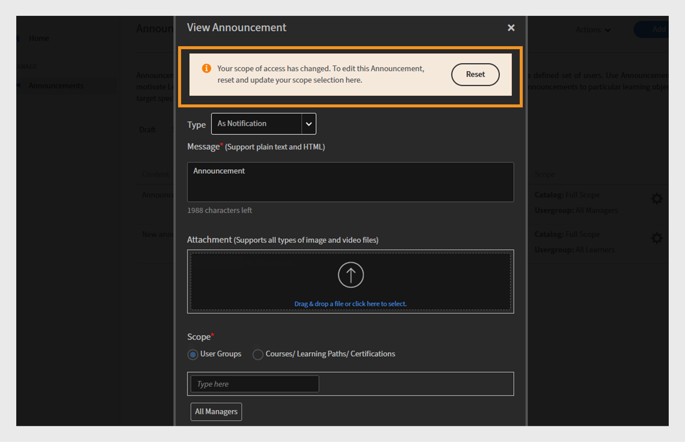
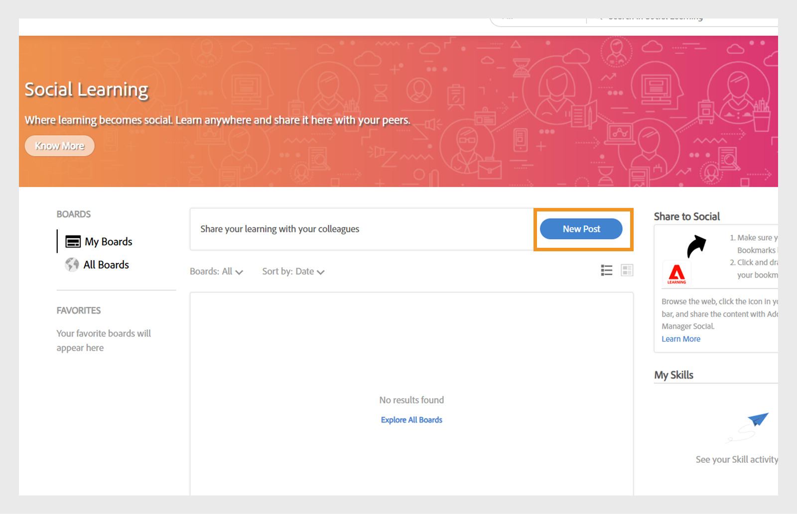
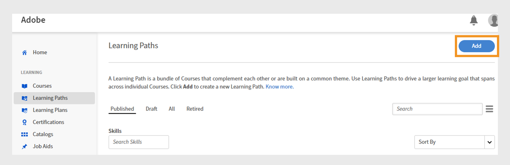

# Aanstaande wijzigingen in Adobe Learning Manager

<!-- >>[!IMPORTANT]
>
>The Adobe Learning Manager October 2025 release is now live. View [What's New](/help/migrated/whats-new.md) for more information on the latest features and enhancements. This page will be updated with the new features and enhancements for the next release. Stay tuned for more updates. -->

## Overzicht van de release

De Adobe Learning Manager-versie van april 2026 introduceert een groot aantal verbeteringen die het leren voor studenten vloeiender maken, eenvoudiger te beheren voor beheerders en flexibeler voor docenten, inclusief een duidelijkere navigatie in de Fluidic Player met een label Volgende module en een speciale knop Afsluiten, ondersteuning voor meerdere gelijktijdige Zoom-sessies zodat teams parallelle virtuele klassen kunnen uitvoeren zonder handmatige installatie, en een betere zichtbaarheid voor gedeelde cursussen door de echte auteur te tonen in plaats te maken van &quot;Externe auteur in collega-accounts. De update maakt ook vervaldatums voor leerobjecten beschikbaar in API&#39;s voor studenten, zodat LXP&#39;s tijdgevoelige trainingen kunnen markeren, meertalige ondersteuning voor taakhulpen toevoegt, zodat één taakhulp alle taalversies kan dragen en beheerders beperkingen kunnen instellen wanneer modules kunnen worden gestart door begin- en eindvensters te definiëren die handig zijn voor cohorten of getimede programma&#39;s.

Externe systemen die LTI gebruiken, kunnen nu automatisch de spelertaal instellen, waardoor studenten op alle platforms een consistente taalervaring krijgen. Er zijn ook verschillende upgrades voor checklist beschikbaar, waaronder gewogen scores, meertalige vraagtekst en optionele revisieopmerkingen voor rijkere feedback. ALM legt nu meerdere quizpogingen vast die worden beheerd binnen SCORM-inhoud en rapporteert elke poging zorgvuldig in L2-rapportage. Docenten kunnen ook zelf QR-codes genereren voor onmiddellijke inschrijving en aanwezigheidsregistratie tijdens persoonlijke sessies, en inhoud van Captivates speelt schoner af met een uniforme inhoudsopgave, voltooiingsvakjes op dianiveau en het exporteren van betrouwbare notities. In het algemeen richt de release zich op helderheid, consistentie, meertalige gereedheid, beheerefficiëntie en flexibelere trainingslevering.

## Navigatie voor Fluidic Player: geef de naam van de volgende module weer

### Overzicht

Deze verbetering is al opgenomen in de november 2025-versie van Adobe Learning Manager.

De actie &quot;Volgende&quot; in de speler geeft aan wat er gebeurt wanneer erop wordt geklikt door de naam van de volgende module of cursus weer te geven en door expliciet te signaleren wanneer de student op het punt staat de speler af te sluiten.

### Nieuwe functies

**label &quot;Next Module: {ModuleName}&quot; in de speler**

Het volgende pictogram in de Fluidic Player toont nu de naam van de volgende module in de cursus. Bijvoorbeeld Volgende module: Les 2 - Aan de slag.

Dit is van toepassing wanneer de student in dezelfde cursus van de ene module naar de andere overschakelt.

**Duidelijke uitgangsactie op de laatste module**

Wanneer de student zich in de laatste module van een cursus bevindt, verschijnt er een knop Handeling afsluiten om aan te geven dat de speler wordt gesloten wanneer deze erop klikt en naar de cursuscontext terugkeert.

**Responsief gedrag voor mobiele en PDF-inhoud**

In kleinere viewports (bijvoorbeeld ~320 px breedte) kan het label Volgende worden ingekort of verborgen, waarbij alleen het pictogram wordt weergegeven, om overlapping met de PDF-besturingselementen te voorkomen.

Voor PDF-modules past de speler besturingselementen aan op een aparte regel, zodat navigatielabels en PDF-besturingselementen elkaar niet beïnvloeden.

**Bijgewerkte Admin > Branding > de voorproef van de Speler**

De voorvertoning van de speler in Beheer > Branding geeft nu het nieuwe label weer, bijvoorbeeld Volgende module: Les 2. Zo kunnen beheerders het bijgewerkte navigatiegedrag zien.

### Belangrijkste voordelen

**de duidelijkere navigatie voor studenten**

Studenten hoeven niet meer te raden wat er gebeurt als ze &quot;Volgende&quot; selecteren. Het label geeft duidelijk aan wat er hierna komt, of het nu een module of een cursus is. Deze vermindering van dubbelzinnigheid helpt aarzeling en verwarring te verminderen, met name bij grote doelgroepen in de klanteneducatie waar veel studenten wellicht niet vertrouwd zijn met LMS-interfaces.

**hogere cursus-voltooiing tarieven**

Het duidelijk aangeven van de volgende stap (Volgende module: {ModuleName}) en het toevoegen van een duidelijke actie Afsluiten voor de uiteindelijke module vermindert de kans dat studenten de cursus verlaten of de laatste voltooiingsstap negeren.

**voorspelbaardere gebruikerservaring over apparaten**

De bijgewerkte labels worden uitgelijnd op het gedrag Volgende of Vorige en de pictogrammen op desktops, tablets en mobiele apparaten. Layoutbeperkingen worden gerespecteerd op alle apparaten en PDF-flows, zodat de besturingselementen bruikbaar en toegankelijk blijven.

Dit is met name belangrijk voor headless implementaties, waarbij de Fluidic Player is ingesloten in een aangepaste leerervaring.

### Gebruiksscenario&#39;s

**de portals van het de onderwijspas van de Klant en van de partner (headless of AEM-geïntegreerd)**

Accounts gebruiken Adobe Learning Manager in een volledig headless setup, waardoor studenten worden geleid van externe marketingkanalen. Deze studenten:

* Gebruik vaak video-inhoud in lange reeksen.

* Verwacht een ervaring in de vorm van een studieprogramma waarbij het systeem duidelijk de volgende aflevering of module aangeeft.

In deze milieu&#39;s, **Volgende Module:{ModuleName}** etiket:

* Versterkt de geleide aard van de reis.

* Minimaliseert drop-off tussen modules.

**de cursussen van de Naleving en van de certificatie met bevolen modules**

In gereguleerde of nalevingszware scenario&#39;s:

* Studenten moeten een strikte reeks modules voltooien.

* Auteurs schakelen de inhoudsopgave vaak uit om overslaan te voorkomen.

Hier ziet u de **volgende module:{ModuleName}**

* Bevestigt studenten dat zij de juiste volgorde volgen.

* Maakt het minder waarschijnlijk dat ze de volgende actie verkeerd interpreteren en vroegtijdig afsluiten.

**het Leren Wegen waar de cursussen elkaar volgen**

Waar leerpaden of equivalenten meerdere cursussen koppelen. Dit is handig wanneer u reeksen maakt die in het studieprogramma staan voor grote doelgroepen.

**mobiel-eerste consumptie**

Voor studenten die voornamelijk telefoons of tablets gebruiken:

* Door bijgewerkte labels en responsief gedrag blijft de navigatie begrijpelijk zonder dat je afhankelijk bent van kleine, gesloten pictogrammen of verborgen besturingselementen.

* Dit is belangrijk voor de voorlichting van klanten, het geven van assistenten of vooraf gedefinieerde studenten die in korte sessies op mobiele apparaten toegang hebben tot inhoud.

## Zoomconnector - meerdere gelijktijdige zoomsessies maken

### Overzicht

De komende upgrade naar de Zoom-connector zal de manier waarop Adobe Learning Manager Virtual Instructor-Led Training (VILT) beheert aanzienlijk verbeteren. Voorheen konden gebruikers slechts één zoomsessie tegelijk maken. Met de nieuwe update kunnen beheerders en auteurs meerdere Zoom-sessies tegelijk plannen met behulp van de standaardintegratie.

### Nieuwe functies

#### Ondersteuning voor meerdere gelijktijdige zoomsessies via de connector

* Met de Zoom-connector kunnen nu meer dan één VILT-sessie op dezelfde datum/tijd worden gemaakt vanuit ALM.

* De planningslogica dwingt niet langer een &#39;één zoomvergadering tegelijk&#39;-beperking op account-/verbindingsniveau af.

* Beheerders en auteurs kunnen overlappende VILT-sessies configureren (bijvoorbeeld regionale lesruimten, parallelle tracks of herhaalde sessies voor verschillende partnergroepen) zonder tussenruimten.

#### Vergaderingen worden gemaakt met de zoomidentiteit van de docent (niet met de Zoom-superbeheerder)

Om veilige steun gezamenlijke vergaderingen, is de schakelaar bijgewerkt zodat:

* Zoomvergaderingen worden nu gemaakt met behulp van het e-mailadres van de docent in plaats van de e-mail met de Zoom-superbeheerder.

* De rekening van het Gezoem van elke instructeur kan zijn eigen vergaderingen naast andere instructeurs, met inachtneming van de grenzen van het bestaande plan van het Gezoem ontvangen.

**Nota**:

* Er wordt nog slechts één docent per vergadering ondersteund.

* Als de e-mail van een docent later in Adobe Learning Manager wordt bijgewerkt, blijven bestaande vergaderingen gekoppeld aan de oorspronkelijke e-mail die bij het maken is gebruikt.

#### Geen URL meer handmatig in-/uitzoomen voor gelijktijdige sessies

Eerder, toen een tweede of derde zitting van het Gezoem tezelfdertijd moest lopen:

* Auteurs moesten handmatig zoomvergaderingen buiten ALM maken en vervolgens de Zoom join-URL in de configuratie van de cursusinstantie plakken.

* Dit was foutgevoelig en profiteerde niet van verbindingsfuncties zoals het bijhouden van aanwezigheid.

Met de bijgewerkte connector:

* Alle sessies kunnen rechtstreeks vanuit de ALM-gebruikersinterface worden gemaakt met behulp van de zoomconnector, zelfs als ze overlappen in de tijd.

* De levenscyclus van sessies (maken/annuleren) wordt centraal beheerd via integratie.

### Belangrijkste voordelen

#### Betere planning van VILT op schaal

Organisaties kunnen nu:

* Voer tegelijkertijd meerdere op zoomen gebaseerde virtuele lesruimten uit (bijvoorbeeld parallelle tracks op een virtuele top, regionale cohorten of afzonderlijke trainingssessies van partners).

* Vermijd knelpunten waardoor beheerders eerder gedwongen werden om sessies te serialiseren of gebruik te maken van handmatig zoombeheer.

#### Minder overhead voor beheerders en auteurs

De verbetering elimineert:

* Handmatig Zoomvergaderingen buiten Adobe Learning Manager maken.

* Kopieer van Zoomen-URL&#39;s naar elke cursusinstantie voor overlappende sessies.

* Risico van verkeerd-gevormde verbindingen, verkeerde vergaderingen die worden vastgemaakt, of gemiste aanwezigheid het volgen.

Beheerders en auteurs kunnen alle Zoom-sessies vanuit Adobe Learning Manager beheren met behulp van vertrouwde workflows.

#### Betere uitlijning met Zoom-provisioning en docentrollen

Door vergaderingen aan individuele docenten te koppelen Zoom accounts:

* Elke docent kan binnen zijn eigen zoomlicentielimieten werken.

* Organisaties kunnen hun bestaande Zoom-inrichtingsmodel gebruiken (één account per trainer, per eenheid, enz.) en tegelijkertijd volledig integreren met Adobe Learning Manager.

* Zo voorkomt u het knelpunt met één punt bij het gebruik van een gedeelde superbeheerder-zoomgebruiker voor alle sessies.

### Gebruiksscenario&#39;s

#### Virtuele gebeurtenissen en topconferenties met meerdere tracks

Klanteducatieteams die grote evenementen uitvoeren (bijvoorbeeld productlokalen, partnertoppen of certificeringsweken) kunnen:

* Configureer meerdere op zoomen gebaseerde sessies in dezelfde periode (voor verschillende tracks of onderwerpen).

* Beheer al deze modules als VILT-modules onder de cursussen en leerpaden van Adobe Learning Manager.

* Geef studenten een uniforme ervaring terwijl de connector alle onderliggende Zoom-vergaderingen verwerkt.

#### Wereldwijde partner- en klantentraining

Organisaties die klanten en partners in verschillende regio&#39;s trainen, kunnen:

* Voer op overlappende tijden afzonderlijke zoomsessies uit voor EMEA, APAC en Amerika om de lokale werkuren af te stemmen.

* Vermijd het forceren van één algemene tijdsleuf of handmatige zoominstelling voor extra cohorten.

#### Interne activering

Interne actieteams (verkoop, ondersteuning, enzovoort) kunnen:

* Plan parallelle onboardingsessies of op rollen gebaseerde brainstormsessies (bijvoorbeeld aparte zoomruimten voor ontwikkelaars, beheerders en stakeholders uit het bedrijfsleven) in ALM.

* Houd alle sessies binnen het VILT-model van ALM voor rapportage- en nalevingsdoeleinden, in plaats van gedeeltelijk over te gaan naar onbeheerde Zoomvergaderingen.

## Oorspronkelijke auteur tonen voor gedeelde cursussen in collega-accounts

### Overzicht

Wanneer een cursus via de catalogus wordt gedeeld met een collega-account, labelt Adobe Learning Manager de auteur momenteel als &quot;Externe auteur&quot; in de weergaven Student, Beheerder en Auteur van het ontvangende account. Dit kan uitdagingen met zich meebrengen voor studenten en beheerders, met name in grote ondernemingen, omdat het moeilijk wordt om de juiste eigenaar van de inhoud te identificeren en te benaderen wanneer er problemen of vragen optreden.

De verbetering zorgt ervoor dat auteursinformatie voor gedeelde cursussen in collega-accounts wordt behouden en opgehaald, in plaats van te worden vervangen door een generieke plaatsaanduiding.

### Nieuwe functies

De werkelijke auteursnaam van gedeelde cursussen in collega-accounts tonen

Voor cursussen die via externe of collega-catalogi worden gedeeld, wordt de oorspronkelijke auteursnaam van het bronaccount nu weergegeven in het ontvangende account in plaats van &quot;Externe auteur&quot;.

Dit geldt voor:

* Learner-app (cursuskaart of cursusgegevens).

* Weergaven beheerder en auteur wanneer u een voorbeeld bekijkt als student.

### Belangrijkste voordelen

#### Rechtstreekse zichtbaarheid van gedeelde inhoud door eigenaars

Studenten en beheerders in collega-accounts kunnen nu:

* Zie wie de cursus heeft geschreven, zelfs wanneer deze via een gedeelde catalogus is verkregen.

* Vermijd het algemene en onnuttige label &#39;&#39;Externe auteur&#39;&#39;.

#### consistentere ervaring met meerdere tenant en collega-accounts

Voor klanten die scenario&#39;s voor meerdere tenant of uitgebreide ondernemingen uitvoeren:

* Dezelfde cursus wordt weergegeven met consistente merknamen van auteurs in verschillende accounts.

* De ervaring van de student is afgestemd op de verwachtingen van het primaire account (zoals &#39;Cloud Academy Team&#39; in plaats van &#39;Externe auteur&#39;).

### Gebruiksscenario&#39;s

#### Grote onderneming met collega-accounts

De onderneming gebruikt ALM met:

* Een hoofdaccount dat eigenaar is van de canonieke cursussen, en

* Collega-accounts die inhoud ophalen via gedeelde catalogi.

Studenten in collega-accounts moeten weten welk Enterprise-team een cursus heeft gemaakt om vragen of verbeteringssuggesties correct door te sturen.

Met deze verbetering:

* Gedeelde cursussen geven nu de juiste naam van de auteur van de onderneming weer in collega-accounts.

* De interne belasting van de ondersteuning van het bedrijf wordt verminderd omdat studenten en lokale beheerders weten met wie ze contact moeten opnemen.

#### Intern delen met meerdere bits per eenheid

Waar een bedrijfseenheid het leren voor anderen beheert:

* De eigendom van de BU kan in het auteurveld worden geïdentificeerd voor alle accounts die worden gebruikt.

* Lokale L&amp;D-beheerders kunnen snel zien of een cursus lokaal of door een andere BU wordt onderhouden en kunnen dienovereenkomstig samenwerken.

## Vervaldatum (automatisch archiveren) van leerobject weergeven in API&#39;s voor studenten

### Overzicht

Deze verbetering maakt de automatisch gearchiveerde datum van een leerobject (LO) direct beschikbaar via de studentgerichte API&#39;s van Adobe Learning Manager. Wanneer een cursus, leerpad of certificering is geconfigureerd met een vervaldatum of datum voor automatisch archiveren, maakt die informatie nu deel uit van de LO-gegevens die worden geretourneerd door de belangrijkste eindpunten voor studenten.

### Nieuwe functies

#### Nieuw verloopveld/automatisch archiefveld in LO-API&#39;s van student

* De LO-API&#39;s van de student (bijvoorbeeld de eindpunten die leerobjecten terugsturen naar de leerervaring en naar externe platforms) bevatten nu de vervaldatum van de LO (de voor dat leerobject geconfigureerde datum voor automatisch archiveren).

* Dit veld wordt geretourneerd als onderdeel van de LO-entiteit in reacties zoals:

   * Leerobject ophalen (LO-details).

   * LO-gegevens die worden gebruikt om de startpagina, catalogus en zoekresultaten van de student in te vullen.

* Het veld vult de bestaande deadline voor voltooiing aan die al bestaat op instantieniveau; het nieuwe veld is specifiek de datum voor automatisch archiveren op LO-niveau.

#### Beschikbaarheid in door zoekopdrachten ondersteunde leerervaringen

Omdat de vervaldatum als deel van de onderzoek-gesteunde vertegenwoordiging LO wordt blootgesteld, is het nu beschikbaar overal ALM of een extern platform gebruikt:

* zoekAPI&#39;s of

* zoekgestuurde catalogi en suggesties om studentweergaven samen te stellen.

**Reikwijdte en uitsluitingen**

De verbetering is alleen van toepassing op API&#39;s voor studenten.

### Belangrijkste voordelen

#### Vervalbestendige leerervaring in aangepaste LXP&#39;s

Voor grote en middelgrote ondernemingen kan hun aangepaste LXP nu rechtstreeks van ALM informatie over de LO-vervaldatum verkrijgen, zodat deze:

* Toon de labels &quot;Verlopen op {date}&quot; of &quot;Verlopen binnenkort&quot; op cursuskaarten en detailpagina&#39;s.

* Communiceer duidelijker met de urgentie, zodat studenten prioriteit geven aan training die op het punt staat met pensioen te gaan.

Dit is met name belangrijk voor compliance of een aan de tijd gebonden producttraining, waarbij leerobjecten regelmatig worden vernieuwd en oudere versies worden gearchiveerd.

#### Betere begeleiding voor studenten over welke training ze nu moeten volgen

Door het verstrijken van de LO zichtbaar te maken, kan de ervaring van de student:

* Markeer cursussen die nog geldig zijn in plaats van cursussen die binnenkort worden gearchiveerd.

* Voorkom dat studenten zich inschrijven voor trainingen die in de nabije toekomst niet meer beschikbaar of geldig zullen zijn.

#### Samenhang met bestaande gegevens van de voltooiingsdeadline

Voorheen werden de API&#39;s van de student al beschikbaar gesteld als voltooiingsdeadline op instantieniveau, maar niet als de datum voor automatisch archiveren op LO-niveau. Met deze wijziging:

De volgende aspecten van een training zijn beschikbaar:

* &quot;Tegen wanneer moet ik deze instantie voltooien?&quot; (voltooiingsdeadline).

* &quot;Tot wanneer wordt deze training aangeboden?&quot; (automatisch archiveren/vervaldatum).

### Gebruiksscenario&#39;s

#### Een wereldwijd bedrijf met een strikt levenscyclusbeheer voor cursussen

Ondernemingen die regelmatig cursussen archiveren en vervangen (bijvoorbeeld update van regelgeving, product of methodologie) kunnen:

* Vermijd verwarring bij studenten over de vraag of een training al dan niet moet worden afgebroken.

* Leerlingen naar het nieuwste, langlevende aanbod leiden.

Hun aangepaste portals en interne tools kunnen de vervaldatum nu rechtstreeks vanuit ALM lezen via de API&#39;s voor studenten.

#### Externe klant- of partneracademies

Voor het onderwijs aan klanten en partners leggen marketingpagina&#39;s en portals vaak de nadruk op actuele training.

Met vervaldatums in de LO API kunnen ervaringenbouwers:

* Inhoud die bijna is gepensioneerd verbergen of de nadruk erop leggen.

* Bouw &quot;Laatste kans om te voltooien&quot; campagnes.

## Meertalige ondersteuning voor taakhulpen

### Overzicht

De verbetering breidt het lokalisatiemodel van Adobe Learning Manager uit tot taakhulpen, waardoor auteurs verschillende inhoudsbestanden per taal kunnen koppelen aan één taakhulp. In plaats van afzonderlijke taakhulpen voor elke taal te maken, kunnen auteurs nu alle gelokaliseerde versies als één logische taakhulp beheren.

### Nieuwe functies

#### Taalspecifieke inhoud uploaden voor taakhulpen

Auteurs kunnen verschillende bestanden per ondersteunde taal aan één taakhulp koppelen, zoals cursussen en andere LO&#39;s.

Het maken/bewerken van taakhulp ondersteunt nu:

* Taal selecteren.

* Het taalspecifieke bestand voor die taal uploaden binnen dezelfde taakhulpentiteit.

#### Consistente taalverwerking in de gebruikersinterface van speler en student

De Fluidic Player is bijgewerkt zodat wanneer een student een taakhulp opent, de inhoudvariant wordt weergegeven die overeenkomt met de taal van de student (indien beschikbaar).

Beheerders en auteurs kunnen taakhulpen bekijken als afzonderlijke objecten met taalvarianten in plaats van afzonderlijke items per taal.

### Belangrijkste voordelen

#### Eén taakhulp voor alle talen

Auteurs kunnen voorkomen dat er afzonderlijke taakhulpen per taal worden gemaakt.

Alle taalvarianten van dezelfde taakhulp (bijvoorbeeld een procedure, SOP, checklist PDF of naslaggids) kunnen op één plaats worden beheerd.

#### Betere ervaring voor wereldwijde studenten

Studenten zien de taakhulp automatisch in hun voorkeurstaal, wat betekent dat er:

* Minder verwarring over welke versie moet worden geopend.

* Minder risico op het verkrijgen van toegang tot niet-lokale of verouderde kopieën.

Dit is vooral handig in meertalige organisaties waar hetzelfde proces of dezelfde productdocumentatie in meerdere talen beschikbaar moet zijn.

### Gebruiksscenario&#39;s

#### Globale uitrol van referentie-inhoud

Een onderneming moet studenten wereldwijd taakhulpen in verschillende talen bieden, zoals:

* Productreferentiebladen.

* Controlelijsten verwerken.

* Afspeelboeken ondersteunen

In plaats van afzonderlijke taakhulpen te maken zoals &quot;Product Quick Start - EN&quot;, &quot;Product Quick Start - DE&quot;, &quot;Product Quick Start - JP&quot;, enz., kunnen ze één taakhulp maken, gelokaliseerde bestanden voor elke taal koppelen en ALM de juiste versie laten leveren aan elke student op basis van taalinstellingen.

#### Klant- of partnergerichte documentatie voor meerdere markten

Voor klanten- en partneracademies kunnen taakhulpen het volgende omvatten:

* Productbedrukte vellen

* Integratiehandleidingen

* Workflows voor ondersteuning

Met meertalige taakhulpen:

* Elke partner ziet de gelokaliseerde versie zonder dat er een keuze hoeft te worden gemaakt tussen taalspecifieke items.

* Marketing- en actieteams kunnen één taakhulp per onderwerp beheren voor alle landinstellingen.

## Beperken wanneer modules kunnen worden gestart

### Overzicht

Dankzij deze verbetering kunnen auteurs en beheerders in Adobe Learning Manager een tijdvenster definiëren waarin studenten een module mogen starten. Buiten het geconfigureerde begin-/eindvenster blijft de module zichtbaar in de cursusstructuur, maar studenten kunnen deze niet starten.

Deze mogelijkheid is van essentieel belang voor gebruikers die een betere controle nodig hebben over het moment waarop bepaalde inhoud beschikbaar komt of die niet meer mogen worden gestart, bijvoorbeeld in programma&#39;s op tijd, cohorttraining of tijdgevoelige oefeningen.

### Nieuwe functies

Auteurs kunnen nu op moduleniveau binnen een cursus een begindatum/tijd en einddatum/tijd configureren die bepalen wanneer studenten die module mogen starten. Binnen dit venster gedraagt de module zich zoals gewoonlijk; voor de begintijd of na de eindtijd ziet de student de module in het cursusoverzicht, maar kan deze niet starten.

De configuratie wordt in de gebruikersinterface voor het ontwerpen van de cursus weergegeven als extra besturingselementen voor specifieke moduletypen, zoals inhoud op eigen tempo, quizzen of activiteiten. Beheerders kunnen deze besturingselementen gebruiken om modules te maken die in fasen worden geopend of om te voorkomen dat programma&#39;s met een laat programma worden gestart waarin de inhoud binnen een bepaald tijdsbestek moet worden opgenomen.

#### Belangrijkste voordelen

Het belangrijkste voordeel is de mogelijkheid om te controleren wanneer de modules toegankelijk zijn. Trainingsteams kunnen de beschikbaarheid van modules synchroniseren met gebeurtenissen uit de praktijk, zoals het starten van nieuwe producten, deadlines en interne programma&#39;s. Zo zorgt u ervoor dat studenten de vereiste inhoud voltooien voordat ze toegang krijgen tot latere modules.

Cohort 1 heeft bijvoorbeeld alleen toegang tot module 2 in week 2, terwijl module 3 vergrendeld blijft tot week 3, zodat u niet handmatig inhoud hoeft te verbergen of te verbergen of afzonderlijke cursusversies hoeft te maken.

Dit verbetert de ervaring van de student: in plaats van modules te bekijken die technisch toegankelijk zijn maar op dat moment niet zouden moeten zijn (of die al zouden moeten worden voltooid), zien studenten een cursusstructuur waarbij de modules die ze mogen starten duidelijk worden afgestemd op het geplande schema.

#### Gebruiksscenario&#39;s

* **op cohort-gebaseerd inschrijvingsprogramma**: In dit programma, elke week ontgrendelt een nieuwe module. De inhoud voor Week 1 is onmiddellijk beschikbaar, terwijl Week 2 zichtbaar is maar niet kan worden gestart tot een bepaalde datum. Week 3 volgt hetzelfde gatingproces. Studenten kunnen het volledige leerpad zien, maar het systeem bepaalt wanneer ze daadwerkelijk met elke stap kunnen beginnen.

* **tijd-gebonden product of campagneopleiding**: De marketing of productteams kunnen een trainingsmodule tot stand brengen die slechts zou moeten worden betreden terwijl een campagne actief is of wanneer een specifieke versie van een product nog beschikbaar is. Dit toegewezen beginvenster zorgt ervoor dat studenten na de opgegeven eindtijd niet met een module over een beëindigde productversie beginnen.

* **de milieu&#39;s van de Beoordeling of van het examen**: De organisaties kunnen een module (zoals een test) voor een kort, duidelijk-bepaald venster openen (bijvoorbeeld, &quot;u kunt het examen op elk ogenblik tussen 9 :00 en 12 :00 op een bepaalde datum&quot;beginnen). Studenten kunnen niet buiten dat venster beginnen met het examen, dat eerlijke planning over tijdzones en cohorten ondersteunt.

## Taal van speler beheren via aangepaste LTI-parameter

### Overzicht

Dankzij deze verbetering kunnen externe platforms met behulp van LTI (Learning Tools Interoperability) de taal voor Adobe Learning Manager-inhoud opgeven op het moment dat de toepassing wordt gestart. In plaats van dat de student de taal binnen de Fluidic Player moet wijzigen, kan de LTI-consument een taalcode verzenden via een aangepaste LTI-parameter. Adobe Learning Manager gebruikt deze code vervolgens om de juiste taalvariant te selecteren.

### Nieuwe functies

Externe platforms die fungeren als LTI-consumenten kunnen nu een aangepaste taalparameter (en verwante spelerinstellingen) doorgeven bij het starten van ALM-inhoud. ALM leest deze parameter en:

* Hiermee wordt de taal van de speler overeenkomstig ingesteld.

* Opent de overeenkomstige taalvariant van de module, wanneer de meertalige inhoud wordt gevormd.

Dit betekent dat een nieuwe student, die Frans selecteert op het externe platform, de ALM-speler ziet en de module direct in het Frans start, zonder dat hij iets hoeft aan te passen binnen ALM.

De uitbreiding biedt ook ruimte voor scenario&#39;s waarin ALM door het externe platform wordt behandeld als een headless contentspeler. Zo kunt u bijvoorbeeld navigatie-elementen en de inhoudsopgave verbergen door extra aangepaste parameters te verzenden om bepaalde gebruikersinterface-instellingen aan te passen. Deze instellingen werken in combinatie met de taalparameter, waardoor het externe platform een vloeiende merkervaring kan bieden terwijl ALM wordt gebruikt voor afspelen en bijhouden.

### Belangrijkste voordelen

* **Consistente taalervaring over systemen**: Wanneer een student een taal in het externe portaal selecteert, wordt die keuze onmiddellijk weerspiegeld in ALM. Zo voorkomt u dat studenten de taal van de portal en de cursus niet tegenkomen. Als gevolg hiervan hoeven ze niet te zoeken naar een taalwisseling binnen de speler.

* **taal-specifieke het melden**: In hun platform, is de taalselectie verenigbaar met ALM, dat de nauwkeurigheid van hun analytics en het leren volgen verbetert. Deze uitlijning ondersteunt ook configuraties waarbij de eigen taalbesturingselementen van ALM opzettelijk worden uitgeschakeld of verborgen in de Fluidic Player voor specifieke cursussen. In deze gevallen fungeert het externe platform als enige bron van waarheid voor taal.

### Gebruiksscenario&#39;s

* Een belangrijk gebruiksgeval betreft grote ondernemingen die gebruikmaken van op LTI gebaseerde integraties. Studenten schrijven zich eerst in en selecteren een taal op het platform. Vervolgens worden ALM-trainingssessies gestart via LTI. Als een student Spaans selecteert, wordt de ALM-module automatisch in het Spaans geopend. Dit betekent dat studenten de taalinstellingen in ALM niet hoeven aan te passen. Bovendien blijft taalgebaseerde rapportage consistent met wat studenten zien en ervaren in ALM.

* Een andere toepassing is het aanbieden van headless cursuservaringen binnen een klant- of partnerportaal. In deze setup kan de portal ALM-inhoud insluiten via een iframe, terwijl alle navigatie- en taalgebruikerservaring (UX) buiten ALM wordt beheerd. Door aangepaste LTI-parameters te gebruiken, kan de portal ervoor zorgen dat de ALM-speler wordt weergegeven in de juiste taal en dat overbodige gebruikersinterface-elementen (zoals de inhoudsopgave en navigatieknoppen) verborgen zijn. Zo kunnen studenten één coherente toepassing ervaren in plaats van een onsamenhangende verzameling tools.

* Dit is gunstig voor organisaties die grootschalige trainingen in meerdere talen uitvoeren met een ander LMS of leerplatform. Ze kunnen hun gebruik van dat platform standaardiseren voor het beheren van studentprofielen, het selecteren van landinstellingen en het presenteren van catalogi. Ondertussen fungeert ALM als een betrouwbare engine voor inhoud en tracering, waarbij de taalvoorkeuren en gebruikersinteracties worden gerespecteerd die tijdens elke LTI-lancering door het externe systeem worden opgegeven.

## Dekkingsgewicht van de checklist-vraag voor beoordelingen van docenten

### Overzicht

De verbetering introduceert gewogen controlelijsten, die instructeurs en managers toestaan om studenten te evalueren gebruikend scoreschalen en totale scores, eerder dan het behandelen van elke checklist vraag als gelijk. Het doel is het creëren van checklist te vergemakkelijken door het uitvoeren van gewogen evaluaties van vragen, waardoor het relatieve belang van verschillende acties of vaardigheden binnen één enkele checklist kan worden weerspiegeld.

### Nieuwe functies

Controlelijsten ondersteunen de volgende typen:

1. Ja/Nee
Het gedrag blijft hetzelfde als vandaag: elke vraag is Ja/Nee en de criteria voor het doorgeven zijn gebaseerd op het aantal &quot;Ja&quot;-antwoorden.

2. Vragen met hetzelfde gewicht

   * Vragen worden op een numerieke schaal (standaard 0-10) gescore, waarbij:

      * De maximale/minimale waarden op de schaal kunnen worden aangepast op controlelijstniveau.

      * De schaal kan nu beginnen bij 0 (de vorige minimumscore was 1).

   * Alle vragen hebben dezelfde maximale score. De checklist gedraagt zich dus als een uniforme scoreschaal voor elke vraag.

3. Verschillende vragen

   * Elke vraag heeft een eigen maximumscore (gewicht).

   * De criteria om te slagen zijn afhankelijk van het percentage van de totale mogelijke score die de student behaalt in de hele checklist (bijvoorbeeld &quot;geslaagd als de student ≥ 70% van de totale beschikbare score behaalt&quot;).

Voor alle typen controlelijsten:

* De **Recensent** (instructeur of manager) evalueert de student volgens het gevormde controlelijsttype:

   * Ja/Nee selecteren.

   * Kies scores op de gedefinieerde schaal.

* Het **Checklist** rapport wordt bijgewerkt om, voor vragen met verschillend gewicht te omvatten:

   * De maximale score voor elke vraag.

   * De score die elke leerling voor die vraag heeft behaald.

Op deze manier kunt u de algehele prestaties en de vraagspecifieke prestaties analyseren op basis van de bedoelde gewichten.

### Belangrijkste voordelen

* **Rijkere, realistischere beoordelingen**: De instructeurs kunnen echte prioriteiten weerspiegelen door meer punten aan kritisch gedrag en minder aan minder kleine te geven, terwijl nog het gebruiken van een controlelijstwerkschema geschikt aan waargenomen of praktische taken.

* **op totaal-score-gebaseerde pas/ontbreekt**: de evaluaties kunnen op de algemene percentagescore worden gebaseerd, niet alleen hoeveel vragen een drempel passeren, die dichter bij typische bekwaamheids of gradingsregelingen richt.

* **Betere rapportering**: De bijgewerkte controlelijstrapporten stellen max score bloot en behaalden score per vraag, toestaand programmaeigenaars en kwaliteitsteams om specifieke zwakke vlekken te identificeren en opleiding of evaluatierichtlijnen te verfijnen.

### Gebruiksscenario&#39;s

* **de vaardigheidsbeoordelingen van de Onderneming**: De ingenieurs worden beoordeeld via praktische, op scenario-gebaseerde checklists waar bepaalde diagnostische of communicatie stappen meer gewicht moeten dragen dan cosmetische of laag-risicopauters. Gewogen vragen en criteria voor het halen van de score maken deze beoordelingen geloofwaardiger en voorspelbaarder van real-world prestaties.

* **de observaties van de Veiligheid en van de naleving**: In gezondheidszorg, de productie, of de velddienst, kunnen de kritieke veiligheidsstappen hogere maximumscores worden gegeven, die ervoor zorgen dat het missen van een veiligheid-kritieke actie een grotere invloed op de totale score heeft dan het missen van een minder belangrijke procedurele stap.

* **Coaching en kalibratie**: Met max. en behaalde scores per vraag in het rapport, kunnen de managers precies zien waar de studenten onderpresteren en docenten kalibreren op hoe te om constant te scoren.

## Meertalige ondersteuning voor vragen over checklist

### Overzicht

De verbetering introduceert meertalige steun voor checklist vragen, die recensenten toestaan om controlelijsten in hun aangewezen taal te evalueren en te scoren. Deze functie is vooral handig in meertalige regio&#39;s en wereldwijde implementaties, omdat auteurs zo gelokaliseerde vragen over checklist kunnen maken voor elke ondersteunde inhoudstaal, terwijl één controlelijstmodule en een consistent evaluatieproces behouden blijven.

Vandaag in Adobe Learning Manager:

* Alle studentgerichte modules (SCORM, PDF, HTML, enz.) kunnen in meerdere inhoudstalen worden aangeboden, zodat studenten de gewenste taal kunnen kiezen.

* In een controlelijstmodule evalueren revisoren (docenten/managers) studenten op basis van de vragen die in die controlelijst zijn gedefinieerd.

### Nieuwe functies

**Auteurs**

* Auteurs kunnen nu vragen toevoegen met een checklist in alle talen die op cursusniveau zijn geselecteerd.

* Voor elke controlelijst:

   * Van de auteur wordt verwacht dat deze equivalente vraagtekst levert in elke inhoudstaal waarin de cursus bestaat.

   * Auteurs moeten ervoor zorgen dat de betekenis van elke vraag in alle talen consistent is.

**ervaring van het Overzicht**

* Revisoren zien vragen over checklist en evaluatie-UI in hun geselecteerde inhoudstaal.

* Wanneer een vraag in één taal wordt geëvalueerd:

   * De evaluatie (score, Ja/Nee, status) is logischerwijze hetzelfde in alle talen. Het is één controlelijst met meerdere taalweergaven, niet afzonderlijke controlelijsten per taal.

**Rapportage**

In het controlelijstrapport wordt de vraagtekst weergegeven in de inhoudstaal van de gebruiker:

* Een beheerder of revisor die het rapport in elke taal uitvoert, ziet de gelokaliseerde vraagnamen voor die taal.

* De onderliggende reacties en scores blijven hetzelfde; alleen vraaglabels worden vertaald.

### Belangrijkste voordelen

* **Betere reviewerervaring**: de recensenten kunnen volledig in hun eigen taal werken, het lezen van vragen en het registreren van evaluaties zonder taalbarrières.

* **regelgevende en beleidsgroepering**: In gebieden met de eisen van de taalgelijkheid (bijvoorbeeld, Nederlands/Frans in België), kunnen de checklists aan de zelfde normen nu voldoen zoals andere het leren materialen, die nalevingsrisico verminderen.

* **Consistente evaluatielogica**: Terwijl de tekst wordt gelokaliseerd, worden de evaluatie en het scoren gedeeld over alle talen, die ervoor zorgen dat de resultaten vergelijkbaar en centraal beheerd zijn.

### Gebruiksscenario&#39;s

* Licenties voor meerdere landen die in meerdere talen werken, kunnen één cursus en checklist implementeren en tegelijkertijd de gelokaliseerde revisieervaringen bieden op elk gebied.

* Elke internationale onderneming met lokale docenten (bijvoorbeeld EMEA, LATAM, APAC) kan revisoren in hun lokale taal laten werken terwijl ze hetzelfde ontwerp en dezelfde rapportage van de wereldwijde checklist delen.

## Controlelijst met opmerkingsmogelijkheden voor revisor

### Overzicht

De verbetering introduceert een opmerkingseigenschap voor checklist evaluaties, die recensenten, zoals instructeurs en managers, toestaan om kwalitatieve feedback naast de numerieke scores te verstrekken. Deze feedback kan indien nodig zichtbaar worden gemaakt voor studenten.

Het doel is op checklist gebaseerde evaluaties te ondersteunen waarbij mentor feedback even belangrijk is als het numerieke resultaat. Dit omvat het benadrukken van specifieke sterke punten, gebieden voor verbetering, of het verstrekken van context voor de bepaalde score.

Tegenwoordig kunnen revisoren:

* Evalueer een checklist voor elke student, vraag per vraag.

* Bekijk resultaten en evalueer de mislukte studenten opnieuw.

In echte scenario&#39;s, zoals de luchtvaart, beoordelen praktijkopleiders vakmensen en luchthavenpersoneel. Ook docenten en mentoren in het midden- en kleinbedrijf (MKB) maken vaak gebruik van checklists om de prestaties van hun werk te evalueren. Deze checklists bevatten doorgaans echter geen gestructureerde sectie voor het vastleggen van commentaar met betrekking tot de evaluatie.

### Nieuwe functies

#### Ontwerpopties

Auteurs kunnen elke checklist als volgt configureren:

* De mogelijkheid om opmerkingen toe te voegen aan revisoren in of uit te schakelen.

* Bepaal of de naam van de revisor samen met opmerkingen aan de studenten moet worden getoond.

Zo kunnen organisaties de zichtbaarheid van opmerkingen afstemmen op hun cultuur- en privacyvereisten.

#### Revisor-ervaring

Als opmerkingen zijn ingeschakeld:

* Revisoren (docenten/managers) kunnen optionele opmerkingen toevoegen tijdens het evalueren van een controlelijst.

* Ze kunnen op basis van de instellingen van de controlelijst kiezen of de opmerkingen zichtbaar zijn voor de studenten.

Als ze een student opnieuw evalueren, kunnen ze opmerkingen bijwerken of wijzigen om de laatste beoordeling weer te geven.

#### Rapportage en kennisgevingen

* Het controlelijstrapport krijgt een nieuwe kolom voor de opmerkingen van de revisor, waarin de opmerking wordt vastgelegd die tijdens de evaluatie is toegevoegd.

* Studenten ontvangen meldingen (op het platform en via e-mail) wanneer een checklist-evaluatie plaatsvindt. Deze meldingen omvatten:

   * De opmerking en

   * De naam van de revisor, als deze is geconfigureerd om zichtbaar te zijn.

Zo weet u zeker dat de feedback niet alleen wordt opgeslagen, maar ook actief aan de studenten wordt getoond.

### Belangrijkste voordelen

* **rijkere, coach-als terugkoppelen**: De numerieke scores worden aangevuld met contextuele opmerkingen, die checklists een effectiever hulpmiddel maken om te coachen, niet alleen naleving.

* **Traceerbaarheid en controleerbaarheid**: De organisaties krijgen een permanent verslag van wie evalueerde wie, wanneer, en wat zij zeiden, wat in gereglementeerde milieu&#39;s en high-stakes rollen belangrijk is.

* **Betere studentbetrokkenheid**: De studenten ontvangen duidelijke begeleiding verbonden aan specifieke evaluaties, die hun inzicht in verwachtingen en verdere stappen verbetert.

### Gebruiksscenario&#39;s

* Organisaties met gereguleerde omgevingen kunnen opmerkingen gebruiken om klinische beoordelingen of procedurele feedback te documenteren voor personeel dat op het terrein wordt geobserveerd.

* Luchtvaart- en grondafhandelingsorganisaties kunnen gedetailleerde notities toevoegen over operationele prestaties, veiligheidspraktijken en klantgericht gedrag, waardoor een checklist verandert in een gestructureerde debrieftool.

* In mentoring en SME-evaluatie kunnen docenten genuanceerde observaties vastleggen die niet alleen in een score passen, bijvoorbeeld ‘afgehandelde escalatie goed maar moet tijdbeheer verbeteren’ of ‘uitstekende workflow voor probleemoplossing; een documentatiestap gemist.’

## Meerdere pogingen en quizrapportage op inhoudsniveau

### Overzicht

Momenteel ondersteunt ALM meerdere pogingen op LMS-niveau via de MQA (Multiple Quiz Attempt):

* Auteurs kunnen pogingen op cursusniveau (toegepast op alle quizdragende modules in de cursus) of op moduleniveau (per quizmodule) configureren.

* Pogingen kunnen zijn:

   * Een specifiek getal (bijvoorbeeld 3 pogingen), of

   * Oneindige pogingen, bestuurd op LMS-niveau.

* Wanneer een student een module via de Fluidic Player afsluit en de speler vervolgens sluit of de module voltooit, wordt die sessie behandeld als een enkele LMS-poging.

* Elke LMS-poging wordt in het L2-quizrapport vastgelegd als een nieuwe rij.

Als het inhoudsbestand zelf (bijvoorbeeld een Articulate SCORM-quiz) echter zijn eigen logica voor meerdere pogingen implementeert, wordt in het L2-quizrapport van ALM deze interne pogingen momenteel niet goed onderscheiden of bijgehouden.

Deze verbetering introduceert meerdere pogingen bijhouden op inhoudsniveau voor quizzen, zodat Adobe Learning Manager elke poging in de inhoud zelf nauwkeurig kan vastleggen in het L2-quizrapport. Het is ontworpen voor situaties waarin het inhoudsontwerpgereedschap (zoals Articulate SCORM) quizpogingen onafhankelijk beheert. Met deze functie worden pogingen correct weergegeven in ALM-rapportage, zonder dat dit afhankelijk is van de MQA-instellingen (Multiple Quiz Attempt) op LMS-niveau.

### Nieuwe functies

#### Auteurmarkering voor pogingen op inhoudsniveau

* Wanneer auteurs inhoud naar de inhoudsbibliotheek uploaden, kunnen ze nu aangeven dat er meerdere pogingen in zijn ingesloten voor een bepaald inhoudsbestand.

* Dit is een instelling per inhoud die ALM vertelt om pogingen die in de inhoud zijn gedefinieerd, te behandelen als de bron van de waarheid.

#### Cursus-/modulegedrag

Wanneer dergelijke inhoud in een cursus wordt gebruikt:

* De module zal zijn pogingen uit de inhoud, niet uit MQA leiden LMS.

* Studenten zien slechts één poging op LMS-niveau:

   * Het cursusoverzicht en de moduleweergave geven geen LMS-knop &quot;Opnieuw proberen&quot; voor die module.

   * De afhandeling van pogingen (bijvoorbeeld opnieuw proberen in de quiz) wordt bepaald door de inhoud zelf.

#### Rapportage

Het L2-quizrapport wordt bijgewerkt om elke poging op inhoudsniveau te behandelen als een afzonderlijke pogingsrij:

* Elke interne quizpoging die in de inhoud is geconfigureerd, wordt als een eigen rij weergegeven in het L2-quizrapport, zoals hoe pogingen op LMS-niveau vandaag worden weergegeven.

* De opmaak van elke rij blijft hetzelfde als bestaande rijen met meerdere pogingen in L2-rapportage (dezelfde kolommen, structuur en semantiek).

* Dit biedt een consistente rapportage-ervaring:

   * Of pogingen nu door LMS MQA of door de inhoud worden bepaald, het L2 quizrapport toont één rij per poging.

#### Belangrijkste voordelen

* Nauwkeurige zoekgeschiedenis voor SCORM-quizzen waarbij pogingen intern worden bestuurd door gereedschappen zoals Articulate, zonder dat MQA-configuratie op LMS-niveau bovenaan hoeft te staan.

* Mindere ervaring voor studenten: voor pogingen met inhoudsregeling zien studenten één sleuf op LMS-niveau en hoeven ze niet te communiceren met de besturingselementen voor nieuwe pogingen in LMS; alle pogingen worden afgehandeld binnen de quizinterface die ze al kennen.

* Flexibele architectuur: gebruikers kunnen kiezen of ALM MQA of pogingen op inhoudsniveau gedrag per module moeten aansturen, afhankelijk van hoe hun inhoud is gemaakt en hoe ze pogingen liever beheren.

* Consistent rapportmodel: downstream-consumenten van het L2-quizrapport kunnen elke rij als &quot;één poging&quot; behandelen, ongeacht waar de logica van de poging vandaan komt.

#### Gebruiksscenario&#39;s

* Organisaties die Articulate SCORM gebruiken, kunnen zelfstandige quizlogica binnen het SCORM-pakket houden en tegelijkertijd een nauwkeurige rapportage op proberen-niveau bereiken in ALM zonder extra LMS-configuratie.

* Organisaties die door leveranciers verschafte SCORM-inhoud gebruiken, kunnen voorkomen dat ze aanvullende pogingen moeten wijzigen of implementeren en opnieuw logica moeten proberen met MQA op LMS-niveau.

## QR-codes voor docenten, bijvoorbeeld inschrijving en aanwezigheid van sessies

### Overzicht

Deze verbetering voegt de mogelijkheid toe voor docenten om zelf QR-codes te genereren voor:

* Inschrijving van cursusinstantie,

* aanwezigheid van een sessie, of

* Inschrijving + aanwezigheid samen

op sessieniveau. Het is ontworpen voor situaties waarin studenten een fysieke of hybride lesruimte betreden en een snelle, selfserviceoptie nodig hebben om zich in te schrijven en hun aanwezigheid vast te leggen met een QR-code.

### Nieuwe functies

#### Door docenten gegenereerde QR-codes

* Docenten kunnen op sessieniveau QR-codes genereren voor:

   * Inschrijven in instantie: studenten kunnen zich inschrijven voor de instantie die de huidige sessie bevat.

   * Aanwezigheid van sessie markeren: studenten scannen tijdens/na de sessie om aanwezigheid voor die specifieke sessie vast te leggen.

   * Aanwezigheid voor instance- en markeringssessie: een gecombineerd QR voor walk-ins die nog niet zijn ingeschreven en hun aanwezigheid in één stap moeten markeren.

* Docenten kunnen de QR-codes die ze nodig hebben exporteren op basis van het scenario (inschrijving, aanwezigheid of beide).

#### Verpakken van QR-code

De geëxporteerde PDF van de QR-code bevat:

* Cursusnaam

* Instantienaam

* Naam van sessie

Hiermee kunnen docenten en coördinatoren eenvoudig de juiste QR-code voor elke sessie identificeren en afdrukken.

### Belangrijkste voordelen

* **autonomie van de Instructeur**: De instructeurs hoeven niet meer op beheerders te wachten om QR codes te creëren. Ze kunnen ze direct voor elke sessie genereren, waardoor ze flexibeler worden en de overhead op het gebied van coördinatie vermindert.

* **Betere klaslokaallogistiek**: voor loop-binnen of on-site doelgroepen (zoals gebiedsarbeiders, werkplaats personeel, of externe aanwezigen), kunnen de instructeurs inschrijving en aanwezigheid op de plaats beheren gebruikend QR codes.

* **Verminderde admin werkbelasting**: De teams van Admin kunnen zich op configuratie en beheer in plaats van het behandelen van routine QR de verzoeken van de codegeneratie voor elke zitting concentreren.

### Gebruiksscenario&#39;s

* Organisaties die grote hoeveelheden on-site sessies uitvoeren (bijvoorbeeld producttraining voor professionals) kunnen docenten de mogelijkheid geven sessiespecifieke QR-codes af te drukken waarmee ze zich kunnen inschrijven voor één scan en aanwezigheid kunnen markeren.

* In retail-, productie- en gezondheidszorgtrainingen, waar studenten vaak rechtstreeks vanuit de vloer of zonder voorafgaande inschrijving deelnemen aan sessies, kan een QR-code voor Inschrijven + Aanwezigheid bij de deur worden geplaatst. Zo kunnen studenten hun inschrijving en aanwezigheid zelf bedienen via hun telefoon.

* Door trainingsgebeurtenissen voor partners of klanten kan de trainer ter plaatse zich gemakkelijk aanpassen aan wijzigingen in de ruimte, extra sessies of extra aanwezigen zonder dat hij of zij de beheerder om nieuwe QR-codes hoeft te vragen.

## Verbeteringen op gebied van Captivate en ALM-speler

### Overzicht

Deze verbetering verbetert de ervaring van het afspelen van Adobe Captivate-inhoud in de Adobe Learning Manager-speler (ALM), met name na de recente wijzigingen in de architectuur van de Captivate. Het doel is om studenten in staat te stellen om zelf Captivate-modules te gebruiken in ALM, terwijl ze er zeker van zijn dat navigatie, het volgen van de voltooiing en het nemen van notities duidelijk, consistent en betrouwbaar zijn.

### Nieuwe functies

#### Uniforme ervaring voor inhoudsopgave

* Aan de linkerkant van de speler wordt alleen de ALM-inhoudsopgave weergegeven.

* De eigen inhoudsopgave van de Captivate wordt verborgen wanneer de module wordt afgespeeld binnen ALM.

* Zo voorkomt u dubbel werk, zorgt u voor één bron van waarheid voor navigatie en maakt u ruimte in het scherm vrij.

#### Feedback voor visuele voltooiing

* In de ALM-inhoudsopgave worden groene vinkjes (of gelijkwaardige visuele aanwijzingen) weergegeven om aan te geven dat de presentatie is voltooid.

* Naarmate studenten de dia&#39;s met Captivates doorlopen, geeft de ALM-inhoudsopgave aan welke dia&#39;s zijn voltooid, in overeenstemming met de verwachtingen van de studenten voor moderne cursusspelers.

#### Besturingselementen voor contextafhankelijke voortgang

* De besturingselementen van de speler worden aangepast op basis van het diatype:

   * Voor videodia&#39;s:

      * Tijdvoortgangsbalk weergeven die het afspelen van video weerspiegelt.

* Voor niet-videodia&#39;s:

   * Hiermee geeft u besturingselementen voor dianavigatie weer (volgende/vorige dia, enz.) in plaats van een niet-functionele tijdbalk.

      * Hiermee voorkomt u dat er irrelevante of niet-werkende besturingselementen voor bepaalde diatypen worden weergegeven.

#### Vereenvoudigde navigatie

* De afzonderlijke modules navigatiebalk (ALM) en de cursusnavigatiebalk worden samengevoegd tot één intuïtieve balk.

* Deze geïntegreerde navigatie:

   * Hiermee maakt u duidelijk onderscheid tussen het bewegen door de module Captivate en het teruggaan naar het cursus-/moduleniveau.

   * Hiermee vermindert u verwarring die wordt veroorzaakt door meerdere balken met overlappende doeleinden.

#### Betrouwbare aantekeningen

* Notities worden gekoppeld aan dianummers in plaats van tijdstempels.

* Deze wijziging:

   * Hiermee worden exportfouten gecorrigeerd die worden veroorzaakt door ontbrekende of onjuiste tijdstempels.

   * Hiermee zorgt u ervoor dat notities consistent als PDF kunnen worden geëxporteerd, waarbij notities op betrouwbare wijze kunnen worden toegewezen aan de diacontext waartoe ze behoren.

### Belangrijkste voordelen

* Duidelijkere ervaring met één speler: studenten communiceren met één inhoudsopgave en één navigatiemodel, waardoor verwarring en cognitieve belasting afnemen.

* Nauwkeurige informatie over voltooiing en voortgang: dankzij tikken op dia-niveau en contextuele besturingselementen kunnen studenten zien waar ze zich bevinden en wat er nog over is.

* Krachtiger notities maken en exporteren: door notities aan dia&#39;s te koppelen in plaats van fragiele tijdstempels, kunnen gebruikers een betrouwbare workflow voor notities naar PDF terugwinnen, zelfs met inhoud van Captivates op basis van dia&#39;s.

* Workflow van gereserveerde auteurs: auteurs behouden de eenvoud van directe publicatie door de Captivate naar ALM, terwijl studenten een moderne, geïntegreerde afspeelervaring krijgen zonder extra authoringlasten.

### Gebruiksscenario&#39;s

* Met behulp van integratieprogramma&#39;s die voor interactieve simulaties afhankelijk zijn van Captivate, kan inhoud in ALM worden geïmplementeerd, zodat navigatie, het bijhouden van de voltooiing en notities consistent blijven voor studenten.

* Organisaties die Captivate als hun belangrijkste inhoudsontwerpprogramma gebruiken, kunnen publiceren met één klik en verwarrend voorkomen met dubbele inhoudsopgaven en niet-functionele besturingselementen voor studenten.

* Organisaties die gebruikmaken van notities die zijn geëxporteerd uit Captivate-inhoud in ALM (voor coaching, compliance of records), hebben toegang tot:

   * Notities worden correct gekoppeld aan dia&#39;s.

   * PDF worden gegenereerd zoals verwacht.

## Wijzigingen in studenttranscripten

### Overzicht

Adobe Learning Manager heeft met zijn release van april 2026 herzien hoe het de leertijd in Studenttranscripten berekent. Voorheen kon de rapportlogica leiden tot onnauwkeurige tijden als studenten de speler open lieten zonder zich met de inhoud bezig te houden, waardoor er discrepanties ontstonden. De nieuwe methode houdt nu de actieve tijd bij op basis van de gebruikersbetrokkenheid, met name wanneer de focus op de tab ligt en wanneer er gebruikersactiviteit is. Deze wijziging resulteert in nauwkeurigere gegevens.

Deze update verbetert rapporten en dashboards, helpt beheerders beter naleving te garanderen en de voortgang van studenten bij te houden. Controleer na de release uw studenttranscripten om deze verbeteringen te zien.

De bijgewerkte berekeningsmethode richt zich op daadwerkelijke betrokkenheid, zoals actieve tabfocus en recente gebruikersinteracties, waardoor de nauwkeurigheid van tijdrapportage op de volgende gebieden wordt verbeterd:

* Studenttranscripten (UI)
* Dashboardmetrics voor beheerders
* Cursusinschrijvingsrapporten
* API&#39;s en connectoren

### Gewijzigde functies

De **bestede tijd van het Leren** kolom in de Transcripten van de Student gebruikt nu betere logica om tijd nauwkeuriger te berekenen. In plaats van alleen de openings- en sluitingstijden van de speler te volgen, maakt het systeem nu onderscheid tussen actieve en inactieve perioden op basis van gebruikersbetrokkenheid.

* **Actieve tijd**: Tijd wanneer de student actief wordt betrokken (bijvoorbeeld, op het correcte lusje, uitvoerend acties zoals het scrollen of het letten van video).
* **nutteloze tijd**: Tijd wanneer de student niet wordt betrokken (bijvoorbeeld, tabel geschakeld, geen activiteit voor 10+ minuten), die van het totaal wordt uitgesloten.

Dit geldt voor de meeste moduletypen, met uitzondering van SCORM-, Captivate- en XAPI-modules, die de oorspronkelijke logica behouden.

### Zo werkt het

De nieuwe berekening varieert per moduletype:

* **Video en audiomodules**: Actief wanneer de inhoud speelt, zelfs als de student aan een andere tabel overschakelt. Tabfocus is niet vereist voor het bijhouden van de afspeeltijd.
* **Statische modules (PDF, PPT, Excel, etc.)**: Actief als op het lusje en uitvoerend activiteiten (muisbeweging, het scrollen, het klikken, toetsenbordinput) binnen de laatste 10 minuten. Als er gedurende 10 minuten geen activiteit is, wordt er overgeschakeld op inactief.
* **SCORM en Captivate** behouden de originele open/dichte logica.
* **xAPI** gebruikt nu op lusje-gebaseerde actieve tijdopsporing, waar de tijd slechts wordt geteld wanneer het lusje actief is. Merk op dat AICC inhoud **niet** wordt gesteund.
* **HTML, LTI, en Andere Inhoud**: kan variëren; controleer de Transcripten van de Student voor nauwkeurigheid.

De inactieve tijd wordt afgetrokken, zodat alleen de werkelijke betrokkenheidstijd wordt gerapporteerd.

### Samenvattingstabel

| **Type van Module** | **Actieve tijd (geteld)** | **Niet-actieve tijd (uitgesloten)** |
| --- | --- | --- |
| **Video / Audio** | Afspeeltijd | Niet gestart; beëindigd; gepauzeerd **\>10 min** |
| **Statisch (PDF/PPT/DOC)** | Het actieve lusje **en** activiteit in laatste **10 min** | Geen activiteit **\>10 min**; tab inactief |
| **SCORM** | Tijd gerapporteerd door inhoudruntime | Niet-actief kan niet worden gedetecteerd |
| **Captivate** | Op dia&#39;s gebaseerde timing | Niet-actief kan niet worden gedetecteerd |
| **xAPI** | Tab actief | Tab niet actief |
| **HTML** | De open tijd van de speler met lusje actief | Tab niet actief |
| **LTI Producer/Consument** | Als LTI-inhoud wordt afgespeeld in de speler van ALM (dat wil zeggen dat ALM LTI-inhoud gebruikt die wordt gehost op een ander LMS dat optreedt als de Producent), is deze logica van toepassing.<br><br> echter, als de inhoud buiten LMS (namelijk wordt de inhoud ontvangen in ALM, dan is ALM de Producent, maar het playback gebeurt in een externe speler), is dit gedeelte van de tijd-berekeningslogica niet van toepassing.  <br>**Nota**: De consument LTI wordt niet gesteund in Adobe Learning Manager. | Tab niet actief |

**Nota**:

* **Revisits en parallelle zittingen**: Telling als actief wanneer de bovengenoemde voorwaarden worden voldaan aan.
* **Alle apparaten, browsers, talen**: Omvat; het off-line mobiele gebruik wordt toegevoegd na synchronisatie.

### Voordelen van de nieuwe berekening

* **nauwkeurige het melden**: Elimineert opgeblazen tijden van onbeheerde spelers, die realistische het leren duur verstrekken.
* **Betere naleving**: Steunt nauwkeurige het volgen voor verplichte opleiding (bijvoorbeeld, het maandelijkse vereiste van 5 uur van een bedrijf).
* **Verbeterde dashboards**: De grafieken van de gebruikersactiviteit en de tijd-bestede rapporten wijzen nu op daadwerkelijke betrokkenheid.
* **de inzichten van de Student**: Helpt beheerders echte vooruitgang identificeren en ontkoppelde studenten richten.

### Effecten van rapportage en analytics

* **Transcripten van de Student:** &quot;het Leren bestede tijd&quot;wijst nu op **daadwerkelijke engagement**.
* **Dashboard Admin:** Metriek die tijd (bijvoorbeeld, &quot;bestede tijd&quot;tegels, tendensen) omvatten zal **lagere maar meer realistische** waarden in scenario&#39;s tonen waar de nutteloze tijd eerder opblaasde resultaten.
* &lbrace;de rapporten van de Inschrijving van de cursus:**Op tijd betrekking hebbende gebieden keuren de** nieuwe berekening **post-lancering goed.**
* **de nota van de Vergelijkbaarheid:** omdat de historische gegevens niet worden herberekend, tijd-reeksen analyses die de versiedatum overspannen kunnen a **stapverandering** tonen. Overweeg annotatie of segmentatie op datum in analytics-tools.

### API en connectoren

* **geen schemaveranderingen** in bestaande eindpunten/gebieden die bestede tijd melden.
* **semantiek van het Gebied** wordt bijgewerkt om _actief-tijdberekening_ voor zittingen **na** de eigenschaplancering te wijzen.
* **de schakelaars en de uitvoer** verbruikende tijd-bestede gebieden zullen automatisch de bijgewerkte waarden ontvangen die vooruit gaan.

### Achterwaartse compatibiliteit en gegevensmigratie

* **Historische zittingen:** niet herberekend.
* **Nieuwe zittingen:** Gebruik de **nieuwe** actief-tijdberekening.
* **Gemengde periodes:** voor controles of longitudinale rapportering, segment door **pre/post-lancering** om misinterpretatie te vermijden.

### Bekende beperkingen

* **de Interactieve inhoud** (SCORM/Captivate) blijft zich op inhoud-verstrekte timing baseren; de nutteloze opsporing binnen de inhoud is niet beschikbaar.
* **op iframe-gebaseerde inhoud** (HTML/xAPI) beperkt opsporing van fijnkorrelige interactie; de lusjespiegels worden in plaats daarvan gebruikt.

### Veelgestelde vragen

**verandert deze update historische verslagen?**

Aantal De wijziging is alleen van toepassing op sessies nadat de functie is gestart.

**Hoe verifieer ik de veranderingen?**

Controleer de studenttranscripten voor recente modules; vergelijk de tijden met de verwachte duur.

**beïnvloedt dit alle rekeningen?**

Ja, het is een algemene update voor alle Adobe Learning Manager-accounts.

**moeten de studenten actie ondernemen?**

Aantal De wijziging is automatisch en transparant voor studenten.

**wat als de studenten open inhoud verlaten?**

De inactieve tijd wordt nu uitgesloten, waardoor overrapportage wordt voorkomen.

**zijn video/audiozittingen auto-gepauzeerd wanneer het lusje inactief is?**

Aantal Het afspeelgedrag blijft ongewijzigd. Tijd is uitgesloten wanneer gepauzeerd > 10 minuten of wanneer niet actief wordt afgespeeld.

**zal de offline mobiele activiteit worden weerspiegeld?**

Ja. Offlinegebruik wordt opgenomen wanneer het apparaat wordt gesynchroniseerd.

**wat zou ik als mijn dashboards nu lagere gemiddelden tonen moeten doen?**

Dit wordt verwacht wanneer inactieve tijd eerder opgeblazen resultaten had. Annoteer dashboards en pas doelen waar nodig aan.

**zijn er om het even welke eerste vereisten?**

Geen; de wijziging wordt automatisch uitgevoerd.


<!-- See this [article](/help/migrated/administrators/feature-summary/reports/learner-transcripts.md) for more information on Learner Transcript report.

The downloaded Learner Transcript report contains the new column: Mark Completed Date (UTC TimeZone).


_Learner Transcript report displays a new column in yellow highlighting individual completion dates for each user_

## Enhanced User Report with extended data fields

**Overview**

The User Report now includes additional fields to improve user tracking and organizational mapping.

**What's new**

* Internal User ID column: Provides unique internal identifiers for smooth user tracking across different systems and API endpoints.
* Manager Email column: Includes direct manager contact information for organizational hierarchy tracking.

**Key benefits**

* Simplified user identification and eliminates issues when mapping users across multiple systems.
* Supports downstream user management workflows through integration capabilities.
* Improved organizational mapping and better understanding of reporting relationships.
* Maintains organizational boundaries and prevents accidental cross-communication.

### User Report with the new column

See this [article](/help/migrated/administrators/feature-summary/reports.md#user-activity-dashboards) to learn how to download the User Report. 

The downloaded User Report file contains the new columns: Internal User ID and Manager Email.

 
_User Reports highlighting internal user IDs and manager email addresses to streamline user management_

## FTP User Report with Internal User ID support

**Overview**

The FTP-based User Report now includes Internal User ID support, providing a unified approach to data export and integration for headless implementations.

**What's new**

* User Reports are now available through [Custom FTP](/help/migrated/integration-admin/feature-summary/connectors.md#custom-ftp) alongside existing reports (Gamification Transcripts, Learner Transcripts, Trainings Report).
* The Internal User ID column is now consistent across all export methods (FTP, Jobs API, and UI).

**Key benefits**

* Simplified data management with a single source for all necessary reports.
* Better data consistency by ensuring uniform user identification across reporting periods.
* Automated workflow support by enabling bulk operations and analytics workflows with consistent identifiers.
The User Report downloaded from FTP folder contains the new column, Internal User ID.

## Include suspended users in Learner Transcripts

**Overview**

Organizations can now include suspended users (those with disabled external profiles) in Learner Transcripts, ensuring comprehensive historical learning data retention.

**What's new**

* Configurable suspended user visibility with an account-level flag to include suspended users in the Learner Transcripts.
* Historical data retention even after deactivation of suspended external profiles.

**Implementation requirements**

* Contact your Customer Success Manager (CSM) to enable the account-level flag.

>[!NOTE]
>
>This flag is disabled by default for existing accounts and must be explicitly requested for new accounts.

## Scoped announcement permissions for custom administrators

**Overview**

Custom administrators can now create announcements, but only for their assigned user groups or catalogs. This prevents unintended communication across organizational boundaries.

**What's new**

* Custom administrators can only create announcements for users within their assigned scope.
* Announcements can be scoped to specific user groups or catalogs.
* Full administrators maintain visibility and control over all announcements, including those created by scoped custom administrators.

**Key benefits**

* Targeted communication ensuring announcements reach only relevant audiences.
* Reduced information overload by preventing irrelevant notifications from reaching unintended users.
* Maintains organizational boundaries and prevents accidental cross-communication.

**Important considerations**

* If a custom administrator's scope changes, affected announcements display a warning icon and require individual scope resets.
* Each announcement must be updated individually when scope changes occur.
* The Notification Announcement report shows only learners within the custom administrator's assigned scope.

**Use cases**

* Franchise organizations where regional managers need to communicate only with their franchisees.
* Large organizations with regional or departmental administrators targeting announcements to their teams.

### Create announcement for the assigned scope

A custom administrator can create announcements limited to their assigned user groups and catalogs, ensuring messages reach the right audience and preventing unnecessary notifications.

To create an announcement for the assigned scope:

1. Log in to Adobe Learning Manager as an administrator.
2. Select **[!UICONTROL Announcement]** in the left navigation pane.
3. Select **[!UICONTROL Add]**. 
   
   
   _Announcements page in Adobe Learning Manager, where administrators can create and manage announcements for targeted user groups_

4. Select the **[!UICONTROL Announcement Type]** from the dropdown menu.
        a. **[!UICONTROL As Notification]**
        b. **[!UICONTROL As Masthead]**
        c. **[!UICONTROL As Recommendation]**
        d. **[!UICONTROL As Email]**
5. Select **[!UICONTROL As Masthead]**. 
6. Select the language and upload an image for the masthead. 
7. Optionally, add a URL for the action button. 
   
   
   _Create Announcement screen allowing administrators to set announcement type, upload attachments, and add action buttons_

    The assigned scope is pre-selected in the **[!UICONTROL Scope]** section and cannot be modified by administrators.
    
    >[!NOTE]
    >
    >**[!UICONTROL For Notification]** and **[!UICONTROL Email]** announcements, they can include additional user groups and catalogs if these overlap with their assigned scope.

8. Select **[!UICONTROL Save]**.

Only learners within the custom administrator's scope will be able to view the announcement. See this [article](/help/migrated/administrators/feature-summary/announcements.md) to learn how to create multiple types of announcements. 

### Reset the scope by Custom administrators

Custom administrators can reset the scope of their published announcements if an administrator has changed the scope of them. Once the scope is reset, the updated scope will be applied to the announcement, and only learners within the new scope will be able to see the announcement.

To reset the scope:

1. Log in to Adobe Learning Manager as a custom administrator.
2. Select **[!UICONTROL Announcement]** in the left navigation pane.
3. Select **[!UICONTROL Published]** tab.
4. Select any announcement and then select setting icon. 
5. Select **[!UICONTROL Edit]**. 

   
   _Announcement screen showing the published announcements with edit, publish and other options_

6. Select **Reset**. 

   
   _Announcement showing a scope change notification, with an option for custom administrators to reset and update the scope selection to reflect new access permissions_

The scope will be updated, and only users within the updated scope will be able to view the announcement.

### Edit the announcement through administrator UI

Administrators can view announcements created by custom administrators through their interface. They have the ability to edit these announcements only by modifying or removing the assigned scope. If scope changes are not made, administrators cannot make further edits to the announcement.

To edit the announcement through administrator UI:

1. Log in to Adobe Learning Manager as an administrator.
2. Select **[!UICONTROL Announcement]** in the left navigation pane.
3. Select **[!UICONTROL Published]** tab.
4. Select any announcement and then select setting icon.
5. Select **[!UICONTROL Edit]**. 

   
   _Announcement screen showing the published announcements with edit, publish and other options_

6. Select **[!UICONTROL Remove]**. 
   
   
   _Announcement screen indicating that scope must be removed to allow administrators to edit announcements created for scoped user groups_

Administrator can edit the announcement after removing the scope.

## Tag users in social boards

**Overview**

Social learning boards now support user tagging functionality, enabling more targeted discussions and improved collaboration within learning communities. Learners can be tagged in social learning posts and comments through the learner app, APIs, and Adobe Learning Manager reference site.

**What's new**

* **@username tagging**: Users can tag other board members using the "@username" format.
* **Scope-restricted tagging**: Only users with access to the specific board can be tagged, ensuring privacy and relevance.
* **Multi-channel notifications**: Tagged users receive both in-app and email notifications with direct links to relevant posts or comments.

**Key features**

* Users outside the board's scope cannot be tagged, preventing unwanted notifications.
* If a tagged user is deleted from the system, their mention appears as "anonymous".
* Tagging user groups or "@all" is not permitted to prevent notification spam.

**Use cases**

* Healthcare professionals seeking input from specific colleagues on medical cases.
* Subject matter experts being consulted on specialized topics.
* Team discussions requiring input from specific stakeholders.
* Knowledge sharing sessions with targeted expert involvement.

### Tag users in social board posts

Learners can now tag specific board members in posts or comments using @username. Tagging is limited to members with access to that board.

To tag users in a social board:

1. Log in to Adobe Learning Manager as a learner. 
2. Select **[!UICONTROL Social Learning]** in the left navigation pane.
   
   
   _Enable collaborative learning by selecting Social Learning to access discussion boards, share insights, and tag users for interactive engagement_

3. Select **[!UICONTROL New Post]**.
   
   
   _Start a new discussion by selecting New Post in Social Learning to share knowledge with the tagged users_

4. Before tagging users, select the board from the **[!UICONTROL Post this to a Discussion Board]** option.

   
   _Select a discussion board to post and tag users, enabling targeted collaborative conversations in Social Learning_

5. Type your post details, then tag a user by entering the @ symbol followed by their name (for example, @andrew). When you type @ followed by the first three letters of the user's name, it displays a list of matching users.
 
   
   _Tag users in your discussion post by typing @ followed by the username to enable targeted collaboration within Social Learning boards_

6. Select the desired user from the list.
7. Select **[!UICONTROL Post]**. 

The tagged users receive both in-app and email notifications with a direct link to the post, making discussions more targeted and collaborative.

### Tag users based on the board's scope

Scope-restricted tagging allows users to tag only those learners who have permission to access a specific board. This helps maintain privacy by preventing tagging of users outside the scope. 

If you try tagging learners who are outside the board's scope, no suggestions will appear, and you won't be able to tag them. Refer to this [article](/help/migrated/administrators/feature-summary/social-learning-configurations-as-an-admin.md) to learn more about Social Learning Scope. 

## Tag deleted users in comments

If a user who has been deleted is tagged in a Social Learning post, their name will show as Anonymous in the post. The comment and tag remain visible for context, but profile link or details are not shown.

 
_Social Learning post highlighting how a deleted user appears as Anonymous when tagged_

## Job Aids report with direct access links

**Overview**

The Job Aids report has been enhanced to include direct download links to job aids, streamlining content management and audit processes for administrators and authors.

**What's new**

* Job Aid Link column: Direct access to job aid files and external URLs from within the report.
* Role-based access control: Link accessibility depends on user roles and catalog permissions.
* Deleted job aids remain accessible if still linked to active courses.

**Key benefits**

* Direct file downloads and URL access from within the report.
* Eliminates manual effort in locating and downloading job aids for compliance or accessibility audits. 

**Use cases**

* Authors or administrators conduct regular accessibility audits on job aids, as required by large organizations.
* Any scenario where quick, role-based access to job aid files is needed for review or compliance.

### Job Aids Report with the new column

See this [article](/help/migrated/administrators/feature-summary/reports.md#job-aids-report) to learn how to download Job Aids Report.

The Job Aids Report can be downloaded from the Reports section and now includes direct download links for each job aid.

 
_Job Aids Report displays direct download links, making it easy to access and download job aids in Adobe Learning Manager_

## API updates

### Learner API enhancements for quiz performance tracking

**Overview**

The `GET /loResourceGrades` API has been enhanced to provide detailed quiz performance data, enabling more sophisticated analytics and automated decision-making.

**What's new**

The API response now includes two additional fields:

* **[!UICONTROL highestScore]**: The best score achieved by a learner across all quiz attempts
* **[!UICONTROL maxScore]**: The total possible score for the quiz

**API response example**

```
{
    "links": {
        "self": "https://learningmanagerstage1.adobe.com/primeapi/v2/loResourceGrades/course:15067_30122_41715_1_3400468"
    },
    "data": {
        "id": "course:15067_30122_41715_1_3400468",
        "type": "learningObjectResourceGrade",
        "attributes": {
            "completed": false,
            "duration": 0,
            "hasPassed": false,
            "highestScore": 0,
            "maxScore": 0,. 
            "progressPercent": 0,
            "score": 0
        },
        "relationships": {
            "loResource": {
                "data": {
                    "id": "course:15067_30122_41715_1",
                    "type": "learningObjectResource"
                }
            }
        }
    }
}
```

In response, **course:15067_30122_41715_1_3400468** is the ID of the Learning Object resource grade for which the information is being requested. The `learningObjectResourceGrad`e id can be obtained from the `GET /enrollments/{id}` API.  

**Key benefits**

* Enables detailed quiz performance analysis for learning effectiveness measurement.
* Supports progression rules based on highest achievement rather than most recent attempts.
* Provides complete picture of learner quiz performance over time.

**How the API works**

1. A user attempts a quiz multiple times; each attempt is recorded.
2. The API provides both the highest score achieved and the maximum possible score for the quiz.
3. External systems can use this data to trigger automated actions, such as enrolling users in new courses based on their best performance.

**Use cases**

* Headless learning systems require automated enrollment decisions.
* Learning analytics platforms tracking learner achievement patterns.
* Compliance systems with performance-based progression requirements.

### Migration API enhancements

**Overview**
Adobe Learning Manager now supports the migration of various data objects into an account via the migration process. This process can be initiated via both APIs and the User Interface. When a migration fails, errors are available for download via the interface. These errors are useful in debugging migration errors and managing the migration runs. 

With this release, the error logs will also be available to download via the APIs for efficient, programmatic error tracking and debugging.

**API changes**

There is a new migration API, `runStatus`, which allows integration administrators to check the status of migration runs triggered via the API, something not possible in previous versions of Adobe Learning Manager. 

Additionally, `runStatus` API now provides a direct link to download error logs (CSV) for completed runs. Note that the link is valid for seven days only, and the logs are retained for one month.

The `startRun` API's response has been updated to include the migration project ID, sprint ID, and sprint run ID, which are required to query the new status endpoint. 

#### runStatus API

**Description**

Retrieves the status of an existing migration run.

**Endpoint**

```
GET /bulkimport/runStatus
```

**Parameters**

* **migrationProjectId**: (Required). A unique identifier for a migration project. A migration project is used to transfer data and content from an existing Learning Management System (LMS) to Adobe Learning Manager. Each migration project can consist of multiple sprints, which are smaller units of migration tasks.

* **sprintId**: (Required). A unique identifier for a sprint within a migration project. A sprint is a subset of migration tasks that includes specific learning items (e.g., courses, modules, learner records) to be migrated from an existing LMS to Adobe Learning Manager. Each sprint can be executed independently, allowing for phased migration.

* **sprintRunId**: (Required). A unique identifier used to track the execution of a specific sprint within a migration project. It's associated with the actual migration process for the items defined in a sprint. The sprintRunId helps in monitoring, troubleshooting, and managing the migration job.

**Response**

```
{
  "sprintId": 2510080,
  "sprintRunId": 2740845,
  "migrationProjectId": 2509173,
  "startTime": 1746524711052,
  "endTime": 1746524711052,
  [
    {
      "id": 2609923,
      "lastHeartbeatTime": 1746524711052,
      "objectName": "content",
      "jobState": "COMPLETED",
      "errorCsvLink": "",
      "errorLogLink": "migration/5830/2509173/2510080/2740845/content_err.csv",
      "sequenceNumber": 1
    },
    {
      "id": 2609922,
      "lastHeartbeatTime": 1746524713577,
      "objectName": "course",
      "jobState": "WAITING_IN_QUEUE",
      "errorCsvLink": "",
      "errorLogLink": null,
      "sequenceNumber": 2
    }
  ]
}
```

#### startRun API

The `startRun` API response was updated to include three additional fields- migrationProjectId, sprintId, and sprintRunId. These fields allow users to track and query the status of specific migration runs using the new runStatus API.

```
curl -X GET --header 'Accept: text/html' 'https://learningmanager.adobe.com/primeapi/v2/bulkimport/runStatus?migrationProjectId=001&sprintId=10001&sprintRunId=7'
```

Produces the following response. The response contains:

* migrationId
* sprintId
* sprintRunId

**Response**

```
{
  "status": "OK",
  "title": "BULKIMPORT_RUN_INITIATED_SUCCESSFULLY",
  "source": {
    "info": "Success",
    "migrationInfo": {
      "migrationProjectId": "001",
      "sprintId": "10001",
      "sprintRunId": "7"
    }
  }
}
```

### Social API changes (user tag, comments, and replies)

**Overview**

Adobe Learning Manager now supports @user tagging functionality in Social Learning boards, enabling learners to mention and notify peers within posts, comments, and replies. This feature enhances collaboration and content discovery across the platform.

This release introduces new API capabilities to support user mentions, including enhanced POST and GET endpoints, as well as a new search functionality for tagged users.

**API changes overview**

* Updated POST APIs for creating posts/comments/replies with user mentions
* Updated GET APIs with user mention data in responses

**Format of user mentions**

A user is mentioned using the format: @(user:userId)

#### Create post with mentions

**Endpoint**

```
POST /primeapi/v2/posts
```

**Description**

Create a new social learning post with user mentions.

**Request body**

```
{
  "data": {
    "type": "post",
    "attributes": {
      "boardId": 13282,
      "accountId": 11152,
      "text": "<p>This is a new post mentioning @[user:11257229]</p>",
      "createdByUserId": 11257228,
      "postType": "discussion"
    },
    "id": null
  }
}
```

**Response**

Standard post creation response with mention data included in the _userMentions_ relationship.

#### Create comment with mentions

**Endpoint**

```
POST /primeapi/v2/comments
```

**Description** 

Add a comment to a post with user mentions.

**Request body**

```
{
  "data": {
    "type": "comment",
    "attributes": {
      "postId": 20746,
      "accountId": 11152,
      "text": "<p>Test Comment @[user:11257229]</p>",
      "createdByUserId": 11257228,
      "commentLevel": 0
    },
    "id": null
  }
}
```

#### Create reply with mentions

**Endpoint**

```
POST /primeapi/v2/replies
```

**Description**

Reply to a comment with user mentions.

**Request body**

```
{
  "data": {
    "type": "reply",
    "attributes": {
      "postId": 20746,
      "accountId": 11152,
      "text": "<p>Thanks for the update @[user:11257229]</p>",
      "createdByUserId": 11257228,
      "commentLevel": 1,
      "parentCommentId": 55621
    },
    "id": null
  }
}
```

#### Retrieve posts with mentions

**Endpoint**

```
GET /primeapi/v2/posts/{id}
```

**Description**

Retrieve post details, including mentioned users.

**Response**

```
{
  "links": {
    "self": "https://learningmanager.adobe.com/primeapi/v2/posts/7522"
  },
  "data": {
    "id": "7522",
    "type": "post",
    "attributes": {
      "commentCount": 3,
      "dateCreated": "2025-06-10T11:33:29.000Z",
      "dateUpdated": "2025-06-25T14:52:04.000Z",
      "downVote": 0,
      "postingType": "DEFAULT",
      "richText": "<p>my updated fourth post @[user:14707776] second mention my first post</p>",
      "state": "ACTIVE",
      "text": "my updated fourth post @[user:14707776] second mention my first post",
      "upVote": 0,
      "viewsCount": 0
    },
    "relationships": {
      "createdBy": {
        "data": {
          "id": "14707776",
          "type": "user"
        }
      },
      "parent": {
        "data": {
          "id": "3971",
          "type": "board"
        }
      },
      "userMentions": {
        "data": [
          {
            "id": "14707776",
            "type": "user"
          }
        ]
      }
    }
  },
  "included": [
    {
      "id": "14707776",
      "type": "user",
      "attributes": {
        "avatarUrl": "https://cpcontents.adobe.com/public/images/default_user_avatar.svg",
        "binUserId": "45664b87-75a3-43ec-b0b7-5064958eac6f",
        "email": "user@example.com",
        "enrollOnClick": false,
        "fields": {
          "Location": "BLR"
        },
        "gamificationEnabled": true,
        "lastLoginDate": "2025-06-27T11:21:17.000Z",
        "name": "John Doe",
        "pointsEarned": 1690,
        "pointsRedeemed": 0,
        "preferredResolution": "AUTO",
        "profile": "admin",
        "roles": [
          "Learner",
          "Admin",
          "Author",
          "Instructor",
          "Integration Admin",
          "Manager"
        ],
        "state": "ACTIVE",
        "userType": "Internal"
      },
      "relationships": {
        "account": {
          "data": {
            "id": "9238",
            "type": "account"
          }
        }
      }
    }
  ]
}
```

### Social API changes (user search)

**Endpoint**

```
GET /primeapi/v2/users/search?q={searchTerm}&context=tagging
```

**Description**

Search for users available for tagging based on social scope settings.

**Request parameters**


* q (required): Search term (minimum 3 characters).
* context: Set to "tagging" to get users eligible for mentions.
* boardId (optional): Board ID to filter users based on access permissions.

**Response**

```
{
  "data": [
    {
      "id": "11257229",
      "type": "user",
      "attributes": {
        "name": "Jane Smith",
        "email": "jane.smith@example.com",
        "avatarUrl": "https://cpcontents.adobe.com/public/images/default_user_avatar.svg",
        "userType": "Internal",
        "state": "ACTIVE"
      }
    }
  ]
}
```

### Implementation guidelines

#### Character limits

* Posts: 4000-character limit applies, with each tagged user reducing available characters by a fixed amount.
* Comments: 1000-character limit.

#### Mention validation

* Users can only be tagged by username or email (not UUID).
* Internal users cannot tag external users and vice versa.
* Tagging availability follows existing social scope settings.
* Board permissions determine tagging eligibility (Public/Private).

#### Notifications

* Multiple mentions of the same user in one post result in a single notification.
* Original post owner receives notifications only when specifically tagged.

#### Error handling

* Invalid user IDs in mentions return validation errors.
* GDPR and soft-deleted users appear anonymous in tagged content.

### Language-based learner progress

Currently, learner progress is tracked only for the selected locale language, causing significant progress loss when switching languages/locales in the player. This limitation creates poor user experience where learners lose their learning progress when exploring content in different languages.

**Current issues**

* **Progress override**: The progress for each module in the player is tracked at both the user and module levels. This leads to a situation where a user's progress is overridden when they switch back to a previously used locale for the same module.
* **Progress reset**: For instance, if a learner achieves 75% progress in Locale A (English) and then switches to Locale B (Spanish), upon returning to Locale A, their progress resets to 0% instead of resuming from 75%.

To resolve these limitations, the API has been enhanced to support locale-specific progress tracking:

* **Locale-specific storage**: When a learner switches locales (for example, from Locale A to Locale B) within the player, the system now saves the progress state separately for each locale of the content.
* **Progress resumption**: When the user switches back to a previously used locale (from Locale B back to Locale A), the content resumes from where they left off in that specific locale.
* **Independent progress tracking**: Each locale maintains its own state of progress, allowing learners to explore content in multiple languages without losing their individual progress in each language.

#### API changes

The following APIs have been enhanced to support the new locale parameter:

* GET Player State API
* POST Player State API

#### GET Player State API

**Endpoint**

```
GET /primeapi/v2/users/{userId}/playerState
```

**Description**

Retrieves the current state of a learning object for a specific user and locale.

**Parameters**

|Parameter |Type |Location |Required |Description |
|---|---|---|---|---|
|userId |String |Path |Yes |Unique identifier of the user |
|loId |String |Query |Yes |Learning Object identifier in format lo:{id} |
|loResourceId |String |Query |Yes |Learning Object resource identifier in format course:{loId_loInstanceId_moduleId_moduleVersion}|
|csrf_token |String |Query |Yes |CSRF protection token |
|locale |String |Query |Optional |Locale identifier for language-specific progress (e.g., "en-US", "es-ES") |

**Example request**

```
GET /primeapi/v2/users/12345/playerState?loId=lo:67890&loResourceId=course:67890_1_mod123_v2&csrf_token=abc123&locale=en-US
```

**Response behavior**

* If the locale parameter is provided and a locale-specific state exists, the API returns the progress for that locale.
* If the locale parameter is provided but no locale-specific state exists, the API performs a fallback search for the default state.
* If the locale parameter is omitted, the API returns the default state (maintains backward compatibility).
* For headless requests where the locale is null, the API falls back to the default state lookup.

#### POST Player State API

**Endpoint**

POST /primeapi/v2/users/{userId}/playerState

**Description**

Updates or creates the current state of a learning object for a specific user and locale.

**Parameters**

|Parameter |Type |Location |Required |Description |
|---|---|---|---|---|
|userId |String |Path |Yes |Unique identifier of the user |
|loId |String |Query |Yes |Learning Object identifier in format lo:{id} |
|loResourceId |String |Query |Yes |Learning Object resource identifier in format course:{loId_loInstanceId_moduleId_moduleVersion} |
|csrf_token |String |Query |Yes |CSRF protection token |
|locale |String |Query |Optional |Locale identifier for language-sp|

**Request body**

The request body contains the Learning Object state data specific to the locale.

**Example request**

```
POST /primeapi/v2/users/12345/playerState?loId=lo:67890&loResourceId=course:67890_1_mod123_v2&csrf_token=abc123&locale=en-US
```

```
{
  "progress": 75,
  "completionStatus": "incomplete",
  "timeSpent": 1800,
  "lastAccessedPage": 5,
  // Additional state data
}
```

The API creates or updates the Learning Object state for the specified locale.

## Go1 integration enhancements

**Overview**

Go1 integration is enhanced to allow direct curation of Go1 courses for creating Learning Programs (LP) within Adobe Learning Manager. This update supports the inclusion of Go1 courses in recurring certifications and introduces a new version of the Go1 content hub experience, enabling more efficient course curation.

**What's new**

* Create and manage playlists directly within Go1 using AI chat assistance or manual selection.
* Include Go1 courses in recurring certification cycles with automatic progress reset.
* Upgraded content discovery interface for improved browsing and content curation.

**Key benefits**

* AI-assisted playlist creation significantly speeds content grouping and delivery.
* Enables use of Go1 content for recurring regulatory training requirements.
* Clear preview-and-purchase model supports informed content investment decisions.
* Improved discovery and curation tools for better content management.

**Important notes**

* All Go1 features require an active Go1 license.
* Previous free Go1 content will be decommissioned. Organizations must preview and purchase required content bundles.
* Administrators and authors can create and manage playlists; learners maintain view-only access.

**Use cases**

* Organizations requiring extensive external content libraries for comprehensive training programs.
* Compliance-focused training programs needing regular content updates and delivery cycles.
* Learning teams are seeking to reduce content curation overhead through AI assistance.

### Add Go1 playlist to a Learning Path

Administrators can create a learning path that includes a Go1 playlist, so learners can access selected third-party courses as part of their training.

To create a learning path:

1. Log in to Adobe Learning Manager as an administrator.
2. Select **[!UICONTROL Learning Paths]** in the left navigation pane. 
3. Select **[!UICONTROL Add]**. 

   
   _Select Add in the Learning Paths section to create and organize new structured training programs for your learners_

4. Type the required details and select **[!UICONTROL Save]**. See this [article](/help/migrated/administrators/feature-summary/learning-paths.md) for more information. 
5. Select **[!UICONTROL Add Go1 Courses]**.

   
   _Add Go1 courses to your Sales Engineers Skill Development playlist to expand learning options with curated third-party content_

6. In the **[!UICONTROL Library]**, search for and select **[!UICONTROL Create playlist]** and choose from one of the following:
    a. **[!UICONTROL with AI]**: Create a playlist with the help of AI.
    b. **[!UICONTROL by myself]**: Create a playlist by manually adding courses to it. 

**Create a playlist with AI**

Administrators can type the playlist description in the AI prompt. The AI will curate the related courses and create a playlist based on the requirements. AI generates playlists by interpreting the learning goal or prompt provided by the user. When creating a playlist, admins can select to curate content 'with AI' which allows the system to use large language models to understand the specified learning objectives and content preferences like duration and type. The AI then searches the content library for relevant learning objects that match these criteria.

To create a playlist with AI:

1. Select **[!UICONTROL Create playlist]** and then select **[!UICONTROL with AI]**.
   
   
   _Create curated playlists with AI, which enables automated course recommendations tailored to learner needs_

2. Type a short description about your playlist in the **[!UICONTROL Enter your learning goal]** text field.
3. Select **[!UICONTROL Next]**. 
   
   
   _Type your learning goal to create a custom playlist, helping Adobe Learning Manager recommend targeted courses tailored to your learners' needs_

4. Choose the skills from the list.
   
   
   _Choose the skills from the list to curate the courses for the Sales Engineer_
5. Select the course duration and type for your playlist.
6. Select **[!UICONTROL Generate playlist]**. The playlist is created with 10 courses, and administrators can use it to create a Learning Path.
   
   
   _Review your curated Sales Engineer Skills Enhancement Playlist in Adobe Learning Manager_
7. Select **[!UICONTROL Add to Library]**.
8. Select **Yes** in the confirmation prompt.
9. Select the playlist from the **[!UICONTROL Select playlist to import prompt]**. 

   
   _Select and import the Sales Engineer Skills Enhancement Playlist from the Go1 Library in Adobe Learning Manager_

10. Select **[!UICONTROL Add Playlists to Learning Path]** and then **[!UICONTROL Publish]**. 

The courses in the playlist will be added to the Learning Path. Administrators can then enroll learners, who can immediately begin taking the courses.

**Create a playlist manually**

Manually select courses that best match learners' requirements and curate additional relevant courses.

To create a playlist manually:

1. Select **[!UICONTROL Create playlist]** and then select **[!UICONTROL by myself]**.
   
   
   _Manually create a playlist giving administrators full control to curate courses based on specific learner needs_

2. Type the title and description of your playlist.
 
   
   _Add a title and description to your playlist in Adobe Learning Manager to clearly define its purpose and help guide learners toward targeted skill development_

3. Select **[!UICONTROL Create]**. 
4. Select **[!UICONTROL Add item]** to add the related courses. 
   
   
   _Add items to your Sales Engineers Skill Development playlist in Adobe Learning Manager to curate targeted courses_

5. Search and select the required courses. 

The playlist has been created with related courses, and administrators can use it to create a learning path. 

## Save player state progress for languages

**Overview**

The Fluidic Player now saves your progress separately for each language within a module. This means you can switch between languages and pick up exactly where you left off in each one, instead of losing your progress and starting over.

**Key benefits**

* Jump between languages and resume from your exact position in each one.
* Perfect for learners who need to access content in multiple languages during their learning journey.
* Complete the module in any language while maintaining progress in all languages you've accessed.

**Use cases**

* Global organizations with employees who speak multiple languages and may need to reference content in their native language and English.
* Compliance training where learners might start in one language but need to complete in another for certification purposes.
* Technical training programs where learners might understand concepts better in their native language but need English terminology for their work.

**Important notes**

* The Fluidic Player's language preference is retained within a session. If a learner changes the language and moves to another module, the new language is used for subsequent modules, as long as the player remains open.
* The grade (completion status) is still tracked at the module level, not per locale. The first locale in which the completion criteria are met will update the grade for the module. If a learner completes the module in one language and then switches to another, any further grade updates will be overwritten from the previous grade, but progress for each locale is still preserved.

## Custom roles import support in incremental user import

Adobe Learning Manager now supports custom role imports in the existing multi-incremental user import workflow (regular full user import + incremental enabled flow). This enhancement allows role.csv and user_role.csv files to be uploaded and processed incrementally, without requiring full data uploads each time.

Previously, role.csv and user_role.csv files could only be uploaded in full mode, meaning administrators had to include all previously added role definitions and assignments in every upload. With this new incremental support, only new or modified role data needs to be uploaded, reducing overheads and improving efficiency.

**What's new**

1. Incremental support for custom roles and role assignments:

    * role.csv  and  user_role.csv can now be processed incrementally in the multi-file incremental workflow.
    * No need to upload all existing role and user role data with every import.

2. Enhanced multi-incremental workflow implementation:

    * Create separate folders in FTP for each uploaded user import file.
    * Each folder contains:

        * The user import file- (File1.csv)
        * Corresponding role and role assignment files- (File1_role.csv, File1_user_role.csv)

    For example, user1.csv corresponds to user1_role.csv (custom roles) and user1_user_roles.csv (user-role mapping).

    **Example FTP structure before processing:**

    ```
    import/user/internal/  
         File1.csv  
         File2.csv  
        File3.csv  

    UserRole/  
        File1_role.csv  
        File1_user_role.csv  
        File2_role.csv  
        File2_user_role.csv  
        File3_role.csv  
        File3_user_role.csv  
    ```
 
3. Adobe Learning Manager also supports up to 20 incremental user CSVs and their corresponding custom roles CSVs, making it suitable for large-scale operations.

**Use cases**

* Global companies manage regional teams by uploading multiple incremental user files for each region (EU, America, Asia), allowing administrators to update users and assign new roles for each region in a single workflow.
* Large enterprises automate onboarding and permissions by regularly ingesting incremental user updates from HR systems. This supports seamless updates to user profiles and granular role assignments without manual intervention.

### New columns added to CSV files

Three new columns have been introduced to enhance the data captured in user, role, and user-role CSV exports/imports:

* **User Registration State (user.csv)**: Indicates the current registration status of the user.
* **Role State (role.csv)**: Indicates the current status of roles within the system.
* **User Role State (user_role.csv)**: Indicates the status of the user-role association. 

>[!NOTE]
>
>The above CSV changes apply only to the accounts that use incremental users.

Download the [sample CSVs](assets/sample-csv-Incremnetal.zip) here. 

## Reset recommendations in Salesforce app

**Overview**

Previously, learners using the Adobe Learning Manager Salesforce app could only select roles and recommendation preferences once. If their role changed, they were required to access the native Adobe Learning Manager app to update their profile and receive relevant course recommendations. This made the learning experience and contributed to lower engagement within the Salesforce environment.

**What's new**

Adobe Learning Manager now features a  **[!UICONTROL Reset Interests]** button within the Salesforce app. Learners can now reset their roles and learning preferences without needing to leave Salesforce or sign in into the native Adobe Learning Manager app. This enhancement streamlines access to personalized learning content, ensuring recommendations remain relevant as users' roles evolve.

**Use cases**

* Learners who change job roles, teams, or responsibilities can quickly reset their preferences to receive updated and relevant course recommendations all within the Salesforce app.
* By removing the need to switch to the native Adobe Learning Manager app, the learning journey is smoother, encouraging ongoing engagement and consumption of recommended content through Salesforce.
* Administrators benefit from higher rates of learning completion and better alignment between user roles and recommended content, without extra support or guidance on switching platforms.

### Reset interest in the Salesforce app

To reset the interests and recommendations from the Salesforce app:

1. Log in to Adobe Learning Manager app for Salesforce as a learner.
2. Select **[!UICONTROL Reset Interests]** option at the bottom.

The learner's recommendation or interest will be reset from the Adobe Learning Manager Salesforce app. 

## Create learning portals with Experience Builder

>[!IMPORTANT]
>
>We are excited to announce that Experience Builder, the innovative tool for creating customizable learning portals, will be available following the October 2025 release of Adobe Learning Manager.
>
>Stay tuned for more updates as we approach the release date. We look forward to seeing how you use Experience Builder to transform your learning portals.
>
>For any questions or additional information, contact your Customer Success Manager.

**Introduction**

Experience Builder is a no-code/low-code tool in Adobe Learning Manager that helps you create customized learning portals. It allows you to design branded, user-friendly learning portals without needing technical skills or extensive coding knowledge.
With Experience Builder, you can create new pages, menus, and widgets to deliver personalized learning experiences for your audience quickly and easily. With Experience Builder, you can quickly create new pages, menus, and widgets to deliver personalized learning experiences for your audience.

**Problem statement**

Before Experience Builder, organizations faced several challenges:

1. **Limited customization**: Portals had fixed designs with few options to reflect your brand. Administrators could only make basic changes, such as modifying headers, footers, or colors, which limited the ability to create unique experiences.
2. **Cost**: Building custom portals required expensive developers and long timelines, often taking 6 to 9 months to complete. This approach increased the total cost of ownership and delayed deployment.
3. **Generic experiences**: Everyone saw the same content, even if it wasn't relevant to their role or needs. This lack of personalization reduced learner engagement and satisfaction.
4. **Technical barriers**: Non-technical administrators struggled to create or update portals because they needed coding knowledge or external support.

Experience Builder solves these problems by providing a simple, no-code/low-code solution for creating personalized, branded portals.

It allows administrators to design portals that meet their organization's needs without relying on technical expertise or external developers.

**Key benefits**

**Easy customization**

* Design portals that match your brand with custom headers, footers, logos, and layouts.
* Use widgets to add dynamic content like courses, categories, and HTML elements.
* Create pages and menus tailored to specific audiences, ensuring learners see relevant content.

**No-code/low-code solution**

* Administrators can create and manage portals without coding knowledge, making it accessible to non-technical users.
* Drag-and-drop functionality simplifies the process of building pages and menus.

**Personalized learning**

* Configure pages and menus to display content relevant to specific user groups, such as sales teams, designers, or engineers.
* Use hidden pages to provide exclusive content accessible only through direct links.

**Global reach**

* Create multilingual pages to support learners around the world.
* Localize content to cater to diverse audiences and improve accessibility.

**Mobile-friendly**

* Learners can access content on any device, including phones and tablets.
* Preview pages in both desktop and mobile views to ensure a smooth experience.

**Real-world use cases**

**Branded portals**

* Create a learning portal that looks like your company's website, complete with logos, colors, and layouts.
* For example, a healthcare company can design a portal that matches its corporate branding while integrating learning content.

**Role-based learning**

* Build pages for specific roles, like engineers, sales teams, or designers.
* For instance, sales teams might see product training, while engineers access technical courses.

**Product training**

* Set up separate pages for different products, such as Photoshop, Illustrator, or other offerings.
* Each page can include widgets displaying courses, certifications, and resources related to the product.

**Employee and customer training**

* Use the portal for onboarding new employees, training external partners, or educating customers about your products.
* For example, a software company can create a portal for customer tutorials and troubleshooting guides.

**Localized content**

* Offer content in multiple languages for global learners.
* For instance, a multinational company can create pages in English, Spanish, and French to cater to its diverse workforce.

### Building blocks of Experience Builder

The main components and building blocks of Experience Builder are structured to provide flexibility, ease of use, and targeted learning experiences. Below is a detailed breakdown:

#### Pages

Pages are the foundation of building a learning portal in Experience Builder. Administrators can create new pages tailored to specific audiences or purposes. Additionally, administrators can:

* Create custom pages with flexible layouts (rows and columns).
* Add widgets to populate pages with content.
* Manage page lifecycle with draft and published states.
* Hide pages from menus while keeping them accessible via direct links.

For example, a page for sales training might include widgets displaying relevant courses, testimonials, and a calendar of upcoming sessions.

#### Menus

Menus organize pages into navigable structures for learners. Administrators can:

* Create custom menus to group pages for specific user groups.
* Add hierarchy and ordering to prioritize visibility for specific audiences.
* Include submenus for grouping related pages.

For example, a menu called Resources might include pages for eBooks, videos, and FAQs.

#### Widgets

Widgets allow administrators to add dynamic content and functionality to pages. The following widgets are available:

* Calendar
* Categories
* Compliance Status
* Courses & Paths
* Content Box
* Gamification
* HTML
* Iframe
* My Learning
* Social Learning

For example, a page might include a Courses & Paths widget to display recommended courses and a Calendar widget for upcoming training sessions.

#### Branding tools

Experience Builder provides tools to customize the appearance of the portal. Administrators can:

* Customize headers, footers, and layouts to match corporate branding.
* Use CSS and JavaScript for advanced styling.

For example, a healthcare company might use branding tools to create a portal that matches their corporate website's look and feel.

### Get started with Experience Builder

A software company wants to build a training portal for its customers. The portal will have pages for different products like Photoshop and Illustrator, organized in menus. It will include widgets that show courses, certifications, and upcoming training sessions.

#### Create a page

To create a page in Adobe Learning Manager:

1. Log in to Adobe Learning Manager as an administrator. 
2. Select **[!UICONTROL Branding]** in the left navigation pane. 
3. Select **[!UICONTROL Custom Pages]**.
4. Select **[!UICONTROL Create page]**.

   
   _Custom Pages screen showing the Create page option to design new custom learning experiences_

5. Type the **[!UICONTROL Page name]** (for example, Photoshop training).
6. Type the **[!UICONTROL Page description]** (for example, Learn how to use Photoshop effectively). 
7. Select the page type from the following:

    * **[!UICONTROL Build using ALM widgets]**: Administrator can create a page using the existing Adobe Learning Manager widgets.
    * **[!UICONTROL External page]**: The administrator can add a URL for the external page. If you select the page type as external, add the URL in the Page URL text field.

8. Select the **[!UICONTROL Change icon]** to change the page's icon.
 
   
   _Courses page creation screen displaying options to type the page name, description, type, and icon for a customized learner page_
9. Select **[!UICONTROL Add New Language]** to add the default language for the page. 
10. Select **[!UICONTROL Save]**. 

The page has been created and saved as a draft in the Custom Pages section. Administrators can edit and design the drafted pages using the widgets. 

#### Design page in Experience Builder

Adobe Learning Manager enables administrators to design pages tailored to their requirements using customizable widgets.
To design the page in Experience Builder:

1. Log in to Adobe Learning Manager as an administrator. 
2. Select **[!UICONTROL Branding]** in the left navigation pane. 
3. Select **[!UICONTROL Custom Pages]** and then select the required page. 
4. Select **[!UICONTROL Page Design]**.  
5. Select **[!UICONTROL Edit]**. 
 
   
   _Edit mode allows administrators to design course pages by organizing sections and adding widgets in their preferred language_

6. Choose the options from **[!UICONTROL Select section layout]** dropdown.
7. Select a section from the following based on the number and size of the widgets you want to add in the section:

    * **[!UICONTROL 1 column-Full section width]**: Content spans the entire section width for maximum space.
    * **[!UICONTROL 2 columns-1/2 section width each]**: Two equal-width columns split the section evenly.
    * **[!UICONTROL 2 columns-2/3 and 1/3 section width respectively]**: Main content takes two-thirds, side content one-third.
    * **[!UICONTROL 2 columns-1/3 and 2/3 section width respectively]**: Side content takes one-third, main content two-thirds.
    * **[!UICONTROL 3 columns-1/3 section width each]**: Three equal-width columns divide the section into thirds.
 
   
   _Section layout selection dialog allows administrators to choose single or multi-column widget arrangements for custom page design_

8. Select **[!UICONTROL Proceed]**.
9. Select **[!UICONTROL Add widget]**.
 
   
   _The page design screen allows administrators to select and add widgets to customize their course pages_

10. Choose the required widget and then select **[!UICONTROL Proceed]**. 
11. Configure the widget and select **[!UICONTROL Add widget]**. See this [section](#add-and-configure-widgets) for adding and configuring the widgets.
12. Select **[!UICONTROL Save]** and choose from the following options:

    * **[!UICONTROL Save as Draft]**: The page will be saved as a draft. The administrator can edit the page later.
    * **[!UICONTROL Save & Publish]**: The page will be published, and the administrator can add this page to the Menu. 
   
   
   _Save options allow administrators to choose between saving a page as a draft for future editing or publishing it for learner access_

The page can be saved as a draft or published. Administrators can edit drafts before publishing and can also update and republish published pages.

#### Add and configure widgets

**Calendar widget**

This widget visually presents courses and schedules in calendar format. It supports filters by catalog, enrollment status, location, product, and role. The responsive design adapts to various grid sizes.

To configure the Calendar widget:

1. Follow steps 1-9 from the [Design page in Experience Builder](#design-page-in-experience-builder). 
2. Select **[!UICONTROL Calendar]** and then select **[!UICONTROL Proceed]**.
 
   
   _Widget selection screen highlighting the Calendar widget option to display training sessions in a calendar_

3. Type a **[!UICONTROL Widget title]** and **[!UICONTROL Widget description]**.
 
   
   _Calendar widget customization screen, where administrators can set the widget title, description, and select catalogs_

4. Select a catalog by searching to display its courses and learning paths within the **[!UICONTROL Calendar]** widget.
5. Select **[!UICONTROL Add Widget]**.

The Calendar widget will be added to the page. Administrator can add other widgets and publish the page.

**Categories widget**

This widget displays categories (e.g., roles, catalogs) as tiles, leading to filtered views or specific pages.

To configure the Categories widget:

1. Follow steps 1-9 from the [Design page in Experience Builder](#design-page-in-experience-builder).  
2. Select **[!UICONTROL Categories]** and then select **[!UICONTROL Proceed]**. 
 
   
   _Widget selection screen highlighting the Categories widget option to organize learning content by catalog, product, or role for easy navigation_

3. Select the details to display on the category cards:

    * **[!UICONTROL Category Image]**
    * **[!UICONTROL Category Description]**

4. Type a **[!UICONTROL Widget title]** and **[!UICONTROL Widget description]**.
5. Search for and choose a catalog from the **[!UICONTROL Category source]**.
 
   
   _Configure Categories widget options to set widget title and description, and select the category source_

6. Select **[!UICONTROL Add Widget]**.

The Categories widget will be added to the page. Administrators can add other widgets and publish the page.

**Compliance widget**

This widget supports filtering similar to a calendar, but is focused on compliance-related learning objects. It allows learners to modify or remove compliance label filters dynamically.

To configure the Compliance widget:

1. Follow steps 1-9 from the [Design page in Experience Builder](#design-page-in-experience-builder).  
2. Select **[!UICONTROL Compliance Status]** and then select **[!UICONTROL Proceed]**.
 
   
   _Widget selection screen highlighting the Compliance Status widget used to display learner enrollments with deadlines and status indicators_

3. Type a **[!UICONTROL Widget title]** and **[!UICONTROL Widget description]**.
 
   
   _Compliance Status widget screen, where administrators can set the widget title and description to display enrollment deadlines and status for learners_

4. Select **[!UICONTROL Add widget]**.

The Compliance status widget will be added to the page. Administrators can add other widgets and publish the page.

**Courses and paths widget**

This widget displays a strip of course or path tiles, customizable to show different details. 

To configure the Courses and Paths widget:

1. Follow steps 1-9 from the [Design page in Experience Builder](#design-page-in-experience-builder). 
2. Select **[!UICONTROL Courses & Paths]**.
 
   
   _Widget selection screen highlighting the Courses & Paths widget for displaying courses, learning paths, certifications, and job aids as interactive cards for learners_

3. Select **[!UICONTROL Proceed]**. 
4. Type **[!UICONTROL Widget title]** and **[!UICONTROL Widget description]**. 
5. Select the catalogs or manually choose up to 25 courses to display.
    
   
   _Courses & Paths widget where administrators set the widget title, description, and select courses or learning paths to display as interactive cards_

6. Select **[!UICONTROL Add widget]**. 

The Courses & Paths widget will be added to the page. Administrators can add other widgets and publish the page.

**Content Box widget**

This widget allows creating sections with titles, descriptions, images, and CTAs. 

To configure Content Box widget:

1. Follow steps 1-9 from the [Design page in Experience Builder](#design-page-in-experience-builder).
2. Select **[!UICONTROL Content Box]** and then select **[!UICONTROL Proceed]**. 
 
   
   _Widget selection screen highlighting the Content Box widget for displaying custom images, text, and action buttons to enhance learner engagement_

3. Type the **[!UICONTROL Title]** and **[!UICONTROL Description]**.
4. Type the text into the **[!UICONTROL Action button label]** and provide a link. 
5. Select any of the options for Background fill:

    * **[!UICONTROL Color]**: Select the color from the color picker or type the color code in the text field.
    * **[!UICONTROL Image]**: Browse and upload a picture.

6. Adjust the box height using the **[!UICONTROL Content box height]** option. 
7. Select the text formatting options.
 
   
   _Content Box widget customization screen, where administrators can enter a title, description, action button label, and link_

8. Select **[!UICONTROL Add widgets]**. 

The Content Box widget will be added to the page. Administrators can add other widgets and publish the page.

**Gamification widget**

This widget shows gamification and points earned by learners in a leaderboard format. It has been updated for Experience Builder with a name, description, and localization customization.

To configure the Gamification widget:

1. Follow steps 1-9 from the [Design page in Experience Builder](#design-page-in-experience-builder).
2. Select **[!UICONTROL Gamification]** and then select **[!UICONTROL Proceed]**. 
 
   
   _Widget selection screen highlighting the Gamification widget used to display learning activities and achievements on the leaderboard_

3. Type the **[!UICONTROL Widget title]** and **[!UICONTROL Widget description]**. 
4. Select **[!UICONTROL Add widgets]**. 

The Gamification widget will be added to the page. Administrators can add other widgets and publish the page.

**HTML widget**

This widget allows custom HTML, CSS, and JS code to be embedded, providing flexibility for static content like testimonials. 

To configure the HTML widget:

1. Follow steps 1-9 from the [Design page in Experience Builder](#design-page-in-experience-builder).
2. Select **[!UICONTROL HTML]** and then select **[!UICONTROL Proceed]**. 
 
   
   _Widget selection screen highlighting the HTML widget for customizing pages using HTML, CSS, and JavaScript code_

3. Type your **[!UICONTROL HTML]**, **[!UICONTROL CSS]**, and **[!UICONTROL JavaScript]** code in the respective fields. 
4. Select **[!UICONTROL Add widget]**. 

The HTML widget will be added to the page. Administrators can add other widgets and publish the page.

**IFrame widget**

This widget allows embedding external web applications or webpages directly within the page. Includes options to name, describe, and localize the iframe content.

To configure the Iframe widget:

1. Follow steps 1-9 from the [Design page in Experience Builder](#design-page-in-experience-builder).
2. Select **[!UICONTROL Iframe]** and then select **[!UICONTROL Proceed]**. 
 
   
   _Widget selection screen highlighting the Iframe widget for embedding external applications or web pages within a selected section_

3. Type the URL in the **[!UICONTROL Page linked to Action button]** option.
4. Adjust the Iframe height using the **[!UICONTROL Iframe height]** option.     
 
   
   _Iframe widget customization screen, where administrators can enter a page URL and specify iframe height to embed external content_

5. Select **[!UICONTROL Add widget]**. 

The Iframe widget will be added to the page. Administrators can add other widgets and publish the page.

**My Learning widget**

This widget is similar to the Courses and Paths widget, but filters content specifically for each learner, showing their personalized set of enrolled learning objects.

To configure the My Learning widget:

1. Follow steps 1-9 from the [Design page in Experience Builder](#design-page-in-experience-builder). 
2. Select **[!UICONTROL My Learning]** and then select **[!UICONTROL Proceed]**. 
 
   
   _Widget selection screen, highlighting the My Learning widget used to display the learner's personalized list of enrolled courses_

3. Type the **[!UICONTROL Widget title]** and **[!UICONTROL Widget description]**.
4. Select **[!UICONTROL Add widget]**.

My Learning widget will be added to the page. Administrators can add other widgets and publish the page.

**Social Learning widget**

This widget enables social collaboration functionalities such as posts, comments, and user tagging within the platform. It is enhanced for Experience Builder with customization options, including name and localization.

To configure the Social Learning widget:

1. Follow steps 1-9 from the [Design page in Experience Builder](#design-page-in-experience-builder). 
2. Select **[!UICONTROL Social Learning]** and then select **[!UICONTROL Proceed]**. 
 
    
   _Widget selection screen highlighting the Social Learning widget for displaying a posts to encourage collaboration and engagement_

3. Type the **[!UICONTROL Widget title]** and **[!UICONTROL Widget description]**.
4. Select **[!UICONTROL Add widget]**. 

The Social Learning widget will be added to the page. Administrators can add other widgets and publish the page.

#### Organize pages into a menu

Menus help organize and link pages in Experience Builder, making it easy for learners to navigate your learning portal. Administrators can create menus, add pages to them, and customize which menus are shown to specific audiences. 

**Create a menu**

To create a menu:

1. Log in to Adobe Learning Manager as an administrator.
2. Select **[!UICONTROL Branding]** in the left navigation pane.
3. Select **[!UICONTROL Menu]** and then select **[!UICONTROL Create]**.
 
   
   _Menu screen showing options to view, organize, and create customized menus for different learner groups_

4. Type the **[!UICONTROL Menu name]** (for example, Product Training) and select the user group in the **[!UICONTROL Visible to]** option.
   
   
   _Create menu screen, where administrators can enter a menu name for internal use and specify user groups to control menu visibility_

5. Choose the custom page from the **[!UICONTROL Select pages]** option. 
 
   
   _Page selection screen, highlighting the option to include the custom page for user groups and customize the menu order_

6. Select **[!UICONTROL Preview menu]** to view the menu before saving it. 
7. Select **[!UICONTROL Save]**.

The created menu will be visible for the selected learners. They can access the custom pages through their Learner UI. 
 

_Learner UI displaying the custom page with featured training modules and easy navigation from the sidebar menu_

#### Manage pages lifecycle

Administrators can use the Custom Pages section to edit, delete, and duplicate the pages.

**Edit the page**

To edit the custom pages:

1. Log in to Adobe Learning Manager as an administrator.
2. Select **[!UICONTROL Branding]** in the left navigation pane.
3. Select **[!UICONTROL Custom Pages]**.
4. Select the required page and then select **[!UICONTROL Edit]**. 
5. Select **[!UICONTROL Save]**.

The page will be updated with the changes. 


_Edit the custom page, allowing administrators to update the page name, description, and type_

**Delete the page**

To delete the page:

1. Log in to Adobe Learning Manager as an administrator.
2. Select **[!UICONTROL Branding]** in the left navigation pane.
3. Select **[!UICONTROL Custom Pages]**.
4. Select the required page.
5. Select **[!UICONTROL Action]** and then select **[!UICONTROL Delete]**. 
 

_Custom Pages screen displaying options to delete custom pages created for product training_

**Duplicate the page**

To duplicate the page:

1. Log in to Adobe Learning Manager as an administrator.
2. Select **[!UICONTROL Branding]** in the left navigation pane.
3. Select **[!UICONTROL Custom Pages]**.
4. Select the required page.
5. Select **[!UICONTROL Action]** and then select **[!UICONTROL Duplicate]**. 
 

_Custom Pages screen displaying options to duplicate the custom pages created for product training_

#### Preview the pages

To preview the pages:

1. Log in to Adobe Learning Manager as an administrator.
2. Select **[!UICONTROL Branding]** in the left navigation pane.
3. Select **[!UICONTROL Custom Pages]**.
4. Select the required page and then select **[!UICONTROL Page Design]**
5. Select **[!UICONTROL Edit]** and then select **[!UICONTROL Preview page]** to view the portal's preview. 


_Page preview showing a custom page layout with a banner, featured courses_

#### Localize the pages

When an admin adds multiple languages to the custom pages, add the widget details for each language in the corresponding language tab next to the default language tab.

 
_Administrators can add widget details for additional languages, such as French, alongside the default language_

#### Set up hidden pages

The hide pages option allows administrators to keep the Learner UI clean by showing fewer pages. Administrators can hide pages from the menu so learners don't see them in learner UI, but learners can still reach those pages in other ways. For example, the Catalog page can be hidden from the menu but accessed through other navigation paths.
 

_Menu configuration screen showing hidden pages such as Catalog, Social Learning, Skills, and Badges_ -->


<!-- We're excited to share several important updates coming to Adobe Learning Manager with the upcoming releases. These enhancements aim to streamline admin workflows, improve data reporting accuracy, and strengthen role-based controls.

These changes are designed to reduce manual effort, support automation, and improve governance across training operations.

## Capture instructor-marked completions in Learner Transcript

### Audience  

Administrator and automation owners 

### Overview 

In Adobe Learning Manager, when using incremental Learner Transcripts (LT) for automation workflows, instructor-marked completions made after the session date are not captured. The completion timestamp reflects the original session end time (not the time the instructor marked the completion). Since these updates fall outside the one-day change window used for incremental LT generation, as a result, learners' attendance and completion data are excluded from reports, leading to inaccurate or incomplete downstream reporting and potential compliance gaps. 

### What has changed 

Learner Transcript (LT) reports include completions marked by instructors after the session date. This ensures that any delayed attendance marking is correctly reflected in the transcript export. 

Attendance states like "Attended with pass/fail" will appear automatically in incremental LT exports. 

### What's new 

* New column: Mark Completed Date (UTC TimeZone). 
* Completion Source is available at module level. 
* Compatible with connector-based or job API-generated LT reports. 


**Action required**

* If your automation depends on column positions, ensure logic accounts for the new column. 
* If using column names, no changes are required. 
* Retrofitted completions (manual imports) are not included. 

## Download links in Job Aids report

### Audience 

Administrator, custom administrator, and automation owners 

### Overview 

The Job Aids report includes a direct download link for each job aid, allowing quick access from the report itself. 

### What's new  

A new column, **[!UICONTROL Job Aid Link]**, has been added to the third position in the report. It links directly to the job aid if it's a file or shows the external URL provided by the author. 

Users with access (admin/authors and custom roles) can download the job aid using this link. 

 

### Action required 

* Review automated workflows using Job Aids reports (using Jobs API). 
* If the script is based on column position, update scripts accordingly. 
* No action is needed if using column names. 

## Internal User ID and Manager Email columns added to User Report

### Audience 

Administrators (and custom administrators) using the **[!UICONTROL User Report]** (**[!UICONTROL Admin]** > **[!UICONTROL Users]** > **[!UICONTROL Internal]** > **[!UICONTROL Export User data]**) downloaded from the administrator User Interface. 

### Overview 

To assist in user identification and integration workflows, two columns, **[!UICONTROL Internal User ID]** and **[!UICONTROL Manager Email]** have been added to the User report, exported via the User Interface. 

### What's new 

The User report includes a user's internal user ID and their manager's email address, to map them uniquely across different tools or API endpoints. 

### Action required 

* If using this report in automated flows, then this newly added column should be taken care of in automation.  
* No changes are needed if workflows are not impacted. 

## Scoped announcement permissions for custom administrators

### Audience 

Custom administrators 

### Overview 

Custom administrators can create announcements only for the user groups or catalogs within their defined scope. 

### What's new 

* Scoping rules allow custom administrators to create announcements for specific user groups or catalogs only. 
* When defining a custom role, administrators can assign announcement permissions with scope on user groups or catalogs. 
* Custom administrators are limited to creating announcements within their given scope. 
* The notification announcement report for custom administrators will display learners only within their assigned scope. 

### Action required 

* The format of the report will remain unchanged. If custom administrators download it from the User Interface, the content of the report will be subject to their scope. 
* No modifications are necessary if this report is not utilized in any automated or downstream workflow.

See the [Release notes](https://experienceleague.adobe.com/nl/docs/learning-manager/using/introduction/release-notes) article for a cumulative list of new features and changes to Adobe Learning Manager.-->
