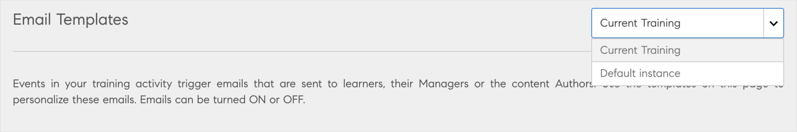
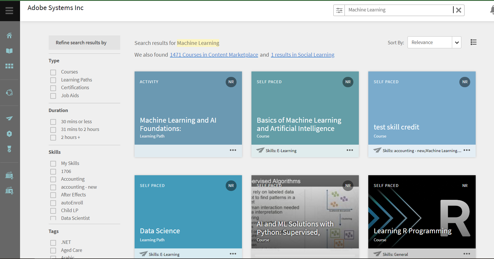
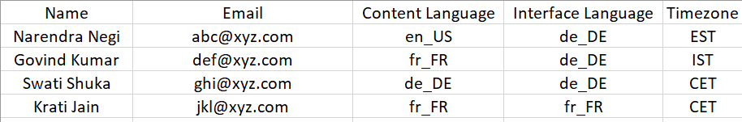

# Nieuwe functies in deze release (november 2022)

<!--
IN-PROGRESS

<https://helpx.adobe.com/learning-manager/whats-new-nov-2022.html>
-->

## Meerdere SSO-configuraties

Adobe Learning Manager ondersteunt momenteel één aanmeldingsmethode voor interne gebruikers en één aanmeldingsmethode voor externe gebruikers. Dit leidt tot beperkingen in gevallen waarin klanten hun werknemers en hun eigen klanten en kanaalpartners op de zelfde rekening hebben.

Met de bedoeling om meerdere typen gebruikersgroepen te ondersteunen die zich aanmelden bij het platform, ondersteunt Adobe Learning Manager nu meerdere aanmeldingsmethoden via meerdere SSO-configuraties voor zowel interne als externe gebruikers.

Zie voor meer informatie [Meerdere SSO-aanmeldingen](/help/migrated/administrators/feature-summary/multiple-sso-logins.md).

## Ondersteuning voor niet-aangemelde functies

Het eigen portal van de Adobe Learning Manager ondersteunt nu niet-aangemelde toegang tot een trainingsportaal.

Studenten kunnen nu de trainingssite vinden en openen, verschillende beschikbare cursussen en inhoud uitchecken en besluiten zich aan te melden om de cursussen te volgen.

Met deze functie kunt u gemakkelijker een klantgericht leerportaal maken, waarin studenten door verschillende cursussen kunnen bladeren zonder zich in eerste instantie aan te melden.

Zie voor meer informatie [Niet-aangemelde ervaring voor studenten](/help/migrated/administrators/feature-summary/non-logged-in-experience-learners.md).

## Paginaverbeteringen van trainingsoverzicht

Op de pagina Overzicht van training wordt nu een vernieuwde gebruikersinterface afgespeeld, zodat studenten een verbeterde ervaring hebben tijdens het volgen van een cursus.

Andere verbeteringen zijn:

* Bladwijzer maken van training.
* Aanbeveling van verwante cursussen.
* Informatie over leerpad(en) voor cursussen en leerpaden.
* Clickable author names.
* Broodkruimels voor eenvoudigere navigatie.

## Paginaverbeteringen van trainingsoverzicht

Op de pagina Overzicht van training wordt nu een vernieuwde gebruikersinterface afgespeeld, zodat studenten een verbeterde ervaring hebben tijdens het volgen van een cursus.

Andere verbeteringen zijn:

* Bladwijzer maken van training.
* Aanbeveling van verwante cursussen.
* Informatie over leerpad(en) voor cursussen en leerpaden.
* Clickable author names.
* Broodkruimels voor eenvoudigere navigatie.

## Profielpagina van auteur

Op de pagina met het auteurprofiel wordt alle training weergegeven die door een bepaalde auteur is gemaakt.

Studenten kunnen gemakkelijk auteursspecifieke informatie en alle training die door de auteur zijn gemaakt vinden.

## Boekgemarkeerde trainingen

Studenten kunnen de cursus of de overzichtspagina openen en opslaan (met de knop Opslaan) of een bladwijzertraining. Alle cursussen met bladwijzer zijn beschikbaar op de startpagina van de student.

## Player-aanpassing

In deze release kunt u de Fluidic Player aanpassen aan de brandingvereisten van een cursus.

U kunt verschillende spelerinstellingen en -opties tonen en verbergen op basis van de inhoudsvereisten en studenten besturen op basis van het inhoudstype. U kunt deze wijziging toepassen op zowel native als headless implementaties.

U kunt de volgende opties wijzigen:

* Inhoudsopgave in-/uitschakelen
* Opmerkingen
* Taal
* Snelheid
* Bijschrift
* Volume
* Besturingselementen voor afspelen

## Imitatie van student en manager

Beheerders kunnen een gepersonaliseerde sessie starten waarin ze zich kunnen aanmelden namens elke gebruiker in hun account in hun studentrol en managerrol.

Zie voor meer informatie [Imitatie van student en manager](/help/migrated/administrators/feature-summary/impersonation-learner-manager.md).

## Andere verbeteringen

### Auditlogboek van e-mails

Beheerders hebben nu toegang tot alle e-maillogboeken die vanuit het systeem zijn verzonden via een e-mailaudittrail-rapport.

In dit logbestand worden alle gegevens vastgelegd die betrekking hebben op e-mails die de afgelopen 30 dagen zijn verzonden en die elke dag worden vernieuwd. Bovendien bevat het rapport informatie, bijvoorbeeld de geleverde status, afzender, ontvanger, onderwerp en metagegevens over inhoud.

Download het rapport via Rapporten > Aangepaste rapporten > Excel-rapporten > E-mailrapport. Er wordt een melding weergegeven waarmee u het rapport kunt downloaden.

Dit rapport bestaat uit de volgende velden:

* E-mail getriggerde tijd (UTC-tijdzone)
* Statustijd laatste gebeurtenis (UTC-tijdzone)
* Leveringsstatus
* E-mail ontvanger
* Gebruiker-id afzender
* E-mailonderwerp
* Type entiteit
* Naam entiteit
* Entiteit-id

### Melding van studenten wachtlijst

Wanneer een auteur een nieuwe instantie toevoegt, kan de auteur een e-mail activeren om studenten op de wachtlijst op de hoogte te stellen van andere instanties. De studenten krijgen een e-mail met de wijziging.

### E-mailsjablonen op instantieniveau

U kunt e-mails aanpassen voor elke instantie van een training.

Telkens wanneer de auteur of beheerder een nieuwe instantie mag toevoegen, kan de sjabloon voor een afzonderlijke instantie worden bewerkt.

Als een cursus bijvoorbeeld verschillende soorten doelgroepen heeft, kunt u de e-mailsjabloon dienovereenkomstig wijzigen.



De prioriteit van de sjabloon wordt hieronder vermeld:

1. Sjabloon op instantieniveau
2. Sjabloon op trainingsniveau
3. Sjabloon op accountniveau

### Opmerkingen van docenten tijdens het accepteren van inzendingen

Docenten kunnen nu opmerkingen toevoegen terwijl ze de inzendingen van studenten accepteren. De student ontvangt een e-mailmelding en een bericht in de app (indien ingeschakeld) nadat de inzending door de docent is goedgekeurd. De opmerkingen met betrekking tot inzendingen zijn te vinden in de Studenttranscripten voor zowel de beheerder als de student.

### Verbeteringen op gebied van zoekopdrachten

De recente zoekgeschiedenis van een student verschijnt zodat deze alle zoekopdrachten uit het verleden kan bekijken.

De zoekresultaten zijn nu consistent in alle formele en informele leervormen (Sociaal leren). De resultaten zijn onder andere training, sociaal leren en wedstrijden op de contentmarkt.

De zoekopdracht is gerichter en doelgerichter, zodat je de zoekresultaten op drie plaatsen kunt bekijken: formeel leren, Sociaal leren en Contentmarkt.



#### Phrase-gestuurde zoekopdracht

In deze versie van Adobe Learning Manager hebben we de Typeahead-zoekopdracht vervangen door fragment-gestuurde zoekopdracht.

#### Recente zoekopdrachten

Een student kan hun recente zoekopdrachten alleen in de huidige sessie bekijken.

### Catalogus gratis cursussen op Content Marketplace

Kant-en-klare cursussen met een beheerde gratis catalogus van hoge kwaliteit van 50 gratis cursussen zijn nu beschikbaar op de contentmarkt voor studenten.

### Ondersteuning voor Indonesische taal

Bahasa Indonesia wordt nu toegevoegd als interfacetaal in de leer- en managerapps.

### Verplicht veld Auteur

Tijdens het maken van een cursus is het veld Auteur verplicht.

### Wijzigingen in Content Marketplace

* Nieuw gemaakte proefaccounts bevatten een nieuwe catalogus voor 50 gratis cursussen in de Content Marketplace, die beschikbaar zijn voor gebruikers.
* Een student kan nu het aantal zoekresultaten zien en ingesloten koppelingen koppelen om over te gaan naar Content Marketplace.

### Mobiele immersive changes

In deze versie kunnen mobiele immersive webgebruikers de onderstaande taken uitvoeren:

* Maken - opiniepeilingberichten
* Bericht bewerken - alle typen, RTE
* E-commerceworkflow.
* Een voorvertoning van een module weergeven: studenten beschikken over de functie Modulevoorvertoning in Mobile Immersive. Door deze wijziging kunnen studenten een voorvertoning van de module bekijken voordat ze zich voor een cursus inschrijven.
* Een URL kopiëren.
* Een board verwijderen.

### Wijzigingen in Zoomconnector

Het JWT-app-type wordt in juni 2023 vervangen. We raden u aan om OAuth- of OAuth-apps voor de server te maken om de functionaliteit van een JWT-app in uw account te vervangen.

### Rapport voor gamification

In deze release krijgt u toegang tot een rapport waarin verschillende cursussen worden weergegeven waarvoor gamification is ingeschakeld.

### Taalvoorkeur importeren via CSV

Wanneer u een CSV importeert, bevat de CSV Interfacetaal, Inhoudstaal en Tijdzone als velden.

De beheerder kan het rapport ook exporteren, dat dezelfde velden bevat als hierboven.

* Interfacetaal
* Taal van inhoud
* Tijdzone

Behalve beheerders kan een aangepaste beheerder dit rapport ook exporteren.



#### Gevolgen voor lokalisatie

* De kolomnamen kunnen niet worden gelokaliseerd en moeten hetzelfde zijn (Interfacetaal, Inhoudstaal, Tijdzone).
* De landinstellingscodes zijn niet hoofdlettergevoelig.
* Hoewel er geen beperkingen gelden voor het opgeven van de landcode, kunt u alleen de taalcode opgeven. Zo zijn zowel &quot;it_IT&quot; als &quot;it&quot; geldig.
* Als het rapport een discrepantie vertoont als gevolg van een onjuiste landinstellingscode, gaat de CSV-verwerking zoals gewoonlijk verder en heeft dit geen invloed op de andere records in de CSV. De landinstellingsvoorkeur van de gebruiker met een onjuiste landinstelling wordt niet bijgewerkt. De overige gegevens worden bijgewerkt.

## API-wijzigingen en -verbeteringen

### VC-connectoren

Als een e-mail-ID van de beheerder wordt gebruikt om de VC-connector te configureren, moet die specifieke beheerder toestemming hebben voor het volgende:

* Een vergadering maken
* Een vergadering bijwerken
* Aanwezigheidsrapport ophalen

Tijdens het maken of bijwerken van de VC-vergadering moeten docenten de vergadering beëindigen binnen 30 minuten na de geplande eindtijd van de vergadering.

### Bladwijzer

De volgende API&#39;s worden toegevoegd om een bladwijzer te maken voor een cursus op de pagina Overzicht van training:

* Alle bladwijzers ophalen: `primeapi/v2/bookmarks`
* Een bladwijzer maken: `primeapi/v2/learningObjects/{id}/bookmark`
* Een bladwijzer verwijderen: `primeapi/v2/learningObjects/{id}/bookmark`

### Ondersteuning voor metagegevens en inhoud van meerdere landinstellingen via migratie

Voor alle typen training die worden ondersteund in het platform (cursus, leerpaden, modules, certificeringen en taakhulpen), kan nu de migratie van meerdere talen worden ondersteund via CSV-bestanden met extra kolommen voor extra talen.

#### Vereisten

Maak het migratieproject als integratiebeheerder en deel de migrationProjectId met het ALM-ondersteuningsteam, zodat de markering voor meerdere landinstellingen kan worden ingeschakeld vanaf de back-end.

#### Bereik van migratieobjecten met meerdere landinstellingen

* Module
* Cursus
* Moduleversie
* Certificering
* Leerprogramma
* Taakhulp
* Versie taakhulp

#### CSV-specificatie

Adobe Learning Manager biedt u een reeks standaard CSV-specificaties voor migratie met meerdere landinstellingen. De beste manier is om deze CSV-specificaties door te nemen voordat u begint met het migratieproces. De integratiebeheerder van uw organisatie kan de bestaande gegevensindelingen analyseren en toewijzen, zodat deze overeenkomen met de door de Learning Manager geleverde CSV-sjabloonitems.

#### Wijzigingen met ondersteuning voor meerdere landinstellingen

* De module_version-kolom wordt niet ondersteund in module_version.csv en course_module.csv.
* Kan module_version niet in dezelfde run bijwerken (in dezelfde run kan de module niet worden gemigreerd met twee versies met dezelfde module).
* Update van inhoud of metagegevens wordt beschouwd als update van module_version.csv naar moduleversie.
* Kan de update van Job_Aid_Version niet ondersteunen via job_aid_version.csv

### Automatische tokens en cookies intrekken

Een headless LMS-toepassing krijgt toegang tot refresh_token tijdens de eerste aanmelding. Daarna, wordt refresh_token gebruikt voor het produceren van access_token voor zijn cliënttoepassingen om API vraag te maken. Op dezelfde manier gebruikt het afspelen van inhoud een leeg eindpunt om cookie te genereren voor het beheren van het afspelen. Dit betreft meerdere inhoudsbestanden en API-aanroepen die door deze bestanden met behulp van cookie worden aangeroepen. De cookie die door beide wordt gegenereerd, heeft dezelfde geldigheid als de access_token die zeven dagen duurt. Als de cookie eenmaal is gegenereerd, kunt u deze niet wissen, dit in tegenstelling tot wat gebruikelijk is bij het afmelden van webtoepassingen. De Oauth-cookie en webtoepassingscookie zijn twee verschillende cookies en zijn niet op de hoogte van elkaar.

Om de cookie te wissen, hebben we een nieuw eindpunt geïntroduceerd, dat refresh_token, cookie en zowel cookie als vernieuwingstoken intrekt.

**Details**

**Eindpunt**

`POST oauth/o/revoke`

**Query-parameters**

* `cookie=true|false` - geeft aan dat cookie moet worden ingetrokken
* `refresh_token=true|false` - hiermee wordt aangegeven dat vernieuwen

**Verzoek om body**

Body vereist voor intrekking refresh_token of (refresh_token en cookie)

```
{
      "client_id": <>,
      "client_secret": <>,
      "refresh_token": <>
}
Body required for revoking oauth cookie only
{
      "access_token": <>
}
```

### Openbare API&#39;s

In deze release hebben we een aantal API&#39;s openbaar gemaakt.

| API | Type | Beschrijving |
|---|---|---|
| /social/search | GET | Zoeken in social media. |
| /aankondigingen | GET | Krijg gedetailleerde informatie over de aankondiging op de masthead die aan de student is toegewezen. |
| /aankondigingen/`{id}` | GET | Krijg gedetailleerde informatie over de aankondiging op de masthead die aan de student is toegewezen. |
| /learningObjects/`{id}`/loResources/{loResourcesId} | GET | Upload url van het bestand voor loResource van resourceType &#39;Activity&#39; waarbij het bestand moet worden ingediend. |
| /jobAid/`{jobAidId}`/jobAidDownloaded | GET | Downloadrapport voor taakhulp instellen. |
| /bulkimport/startrun | POST | Voer bulkimport uit. |
| /bulkimport/cansync | GET | bulkimport synchroniseren. |
| /search | GET | DELETEMEBOB |
| /uploadInfo | GET | Verwante informatie over contentupdate ophalen. |
| /uploadSigner | GET | Ontvang de handtekening van de te_ondertekenen inhoud. |
| /avatar | POST | Hiermee wordt de avatar-afbeelding van de student bijgewerkt met een nieuwe afbeelding. |
| /avatar | DELETE | Verwijdert de avatar-afbeelding van de student. |

### Salesforce-app

De **LO voor hogere volgorde negeren** moet zijn ingeschakeld in de Salesforce-app, zodat alle cursussen, leerprogramma&#39;s en certificaten tegelijkertijd kunnen worden weergegeven.

### API&#39;s voor Player-aanpassing

In deze release hebben we API&#39;s beschikbaar gesteld om een speler aan te passen. U kunt:

* Start of laad de speler.
* Navigeer naar een bepaalde module.
* Inhoudsopgave in-/uitschakelen.
* Taal wijzigen.
* Sluit de speler.
* Afspelen, pauzeren, vooruit, achteruit, zoeken, volume wijzigen of snelheid wijzigen.
* Leg gebeurtenissen van de speler vast.

### De wachtlijstpositie van een student weergeven

De GET /enrollments/{id}/waitlistPosition-API onder LO API haalt de wachtlijstpositie van een gebruiker voor een opgegeven inschrijving op.

### Indiening van voltooiingsdatum in externe certificeringen

De /primeapi/v2/learningObjects/certification:xxxxx-API heeft het kenmerk &quot;completionDateSameAsApprovalDate&quot; om aan te geven dat voor het certificaat de optie &quot;Certification Completion Date&quot; is ingeschakeld voor de student of niet, samen met de markering true/false.

### LO-voorvertoningsgegevens ophalen

De GET /preview/learningObjects/{id} API wordt toegevoegd om voorvertoningsinformatie over een leerobject op te halen.

### Externe gebruikers binnen profielen verplaatsen

De `PUT primeapi/v2/externalProfiles/{currentep}/users/{userid}?` call helpt een gebruiker naar een ander extern profiel verplaatsen door een nieuwe externalProfile ID te specificeren.

### Gebruikers toevoegen aan externe profielen

De `POST /externalProfiles/{id}/users` voegt externe gebruikers toe aan een extern profiel.

## Opmerkingen bij de release

Voor informatie over de huidige en vorige releases van de webapp en de apparaatapp van Learning Manager raadpleegt u de [Opmerkingen bij de release](/help/migrated/release-note/release-notes.md).

## Opgeloste problemen

Als u de fouten wilt zien die in deze update zijn gecorrigeerd, raadpleegt u de [Grenzen van lijst](release-note/release-notes.md#bugs-fixed-in-this-release).

## Systeemvereisten

[Systeemvereisten voor Learning Manager](/help/migrated/system-requirements.md)
