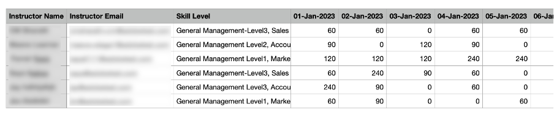

# Nieuwe functies in deze release (april 2023)

## Adobe Learning Manager-app voor Microsoft Teams

De nieuwe Adobe Learning Manager-app op Microsoft Teams is ontworpen om leren in de flow van het werk te bevorderen en sociaal leren te stimuleren. Studenten hebben binnen het Microsoft Teams-platform toegang tot leermateriaal zonder over te hoeven schakelen op een browser. Neem contact op met uw CSAM voor de bèta-release van Adobe Learning Manager-app op MS Teams.

Voor meer informatie, zie [&#x200B; Adobe Learning Manager App voor Microsoft Teams &#x200B;](/help/migrated/adobe-learning-manager-app-microsoft-teams.md).

## Verbeteringen aan de ILT-ervaring (door docent geleide training)

Er zijn verschillende verbeteringen aangebracht aan de ILT-ervaring. Belangrijke verbeteringen zijn: de mogelijkheid om sessies te filteren op basis van locatie, de mogelijkheid om van instantie te veranderen (VILT) zonder dat de voortgang verloren gaat, een nieuwe &quot;Scheduling Assistant&quot; voor het beheren van conflicten in boekingssessies, de mogelijkheid om &quot;Vaardigheden&quot; aan docenten te koppelen en op basis van vaardigheden docenten te kiezen.

### Wat is er veranderd

* De pagina Vaardigheden van de Admin-app bevat de optie om toewijzing Vaardigheid-Docent te uploaden.
* Op de pagina Vaardigheden staat een nieuwe kolom, Instructeurs. De kolom toont het aantal instructeurs tegen de vaardigheid. Als u het aantal in de kolom van Instructeurs klikt, zult u aan een pop-up worden opnieuw gericht, die het aantal instructeurs toont die aan een vaardigheid worden toegewezen.

Zie voor meer informatie [Vaardigheden toewijzen aan docenten](/help/migrated/administrators/feature-summary/skills-levels.md#assign-skills-to-instructors).


### Plannende assistent

Conflicten beheren bij het boeken van docenten en klaslokalen of virtuele klaslokalen. Gebruik de Planningsassistent als u wilt weten op welk tijdstip en op welk tijdstip een docent beschikbaar is voordat u hem aan de cursus toewijst.

Auteurs, Beheerders en Aangepaste beheerders/auteurs kunnen de Planningsassistent gebruiken.

Zie voor meer informatie [Planningsassistent](/help/migrated/authors/feature-summary/courses.md#scheduling-assistant).

## Nieuwe mobiele Adobe Learning Manager-app

Een splinternieuwe mobiele Adobe Learning Manager-app voor Android en iOS die studenten altijd en overal soepele toegang biedt tot lesmateriaal. Met de app kunnen studenten trainingen volgen op hun mobiele apparaten en deze later op hun computers weer oppakken. Met ondersteuning voor meldingen, bestandsuploads, eenvoudig bladwijzers toevoegen en lesmateriaal delen, sociaal leren en meer, biedt de mobiele app meer flexibiliteit aan studenten en ondersteunt de app just-in-time-leren.


Download het mobiele apparaat van de Google Play Store en de Apple App Store. Gebruikers van de oudere versie van de app worden gevraagd om de nieuwe app te downloaden en installeren.

In deze release ondersteunt de app deze functies:

De nieuwe mobiele app ondersteunt de volgende belangrijke functies in deze release:

* Uitgebreide zoekopdracht, inclusief het weergeven van recente zoekopdrachten van de student en populaire zoekopdrachten in de organisatie in het invoervak Zoeken.
* Mogelijkheid om Studenttranscripten te downloaden.
* Verbeterd meldingscentrum - biedt belangrijke updates voor studenten als meldingen binnen de app
* Mogelijkheid om leerobjecten te sorteren en filteren op de pagina&#39;s Catalogus/My Learning
* Mogelijkheid om leerobjecten met bladwijzers (LO&#39;s) te maken - LO&#39;s met bladwijzer zijn beschikbaar in de sectie &quot;Opgeslagen door mij&quot; op de startpagina van de student.
* Ondersteuning voor uitgebreide LP&#39;s
* Mogelijkheid om de taal van de mobiele interface te wijzigen naar een door Adobe Learning Manager ondersteunde taal.
* Ondersteuning voor bestandsuploads in externe certificeringen, CR/VC-sessies en activiteitsmodules.
* Mogelijkheid om L1-cursusfeedback in te dienen binnen de app.
* Ondersteuning voor deep links.
* Ondersteuning voor Sociaal leren.
* Ondersteuning voor Badges.
* Ondersteuning voor inloggen door externe gebruikers.

**wat niet in deze versie** wordt gesteund

* Ondersteuning voor meerdere pogingen tot een quizmodule in een cursus wanneer de cursus wordt gevolgd vanuit de mobiele app.
* Zoekopties waarmee u zoekparameters kunt opgeven, zoals cursusmetagegevens, tags en vaardigheden voor het opgeven van het zoekbereik.
* Aangepaste aankondigingen die door de beheerder zijn ingeschakeld en die als pop-up voor de gebruiker in de mobiele app worden weergegeven.
* U kunt geen vaardigheden toevoegen op de pagina Vaardigheden in de app.
* Cursussen volgen terwijl u offline bent.

Ga voor meer informatie naar de [mobiele app Adobe Learning Manager](/help/migrated/learners/feature-summary/ipad-android-tablet-users.md).

## Een app voor QR-codes scannen gebruiken om QR-codes van Learning Manager te scannen

Adobe Learning Manager biedt nu ondersteuning voor een meer gebruikersintuïtieve manier om QR-codes te scannen met behulp van de native camera-app zonder dat u een app hoeft te downloaden die een QR-code scant.

Ter ondersteuning van de vorige workflow, waarin u een QR-code kunt scannen met het menu van de ALM-app, hebben we in deze release informatie gegeven over het overschakelen naar de nieuwe workflow.

Dankzij de verbeteringen aan op QR-code gebaseerde workflows, worden oude QR-codes die vóór deze release zijn gegenereerd, niet meer ondersteund. Dat betekent het volgende: als u een QR-code hebt gegenereerd met een oudere versie van Learning Manager voor een klaslokaal of VC-sessie die na deze release wordt gehouden, moet u een nieuwe QR-code genereren.

### Verbeteringen aan aanbevelingsaankondigingen

In deze release hebben we de aanbevelingsstrook bijgewerkt van een organisatie naar een aanbeveling op basis van de gebruikersgroep waarvan de student deel uitmaakt, om de relevante cursussen voor de student weer te geven.

Beheerders kunnen bepaalde cursussen of trainingen richten op studenten op basis van de profielen van de studenten. Studenten kunnen dan naar cursussen zoeken op basis van het profiel waarin ze zich bevinden.

**wat is veranderd**

Op de pagina Aankondiging ziet u een optie met de reden waarom deze cursus of training aan hen is aanbevolen.


### Nieuwe beheerdersinstelling

De beheerder heeft een nieuwe optie genaamd Groepen in Instellingen > Filterpanelen weergeven. Wanneer Groepen is ingeschakeld, wordt de filter Groepen op de startpagina van de student weergegeven. De student kan vervolgens kiezen om de cursussen weer te geven op basis van de gebruikersgroepen.

|   | Als de optie is ingeschakeld | Als de optie is uitgeschakeld |
|--- |--- |--- |
| De optie Groepen is ingeschakeld | <ul><li> Hiermee geeft u de gebruikersgroep op de tegel weer, samen met de link naar de cataloguspagina.</li><li> De gebruikersgroep wordt weergegeven op de catalogusfilter.</li></ul> | <ul><li>De naam van de gebruikersgroep wordt niet weergegeven op de tegel.</li><li>De gebruikersgroep wordt niet vermeld in de catalogusfilter.</li></ul> |
| De optie Groepen is uitgeschakeld | <ul><li>Hiermee wordt de naam van de gebruikersgroep op de cursustegel weergegeven als tekstbeschrijving.</li><li>De gebruikersgroep wordt niet vermeld in de catalogusfilter.</li></ul> | <ul><li>De cursustegel geeft de tekst of de naam van de gebruikersgroep niet weer.</li><li>De gebruikersgroep wordt niet vermeld in de catalogusfilter.</li></ul> |

**Hoe het** werkt

De Beheerder maakt een aankondiging door de cursus voor een gebruikersgroep toe te voegen en publiceert deze.

Een student ziet een strook met aanbevolen cursussen op de startpagina en een link naar de cursus op de tegel.


Wanneer de student op de link of op de knop Ga naar catalogus klikt, wordt de student omgeleid naar de pagina met de cursuscatalogus. De student bekijkt dan de lijst met gebruikersgroepen waarop moet worden gefilterd op basis van de gebruikersgroepen in de catalogus en de pagina Mijn leerervaring.


## Sessies zoeken met behulp van locaties

### Locaties van klaslokalen beheren

Soms moet een student een sessie op de agenda filteren op basis van locatie. Nadat een locatie is toegevoegd met behulp van het dialoogvenster Locaties van klaslokalen of het CSV-bestand, kan de student het filter toepassen.

 toe

Zie voor meer informatie [Locaties van klaslokalen toevoegen](/help/migrated/administrators/feature-summary/settings.md#classroom-locations).

### Agendawidget

Als student kunt u sessies die aan u zijn toegewezen, filteren op locatie. Ga naar de agendawidget, selecteer Sessies filteren en selecteer de locatie.


 worden toegepast


Bovendien wordt de trainingslocatie nu weergegeven op de pagina met het cursusoverzicht als de locatie door de auteur is toegevoegd tijdens het maken van de cursus.

### Beheerder

Als Beheerder kunt u beheren of een student cursussen kan filteren op locaties. Schakel in Instellingen > Algemeen Trainingslocaties in of uit.

Zie voor meer informatie [Beheerdersinstellingen](/help/migrated/administrators/feature-summary/settings.md).

## Wijzigingen in proefervaring

Nadat het proefaccount is gemaakt, worden de cursussen in de Marktplaats voor inhoud onmiddellijk beschikbaar.

## Chatbot

Chat met een medewerker of meerdere medewerkers met behulp van een chatbot. Alleen beheerders en aangepaste beheerders van proefaccounts kunnen deze functie gebruiken.

De chatbot:

* Verwelkomt u met een bericht.
* Optie bieden voor productinformatie of een productdemo.
* Draagt de chat over naar een live medewerker.
* Bewaart uw chatgeschiedenis.


## Verbeteringen aan de Observatiecontrolelijst

Auteurs kunnen nu Managers en winkel-/locatiemanagers selecteren als de beoordelaars voor controlelijsten. Managers en winkel-/locatiemanagers, indien geselecteerd als Beoordelaar, kunnen ook de controlelijsten van hun teams bekijken en voltooien zonder dat ze hoeven over te schakelen op de rol van docent. Docenten blijven controlelijsten controleren. Er wordt een nieuw bericht Controlelijst voor revisie verzonden naar de revisoren (docenten/managers) van een instantie voor de controlelijst bij inschrijvingen.

Als een manager als een beoordelaar wordt toegevoegd in de controlelijstmodule, kunnen deze de controlelijst bekijken in de Manager-app. Docenten blijven de controlelijst controleren zoals verwacht.

Zie voor meer informatie [Observatiecontrolelijst](/help/migrated/authors/feature-summary/courses.md#observation-checklist).

## Verdere verbeteringen

### Zoeken voor studenten

De zoekresultaten worden ook als volgt gecategoriseerd:

* Recente zoekopdrachten van u
* Populaire zoekopdrachten in uw organisatie

De zoekfunctionaliteit is ook verbeterd voor studenten. Studenten kunnen nu met dubbele aanhalingstekens &quot;...&quot;, plus &quot;+&quot; en min &quot;-&quot; operatoren sneller relevante resultaten vinden en een Google zoekervaring hebben.

* Gebruik dubbele aanhalingstekens (&quot;...&quot;) om te zoeken naar cursussen die de exacte woordgroep of het exacte woord bevatten. Als u bijvoorbeeld &#39;datawetenschap&#39; invoert, worden cursussen geretourneerd die beginnen met de woordgroep datawetenschap.
* Gebruik het plusteken (+) om ervoor te zorgen dat alleen de resultaten worden weergegeven die de specifieke zin of het specifieke woord bevatten. Zo toont Computer Programming +python alleen de computerprogrammeercursussen die het woord &quot;python&quot; bevatten.
* Gebruik de operator - om ervoor te zorgen dat alleen de resultaten worden weergegeven die de specifieke woordgroep of het specifieke woord niet bevatten. Bijvoorbeeld, zal de Programmering van de Computer - python alle computer programmeringscursussen behalve die tonen die het woord &quot;python&quot; bevatten.

### Conflicterende pop-up voor leerobjecten

Op de overzichtspagina wordt een pop-up bij inschrijving weergegeven wanneer een student conflicterende sessies heeft. Als de inschrijving op de cataloguspagina of overzichtspagina en een student al conflicterende sessies heeft, wordt een conflicterende pop-up met conflicterende sessiedetails geactiveerd. Zelfs als een student een conflicterende sessie heeft, kunnen hij of zij zich inschrijven voor de nieuwe sessie.


Dit bericht is slechts een waarschuwing. U kunt zich nog steeds inschrijven voor een cursus.

### Nieuwe sjabloon

We hebben een nieuwe e-mailsjabloon toegevoegd genaamd Sessie geannuleerd vanwege uitschrijving. Wanneer een gebruiker wordt uitgeschreven van een training, ontvangt deze de annulerings-e-mail.

### Nieuwe prijsfunctie voor cursussen

Beheerders kunnen nu de valuta instellen voor de account in Beheerdersinstellingen > Basisinformatie. Beheerders kunnen zowel het symbool als de ISO-valutacode opgeven, zoals USD, GBP etc. De standaardwaarde voor alle nieuwe accounts is $. Deze wijziging is alleen van toepassing op apps die niet voor studenten zijn. Beheerders kunnen de wijziging zien wanneer ze de cursus als studenten voorvertonen. Het valutasymbool wordt ook weergegeven in Studenttranscripten en trainingsrapporten.

Zie voor meer informatie [Beheerdersinstellingen](/help/migrated/administrators/feature-summary/settings.md).

### Schakelen tussen instanties

Een student die is ingeschreven voor een bepaalde instantie van een cursus kan een lijst met alle beschikbare instanties van de cursus bekijken en schakelen naar een andere instantie die voor de student beter werkt. De reden voor overschakeling is bijvoorbeeld dat de student niet aanwezig was bij de vorige instantie, of de sessietiming voor de nieuwe instantie beter uitkomt. Het kan ook iets anders zijn.

De voortgang van de student als onderdeel van de cursus, quizscores van de leerling etc. worden overgedragen naar de nieuwe instantie. Deze functie is voornamelijk bedoeld voor klaslokaal- en gemengde cursussen, maar we ondersteunen alle typen cursussen, inclusief zelfstudiecursussen.

Bij deze optie wordt Alle instanties weergeven getoond, ongeacht de instellingen voor Schakelen tussen instanties. Studenten zien nu een optie om alle instanties te bekijken als er meer dan één instantie van een cursus is.

Als de optie Schakelen tussen instanties is ingeschakeld, kunnen studenten tussen verschillende instanties schakelen totdat ze de cursus voltooien. Als de optie is uitgeschakeld, kunnen studenten de instanties bekijken, maar kunnen ze zich niet inschrijven voor de cursus.

Wanneer de student **Alle instanties bekijken** selecteert, ziet de student alle cursusinstanties.


_Bekijk al instantiepagina van studentenconsole_


_instantie van de Schakelaar van studentenpagina_

Een beheerder kan van instantie veranderen voor studenten. Selecteer een cursus van de admin console, ga naar de **[!UICONTROL sectie van Studenten]**, kies een gebruiker, en selecteer de **[!UICONTROL knoop van de Actie]**. Dan, selecteer **[!UICONTROL Instantie van de Schakelaar]** en kies de gewenste instantie.


_instantie van de Schakelaar van Admin console_


_de instantieherinnering van de Schakelaar_

U kunt niet van instantie wisselen totdat een instantie van de cursus is voltooid vanuit de Learner- of Admin-app.

Auteurs kunnen tijdens het maken van een cursus schakelen tussen het in- en uitschakelen van de optie Instantieverwisselen. Schakelen van instantie is alleen beschikbaar voor gratis cursussen.

Voor meer informatie, zie [&#x200B; configuratie van de Instantie &#x200B;](/help/migrated/authors/feature-summary/courses.md).

**Studenten**

Studenten kunnen overschakelen van een op de wachtlijst geplaatste cursusinstantie naar een andere instantie. Ze kunnen ook overschakelen op een cursusinstantie in een leerpad of certificering.

Nadat ze zich hebben ingeschreven voor het leerpad of de certificering, kunnen ze op de cursuspagina op Instanties weergeven klikken en vervolgens een instantie omwisselen.

>[!NOTE]
>
>De configuratie van Schakelen tussen instanties wordt niet gesteund voor de door de manager aangewezen types van inschrijving.
>
>Als u van instanties van een LP van Flex overschakelt, wordt de vooruitgang naar de andere instantie gedragen.

### Audittrail van gebruiker

In het controlerapport van de gebruiker wordt informatie vastgelegd over de studenten die van instantie zijn overgeschakeld, van instantie naar instantie, van tijd tot datum, enz.


Zie voor meer informatie [Rapport Audittrail van gebruiker](/help/migrated/administrators/feature-summary/reports.md#useraudittrailreports).

### Gebruiksrapport docent

Dit rapport bevat de tijd (in minuten) die een docent dagelijks besteedt aan het lesgeven van toegewezen sessies. Het rapport kan worden gedownload voor een periode van drie maanden vanaf de geselecteerde startdatum.

Voor meer informatie, zie [&#x200B; Rapport van het Gebruik van de Instructeur &#x200B;](/help/migrated/administrators/feature-summary/reports.md#instructor-utilization-report).



### Taakhulpenrapport

Een nieuw rapport om de taakhulpen bij te houden die aanwezig zijn in de account en verschillende informatie over de taakhulpen, zoals taal, type, duur, auteur, tags etc.

Voor meer informatie, zie [&#x200B; het inschrijvingsrapport van de Hulp van de Baan &#x200B;](/help/migrated/administrators/feature-summary/reports.md).

### Gerichte ad hoc e-mails naar studenten die zijn ingeschreven voor een specifieke cursusinstantie

Beheerders en auteurs kunnen gerichte ad hoc e-mails verzenden naar studenten die zijn ingeschreven voor een specifieke instantie van een cursus. De optie om e-mails op instantieniveau te verzenden is toegevoegd voor Cursussen en Leerprogramma&#39;s.


*verzend instantie-vlakke e-mails*

In het dialoogvenster Aankondiging maken is de optie Type als e-mail en training, samen met de instantie, standaard geselecteerd. Geef het onderwerp op, typ het bericht en klik op Opslaan.

Zie voor meer informatie [E-mails op instantieniveau](/help/migrated/administrators/feature-summary/courses.md#send-instance-level-emails).

### Gerichte ad-hoce-mails aan studenten via aankondigingen door de beheerder

Voor Beheerders is een nieuw type Aankondiging, &#39;Als e-mail&#39;, toegevoegd. Dit kan worden gebruikt om gerichte ad hoc e-mails te sturen naar studenten van een geselecteerde gebruikersgroep of naar studenten die zijn ingeschreven voor een specifieke training.

Aangepaste beheerders en auteurs kunnen deze optie ook op instantieniveau bekijken als ze de benodigde toegang hebben.

Voor meer informatie, zie [&#x200B; Aankondigingen &#x200B;](/help/migrated/administrators/feature-summary/announcements.md#as-email).

### Nieuwe e-mailsjablonen

In deze release hebben we e-mailsjablonen toegevoegd voor managers op het niveau &quot;skip&quot;. Deze sjablonen zijn bedoeld voor wanneer managers e-mails ontvangen over hun tweedegraads rapporten die deadlines voor cursussen, leertrajecten of certificeringen missen. Bovendien ontvangen ze e-mails wanneer hun rapporten op het tweede niveau de voltooiingsdeadlines voor deze cursussen, leerpaden of certificeringen benaderen.

* Niveau-escalatie overslaan voor voltooiing van de cursus - Voor de deadline
* Niveau-escalatie voor gemiste cursusdeadline overslaan
* Niveau-escalatie overslaan voor voltooiing leerpad - Voor de deadline
* Niveau-escalatie overslaan voor gemiste deadline van leerpad
* Niveau-escalatie overslaan voor voltooiing van certificering - Voor de deadline
* Niveau-escalatie overslaan voor gemiste certificeringsdeadline

De opties zijn standaard ingeschakeld.

## API-wijzigingen in deze release

### Nieuwe rapporten

We hebben een nieuw kenmerk, jobType, toegevoegd aan de API voor taken. Het attribuut accepteert de volgende waarden:

* **generateInstructorUtilisationReport**: Keert het gebruiksrapport van een instructeur terug.
* **generateJobAidMetadataReport**: keert de meta-gegevens van een rapport van de Hulp van de Baan terug.

**Eindpunt**: POST /primeapi/v2/jobs

generateJobAidMetadataReport-aanvraag:

```javascript {line-numbers="true"}
{ 
    "data": { 
        "type": "job", 
            "attributes": { 
                "description": "description of your choice", 
                "jobType": "generateJobAidMetadataReport" 
            } 
    }
} 
```

generateJobAidMetadataReport reactie:

```javascript {line-numbers="true"}
{ 
  "links": { 
    "self": "https://learningmanagerstage1.adobe.com/primeapi/v2/jobs" 
  }, 
  "data": { 
    "id": "31126", 
    "type": "job", 
    "attributes": { 
      "dateCreated": "2023-02-28T18:36:48.000Z", 
      "description": "description of your choice", 
      "jobType": "generateJobAidMetadataReport", 
      "status": { 
        "code": "Submitted" 
      } 
    } 
  } 
} 
```

generateInstructorUtilisationReport-verzoek:

```javascript {line-numbers="true"}
{
    "data": { 
        "type": "job", 
            "attributes": { 
                "description": "description of your choice", 
                "jobType": "generateInstructorUtilisationReport", 
                "payload": { 
                    "year": "2023", 
                    "month": "2" 
                } 
            } 
    } 
}
```

generateInstructorUtilisationReport:

```javascript {line-numbers="true"}
{ 
  "links": { 
    "self": "https://learningmanagerstage1.adobe.com/primeapi/v2/jobs" 
  }, 
  "data": { 
    "id": "31130", 
    "type": "job", 
    "attributes": { 
      "dateCreated": "2023-02-28T18:43:43.000Z", 
      "description": "description of your choice", 
      "jobType": "generateInstructorUtilisationReport", 
      "payload": { 
        "month": "2", 
        "year": "2023" 
      }, 
      "status": { 
        "code": "Submitted" 
      } 
    } 
} 
} 
```

Zie voor meer informatie het [API-referentiedocument](https://captivateprime.adobe.com/docs/primeapi/v2/).

### Schakelen tussen studentinstanties

Met de API Inschrijving student hebt u toegang tot alle instanties en kunt u schakelen naar een andere instantie van een cursus. De nieuwe instantie neemt alle eigenschappen over van de vorige cursus.

We hebben een nieuwe queryparameter, enrollmentID, toegevoegd waarvoor de informatie wordt gevraagd.

>[!NOTE]
>
>De hoofdtekst is alleen vereist voor de volgende scenario&#39;s:
>
>1. Flexibel leerplan
>1. Schakelen tussen cursusinstanties

### Accounts

De reactie bevat een nieuw attribuut, currencyCode.

**Eindpunt**: GET /primeapi/v2/account

### Vaardigheden en vaardigheidsvereniging voor docenten

We hebben een nieuwe functie geïntroduceerd, die de vaardigheidsexpertise van de docenten vastlegt, dat wil zeggen dat voor elke docent hun expertise behouden blijft, en dat kan beschikbaar worden gemaakt voor downstreambewerkingen zoals zoeken en filteren.

De volgende attributen zijn toegevoegd:

* instructorSkills
* instructorSkillLevel

**Eindpunt**: GET /primeapi/v2/account /&lt;account_id>/instructorskill/search

### ILT-wijzigingen

| Beschrijving | Nieuwe parameter/reactie | Eindpunt |
|--- |--- |--- |
| Alle steden weergeven | filter.cityName=true/false | GET /primeapi/v2/data |
| Plaatsen zoeken en filteren | filter.cityName=city_name <br> steunt ook een komma-gescheiden lijst van steden |
| GET /primeapi/v2/search |
| Details van de ruimte retourneren | include=room | GET /primeapi/v2/users/`<id>`/endar |
| Leerobject om plaatsen te filteren | filter.cityName=city_name <br> Hiermee wordt ook een door komma&#39;s gescheiden lijst met steden ondersteund. | GET /primeapi/v2/learningObjects |
| Deelvenster Plaats toevoegen | De reactie bevat een nieuw kenmerk, filterPanelSetting=true/false. | GET /primeapi/v2/account |

### Studentsessies die een conflict hebben

Haal een lijst op van alle conflicterende sessies voor een instantie.

We hebben de volgende velden toegevoegd:

* loID
* loInstanceID

**Eindpunt**: `GET /primeapi/v2/learningObjects/{loId}/instances/loInstanceId/conflictingSessions?page[offset]=0&page[limit]=10`

### Klaslokaal in VC

Voer op locatie gebaseerde zoekopdracht uit voor VC-cursussen. Het resourcepamodel bevat een nieuw kenmerk roomLocation om de vrije-vormlocatie aan te geven die tijdens het maken van een VC-cursus wordt geboden.

We hebben de volgende wijzigingen aangebracht:

**LO**

Een nieuwe queryparameter, filter.loFormat=Virtual Classroom voor de API learningObjects.

**Eindpunt**: GET /primeapi/v2/learningObjects

**Kalender**

Een nieuwe queryparameter, filter.allSessions=false voor de API Agenda. De standaardwaarde van de parameter is niet waar. Indien waar, retourneert de API alle agendasessies van een student.

**Eindpunt**: `GET /primeapi/v2/users/<id>/calendar?filter.allSessions=false`

### Zoekgeschiedenis van student

**Zoeken**

Een nieuwe queryparameter, persistSearchHistory. De standaardwaarde is waar, waarmee de query blijft staan voor de zoeksuggesties.

**Eindpunt**: GET /primeapi/v2/search?persistSearchHistory=true

**Suggesties**

Een nieuwe queryparameter, suggestionType. De toegestane waarden zijn:

* learnerHistory (standaard)
* accountHistory

**Eindpunt**: GET /primeapi/v2/search/suggestis/?suggestieType=learnerHistory

### Filteren op gebruikersgroepen

De API&#39;s Leerobject en Zoeken bieden filters om via opgegeven filters alle Leerobjecten op te halen die horen bij de gebruikersgroep. De API&#39;s ondersteunen filters als een met komma&#39;s gescheiden lijst.

We hebben een nieuw filter beschikbaar gesteld, filter.lo.announcementGroups, om alle LO&#39;s op te halen die bij de meegeleverde filters voor de gebruikersgroep horen.

Dit kan een met komma&#39;s gescheiden lijst met meerdere waarden zijn voor flexibiliteit. De verwerking is gebaseerd op de &#39;OR&#39;-bewerking tussen de meerdere groepen. Dat houdt in: alle LO&#39;s ophalen die onder de opgegeven gebruikersgroepen vallen.

### Aangepaste groep

U kunt externe gebruikers toevoegen aan en verwijderen uit Aangepaste groepen via API.

**BERICHT**

POST /userGroups/{id}/users

**Lichaam**

```javascript {line-numbers="true"}
"data": [ 
     { 
           "type": "user",  
           "id": "{id}"   
     }  
]  
```

**DELETE**

DELETE /userGroups/{id}/users

**Lichaam**

```javascript {line-numbers="true"}
"data": [  
     {  
          "type": "user",  
           "id": "11218291"  
     }  
]   
```

### Aankondiging van gebruikersgroepfiltering voor verlies in Learner-app

* De GET /users/{userId}/userGroups API heeft een nieuwe parameter, filter.knownGroupsOnly, die een Booleaanse waarde (true/false) gebruikt. Hiermee worden alleen gebruikersgroepen gefilterd die de beheerder aankondigt. De standaardwaarde van de parameter is niet waar.
* De API GET /learningObjects heeft een nieuwe parameter, filter.knownGroups, die id&#39;s van aankondigingsgroepen accepteert om resultaten te filteren.
* De GET /search API heeft een nieuwe parameter, filter.publishedGroups, die aankondigingsgroep-id&#39;s accepteert om resultaten te filteren.

Voorbeeldreactie hieronder:

```javascript {line-numbers="true"}
{
  "links": {
    "self": "https://learningmanagerstage1.adobe.com/primeapi/v2/recommendations?page[offset]=0&page[limit]=10&strip=1&filter.recType=announcement&filter.loTypes=course"
  },
  "data": [
    {
      "id": "course:5836866_10855885_recommendation",
      "type": "recommendation",
      "attributes": {
        "reason": [
          "Based on your Group - UGforAnnouncement"
        ],
        "reasonModel": [
          {
            "modelId": 1781592,
            "modelType": "userGroup",
            "modelValues": {
              "group_name": "UGforAnnouncement"
            },
            "template": "Based on your Group - {{group_name}}"
          }
        ]
      },
      "relationships": {
        "learningObject": {
          "data": {
            "id": "course:5836866",
            "type": "learningObject"
          }
        }
      }
    },
    {
      "id": "course:7013328_10855885_recommendation",
      "type": "recommendation",
      "attributes": {
        "reason": [
          "Based on your Group - All Learners"
        ],
        "reasonModel": [
          {
            "modelId": 1410724,
            "modelType": "userGroup",
            "modelValues": {
              "group_name": "All Learners"
            },
            "template": "Based on your Group - {{group_name}}"
          }
        ]
      },
      "relationships": {
        "learningObject": {
          "data": {
            "id": "course:7013328",
            "type": "learningObject"
          }
        }
      }
    },
    {
      "id": "course:6408989_10855885_recommendation",
      "type": "recommendation",
      "attributes": {},
      "relationships": {
        "learningObject": {
          "data": {
            "id": "course:6408989",
            "type": "learningObject"
          }
        }
      }
    },
    {
      "id": "course:6409761_10855885_recommendation",
      "type": "recommendation",
      "attributes": {},
      "relationships": {
        "learningObject": {
          "data": {
            "id": "course:6409761",
            "type": "learningObject"
          }
        }
      }
    },
    {
      "id": "course:6979586_10855885_recommendation",
      "type": "recommendation",
      "attributes": {},
      "relationships": {
        "learningObject": {
          "data": {
            "id": "course:6979586",
            "type": "learningObject"
          }
        }
      }
    }
  ]
}
```

## Aanvullende informatie

Voor informatie betreffende huidige en vorige versies van het Leren Web app van de Manager en apparaat app, zie de [&#x200B; nota&#39;s van de Versie &#x200B;](/help/migrated/release-note/release-notes.md).

## Foutoplossingen

Om de insecten te zien die in deze update worden bevestigd, verwijs naar de [&#x200B; Bugs vaste lijst &#x200B;](release-note/release-notes.md#bugs-fixed-in-this-release).

## Systeemvereisten

[Learning Manager-systeemvereisten](/help/migrated/system-requirements.md)
