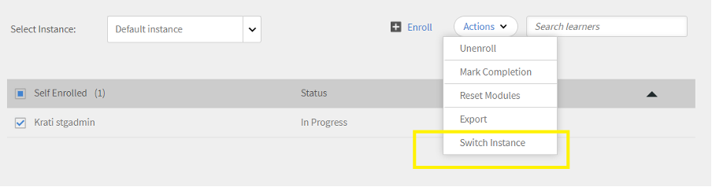

# Nieuwe functies in deze release (april 2023)

## Adobe Learning Manager-app voor Microsoft Teams

De nieuwe Adobe Learning Manager-app op Microsoft Teams is ontworpen om het leren in de workflow te bevorderen en sociaal leren te stimuleren. Studenten hebben toegang tot leerinhoud binnen het platform Microsoft Teams zonder dat ze hoeven over te schakelen naar een browser. Neem contact op met uw CSAM voor de bètaversie van de Adobe Learning Manager-app op MS Teams.

Zie voor meer informatie [Adobe Learning Manager-app voor Microsoft Teams](/help/migrated/adobe-learning-manager-app-microsoft-teams.md).

## Verbeteringen aan de ILT-ervaring (Instructor-Led Training)

Er zijn verschillende verbeteringen aangebracht in de ILT-ervaring (Instructor Led Training). Belangrijke verbeteringen zijn: de mogelijkheid om sessies te filteren op basis van locatie, de mogelijkheid om van instantie te veranderen (VILT) zonder dat de voortgang verloren gaat, een nieuwe &quot;Scheduling Assistant&quot; voor het beheren van conflicten in boekingssessies, de mogelijkheid om &quot;Vaardigheden&quot; aan docenten te koppelen en op basis van vaardigheden docenten te kiezen.

### Wat er is veranderd

* Op de pagina Vaardigheden van de Admin-app kunt u de toewijzing Vaardigheden-docenten uploaden.
* Op de pagina Vaardigheden staat een nieuwe kolom, Instructeurs. De kolom toont het aantal instructeurs tegen de vaardigheid. Als u het aantal in de kolom van Instructeurs klikt, zult u aan een pop-up worden opnieuw gericht, die het aantal instructeurs toont die aan een vaardigheid worden toegewezen.

Zie voor meer informatie [Vaardigheden toewijzen aan docenten](/help/migrated/administrators/feature-summary/skills-levels.md#assign-skills-to-instructors).


### Plannende assistent

Conflicten beheren in het boeken van docenten en lesruimten of virtuele lesruimten. Gebruik de Planningsassistent als u wilt weten op welk tijdstip en op welk tijdstip een docent beschikbaar is voordat u hem aan de cursus toewijst.

Auteurs, beheerders en aangepaste beheerders/auteurs kunnen de Planningsassistent gebruiken.

Zie voor meer informatie [Planningsassistent](/help/migrated/authors/feature-summary/courses.md#scheduling-assistant).

## Nieuwe Adobe Learning Manager Mobile-app

Een gloednieuwe Adobe Learning Manager mobiele app voor Android en iOS waarmee studenten onderweg probleemloos toegang tot het leerproces hebben. Met de app kunnen studenten training volgen op hun mobiele apparaten en deze later hervatten op hun desktops. Met ondersteuning voor meldingen, het uploaden van bestanden, het eenvoudig koppelen en delen van leerinhoud, sociaal leren en meer biedt de mobiele app extra flexibiliteit voor studenten en ondersteunt u Just-In-Time Learning.


Download het mobiele apparaat van de Google Play Store en de Apple App Store. Gebruikers van de oudere versie van de app worden gevraagd om de nieuwe app te downloaden en installeren.

In deze release ondersteunt de app de volgende functies:

De nieuwe mobiele app ondersteunt de volgende belangrijke functies in deze release:

* Verbeterde zoekfunctie, inclusief het weergeven van recente zoekopdrachten door de student en populaire zoekopdrachten in de organisatie in het invoervak voor zoekopdrachten.
* Mogelijkheid om studenttranscripten te downloaden.
* Verbeterd meldingscentrum - biedt belangrijke updates voor studenten als meldingen binnen de app
* Mogelijkheid om leerobjecten te sorteren en filteren op de pagina&#39;s Catalogus/Mijn leerervaring
* Mogelijkheid om leerobjecten met bladwijzers (LO&#39;s) te maken - LO&#39;s met bladwijzer zijn beschikbaar in de sectie &quot;Opgeslagen door mij&quot; op de startpagina van de student.
* Ondersteuning voor verbeterde LP&#39;s
* Mogelijkheid om de taal van de mobiele interface te wijzigen in een door de Adobe ondersteunde taal.
* Ondersteuning voor het uploaden van bestanden in externe certificeringen, CR/VC-sessies en activiteitenmodules.
* Mogelijkheid om L1-cursusfeedback in de app in te dienen.
* Ondersteuning voor diepe koppelingen.
* Ondersteuning voor Sociaal leren.
* Ondersteuning voor badges.
* Ondersteuning voor externe gebruikersaanmelding.

**Wat wordt niet ondersteund in deze release**

* Ondersteuning voor meerdere pogingen tot een quizmodule in een cursus wanneer de cursus wordt gevolgd vanuit de mobiele app.
* Zoekopties waarmee u zoekparameters kunt opgeven, zoals cursusmetagegevens, tags en vaardigheden voor het opgeven van het zoekbereik.
* Aangepaste aankondigingen die door de beheerder zijn ingeschakeld en die als pop-up voor de gebruiker in de mobiele app worden weergegeven.
* U kunt geen vaardigheden toevoegen op de pagina Vaardigheden in de app.
* Cursussen volgen terwijl u offline bent.

Zie voor meer informatie [Adobe Learning Manager mobiele app](/help/migrated/learners/feature-summary/ipad-android-tablet-users.md).

## Een QR-code scannen-app gebruiken om QR-codes voor Learning Manager te scannen

Adobe Learning Manager biedt nu ondersteuning voor een meer gebruikersintuïtieve manier om QR-codes te scannen met behulp van de native camera-app zonder dat u een app hoeft te downloaden die een QR-code scant.

Ter ondersteuning van de vorige workflow, waarin u een QR-code kunt scannen met het menu van de ALM-app, hebben we in deze release informatie gegeven over het overschakelen naar de nieuwe workflow.

Dankzij de verbeteringen aan op QR-code gebaseerde workflows, worden oude QR-codes die vóór deze release zijn gegenereerd, niet meer ondersteund. Daarom moet u een nieuwe QR-code genereren als u een QR-code hebt gegenereerd met een oudere versie van Leermanager voor een klassikale of VC-sessie die na deze release wordt uitgevoerd.

### Verbeteringen in de aankondiging van aanbevelingen

In deze release hebben we de aanbevelingsstrook bijgewerkt van een organisatie naar een aanbeveling op basis van de gebruikersgroep waarvan de student deel uitmaakt, om de relevante cursussen voor de student weer te geven.

Beheerders kunnen bepaalde cursussen of trainingen richten op studenten op basis van de profielen van de studenten. Studenten kunnen dan naar cursussen zoeken op basis van het profiel waarin ze zich bevinden.

**Wat er is veranderd**

Op de pagina Aankondiging ziet u een optie met de reden waarom deze cursus of training aan hen is aanbevolen.


### Nieuwe beheerdersinstelling

De beheerder heeft een nieuwe optie genaamd Groepen in Instellingen > Filterdeelvensters tonen. Wanneer Groepen is ingeschakeld, wordt het filter Groepen op de startpagina van de student weergegeven. De student kan vervolgens kiezen om de cursussen weer te geven op basis van de gebruikersgroepen.

|   | Als de optie is ingeschakeld | Wanneer de optie is uitgeschakeld |
|--- |--- |--- |
| De optie Groepen is ingeschakeld | <ul><li> Geeft de gebruikersgroep op de tegel weer, samen met de koppeling naar de cataloguspagina.</li><li> De gebruikersgroep wordt weergegeven op het catalogusfilter.</li></ul> | <ul><li>De naam van de gebruikersgroep wordt niet weergegeven op de tegel.</li><li>De gebruikersgroep wordt niet vermeld in het catalogusfilter.</li></ul> |
| De optie Groepen is uitgeschakeld | <ul><li>Geeft de naam van de gebruikersgroep op de cursustegel weer als tekst zonder opmaak.</li><li>De gebruikersgroep wordt niet vermeld in het catalogusfilter.</li></ul> | <ul><li>De cursustegel geeft de tekst of de naam van de gebruikersgroep niet weer.</li><li>De gebruikersgroep wordt niet vermeld in het catalogusfilter.</li></ul> |

**Hoe werkt het?**

De beheerder maakt een aankondiging door de cursus voor een gebruikersgroep toe te voegen en te publiceren.

Een student ziet een strook met aanbevolen cursussen op de startpagina en een link naar de cursus op de tegel.


Wanneer de student op de koppeling of op de knop Ga naar catalogus klikt, wordt de student omgeleid naar de pagina met de cursuscatalogus. De student bekijkt dan de lijst met gebruikersgroepen waarop moet worden gefilterd op basis van de gebruikersgroepen in de catalogus en de pagina Mijn leerervaring.


## Sessies zoeken op locaties

### Locaties in lesruimten beheren

Soms wilt u dat een student een sessie op de agenda filtert op basis van de locatie. Na het toevoegen van een locatie via het dialoogvenster Locaties lesruimte of het CSV-bestand, kan de student vervolgens filteren.


Zie voor meer informatie [Locaties voor lesruimten toevoegen](/help/migrated/administrators/feature-summary/settings.md#classroom-locations).

### Kalenderwidget

Als student kunt u sessies filteren die aan u zijn toegewezen op locatie. Ga naar de kalenderwidget, selecteer Sessies filteren en selecteer de locatie.


Bovendien wordt de trainingslocatie nu weergegeven op de pagina met het cursusoverzicht als de locatie door de auteur is toegevoegd tijdens het maken van de cursus.

### Beheerder

Als beheerder kunt u bepalen of een student cursussen kan filteren op basis van locaties. Schakel Trainingslocaties in of uit in Instellingen > Algemeen.

Zie voor meer informatie [Beheerdersinstellingen](/help/migrated/administrators/feature-summary/settings.md).

## Wijzigingen in testervaring

Nadat het proefaccount is gemaakt, worden de cursussen in de Content Marketplace onmiddellijk beschikbaar.

## Chatbot

Chat met een agent of meerdere agenten die een chatbot gebruiken. Alleen beheerders en aangepaste beheerders van proefaccounts kunnen deze functie gebruiken.

De chatbot zal:

* Welkom bij een bericht.
* Optie bieden voor productinformatie of een productdemo.
* Breng de chat over aan een levende agent.
* Behoud uw chatgeschiedenis.


## Verbeteringen van de controlelijst voor waarneming

Auteurs kunnen nu Managers en Store/Location Managers selecteren als de controleurs voor checklists. Managers en Store/Location Managers, indien geselecteerd als Revisor, kunnen ook de checklists van hun teams bekijken en voltooien zonder dat ze hoeven over te schakelen op de rol van docent. Docenten blijven controlelijsten controleren. Er wordt een nieuw bericht Controlelijst voor revisie verzonden naar de revisoren (docenten/managers) van een instantie voor de controlelijst bij inschrijvingen.

Als een manager als een revisor wordt toegevoegd in de controlelijstmodule, kunnen deze de controlelijst bekijken in de Manager-app. Docenten zullen de checklist blijven controleren zoals verwacht.

Zie voor meer informatie [Controlelijst voor waarneming](/help/migrated/authors/feature-summary/courses.md#observation-checklist).

## Andere verbeteringen

### Studentenzoekopdracht

De zoekresultaten worden ook als volgt gecategoriseerd:

* Recente zoekopdrachten van u
* Populaire zoekopdrachten in uw organisatie

De zoekfunctionaliteit is ook verbeterd voor studenten. Studenten kunnen nu met dubbele aanhalingstekens &quot;...&quot;, plus &quot;+&quot; en min &quot;-&quot; operatoren sneller relevante resultaten vinden en een Google zoekervaring hebben.

* Gebruik dubbele aanhalingstekens (&quot;...&quot;) om te zoeken naar cursussen die de exacte woordgroep of het exacte woord bevatten. Als u bijvoorbeeld &quot;datawetenschap&quot; invoert, worden cursussen geretourneerd die beginnen met de woordgroep datawetenschap.
* Gebruik de operator + om ervoor te zorgen dat alleen die resultaten worden weergegeven die de specifieke woordgroep of het specifieke woord bevatten. Zo toont Computer Programming +python alleen de computerprogrammeercursussen die het woord &quot;python&quot; bevatten.
* Gebruik de operator - om ervoor te zorgen dat alleen de resultaten worden weergegeven die de specifieke woordgroep of het specifieke woord niet bevatten. Bijvoorbeeld, zal de Programmering van de Computer - python alle computer programmeringscursussen behalve die tonen die het woord &quot;python&quot; bevatten.

### Conflicterende pop-up voor leerobjecten

Op de overzichtspagina wordt een pop-up bij inschrijving weergegeven wanneer een student conflicterende sessies heeft. Als de inschrijving op de cataloguspagina of overzichtspagina en een student al conflicterende sessies heeft, wordt een conflicterende pop-up met conflicterende sessiedetails geactiveerd. Zelfs als een student een conflicterende sessie heeft, kunnen hij of zij zich inschrijven voor de nieuwe sessie.


Merk op dat dit bericht slechts een waarschuwing is. U kunt zich nog steeds inschrijven voor een cursus.

### Nieuwe sjabloon

Er is een nieuwe e-mailsjabloon met de naam Sessie geannuleerd vanwege uitschrijving toegevoegd. Wanneer een gebruiker wordt uitgeschreven voor een training, ontvangen deze de annuleringsmail.

### Nieuwe prijsfunctie voor cursussen

Beheerders kunnen nu de valuta voor het account instellen in het gedeelte Beheerinstellingen > Basisinformatie. Beheerders kunnen zowel het symbool als de ISO-valutacode opgeven, bijvoorbeeld USD, GBP, enzovoort. De standaardwaarde voor alle nieuwe accounts is $. Deze wijziging is alleen van toepassing op niet-student apps. Beheerders kunnen de wijziging zien wanneer ze de cursus als studenten voorvertonen. Het valutasymbool wordt ook weergegeven in Studenttranscripten en trainingsrapporten.

Zie voor meer informatie [Beheerdersinstellingen](/help/migrated/administrators/feature-summary/settings.md).

### Overschakelen op instanties

Een leerling die voor een bepaalde instantie van een cursus is ingeschreven, kan een lijst met alle beschikbare instanties van de cursus bekijken en overschakelen op een andere instantie die voor hem of haar beter werkt. De reden voor het overschakelen kan zijn dat de student de vorige instantie niet heeft bijgewoond of dat de sessietijd voor de nieuwe instantie geschikter is of dat het iets anders kan zijn.

Alle vorderingen die de student heeft gemaakt als onderdeel van de cursus, quizscores voor studenten, enz., worden overgedragen naar de nieuwe instantie. Deze functie is voornamelijk bedoeld voor klassikale en blended cursussen, maar we ondersteunen alle soorten cursussen, ook cursussen op eigen tempo.

Bij deze optie wordt Alle instanties weergeven weergegeven, ongeacht de instellingen voor Instantie wisselen. Studenten zien nu een optie om alle instanties te bekijken als er meer dan één instantie van een cursus is.

Als de optie Instantie wisselen is ingeschakeld, kunnen studenten naar verschillende instanties overschakelen totdat ze de cursus voltooien. Als de optie is uitgeschakeld, kunnen studenten de instanties bekijken, maar kunnen ze zich niet inschrijven voor de cursus.

Wanneer de student **Alle instanties weergeven** kan de student alle cursusinstanties zien.


Een beheerder kan de instanties voor studenten wisselen.




U kunt niet van instantie wisselen totdat een instantie van de cursus is voltooid vanuit de Learner- of Admin-app.

Auteurs kunnen tijdens het maken van een cursus schakelen tussen het in- en uitschakelen van de optie Instantieverwisselen. Instantieswitch is alleen beschikbaar voor gratis cursussen.

Zie voor meer informatie [Instantieconfiguratie](/help/migrated/authors/feature-summary/courses.md).

**Studenten**

Studenten kunnen overschakelen van een op de wachtlijst geplaatste cursusinstantie naar een andere instantie. Ze kunnen ook overschakelen op een cursusinstantie in een leerpad of certificering.

Nadat ze zich hebben ingeschreven voor het leerpad of de certificering, kunnen ze op de cursuspagina op Instanties weergeven klikken en vervolgens een instantie omwisselen.

>[!NOTE]
>
>De configuratie van de Schakelaar van de Instantie wordt niet gesteund voor de Manager Aangewezen types van Inschrijving.
>
>Als u van instanties van een LP van Flex overschakelt, zal de vooruitgang naar de andere instantie worden gedragen.

### Audittrail van gebruiker

In het controlerapport van de gebruiker wordt informatie vastgelegd over de studenten die van instantie zijn overgeschakeld, van instantie naar instantie, van tijd tot datum, enz.


Zie voor meer informatie [Rapport Audittrail gebruiker](/help/migrated/administrators/feature-summary/reports.md#useraudittrailreports).

### Gebruiksrapport docent

Dit rapport legt de tijd (in minuten) vast die dagelijks wordt doorgebracht door een docent die toegewezen sessies onderwijst. Het rapport kan worden gedownload gedurende een periode van drie maanden vanaf de geselecteerde startdatum.

Zie voor meer informatie [Gebruiksrapport docent](/help/migrated/administrators/feature-summary/reports.md#instructor-utilization-report).


### Taakhulpenrapport

Een nieuw rapport waarin de taakhulpen in het account en diverse informatie over taakhulpen worden bijgehouden, zoals taal, type, duur, auteur, tags, enzovoort.

Zie voor meer informatie [Inschrijvingsrapport voor taakhulpen](/help/migrated/administrators/feature-summary/reports.md).

### Gerichte ad-hoce-mails aan studenten die zijn ingeschreven voor een specifieke cursusinstantie

Beheerders en auteurs kunnen doelgerichte ad-hoc e-mailcommunicatie sturen naar studenten die zijn ingeschreven voor een specifieke instantie van een cursus. De optie om e-mails op instantieniveau te verzenden is toegevoegd voor cursussen en leerprogramma&#39;s.


*E-mails op instantieniveau verzenden*

In het dialoogvenster Aankondiging maken is de optie Type als e-mail en training, samen met de instantie, standaard geselecteerd. Geef het onderwerp op, typ het bericht en klik op Opslaan.

Zie voor meer informatie [E-mails op instantieniveau](/help/migrated/administrators/feature-summary/courses.md#send-instance-level-emails).

### Gerichte ad-hoce-mails aan studenten via aankondigingen door de beheerder

Voor beheerders is een nieuw type aankondiging toegevoegd: &quot;Als e-mail&quot;. Hiermee kunt u doelgerichte ad-hoc-e-mails sturen naar studenten van een geselecteerde gebruikersgroep of naar studenten die zijn ingeschreven voor een specifieke training.

Aangepaste beheerders en auteurs kunnen deze optie ook op instantieniveau bekijken als ze de benodigde toegang hebben.

Zie voor meer informatie [Aankondigingen](/help/migrated/administrators/feature-summary/announcements.md#as-email).

### Nieuwe e-mailsjablonen

In deze release hebben we e-mailsjablonen toegevoegd voor managers op het niveau &quot;skip&quot;. Deze sjablonen zijn bedoeld wanneer de managers e-mails ontvangen over hun tweedehands rapporten waarbij cursussen, leerpaden of certificeringsdeadlines ontbreken. Bovendien ontvangen ze e-mails wanneer hun rapporten op het tweede niveau de voltooiingsdeadlines voor deze cursussen, leerpaden of certificeringen benaderen.

* Niveau-escalatie overslaan voor voltooiing van cursus - Voor deadline
* Niveau-escalatie voor gemiste cursusdeadline overslaan
* Niveau-escalatie overslaan voor voltooiing leerpad - Voor deadline
* Niveau-escalatie voor gemiste deadline van leerpad overslaan
* Niveau-escalatie voor voltooiing van certificering overslaan - Voor deadline
* Niveau-escalatie voor gemiste certificeringsdeadline overslaan

De opties zijn standaard ingeschakeld.

## API-wijzigingen in deze release

### Nieuwe rapporten

We hebben een nieuw kenmerk, jobType, toegevoegd aan de API voor taken. Het kenmerk accepteert de volgende waarden:

* **generateInstructorUtilisationReport**: Retourneert het gebruiksrapport van een docent.
* **generateJobAidMetadataReport**: Retourneert de metagegevens van een taakhulprapport.

**Eindpunt**: POST /primeapi/v2/jobs

generateJobAidMetadataReport-verzoek:

```javascript {line-numbers="true"}
{ 
    "data": { 
        "type": "job", 
            "attributes": { 
                "description": "description of your choice", 
                "jobType": "generateJobAidMetadataReport" 
            } 
    }
} 
```

generateJobAidMetadataReport reactie:

```javascript {line-numbers="true"}
{ 
  "links": { 
    "self": "https://learningmanagerstage1.adobe.com/primeapi/v2/jobs" 
  }, 
  "data": { 
    "id": "31126", 
    "type": "job", 
    "attributes": { 
      "dateCreated": "2023-02-28T18:36:48.000Z", 
      "description": "description of your choice", 
      "jobType": "generateJobAidMetadataReport", 
      "status": { 
        "code": "Submitted" 
      } 
    } 
  } 
} 
```

generateInstructorUtilisationReport-verzoek:

```javascript {line-numbers="true"}
{
    "data": { 
        "type": "job", 
            "attributes": { 
                "description": "description of your choice", 
                "jobType": "generateInstructorUtilisationReport", 
                "payload": { 
                    "year": "2023", 
                    "month": "2" 
                } 
            } 
    } 
}
```

generateInstructorUtilisationReport:

```javascript {line-numbers="true"}
{ 
  "links": { 
    "self": "https://learningmanagerstage1.adobe.com/primeapi/v2/jobs" 
  }, 
  "data": { 
    "id": "31130", 
    "type": "job", 
    "attributes": { 
      "dateCreated": "2023-02-28T18:43:43.000Z", 
      "description": "description of your choice", 
      "jobType": "generateInstructorUtilisationReport", 
      "payload": { 
        "month": "2", 
        "year": "2023" 
      }, 
      "status": { 
        "code": "Submitted" 
      } 
    } 
} 
} 
```

Zie de klasse [API-naslagdocument](https://captivateprime.adobe.com/docs/primeapi/v2/).

### Student-instantieswitch

Met de API voor leerling inschrijven hebt u toegang tot alle beschikbare instanties en kunt u overschakelen op een andere instantie van een cursus. De nieuwe instantie neemt alle eigenschappen van de vorige cursus over.

We hebben een nieuwe queryparameter, enrollmentID, toegevoegd waarvoor de informatie wordt gevraagd.

>[!NOTE]
>
>De hoofdtekst is alleen vereist voor de volgende scenario&#39;s:
>
>1. Flexibel leerplan
>1. Schakelaar voor cursusinstantie

### Accounts

De reactie bevat een nieuw kenmerk, currencyCode.

**Eindpunt**: GET /primeapi/v2/account

### Vaardigheden en vaardigheidsvereniging voor docenten

We hebben een nieuwe functie geïntroduceerd, die de vaardigheidsexpertise van de docenten vastlegt, dat wil zeggen dat voor elke docent hun expertise behouden blijft, en dat kan beschikbaar worden gemaakt voor downstreambewerkingen zoals zoeken en filteren.

De volgende kenmerken worden toegevoegd:

* instructorSkills
* instructorSkillLevel

**Eindpunt**: GET /primeapi/v2/account /&lt;account_id>/instructorskill/search

### ILT-wijzigingen

| Beschrijving | Nieuwe parameter/reactie | Eindpunt |
|--- |--- |--- |
| Alle steden weergeven | filter.cityName=true/false | GET /primeapi/v2/data |
| Steden zoeken en filteren | filter.cityName=city_name<br>ondersteunt ook een door komma&#39;s gescheiden lijst van steden |
| GET /primeapi/v2/search |
| Details van de ruimte retourneren | include=room | GET /primeapi/v2/users/`<id>`/agenda |
| Object leren om steden te filteren | filter.cityName=city_name <br> Tevens wordt ondersteuning geboden voor een door komma&#39;s gescheiden lijst met steden. | GET /primeapi/v2/learningObjects |
| Deelvenster Plaats toevoegen | De reactie bevat een nieuw kenmerk, filterPanelSetting=true/false. | GET /primeapi/v2/account |

### Studentensessies met een conflict

Hiermee wordt een lijst met alle conflicterende sessies voor een instantie opgehaald.

We hebben de volgende velden toegevoegd:

* loID
* loInstanceID

**Eindpunt**: `GET /primeapi/v2/learningObjects/{loId}/instances/loInstanceId/conflictingSessions?page[offset]=0&page[limit]=10`

### Lesruimte in VC

Op locatie gebaseerde zoekopdracht uitvoeren voor VC-cursussen. Het resourcepamodel bevat een nieuw kenmerk roomLocation om de vrije-vormlocatie aan te geven die tijdens het maken van een VC-cursus wordt geboden.

We hebben de volgende wijzigingen aangebracht:

**LO**

Een nieuwe queryparameter, filter.loFormat=Virtual Classroom voor de learningObjects-API.

**Eindpunt**: GET /primeapi/v2/learningObjects

**Kalender**

Een nieuwe queryparameter, filter.allSessions=false voor de agenda-API. De standaardwaarde van de parameter is false. Indien waar (true), retourneert de API alle kalendersessies van een student.

**Eindpunt**: `GET /primeapi/v2/users/<id>/calendar?filter.allSessions=false`

### Zoekgeschiedenis student

**Zoeken**

Een nieuwe queryparameter, persistSearchHistory. De standaardwaarde is true. De zoekopdracht voor de zoeksuggesties wordt voortgezet.

**Eindpunt**: GET /primeapi/v2/search?persistSearchHistory=true

**Suggesties**

Een nieuwe query-parameter, suggestietype. De toegestane waarden zijn:

* learnerHistory (standaard)
* accountHistory

**Eindpunt**: GET /primeapi/v2/search/Suggesties/?suggestieType=learnerHistory

### Filteren op gebruikersgroepen

Leerobject- en zoek-API&#39;s bieden filters om via opgegeven filters alle leerobjecten die tot de gebruikersgroep behoren op te halen. De API&#39;s ondersteunen filters als een door komma&#39;s gescheiden lijst.

We hebben een nieuw filter beschikbaar gesteld, filter.lo.announcementGroups, om alle LO&#39;s op te halen die bij de meegeleverde filters voor de gebruikersgroep horen.

Dit kan een lijst met door komma&#39;s gescheiden waarden zijn, zodat de verwerking flexibel is en gebaseerd is op de bewerking &quot;OR&quot; tussen de meerdere groepen. Met andere woorden, alle LO&#39;s ophalen die onder de opgegeven gebruikersgroepen vallen.

### Aangepaste groep

Via een API kunt u externe gebruikers toevoegen aan en verwijderen uit aangepaste groepen.

**POST**

POST /userGroups/{id}/users

**Body**

```javascript {line-numbers="true"}
"data": [ 
     { 
           "type": "user",  
           "id": "{id}"   
     }  
]  
```

**DELETE**

DELETE /userGroups/{id}/users

**Body**

```javascript {line-numbers="true"}
"data": [  
     {  
          "type": "user",  
           "id": "11218291"  
     }  
]   
```

### Aankondiging van gebruikersgroepfiltering voor verlies in Learner-app

* De GET /users/{userId}/userGroups API heeft een nieuwe parameter, filter.publishedGroupsOnly, die een Booleaanse waarde (true/false) gebruikt. Hiermee worden alleen gebruikersgroepen gefilterd die de beheerder aankondigt. De standaardwaarde van deze parameter is false.
* De API GET /learningObjects heeft een nieuwe parameter, filter.knownGroups, die id&#39;s van aankondigingsgroepen accepteert om resultaten te filteren.
* De GET /search API heeft een nieuwe parameter, filter.publishedGroups, die aankondigingsgroep-id&#39;s accepteert om resultaten te filteren.

Monsterreactie hieronder:

```javascript {line-numbers="true"}
{
  "links": {
    "self": "https://learningmanagerstage1.adobe.com/primeapi/v2/recommendations?page[offset]=0&page[limit]=10&strip=1&filter.recType=announcement&filter.loTypes=course"
  },
  "data": [
    {
      "id": "course:5836866_10855885_recommendation",
      "type": "recommendation",
      "attributes": {
        "reason": [
          "Based on your Group - UGforAnnouncement"
        ],
        "reasonModel": [
          {
            "modelId": 1781592,
            "modelType": "userGroup",
            "modelValues": {
              "group_name": "UGforAnnouncement"
            },
            "template": "Based on your Group - {{group_name}}"
          }
        ]
      },
      "relationships": {
        "learningObject": {
          "data": {
            "id": "course:5836866",
            "type": "learningObject"
          }
        }
      }
    },
    {
      "id": "course:7013328_10855885_recommendation",
      "type": "recommendation",
      "attributes": {
        "reason": [
          "Based on your Group - All Learners"
        ],
        "reasonModel": [
          {
            "modelId": 1410724,
            "modelType": "userGroup",
            "modelValues": {
              "group_name": "All Learners"
            },
            "template": "Based on your Group - {{group_name}}"
          }
        ]
      },
      "relationships": {
        "learningObject": {
          "data": {
            "id": "course:7013328",
            "type": "learningObject"
          }
        }
      }
    },
    {
      "id": "course:6408989_10855885_recommendation",
      "type": "recommendation",
      "attributes": {},
      "relationships": {
        "learningObject": {
          "data": {
            "id": "course:6408989",
            "type": "learningObject"
          }
        }
      }
    },
    {
      "id": "course:6409761_10855885_recommendation",
      "type": "recommendation",
      "attributes": {},
      "relationships": {
        "learningObject": {
          "data": {
            "id": "course:6409761",
            "type": "learningObject"
          }
        }
      }
    },
    {
      "id": "course:6979586_10855885_recommendation",
      "type": "recommendation",
      "attributes": {},
      "relationships": {
        "learningObject": {
          "data": {
            "id": "course:6979586",
            "type": "learningObject"
          }
        }
      }
    }
  ]
}
```

## Opmerkingen bij de release

Voor informatie over de huidige en vorige releases van de webapp en de apparaatapp van Learning Manager raadpleegt u de [Opmerkingen bij de release](/help/migrated/release-note/release-notes.md).

## Opgeloste problemen

Als u de fouten wilt zien die in deze update zijn gecorrigeerd, raadpleegt u de [Grenzen van lijst](release-note/release-notes.md#bugs-fixed-in-this-release).

## Systeemvereisten

[Systeemvereisten voor Learning Manager](/help/migrated/system-requirements.md)
