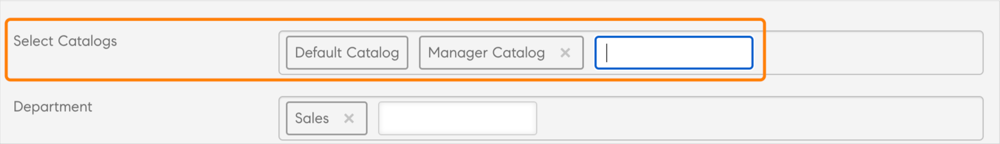

# Nieuwe functies in deze release (juli 2023)

## Verbeterde aanbevelingen

Adobe Learning Manager heeft een nieuw en verbeterd aanbevelingssysteem voor cursussen geïntroduceerd. Deze aanbevelingsfunctie gebruikt AI-algoritmen en gebruikersinteresses zoals Producten, Rollen en Niveaus om gepersonaliseerde contentaanbevelingen te bieden.

Zie voor meer informatie [Aanbevelingen in Adobe Learning Manager](recommendations-adobe-learning-manager.md).

## Meerdere inschrijvingen

In deze versie van Adobe Learning Manager introduceren we meerdere inschrijvingen voor studenten, waardoor studenten zich kunnen inschrijven voor meer dan één instantie van een cursus in één of verschillende tijdsperioden.

Zie [Meerdere inschrijvingen](/help/migrated/authors/feature-summary/courses.md) voor meer informatie.

### Meerdere inschrijvingen in de mobiele app of Immersive-omgeving

Studenten kunnen zich niet inschrijven voor meerdere instanties vanuit de mobiele app of Immersive-omgeving Meerdere inschrijvingen wordt niet ondersteund in mobiele apps en immersive mobile web.

>[!NOTE]
>
>Als u meerdere inschrijvingen inschakelt, worden er meerdere rijen toegevoegd aan het Studenttranscriptrapport voor elke cursus (één rij voor elke instantie).
>
>Als u een automatiseringsinstelling hebt ingesteld die slechts één rij per cursus verwacht, moet u de vereiste aanpassingen in de rapportautomatisering aanbrengen voordat u de functie voor meervoudige inschrijving inschakelt.

### Indeling van badges in een meervoudig ingeschreven instantie

Om badges in een meervoudig ingeschreven instantie te ondersteunen, wordt de badgeindeling gewijzigd in `userId_badgeId_COURSE_courseId_courseInstanceId`.

### De speler starten in meerdere inschrijvingen in de headless-modus

In deze release is de bibliotheek gewijzigd die wordt gebruikt voor communicatie met de headless-speler.

Bij meervoudige inschrijving moet u de argumenten doorgeven die in een object zijn verpakt.

```
{{startplayer(argument_object) ,
where
argument_object=
{ loId = <loId>, accountId = <accountId>, userId =<userId>, accessToken = <accessToken>, domId = <elementId>, onModuleLoaded = fn(), isMultiEnrolled=<boolean>, instanceId=<instanceId> }
}}
```

## Veroudering van de buitenaardse connector

Deze versie van Adobe Learning Manager bevat een nieuwe connector die gebruik maakt van het SFTP-protocol van AWS Transfer Family.

Deze verandering zal ook de ExaVault-connector vervangen, die niet langer beschikbaar zal zijn voor nieuwe gebruikers. U kunt elke opensource FTP-client gebruiken als vervanging voor ExaVault. Zie voor meer informatie [Overgang van Adobe FTP Manager](transition-from-ftp-manager.md).

## Herinneringen in vooruitzichten voor klassikale en virtuele sessies

Op Adobe Learning Manager gemaakte klassikale en virtuele klassikale sessies die zijn toegevoegd aan de Outlook-agenda van de student ondersteunen nu consistent herinneringen vanuit Outlook (vergelijkbaar met herinneringen voor vergaderingen in Outlook).

## Verbeteringen voor het toewijzen van vaardigheden aan cursussen

We hebben verbeteringen aangebracht in de workflow voor het toewijzen van vaardigheden aan auteurs. De lijst met Vaardigheidssuggesties op de pagina met cursusinstellingen bevat nu een zoekmogelijkheid met typeahead. Auteurs kunnen nu naar vaardigheden zoeken door de eerste paar tekens in te typen, waarna op basis van de invoer suggesties worden weergegeven in de vervolgkeuzelijst Vaardigheden. Met deze verbetering hoeven de auteurs niet door de volledige lijst te bladeren om vaardigheden te vinden en aan cursussen toe te wijzen.

## Verbeteringen van de cursusworkflow die door de manager is goedgekeurd

Door een manager goedgekeurde cursussen bieden nu de juiste foutinformatie aan zowel managers als studenten.


Managers kunnen nu relevante foutberichten met informatie bekijken (bijvoorbeeld dat de inschrijvingsdeadline is verstreken) wanneer ze een inschrijvingsverzoek voor een cursus niet kunnen goedkeuren. Studenten zien de fout en de herstelactie.

## Rapport over nieuw leerplan

Beheerders/aanpassingsbeheerders kunnen nu een lijst exporteren van alle leerplannen in de account en metadata zoals status, toepasselijke gebruikersgroepen, triggerinformatie, cursussen/leerpaden in het leerplan en herinneringsinformatie.

## Rapport voor het bijhouden van aanstaande gearchiveerde instanties

Het trainingsrapport bevat een extra kolom om de voltooiingstermijn van de instanties in de cursussen of leerpaden weer te geven, zodat beheerders en auteurs weten welke instanties verwijderd zullen worden en de nodige acties kunnen ondernemen.

## Verbeteringen om cursusbeoordelingen van studenten vast te leggen

Zodra de gebruiker de laatste module van de cursus heeft afgerond, verschijnt er een venster waarin de cursus met sterren kan worden gewaardeerd.


## E-mailsjablonen aanpassen

E-mailsjablonen in Learning Manager bevatten nu volledig bewerkbare secties, wat meer flexibiliteit biedt om e-mailcommunicatie aan te passen op basis van voorkeuren voor berichten en huisstijl.

Zie [E-mailsjabloon aanpassen](/help/migrated/administrators/feature-summary/email-templates.md#flexibility-in-customizing-the-templates) voor meer informatie.

## Verbeteringen voor het plannen van de assistent

Verfijn het proces waarbij u een docent selecteert voor klassikale of virtuele sessies. Er is een filter Gebruikersgroep toegevoegd aan het veld Docent in de Planningsassistent. Auteurs kunnen nu filteren op docenten op basis van &#39;Vaardigheden van docenten&#39; en op aanvullende parameters zoals locatie, taal, aanduiding, enzovoort.

Zie [Filter Gebruikersgroep in Planningsassistent](/help/migrated/authors/feature-summary/courses.md#user-group-filter) voor meer informatie.

## Verbeteringen aan de workflow voor het archiveren van leerobjecten

Auteurs kunnen nu een datum instellen voor **Automatisch archiveren** van een cursus. Dit voorkomt catalogusinflatie na verloop van tijd en het is niet langer nodig om terug te gaan en de cursussen handmatig te verwijderen.

Beheerders kunnen ook op accountniveau bepalen wat de toegang is tot gearchiveerde leerobjecten.

Het trainingsrapport bevat een nieuwe kolom, **Datum van automatische aflossing** om de pensioendatum voor elk leerobject weer te geven (indien ingesteld).

## Cataloguslabelwaarden door auteurs

Auteurs kunnen nu hun waarden voor cataloguslabels toevoegen tijdens het maken of bewerken van een cursus. Beheerders kunnen deze functie op accountniveau inschakelen. Nadat een auteur een nieuwe waarde voor een cataloguslabel heeft toegevoegd, wordt deze onderdeel van het zoeken met typeahead.



## Verbeteringen voor het zoeken naar beheerdersrollen, auteur- en managerrollen

Er zijn zoekverbeteringen doorgevoerd voor de rollen beheerder, auteur en manager. Deze kunnen nu met trefwoorden zoeken naar de titels. Dit geldt voor cursussen, leerpaden en certificeringen.

## Meldingen voor migratiefouten

Integratiebeheerders worden via e-mail op de hoogte gebracht als import- of exportbewerkingen mislukken tijdens de migratie of bij het gebruik van gegevensconnectoren zoals PowerBI, FTP, Box, enz.

## Configuratie met meerdere managers via API&#39;s

Er is een nieuwe API toegevoegd aan de set met API&#39;s voor beheerde kantoren om de configuratie van meerdere beheerders te ondersteunen.

## Verbeteringen in de API voor aanmelding

De API voor inschrijving is verbeterd om grootschalige bulkinschrijvingen te ondersteunen en te optimaliseren.

## Mobiele app - Offline content weergeven

Studenten kunnen inhoud downloaden en gebruiken in de offline modus. Geneste en flexibele leerpaden worden niet ondersteund voor offline weergave.

*In deze release wordt het weergeven van offline inhoud alleen ondersteund voor Engelse inhoud.*

## Toegankelijkheid

Er zijn meerdere verbeteringen geïmplementeerd om de toegankelijkheid te verbeteren, waaronder verbeteringen om de leesbaarheid voor schermlezers te optimaliseren.

## Ondersteuning voor mobiele apps

Met de volgende grote release ondersteunt de mobiele app van Adobe Learning Manager alleen de drie meest recente mobiele OS-versies.

## Inhoud op LinkedIn

LinkedIn-inhoud wordt niet zoals verwacht geladen in de Immersive-app in de Safari-browser. Voer als tijdelijke oplossing de volgende handelingen uit:

1. Selecteer op het apparaat **[!UICONTROL Instellingen]** > **[!UICONTROL Safari]**.
1. Schakel **Voorkom volgen door gekoppelde sites** uit.
1. Schakel **Alle cookies blokkeren** uit.
1. Meld u aan bij de Immersive-app.
1. Speel de inhoud af.
1. Laat pop-ups toe.

## Verdere verbeteringen

### Schakelen tussen instanties in MS Teams

Een student kan overschakelen op een andere cursusinstantie totdat deze is voltooid en de voortgang van de cursus behouden.

### Ondersteuning voor meervoudige inschrijving in MS Teams

Een student kan zich in een andere cursusinstantie inschrijven, ongeacht de voltooiingsstatus bij eerdere instanties. De student wordt dan in meerdere instanties van dezelfde cursus ingeschreven.

### Cursusnotities bieden ondersteuning voor meerdere inschrijvingen in MS Teams

Cursusnotities zijn beschikbaar op cursusinstantieniveau ter ondersteuning van meerdere inschrijvingen.

## API-wijzigingen

Zie de [Adobe Learning Manager API-referentie](https://captivateprime.adobe.com/docs/primeapi/v2/) voor meer informatie over de API-wijzigingen.

### API-ondersteuning voor nieuwe aanbevelingen

**GET /account**

Wordt geretourneerd als prlRecommendation is ingeschakeld.

**Verzoek**

`https://learningmanagerstage1.adobe.com/primeapi/v2/account`

**GET /data?filter.aanbevelingCriteria=product**

Resulteert in een lijst met producten/onderwerpen. De resultaten zijn afhankelijk van accountinstellingen die bevestigen of alle producten zichtbaar zijn voor de student of voor de producten/onderwerpen in de catalogus.

**Verzoek**

`https://learningmanagerqe.adobe.com/primeapi/v2/data?filter.recommendationCriteria=product&filter.showAllRecommenda`

**`GET /data?filter.recommendationCriteria=role`**

Resulteert in een lijst met aanbevolen rollen.

**Verzoek**

`https://learningmanagerqe.adobe.com/primeapi/v2/data?filter.recommendationCriteria=role&filter.showAllRecommendationCriteria=false`

**`GET /data?filter.recommendationCriteria=level`**

Resulteert in een lijst met aanbevolen rollen.

**Verzoek**

`https://learningmanagerqe.adobe.com/primeapi/v2/data?filter.recommendationCriteria=level&filter.showAllRecommendationCriteria=false`

**POST/zoekopdracht/query**

De zoekopdracht bevat ook producten en rolparameters in de query. Er query en body bevatten geen veranderingen. We voegen nieuwe sorteeropties toe

**Verzoek**

`https://learningmanagerstage1.adobe.com/primeapi/v2/search/query?...`

**GET /learningObjects**

Het leerobjectmodel geeft aanbevelingen met een auteurstag als de PRL-aanbeveling live is.

**URL aanvragen**

`https://learningmanagerstage1.adobe.com/primeapi/v2/learningObjects?sort=recommendationScore&filter.recommendationProducts=...&filter.recommendationRoles=...&filter.excludeIgnoredRecommendations=true`

POST /learningObjects/query

De volgende attributen worden gesteund in het lichaam van vraagvraag:

```javascript {line-numbers="true"}
{
  "filter.announcedGroups": [
    "string"
  ],
  "filter.bookmarks": true,
  "filter.catalogIds": [
    "string"
  ],
  "filter.cityName": [
    "string"
  ],
  "filter.duration.range": [
    "string"
  ],
  "filter.effectiveModifiedDate.fromDate": "string",
  "filter.effectiveModifiedDate.toDate": "string",
  "filter.excludeIgnoredRecommendations": true,
  "filter.ignoreEnhancedLP": true,
  "filter.ignoreHigherOrderLOEnrollment": true,
  "filter.lang.subLOs": true,
  "filter.lang.twoLetterCode": true,
  "filter.learnerState": [
    "string"
  ],
  "filter.loFormat": [
    "string"
  ],
  "filter.loTypes": [
    "string"
  ],
  "filter.price": "string",
  "filter.priceRange": [
    "string"
  ],
  "filter.recommendationLevels": [
    "string"
  ],
  "filter.skill.level": [
    "string"
  ],
  "filter.skillName": [
    "string"
  ],
  "filter.tagName": [
    "string"
  ],
  "language": [
    "string"
  ],
  "preferredSortPartitionOrder": [
    "string"
  ],
  "showLoContentSource": true,
  "useCache": true,
  "filter.recommendationProducts": [
    {
      "levels": [
        "string"
      ],
      "name": "string"
    }
  ],
  "filter.recommendationRoles": [
    {
      "levels": [
        "string"
      ],
      "name": "string"
    }
  ]
}
```

**GET /aanbevelingProducts**

Hiermee wordt het PRL-product opgehaald op aanbevolen product-ID.

**URL aanvragen**

`https://learningmanagerstage1.adobe.com/primeapi/v2/recommendationProducts`

GET /recommendationRoles

Hiermee wordt het PRL-product opgehaald op aanbevolen product-ID. Resulteert alleen in zichtbare rollen (van leerobjecten).

**URL aanvragen**

`https://learningmanagerstage1.adobe.com/primeapi/v2/prlRecommendations/roles`

`POST /users/{id}/recommendationPreferences`

Hiermee kunt u voorkeuren voor PRL-aanbevelingen maken of opnieuw maken (overschrijven). Voorbeeld lading:

```javascript {line-numbers="true"}
{
    "data": {
        "id": "userRecommendationPreferences:14755328",
        "type": "userRecommendationPreferences",
        "attributes": {
            "products": [
                {
                    "id": "recommendationProduct:1",
                    "dateCreated": "2023-05-07T20:00:00.000Z"
                },
                {
                    "id": "recommendationProduct:37",
                    "dateCreated": "2023-05-07T21:00:00.000Z"
                }
            ],
            "roles": [
                {
                    "id": "recommendationRole:23",
                    "dateCreated": "2023-05-07'T'21:00:00.000'Z'"
                },
                {
                    "id": "recommendationRole:1",
                    "dateCreated": "2023-05-07'T'20:01:00.000'Z'"
                },
                {
                    "id": "recommendationRole:2",
                    "dateCreated": "2023-05-07'T'19:02:00.000'Z'"
                },
                 {
                    "id": "recommendationRole:3",
                    "dateCreated": "2023-05-07'T'18:02:00.000'Z'"
                },
                {
                    "id": "recommendationRole:20",
                    "dateCreated": "2023-05-07'T'17:02:00.000'Z'",
                    "levels": [
                        "INTERMEDIATE"
                    ]
                }
            ]
        }
    }
}
```

**`GET /users/{id}/recommendationPreferences`**

**URL aanvragen**

`https://learningmanagerstage1.adobe.com/primeapi/v2//users/123/recommendationPreferences`

**`DELETE /users/{id}/recommendationPreferences`**

Hiermee verwijdert u de voorkeuren van de PRL-aanbevelingen voor een product of rol.

**URL aanvragen**

`https://learningmanagerstage1.adobe.com/primeapi/v2/users/123/recommendationPreferences?ids=recommendationRole:123,recommendationRole:234`

Parameters:

Id&#39;s = lijst met id&#39;s die moeten worden verwijderd

**PATCH /gebruikers/{id}/aanbevelingPreferences**

Gedeeltelijke aanvulling/update. Voorbeeld lading:

```javascript {line-numbers="true"}
{
  "data": {
    "id": "userRecommendationPreferences:<USER_ID>",
    "type": "userRecommendationPreferences",
    "attributes": {
      "roles": [
        {
          "id": "recommendationRole:123",
          "type": "recommendationRole",
          "attributes": {
            "levels": [
              "INTERMEDIATE"
            ]
          }
        },
        {
          "id": "recommendationRole:123",
          "type": "recommendationRole",
          "attributes": {
            "levels": [
              "ADVANCED"
            ]
          }
        }
      ]
    }
  }
}
```

**POST/aanbevelingPreferences/learningObjects/{id}/ignore**

LO toevoegen aan geblokkeerde aanbevelingen.

**URL aanvragen**

`https://learningmanagerstage1.adobe.com/primeapi/v2/recommendationPreferences/learningObjects/{id}/ignored`

**`DELETE /recommendationPreferences/learningObjects/{id}/ignore`**

Verwijdert LO uit geblokkeerde aanbevelingen.

**URL aanvragen**

`https://learningmanagerstage1.adobe.com/primeapi/v2/recommendationPreferences/learningObjects/{id}/ignored`

**`GET /users/{id}/recommendationStrips`**

Hiermee worden alle strips opgehaald die moeten worden gebruikt om aanbevelingen voor PRL weer te geven

### Ondersteuning voor meerdere inschrijvingen voor API

**GET /primeapi/v2/account**

Er worden twee nieuwe attributen toegevoegd:

* instanceSwitchEnabled
* multiEnrollmentEnabled

**GET /gebruikers/{userId}/userNotifications**

Id van cursusinstantie toegevoegd in meldingen in het nieuwe metadata-attribuut.

**GET /learningObjects**

De inschrijvingsrelatie geeft alleen de primaire inschrijving weer, d.w.z. als eerste ingeschreven of als eerste voltooid.

**`GET /learningObjects/{id}`**

De inschrijvingsrelatie geeft alleen de primaire inschrijving weer, d.w.z. als eerste ingeschreven of als eerste voltooid.

**`GET /learningObjects/{loId}/instances/{loInstanceId}`**

Er is een nieuwe relatie toegevoegd aan het LO-instantiemodel.

**`GET /enrollments/{id}`**

Inschrijving van cursussen met meerdere inschrijvingen ophalen.

**`DELETE /enrollments/{id}`**

Meldt zich af van een bepaalde instantie van een leerobject.

**POST/inschrijvingen**

Ondersteunt inschrijving in verschillende instanties.

**GET/inschrijvingen**

Hiermee worden alleen primaire inschrijvingen voor het leerobject opgehaald.

**`GET /learningObjects/{id}/note`**

Hiermee wordt een lijst met notities voor een cursus opgehaald.

**`GET /learningObjects/{lo_id}/instances/{loi_id}/note`**

Hiermee wordt een lijst met notities voor een cursus en de instantie opgehaald.

**`GET /learningObjects/{id}/resources/{loResourceId}/note`**

Hiermee wordt een lijst met notities voor een bron in een cursus opgehaald.

**`POST /learningObjects/{id}/resources/{loResourceId}/note`**

Hiermee wordt een notitie toegevoegd aan een module van een bepaalde cursus.

**`DELETE /learningObjects/{id}/resources/{loResourceId}/note/{noteId}`**

Hiermee worden specifieke notities uit een bepaalde module verwijderd op basis van een specifieke instantie (onderdeel van loResource Id).

**`GET /learningObjects/{id}/resources/{loResourceId}/note/{noteId}`**

Hiermee wordt een specifieke notitie in een cursusmodule van een bepaalde instantie (onderdeel van loResourceId) opgehaald.

**`PATCH /learningObjects/{id}/resources/{loResourceId}/note/{noteId}`**

Hiermee worden specifieke notities van een bepaalde module bijgewerkt op basis van een specifieke instantie (onderdeel van loResource Id).

**Wijzigingen in Admin API**

* GET /users/{id}/enrollments
* POST /gebruikers/{id}/enrollments
* DELETE /gebruikers/{id}/enrollments/{enrollmentId}
* PATCH /users/{id}/enrollments/{enrollmentId}

### Afgedwongen velden voor eindpunten

Producten en rollen worden alleen geladen wanneer ze worden afgedwongen.

Voorbeeldverzoek

* GET `https://learningmanagerstage1.adobe.com/primeapi/v2/learningObjects/course%3A7418798?enforcedFields[learningObject]=products`
* GET `https://learningmanagerstage1.adobe.com/primeapi/v2/users/11255638/userBadges?include=model&page[offset]=0&page[limit]=10&sort=dateAchieved&enforcedFields[learningObject]=products,roles`

### Zoeken in API-wijzigingen stamimplementatie (landinstelling Engels)

Stemming is het proces waarbij een woord tot de basisvorm wordt verkleind. Dit zorgt ervoor dat varianten van een woord overeenkomen tijdens een zoekopdracht. Zo kunnen lopen en lopen worden gekoppeld aan hetzelfde hoofdwoord: lopen. Als een woord eenmaal is tegengehouden, komt het voorkomen van een woord overeen met het andere woord in een zoekopdracht.

In deze release hebben we stamstamversies toegevoegd voor Engelse landinstellingen, die de volgende varianten omvatten: en_US, en_AU, en_GB.

Het stamvormattribuut geeft aan of stamvorming is vereist in zoekresultaten. Dit is standaard ingesteld op Onwaar.

API-queryparameters:

matchType=frase_and_match stemmed=true

### Verwijderen van V1-eindpunten

V1-API&#39;s werken niet meer in deze versie. Zie de [Handleiding voor ontwikkelaars](/help/migrated/integration-admin/feature-summary/developer-manual.md) voor meer informatie.

### Kennisgevingen voor het in- of uitschrijven bij een cursus

Deze release introduceert ondersteuning voor cursusinstantie-id met meldingen in het nieuwe metagegevenskenmerk.

### Ondersteuning voor L1-feedback

Hiermee kan de student feedback geven op elk instantieniveau van de functie Meerdere inschrijvingen.

**API:** `POST /enrollments/{id}/l1Feedback`

### LO-lijst met afgedwongen velden

In deze release moet u secties, prequezeConstraints, conditionLOs, subLOs, additionalResources, additionalLOs, instances, catalogLabels expliciet naar het learningObject verzenden.

Bijvoorbeeld:

`enforcedFields[learningObject]=prerequisiteLOs,instances`

### Afschaffingsbericht voor de volgende versie

* Markering voor overschrijven van student-API&#39;s.
* We wijzigen de standaardwaarde voor highlightResults=false. Bovendien wijzigen we de standaardinstelling van snippetType=courseName.
* We vervangen matchType=bool in het zoekeindpunt.
* autoCompleteMode heeft de [Vervangen] tag en om dezelfde functionaliteit van autoCompleteMode =false te bieden, hebben we een matchType toegevoegd, genaamd Match.

### Badge-id-indeling met meerdere inschrijvingen

Ter ondersteuning van meervoudige inschrijvingsbadges wijzigen we de indeling van cursusbadges van `userId_badgeId_COURSE_courseId to userId_badgeId_COURSE_courseId_courseInstanceId` om badges op unieke wijze te identificeren.

## Aanvullende informatie

Voor informatie over de huidige en vorige releases van de webapp en de apparaatapp van Learning Manager raadpleegt u de [Opmerkingen bij de release](/help/migrated/release-note/release-notes.md).

## Bekende problemen of beperkingen in deze release

Hieronder volgen de beperkingen van deze versie:

### Offline inhoud weergeven in de mobiele app

De volgende toepassingen worden niet ondersteund tijdens het weergeven van offline inhoud in de app:

* Flex-cursussen, leerplannen of certificeringen.
* Verbeterde cursussen, leerplannen of certificeringen.
* Meerdere quiz ingeschakeld: cursussen, leerplannen of certificeringen.
* Harvard Manage Mentor, Content Marketplace, GetAbstract of LinkedIn Cursussen, Leerplannen of Certificeringen.
* Leerplannen en certificaten met de vereiste waarden ingeschakeld.
* Gearchiveerde cursussen, leerplannen of certificeringen.
* Cursussen, leerplannen of certificeringen waarvan de deadline is verlopen.
* Externe certificaten.
* Voor e-commerce geschikte cursussen, leerplannen of certificeringen.

Er zijn een aantal problemen met offline synchronisatie voor de volgende leerpaden, cursussen of certificeringen:

* Alle leerpaden.
* Alle interne certificaten.
* Inhoud met POST-aanroepen.

### Aanbevelingen

Het volgende wordt niet ondersteund voor Product/Rol/Niveau in het nieuwe aanbevelingssysteem:

* Adobe Experience Manager, Teams, SFDC en Non-logged in.
* De mobiele app biedt geen ondersteuning voor het bewerken van producten en rollen op de pagina Aanbevelingen.
* De toewijzing is niet mogelijk tijdens de migratie.
* LinkedIn, Content Marketplace en andere externe cursussen, leerplannen of certificeringen automatisch taggen.
* Terugkeren naar op vaardigheid gebaseerd of Klassiek nadat u live bent gegaan.
* Het zoekmenu voor Producten en rollen in de Learner-app.
* Bulktoewijzing van cursussen, leerplannen of certificeringen en gebruikers in de Admin-app.

## Systeemvereisten

[Learning Manager-systeemvereisten](/help/migrated/system-requirements.md)
