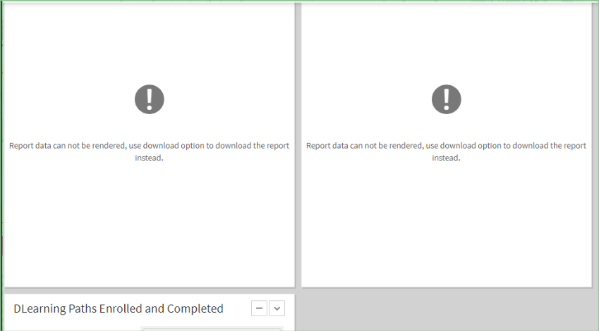

# Nieuwe functies in deze release

## Nieuwe gebruikersinterface

De gebruikersinterface van de Adobe Learning Manager heeft een paar updates ondergaan om een schonere en modernere ervaring te bieden. De landingspagina&#39;s voor de beheerders- en auteursrollen zijn vernieuwd en er zijn updates van het UI-thema voor alle rollen gemaakt. Er zijn echter geen wijzigingen aangebracht in de locatie van menu&#39;s, knoppen of koppelingen en u kunt deze precies vinden op de plaats waar ze eerder waren geplaatst.

De thema-updates worden automatisch toegepast op accounts die het standaardthema gebruiken. De thema-updates voor de gebruikersinterface hebben geen invloed op accounts die wijzigingen hebben aangebracht voor het gebruik van een aangepast thema. Dergelijke accounts moeten terugschakelen naar het standaardthema om de nieuwe thema-updates te krijgen.

### Over deze wijziging

**Welke wijzigingen in deze release?**

Er is een nieuwe sjabloon in de koptekst, die het formaat van het logo automatisch wijzigt in een vaste grootte en positie, terwijl de hoogte-breedteverhouding van het logo behouden blijft. De wijziging is bedoeld om de visuele aantrekkingskracht van de leerervaring te verbeteren.

De naam van de organisatie in de koptekst wordt ook automatisch gewijzigd in 336 (minimum) x 680 (maximum) px voor studenten.

**Wat is de aanbevolen grootte van het logo?**

De maximumbreedte van het logo is 210 px. Logo&#39;s met een breedte van meer dan 210 px of een hoogte van meer dan 42 px worden vergroot of verkleind tot 42 x 210 px.

Als de grootte van het logo kleiner is dan de aanbevolen grootte, wordt het logo zonder wijzigingen geüpload en gecentreerd.

**Wat is de impact?**

De namen van het bedrijf die langer zijn zullen worden in orde gemaakt, en een ellips zal de ruimte vullen.

**Wat bevelen we aan?**

* Pas het formaat van de afbeelding aan, waarbij de hoogte-breedteverhouding behouden blijft. De aanbevolen maximale logogrootte is 42 px (verticaal) x 210 px (horizontaal).
* Voor veel accounts is dit automatisch van toepassing; er is geen wijziging vereist.

## Native uitbreidbaarheid

Stel aangepaste ervaringen in de native versie van Adobe Learning Manager in, zodat je geen headless (headless) kunt gebruiken voor minder ingewikkelde gevallen. U kunt ook aangepaste apps maken en deze op verschillende punten in de native versie van de workflows voor studenten, managers, auteurs en docenten plaatsen.

Een student kan een aangepaste app of een extensie gebruiken die een beheerder heeft gemaakt.

Weergave [Native uitbreidbaarheid](/help/migrated/administrators/feature-summary/native-extensibility.md) voor meer informatie.

## Gereedschap Quiz maken

U kunt nu beoordelingen maken in Learning Manager met het nieuwe gereedschap voor het maken van quiz op de pagina Inhoudsbibliotheek. De gemaakte beoordelingen worden onderdeel van de inhoudsbibliotheek en kunnen worden toegevoegd aan een openbare map voor hergebruik van de cursus.

Weergave [Een quiz maken](/help/migrated/authors/feature-summary/content-library.md) voor meer informatie.

## Wijzigingen in deze release melden

### Wijzigingen in het inschrijvingsrapport voor taakhulp

In eerdere versies van Adobe Learning Manager bevatte het aanmeldingsrapport voor de taakhulp geen filters. Adobe Learning Manager heeft alle gegevens van een account gedownload.

In deze versie hebben we een vervolgkeuzelijst toegevoegd in het dialoogvenster Taakhulpenrapport.

### Wijzigingen in aankondigingsrapport

In eerdere versies van Adobe Learning Manager bevatte het meldingsrapport geen filters. Adobe Learning Manager heeft alle meldingen in het account gedownload.

In deze versie hebben we een datumfilter toegevoegd waarmee u de meldingen binnen een opgegeven periode kunt downloaden.  U kunt het rapport echter alleen voor de laatste zes maanden downloaden.

### Wijzigingen in cursusrevisiegegevens in inschrijvingsrapport

In deze release kunt u de revisiegegevens van de cursus downloaden in een inschrijvingsrapport door een tijd op te geven. De downloadperiode wordt beperkt tot zes maanden voor accounts met meer dan vijf miljoen inschrijvingen. Voor alle andere rekeningen is de periode 15 maanden.

U kunt het rapport downloaden van **[!UICONTROL Rapporten]** > **[!UICONTROL Aangepaste rapporten]** > **[!UICONTROL Historische verslagen]** > **[!UICONTROL Cursustoegangsrapport]**.

### Wijzigingen in studenttranscript

Als een aangepaste beheerder in eerdere versies van Adobe Learning Manager een gebruikersbereik had, bevatte het leertranscript de verwijderde gebruikers. In deze release bevat het leertranscript de verwijderde gebruikers als de aangepaste beheerder het gebruikersbereik of de toegang tot alle gebruikersgroepen heeft.

### Wijzigingen in aanwezigheidsrapport

Het aanwezigheidsrapport op de pagina Aanwezigheid van cursussen in de Admin-app en op de pagina Sessie-studenten van de app voor docenten die synchroon worden gedownload. In deze release wordt dit rapport asynchroon gedownload via een melding.

Zie voor meer informatie over rapporten [Rapporten](/help/migrated/administrators/feature-summary/reports.md) in Adobe Learning Manager.

## Ontmanteling van Content Marketplace

De cursussen die zijn verlopen in de geïmporteerde marktplaatscatalogus voor inhoud (Enterprise Training) worden na het verlopen automatisch verwijderd. De cursussen worden zo ingesteld dat ze worden gearchiveerd wanneer de inhoud wordt gemarkeerd voor ontmanteling. Bestaande ingeschreven studenten kunnen deze binnen een beperkte tijdsperiode volgen waarna ze worden verwijderd. Zo blijft de catalogus schoon en worden gebruikers geen verlopen cursussen getoond.

## Nieuwe aanbevelingen op basis van vaardigheden

Adobe Learning Manager verbetert de aanbevelingen voor accounts die geschikt zijn voor klanten en partners. Deze verbetering in het aanbevelingsalgoritme met de wijziging in het ranking-algoritme voor cursus, leerpad en certificering biedt een betere gebruikerservaring bij het vinden van inhoud.

Het algoritme staat geen peer-based aanbevelingen meer toe. De wijziging is niet van invloed op de bestaande gebruikers, maar de optie Uitgelijnde sector blijft bestaan. Voor de optie Aangepast staat Adobe Learning Manager geen aangepaste peer-gebaseerde selectie meer toe.

De collega-groep wordt nu een account en studenten zien een tekenreeks met de trending topics in de groep. Alle aanbevelingen kunnen worden uitgelegd. Als u bijvoorbeeld iets op een onderwerp bekijkt, wordt op de kaart op de strook de reden voor de cursus weergegeven.

## Verbeteringen in de workflow voor aangepaste beheerders

Aangepaste beheerders hebben nu meer pariteit met beheerdersrollen wat betreft toegang tot rapporten. Beheerders kunnen de rapporttoegang beter configureren.

In Adobe Learning Manager zijn alleen Leertranscript en Gamification Transcript beschikbaar voor een aangepaste beheerder. In deze release heeft een aangepaste beheerder toegang tot alle aangepaste rapporten, behalve xAPI- en e-mailrapporten, die nog steeds alleen voor de beheerder beschikbaar zijn. Toegang tot alle rapporten is afhankelijk van de catalogus en het gebruikersbereik die de aangepaste beheerder heeft. Er zijn weinig rapporten die alleen beschikbaar zijn met een volledig bereik. Het zijn:

<table>
    <tbody>
        <tr>
            <td>
    
<b>Rapport</b>
</td>
   <td>
    
<b>Beschikbaar</b>
</td>
   <td>
    
<b>Toepassingsgebied</b>
</td>
        </tr>
    <tr>
   <td>
    
Audittrail van inhoud
</td>
   <td>
    
Ja
</td>
   <td>
    
Volledige catalogus
</td>
  </tr>
  <tr>
   <td>
    
Audittrail van gebruiker
</td>
   <td>
    
Ja
</td>
   <td>
    
Volledige gebruiker
</td>
  </tr>
  <tr>
   <td>
    
Toegang tot aanmelding
</td>
   <td>
    
Ja
</td>
   <td>
    
Volledige gebruiker
</td>
  </tr>
    </tbody>
</table>

**Nieuwe alleen-lezen besturingselementen**

Op de pagina Aangepaste rollen hebben we de volgende opties voor Alleen-lezen toegevoegd om beheerders in staat te stellen flexibelere opties te bieden aan de aangepaste beheerder: aangepaste beheerders hebben nu extra machtiging Alleen-lezen voor gebruikers, E-mailsjablonen en leerplannen.

**Gebruikers**:

Als u Alleen-lezen selecteert, kan de aangepaste beheerder alle gebruikers bekijken, maar kan hij/zij geen gebruikersgegevens bewerken en een zelfregistratieportal voor gebruikers maken.

**Leerplannen**:

Als u Alleen-lezen selecteert, kan een aangepaste beheerder geen leerplan toevoegen of bewerken. Ze kunnen een leerplan-rapport downloaden en de details ervan bekijken. Maar ze kunnen de cursusdetails niet wijzigen.

>[!NOTE]
>
>Leerplannen zijn een extra alleen-lezen-optie en hebben volledige controle.

**E-mailsjablonen**

Als u Alleen-lezen selecteert, kan een aangepaste beheerder de e-mailsjablonen bekijken. Ze kunnen de instellingen van e-mailsjablonen niet in- of uitschakelen, maar kunnen rapporten over e-mailtoegang downloaden.

### Studenttranscripten

Als Gebruikersmachtigingen of Alle gebruikersgroepen zijn geselecteerd en aangepaste beheerders proberen Studenttranscripten te downloaden, retourneert de optie Verwijderde student opnemen alle verwijderde studenten in het rapport.

### Rapporten

Een aangepaste beheerder heeft toegang tot de volgende rapporten volgens het gedefinieerde bereik:

| Rapport | Beschikbaar | Toepassingsgebied |
|--- |--- |
| Audittrail van inhoud | Ja | Volledige catalogus |
| Audittrail van gebruiker | Ja | Volledige gebruiker |
| Toegang tot aanmelding | Ja | Volledige gebruiker |

## Verbeterde Connect-integratie

Docenten kunnen hun sessieervaring personaliseren door specifieke ruimten voor docenten te selecteren. In deze release zijn de volgende verbeteringen aangebracht:

### Transcripties importeren

U kunt sessietranscripten importeren uit Connect en de transcripties analyseren. Studenten ontvangen de transcriptie na de opname, die ze later kunnen downloaden.

### Video&#39;s bewerken

Docenten kunnen de video bewerken en de kijkervaring van de studenten verbeteren. Docenten zien een koppeling op de pagina Sessieoverzicht om ze naar de Adobe Connect-aanmeldingspagina te leiden. Nadat u zich hebt aangemeld, ziet de docent de koppeling naar de opname. Als u op de koppeling klikt, worden de clips omgeleid naar de video die ze kunnen bijsnijden.

## Dashboardrapporten beperken tot gebruikers met beheerdersrol

Beheerders kunnen alleen managers zoeken in Dashboard-rapporten.

## Verwerking van verouderd dashboard beperken

Wanneer een beheerder een dashboardrapport probeert uit te zetten en het rapport te lang duurt om uit te zetten (meer dan 2,5 min.), geeft Adobe Learning Manager het volgende bericht weer:

*Foutbericht wanneer rapport te lang duurt*

Rapporten van een dergelijke grootte kunnen niet worden weergegeven in de gebruikersinterface, maar de beheerder kan ze downloaden.

## Migratieondersteuning voor cataloguslabels

De migratieworkflow ondersteunt nu cataloguslabels. CSV&#39;s voor migratie kunnen worden gebruikt om cataloguslabels en cataloguslabelwaarden te importeren en deze toe te voegen aan cursussen, leerpaden, certificeringen en taakhulpen. De workflow kan indien nodig ook worden gebruikt om onjuiste waarden en sleutels te verwijderen.

## API-verbeteringen voor complexe cursusfilters

Het geavanceerd filteren van cursussen op tags en cataloguslabels (met een combinatie van de voorwaarden AND en OR) is nu mogelijk via Leermanager-API&#39;s.

## API-wijzigingen in deze release

### Validatie in taak-API

Als in deze release het taakhulprapport groter is dan 10 miljoen die met de taak-API zijn gegenereerd, krijgt het antwoord het bericht &quot;Gevraagd rapport heeft te veel gegevens om te genereren, probeer taakhulpfilters toe te passen!&quot;

### Melding van een verwijderd bericht

Als in eerdere versies van Adobe Learning Manager een cursus, certificering of leerplan is verwijderd en de bijbehorende melding aanwezig is, kunt u de cursus, certificering of het leerplan nog steeds openen door de melding te bezoeken.

In deze release zorgen we ervoor dat een verwijderd bericht niet meer toegankelijk is. Als u de id opgeeft in /posts/{id} API, en de id voor de post is niet meer beschikbaar, toont API het bericht &quot;Post not found for the specified resource&quot;.

### Voltooiingsdeadline van API voor studenten

In eerdere versies heeft Adobe Learning Manager de deadline opgehaald uit de inschrijvingstabel. In deze release zal Adobe Learning Manager de deadline uit de tabel met cursusinstanties berekenen. Als de deadline niet beschikbaar is, wordt de inschrijvingstabel weergegeven.

### Markering overschrijven

In de november 2023-versie van Adobe Learning Manager stoppen we de overschrijvingsvlag van de API&#39;s. De overschrijvingsvlag maakt geen deel uit van de openbare API-specificatie en is bedoeld voor back-endtesten. De markering wordt nu stopgezet voor studenten-API&#39;s. De markering is echter nog steeds geldig voor Admin API&#39;s.

De reden dat we de markering voor de API&#39;s van de student afschaffen, is omdat de overschrijvingsvlag een grote hoeveelheid gegevens ophaalt via de API&#39;s van de student.

De volgende Learner-API werkt niet meer omdat deze de overschrijvingsvlag heeft.

`https://captivateprime.adobe.com/primeapi/v2/users?page[offset]=0&page[limit]=10&sort=id&override=TRUE`

### Resultaten markeren

In de aanstaande versie van Adobe Learning Manager, bijvoorbeeld, in /search API, veranderen wij het gebrek voor highlightResults in vals.

Bovendien, zullen wij het gebrek van snippetTypes in courseName veranderen. Als u dit doet, worden alleen de cursusnamen in de zoekopdracht gemarkeerd als highlightResults True is.

### Nieuw brontype voor quiz

De `instances.loResources.resources` eindpunt wordt geretourneerd `ResourceContentType` met Quiz.

## Kennisgeving van verval

Op 30 november 2023 vervalt LinkedIn Learning het gebruik van de HTTP-methode voor het verkrijgen van een OAuth-token. Na de veroudering kunt u alleen een OAuth-token genereren met de HTTP-POST-methode.
Adobe Learning Manager zal BlueJeans in februari 2024 stopzetten. Alle nieuwe accounts die na februari 2024 worden geopend, hebben geen toegang tot de BlueJeans-connector.

## Opmerkingen bij de release

Voor informatie over de huidige en vorige releases van de webapp en de apparaatapp van Learning Manager raadpleegt u de [Opmerkingen bij de release](release-note/release-notes.md).

## In deze versie gecorrigeerde bugs

* Een miniatuur voor een cursus, die een vereiste is voor een leerpad of een andere cursus, wordt niet weergegeven wanneer een student de voorvertoningspagina van het leerpad of de cursus opent.
* Als de opties Kalender, Gamification en Sociaal leren niet zijn geselecteerd, blijft de volgende instelling voor het dashboard van de student niet behouden. De opties zoals Aanbevolen in uw aandachtsgebieden en Bladeren op catalogus worden niet weergegeven als geselecteerd maar in de voorvertoning.
* Zelfs nadat een student een VC-cursus heeft voltooid, ontvangen ze een herinneringsmail om de cursus te voltooien.
* Voor collega-accounts kunt u geen dashboardrapporten downloaden.
* Het verwijderen en toevoegen van een controlelijstmodule in een cursus resulteert in een interne fout.
* In het geval van Sessie-uitnodigingssjablonen heeft de e-mail-ID van de afzender de tekst captivatePrime in plaats van AdobeLearningManager.
* Wanneer u Cursuseffectiviteit als secundaire Y-as gebruikt, mislukt het downloaden van het rapport met een Null-aanwijzeruitzondering.
* Als aan een student een aangepaste beheerdersrol is toegewezen, navigeert deze standaard naar het aangepaste beheerdersprofiel. Wanneer echter een URL voor omleiding naar student in het account is ingesteld, wordt de aangepaste beheerder naar een ander doel geleid, niet naar het profiel Aangepaste beheerdersrol.
* Het gamificationbereik werkt niet zoals verwacht als disabled_sub_groups op een groot getal worden ingesteld.
* In sommige gevallen wordt een migratie geactiveerd door verwijderde gebruikers.
* Een student kan geen LinkedIn-cursussen afspelen in de MS Teams-app.
* De inschrijving-API retourneert de inschrijvingen in een Flex Learning Plan of Ingesloten Learning Plan niet zoals verwacht.
* In de mobiele app verschijnen de namen van een cursus, certificering of leerplan in kleine letters.
* Als in eerdere versies van Adobe Learning Manager een cursus, certificering of leerplan is verwijderd en de bijbehorende melding aanwezig is, kunt u de cursus, certificering of het leerplan nog steeds openen door de melding te bezoeken. In deze release zorgen we ervoor dat een verwijderd bericht niet meer toegankelijk is. Als u de id opgeeft in /posts/{id} API, en de id voor de post is niet meer beschikbaar, toont API het bericht &quot;Post not found for the specified resource&quot;.
* In de API voor studenten wordt het veld voor de voltooiingsdeadline niet weergegeven in de reactie van de API voor aanmelding.
* In de API voor inschrijving voor studenten ophalen worden de inschrijvingsgegevens weergegeven, zelfs nadat u een onjuiste instantie-id hebt opgegeven.

## Bekende problemen in deze release

* Een nieuwe inschrijving of het bijwerken van een inschrijving mislukt wanneer een Flex Learning Plan zich in een ander Flex Learning Plan bevindt.
* De transcript-URL geeft de sessieopnamen niet weer in Adobe Connect-sessies.
* Een student kan zelfs een offline quiz afleggen in de mobiele app als deze niet slaagt.

## Systeemvereisten

[Systeemvereisten voor Learning Manager](system-requirements.md)

## Eerdere versies van Adobe Learning Manager

* [Versie van juli 2023](whats-new-2023-july.md)
* [Versie van april 2023](whats-new-2023-april.md)
* [Versie van november 2022](whats-new-2022-november.md)
